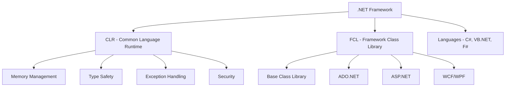
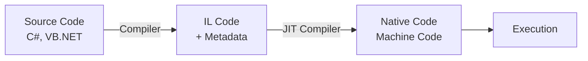
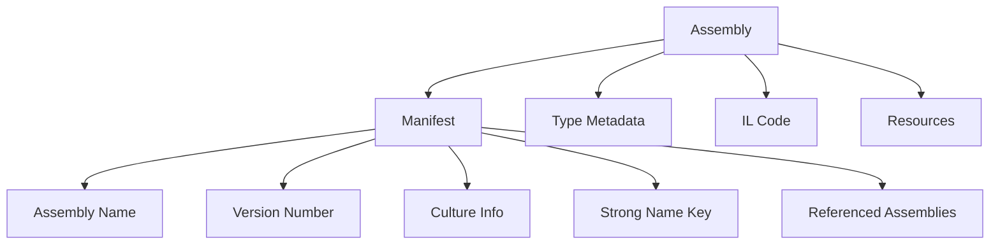
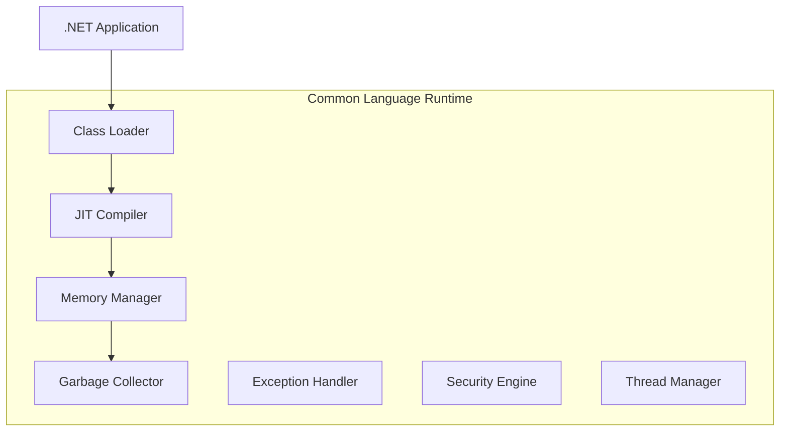
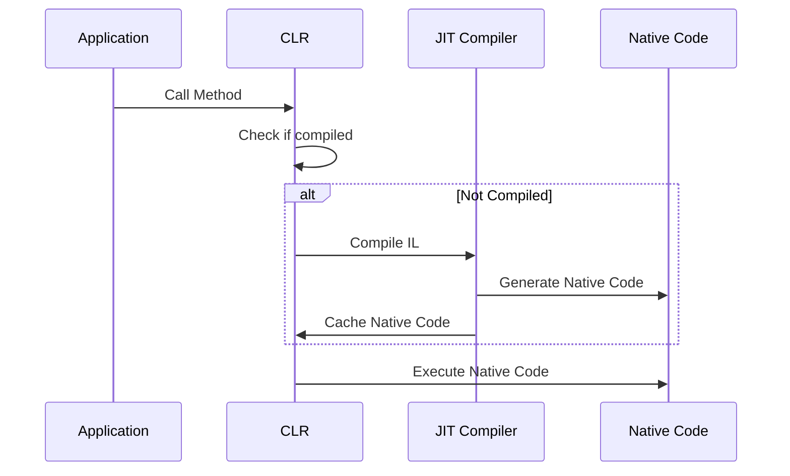
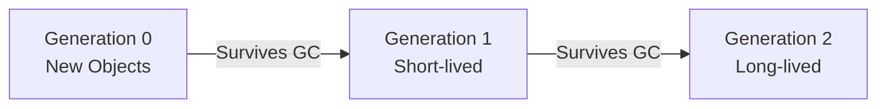
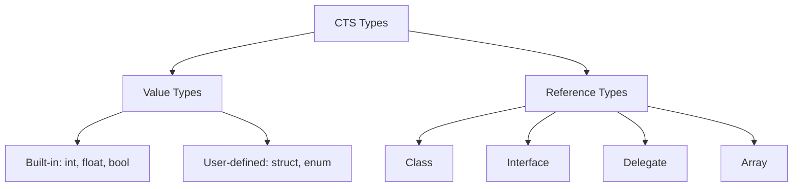
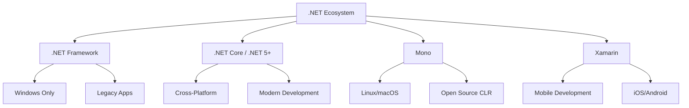

# Sessions 1-2: .NET Framework Fundamentals

## 📚 Introduction to .NET Framework

The **.NET Framework** is a software development platform developed by Microsoft for building and running Windows applications.

### What is .NET Framework?



### .NET Architecture Overview

| Component | Description |
|-----------|-------------|
| **CLR** | Runtime engine that executes .NET code |
| **FCL** | Comprehensive library of reusable classes |
| **CTS** | Common Type System - defines all data types |
| **CLS** | Common Language Specification - rules for language interoperability |
| **IL/MSIL** | Intermediate Language - platform-independent bytecode |

---

## 🔧 Intermediate Language (IL/MSIL)

**Intermediate Language (IL)** is the CPU-independent instruction set that .NET compilers produce.

### Compilation Process



### Key Characteristics of IL:
- **Platform Independent** - Runs on any platform with CLR
- **Object-Oriented** - Supports OOP concepts
- **Stack-Based** - Uses stack for operations
- **Strongly Typed** - All types are verified

### Sample IL Code:
```
.method public static void Main() cil managed
{
    .entrypoint
    ldstr "Hello, World!"
    call void [mscorlib]System.Console::WriteLine(string)
    ret
}
```

---

## 📦 Assemblies and Their Structure

An **Assembly** is the fundamental unit of deployment, version control, and security in .NET.

### Types of Assemblies

| Type | Extension | Description |
|------|-----------|-------------|
| **EXE** | .exe | Executable assembly with entry point |
| **DLL** | .dll | Dynamic Link Library, reusable code |
| **Private** | n/a | Used by single application only |
| **Shared** | n/a | Stored in GAC, used by multiple apps |

### Assembly Structure



### Manifest Contents:
- **Identity** - Name, version, culture, public key token
- **File List** - All files in the assembly
- **Type References** - Exported types
- **Dependencies** - Referenced assemblies

### Strong Named vs Weakly Named Assemblies

| Feature | Strong Named | Weakly Named |
|---------|--------------|--------------|
| **Signing** | Digitally signed | Not signed |
| **GAC** | Can be installed | Cannot be installed |
| **Version Binding** | Strict | Relaxed |
| **Location** | GAC or private | Private only |

---

## ⚙️ CLR (Common Language Runtime)

The **CLR** is the virtual machine component of .NET that manages the execution of .NET programs.

### CLR Architecture



### CLR Functions

#### 1. JIT Compilation (Just-In-Time)

**JIT Compiler** converts IL code to native machine code at runtime.

| JIT Type | Description | Use Case |
|----------|-------------|----------|
| **Pre-JIT** | Compiles entire assembly at deployment | NGEN tool usage |
| **Econo-JIT** | Compiles only when needed, discards after use | Limited memory devices |
| **Normal-JIT** | Compiles on first call, caches the result | Default behavior |



#### 2. Memory Management

The CLR automatically manages memory allocation and deallocation.

| Memory Area | Contents | Management |
|-------------|----------|------------|
| **Stack** | Value types, method parameters, local variables | Automatic (LIFO) |
| **Heap** | Reference types, objects | Garbage Collector |
| **Large Object Heap (LOH)** | Objects > 85KB | Special GC handling |

#### 3. Garbage Collection (GC)

**Garbage Collection** automatically reclaims memory occupied by unreachable objects.



**GC Generations:**

| Generation | Description | Collection Frequency |
|------------|-------------|---------------------|
| **Gen 0** | Newly allocated objects | Most frequent |
| **Gen 1** | Buffer between Gen 0 and Gen 2 | Moderate |
| **Gen 2** | Long-lived objects | Least frequent |

**GC Phases:**
1. **Mark** - Identify live objects
2. **Relocate** - Update references to objects that will be moved
3. **Compact** - Move live objects together, reclaim space

> **Important for MCQ:** GC.Collect() forces garbage collection but is NOT recommended for production code.

#### 4. AppDomain Management

**AppDomain** is an isolated environment within a process where applications run.

| Feature | AppDomain | Process |
|---------|-----------|---------|
| **Isolation Level** | Within process | System level |
| **Resource Sharing** | Shared process resources | Independent |
| **Creation Cost** | Low | High |
| **Communication** | Easy | Complex (IPC) |

```csharp
// Creating an AppDomain
AppDomain newDomain = AppDomain.CreateDomain("MyDomain");
// Unloading an AppDomain
AppDomain.Unload(newDomain);
```

#### 5. CLS (Common Language Specification)

**CLS** is a set of rules that ensures language interoperability.

**CLS Rules:**
- Only use types that are CLS-compliant
- No unsigned types in public members (except `byte`)
- No pointer types
- No varargs methods
- Unique member names (case-insensitive)

```csharp
// CLS-Compliant
public int MyProperty { get; set; }

// NOT CLS-Compliant (unsigned)
public uint MyUnsignedProperty { get; set; }
```

#### 6. CTS (Common Type System)

**CTS** defines how types are declared, used, and managed in the runtime.



**CTS Data Type Mapping:**

| C# Type | .NET Type | Size |
|---------|-----------|------|
| `bool` | System.Boolean | 1 byte |
| `byte` | System.Byte | 1 byte |
| `short` | System.Int16 | 2 bytes |
| `int` | System.Int32 | 4 bytes |
| `long` | System.Int64 | 8 bytes |
| `float` | System.Single | 4 bytes |
| `double` | System.Double | 8 bytes |
| `decimal` | System.Decimal | 16 bytes |
| `char` | System.Char | 2 bytes (Unicode) |
| `string` | System.String | Variable |
| `object` | System.Object | Variable |

#### 7. Security

The CLR provides several security mechanisms:

| Security Type | Description |
|---------------|-------------|
| **Code Access Security (CAS)** | Controls code permissions based on origin |
| **Role-Based Security** | Controls access based on user identity/role |
| **Type Safety** | Prevents unauthorized memory access |
| **Verification** | Ensures IL code is valid and safe |

---

## 🔄 .NET Framework vs .NET Core vs Mono vs Xamarin



### Detailed Comparison

| Feature | .NET Framework | .NET Core/.NET 5+ | Mono | Xamarin |
|---------|----------------|-------------------|------|---------|
| **Platform** | Windows only | Cross-platform | Cross-platform | iOS, Android, macOS |
| **Open Source** | Partial | Yes | Yes | Yes |
| **Deployment** | Machine-wide | Side-by-side, self-contained | Varies | App bundles |
| **Web Framework** | ASP.NET, ASP.NET MVC | ASP.NET Core | ASP.NET | N/A |
| **Desktop** | WPF, WinForms | WPF, WinForms (Windows) | GTK# | Xamarin.Forms |
| **Mobile** | No | MAUI | Limited | Full support |
| **Performance** | Good | Excellent | Good | Good |
| **Recommended For** | Legacy Windows apps | New cross-platform apps | Linux servers | Mobile apps |

### .NET Versions Timeline

| Version | Release Year | Key Features |
|---------|--------------|--------------|
| .NET Framework 1.0 | 2002 | First release |
| .NET Framework 2.0 | 2005 | Generics, nullable types |
| .NET Framework 3.5 | 2007 | LINQ, Lambda expressions |
| .NET Framework 4.0 | 2010 | Dynamic, parallel computing |
| .NET Framework 4.5 | 2012 | async/await |
| .NET Core 1.0 | 2016 | Cross-platform, open source |
| .NET Core 3.1 | 2019 | LTS, desktop support |
| .NET 5.0 | 2020 | Unified platform |
| .NET 6.0 | 2021 | LTS, MAUI, minimal APIs |
| .NET 7.0 | 2022 | Performance improvements |
| .NET 8.0 | 2023 | LTS, AOT compilation |

---

## 🖥️ Managed vs Unmanaged Code

### Managed Code

**Code that executes under the control of CLR.**

```csharp
// Managed Code Example
public class ManagedExample
{
    public void Process()
    {
        string data = "Hello"; // CLR manages memory
        Console.WriteLine(data);
    } // Memory automatically released
}
```

### Unmanaged Code

**Code that executes outside the CLR**, directly with the operating system.

```csharp
// Unmanaged Code Example (P/Invoke)
[DllImport("user32.dll")]
public static extern int MessageBox(IntPtr hWnd, string text, string caption, uint type);
```

### Comparison

| Aspect | Managed Code | Unmanaged Code |
|--------|--------------|----------------|
| **Memory Management** | Automatic (GC) | Manual |
| **Type Safety** | Enforced by CLR | Not enforced |
| **Security** | CAS, verification | OS-level only |
| **Performance** | JIT overhead | Native speed |
| **Portability** | CLR-dependent | Platform-specific |
| **Debugging** | Rich debugging support | Complex |
| **Examples** | C#, VB.NET, F# | C, C++, Win32 API |

---

## 🔨 Visual Studio & ILDASM

### Visual Studio

**Visual Studio** is the primary IDE for .NET development.

| Edition | Use Case | Cost |
|---------|----------|------|
| **Community** | Students, individuals, open-source | Free |
| **Professional** | Small teams | Paid |
| **Enterprise** | Large organizations | Paid |

### Key Visual Studio Features:
- **IntelliSense** - Code completion
- **Debugging** - Breakpoints, watch windows
- **Testing** - Unit test integration
- **NuGet** - Package management
- **Git Integration** - Version control

### ILDASM (IL Disassembler)

**ILDASM** is a tool to view IL code in assemblies.

```
Developer Command Prompt:
> ildasm MyAssembly.dll
```

**ILDASM Shows:**
- Assembly manifest
- Namespaces and classes
- Methods and their IL code
- Metadata

> **MCQ Tip:** ILDASM is used to view IL code, not to debug or execute code.

---

## 💡 Key MCQ Points

> **Critical Points for CCEE:**

1. **CLR** = Common Language Runtime, executes .NET programs
2. **IL/MSIL** = Intermediate Language, platform-independent bytecode
3. **JIT** = Just-In-Time compilation, converts IL to native code
4. **CTS** = Common Type System, defines all .NET types
5. **CLS** = Common Language Specification, language interoperability rules
6. **GC** = Garbage Collector, automatic memory management
7. **Assembly** = Unit of deployment, contains IL + metadata + manifest
8. **EXE** has entry point, **DLL** doesn't
9. **.NET Core** is cross-platform, **.NET Framework** is Windows-only
10. **Managed code** runs under CLR, **unmanaged code** runs directly on OS
11. **ILDASM** views IL code, **ILASM** creates assemblies from IL
12. **GAC** = Global Assembly Cache, stores shared assemblies
13. **Strong Name** = Assembly signed with public/private key pair
14. **Generation 0** in GC contains newest objects
15. **AppDomain** provides isolation within a single process
