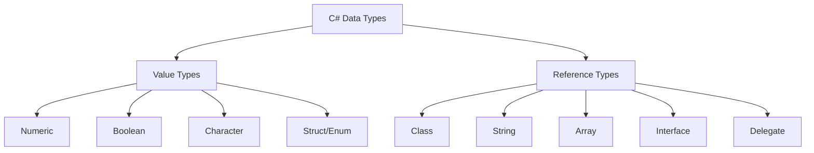
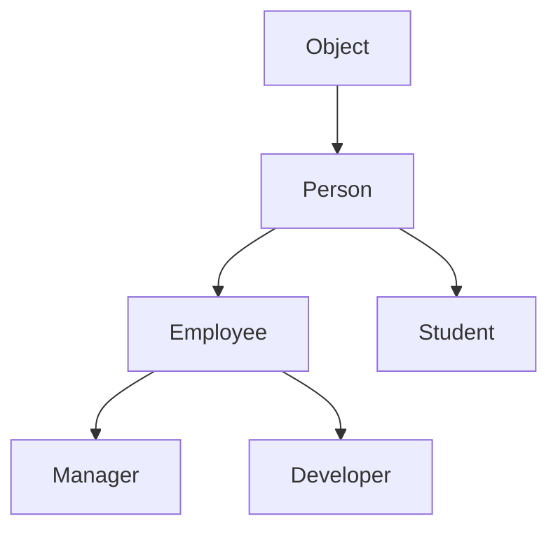

# Sessions 3-4: C# Basics & Object-Oriented Programming

## 📚 Console Applications and Class Libraries

### Creating a Console Application
```csharp
// Program.cs
using System;

namespace MyConsoleApp
{
    class Program
    {
        static void Main(string[] args)
        {
            Console.WriteLine("Hello, World!");
        }
    }
}
```

### Creating a Class Library
```csharp
// In a Class Library project
namespace MyLibrary
{
    public class Calculator
    {
        public int Add(int a, int b) => a + b;
    }
}
```

### Project References
```csharp
// Using a class library
using MyLibrary;

var calc = new Calculator();
int result = calc.Add(5, 3);
```

---

## 🔤 C# Basics

### Data Types and CTS Equivalents



| C# Type | CTS Type | Size | Range/Description |
|---------|----------|------|-------------------|
| `sbyte` | System.SByte | 1 byte | -128 to 127 |
| `byte` | System.Byte | 1 byte | 0 to 255 |
| `short` | System.Int16 | 2 bytes | -32,768 to 32,767 |
| `ushort` | System.UInt16 | 2 bytes | 0 to 65,535 |
| `int` | System.Int32 | 4 bytes | -2.1B to 2.1B |
| `uint` | System.UInt32 | 4 bytes | 0 to 4.2B |
| `long` | System.Int64 | 8 bytes | Very large integers |
| `ulong` | System.UInt64 | 8 bytes | Very large unsigned |
| `float` | System.Single | 4 bytes | 7 digits precision |
| `double` | System.Double | 8 bytes | 15-16 digits precision |
| `decimal` | System.Decimal | 16 bytes | 28-29 digits (financial) |
| `bool` | System.Boolean | 1 byte | true/false |
| `char` | System.Char | 2 bytes | Unicode character |
| `string` | System.String | Variable | Unicode text |
| `object` | System.Object | Variable | Base of all types |

---

## 🏗️ Classes in C#

### Class Definition
```csharp
public class Student
{
    // Fields (private by default)
    private int _id;
    private string _name;
    
    // Properties
    public int Id 
    { 
        get { return _id; } 
        set { _id = value; } 
    }
    
    // Auto-implemented property
    public string Name { get; set; }
    
    // Readonly property
    public string Grade { get; private set; }
    
    // Expression-bodied readonly property
    public bool IsAdult => Age >= 18;
    
    // Methods
    public void Display()
    {
        Console.WriteLine($"ID: {Id}, Name: {Name}");
    }
}
```

---

## 🔧 Methods in C#

### Method Overloading
```csharp
public class Calculator
{
    // Method Overloading - Same name, different parameters
    public int Add(int a, int b) => a + b;
    public double Add(double a, double b) => a + b;
    public int Add(int a, int b, int c) => a + b + c;
}
```

### Optional Parameters
```csharp
public void Greet(string name, string greeting = "Hello")
{
    Console.WriteLine($"{greeting}, {name}!");
}

// Usage
Greet("John");           // Hello, John!
Greet("John", "Hi");     // Hi, John!
```

### Named Parameters
```csharp
public void CreateUser(string name, int age, string city)
{
    Console.WriteLine($"{name}, {age}, {city}");
}

// Using named parameters (order doesn't matter)
CreateUser(age: 25, city: "Mumbai", name: "Raj");
```

### Using params
```csharp
public int Sum(params int[] numbers)
{
    return numbers.Sum();
}

// Usage
int total = Sum(1, 2, 3, 4, 5); // 15
```

> **MCQ Tip:** `params` must be the last parameter and only one `params` is allowed per method.

### Local Functions (C# 7+)
```csharp
public int Factorial(int n)
{
    // Local function - defined inside another method
    int Calculate(int x)
    {
        if (x <= 1) return 1;
        return x * Calculate(x - 1);
    }
    
    return Calculate(n);
}
```

---

## 📝 Properties

### Property Types

```csharp
public class Employee
{
    // Full property with backing field
    private int _age;
    public int Age
    {
        get { return _age; }
        set 
        { 
            if (value >= 0 && value <= 120)
                _age = value; 
        }
    }
    
    // Auto-implemented property
    public string Name { get; set; }
    
    // Readonly property (get only)
    public string FullName { get; }
    
    // Property with private set (readonly from outside)
    public DateTime JoinDate { get; private set; }
    
    // Expression-bodied property (read-only)
    public bool IsActive => Age < 60;
    
    // Init-only property (C# 9+)
    public string Id { get; init; }
}
```

### Property Access Modifiers

| Declaration | Get Access | Set Access |
|-------------|------------|------------|
| `public int X { get; set; }` | Public | Public |
| `public int X { get; private set; }` | Public | Private |
| `public int X { get; protected set; }` | Public | Protected |
| `public int X { get; }` | Public | None (readonly) |
| `public int X { private get; set; }` | Private | Public |

---

## 🔨 Constructors

### Types of Constructors

```csharp
public class Student
{
    public int Id { get; set; }
    public string Name { get; set; }
    
    // Default constructor
    public Student()
    {
        Id = 0;
        Name = "Unknown";
    }
    
    // Parameterized constructor
    public Student(int id, string name)
    {
        Id = id;
        Name = name;
    }
    
    // Constructor chaining using this
    public Student(int id) : this(id, "Unknown")
    {
    }
    
    // Copy constructor
    public Student(Student other)
    {
        Id = other.Id;
        Name = other.Name;
    }
    
    // Static constructor (runs once per type)
    static Student()
    {
        Console.WriteLine("Static constructor called");
    }
}
```

### Constructor Characteristics

| Type | Called | Parameters | Access Modifiers |
|------|--------|------------|------------------|
| **Default** | When no args provided | None | Any |
| **Parameterized** | With matching args | Yes | Any |
| **Static** | Once, before first use | None | implicit private |
| **Private** | Only from within class | Any | Private |

> **MCQ Tip:** Static constructor has no access modifier and cannot take parameters.

---

## 🎯 Object Initializers

```csharp
// Traditional way
Student s1 = new Student();
s1.Id = 1;
s1.Name = "John";

// Object Initializer (preferred)
Student s2 = new Student
{
    Id = 2,
    Name = "Jane"
};

// With constructor parameters
Student s3 = new Student(3) { Name = "Bob" };
```

---

## 🗑️ Destructors (Finalizers)

```csharp
public class FileHandler
{
    private FileStream _file;
    
    // Destructor - called by GC
    ~FileHandler()
    {
        // Clean up unmanaged resources
        if (_file != null)
        {
            _file.Close();
            _file = null;
        }
    }
}
```

### Destructor Rules:
- Only one destructor per class
- Cannot be inherited or overloaded
- Cannot have parameters or access modifiers
- Called automatically by GC
- **Do NOT** call explicitly

---

## 🔄 IDisposable Pattern

```csharp
public class ManagedResource : IDisposable
{
    private bool _disposed = false;
    private FileStream _file;
    
    public void Dispose()
    {
        Dispose(true);
        GC.SuppressFinalize(this);
    }
    
    protected virtual void Dispose(bool disposing)
    {
        if (!_disposed)
        {
            if (disposing)
            {
                // Dispose managed resources
                _file?.Dispose();
            }
            // Free unmanaged resources
            _disposed = true;
        }
    }
    
    ~ManagedResource()
    {
        Dispose(false);
    }
}

// Using statement - automatically calls Dispose
using (var resource = new ManagedResource())
{
    // Use resource
} // Dispose called here
```

---

## 🏛️ Static Members

### Static Fields, Properties, Methods

```csharp
public class Counter
{
    // Static field - shared across all instances
    private static int _count = 0;
    
    // Instance field - unique per instance
    private int _instanceId;
    
    // Static property
    public static int Count => _count;
    
    // Static method
    public static void Reset() => _count = 0;
    
    // Static constructor
    static Counter()
    {
        _count = 0;
    }
    
    public Counter()
    {
        _count++;
        _instanceId = _count;
    }
}
```

### Static Classes

```csharp
// Cannot be instantiated, all members must be static
public static class MathHelper
{
    public static double PI => 3.14159;
    
    public static double CircleArea(double radius)
    {
        return PI * radius * radius;
    }
}

// Usage
double area = MathHelper.CircleArea(5);
```

### Static Local Functions (C# 8+)
```csharp
public int Calculate(int x)
{
    // Static local function - cannot access instance members
    static int Square(int n) => n * n;
    
    return Square(x);
}
```

---

## 👪 Inheritance



### Basic Inheritance

```csharp
// Base class
public class Person
{
    public string Name { get; set; }
    public int Age { get; set; }
    
    public virtual void Introduce()
    {
        Console.WriteLine($"I am {Name}");
    }
}

// Derived class
public class Employee : Person
{
    public int EmployeeId { get; set; }
    public decimal Salary { get; set; }
    
    public override void Introduce()
    {
        base.Introduce();
        Console.WriteLine($"Employee ID: {EmployeeId}");
    }
}
```

---

## 🔐 Access Specifiers

| Modifier | Same Class | Derived Class (Same Assembly) | Non-Derived (Same Assembly) | Derived Class (Other Assembly) | Non-Derived (Other Assembly) |
|----------|:----------:|:-----------------------------:|:---------------------------:|:-----------------------------:|:---------------------------:|
| `public` | ✅ | ✅ | ✅ | ✅ | ✅ |
| `private` | ✅ | ❌ | ❌ | ❌ | ❌ |
| `protected` | ✅ | ✅ | ❌ | ✅ | ❌ |
| `internal` | ✅ | ✅ | ✅ | ❌ | ❌ |
| `protected internal` | ✅ | ✅ | ✅ | ✅ | ❌ |
| `private protected` | ✅ | ✅ | ❌ | ❌ | ❌ |

> **MCQ Tip:** Default access for class members is `private`. Default for top-level types is `internal`.

---

## 🏗️ Constructors in Inheritance

```csharp
public class Animal
{
    public string Name { get; set; }
    
    public Animal()
    {
        Console.WriteLine("Animal default constructor");
    }
    
    public Animal(string name)
    {
        Name = name;
        Console.WriteLine($"Animal parameterized: {name}");
    }
}

public class Dog : Animal
{
    public string Breed { get; set; }
    
    // Calls base default constructor implicitly
    public Dog() : base()
    {
        Console.WriteLine("Dog default constructor");
    }
    
    // Calls base parameterized constructor
    public Dog(string name, string breed) : base(name)
    {
        Breed = breed;
        Console.WriteLine($"Dog parameterized: {breed}");
    }
}
```

> **MCQ Tip:** Base class constructor is ALWAYS called before derived class constructor.

---

## 🔀 Method Hiding (new keyword)

```csharp
public class Base
{
    public void Display()
    {
        Console.WriteLine("Base Display");
    }
}

public class Derived : Base
{
    // Hides base method (warning without 'new')
    public new void Display()
    {
        Console.WriteLine("Derived Display");
    }
}

// Usage
Base b = new Derived();
b.Display();  // Output: "Base Display" (not polymorphic)

Derived d = new Derived();
d.Display();  // Output: "Derived Display"
```

---

## 🔄 Method Overriding (virtual/override)

```csharp
public class Shape
{
    public virtual double Area()
    {
        return 0;
    }
}

public class Circle : Shape
{
    public double Radius { get; set; }
    
    public override double Area()
    {
        return Math.PI * Radius * Radius;
    }
}

public class Rectangle : Shape
{
    public double Width { get; set; }
    public double Height { get; set; }
    
    public override double Area()
    {
        return Width * Height;
    }
}

// Polymorphism in action
Shape shape = new Circle { Radius = 5 };
Console.WriteLine(shape.Area()); // Uses Circle's Area method
```

### new vs override

| Aspect | new (Hiding) | override (Polymorphism) |
|--------|--------------|-------------------------|
| **Base Method** | Any method | Must be `virtual/abstract` |
| **Runtime Behavior** | Based on reference type | Based on object type |
| **Polymorphism** | No | Yes |
| **Keyword Required** | `new` | `override` |

---

## 🔒 sealed Methods and Classes

```csharp
// Sealed class - cannot be inherited
public sealed class SingletonClass
{
    private static SingletonClass _instance;
    public static SingletonClass Instance => _instance ??= new SingletonClass();
    
    private SingletonClass() { }
}

// Sealed method - cannot be overridden further
public class A
{
    public virtual void Display() { }
}

public class B : A
{
    public sealed override void Display()
    {
        Console.WriteLine("Sealed in B");
    }
}

public class C : B
{
    // ERROR: Cannot override sealed method
    // public override void Display() { }
}
```

---

## 📐 Abstract Classes and Methods

```csharp
// Abstract class - cannot be instantiated
public abstract class Animal
{
    public string Name { get; set; }
    
    // Abstract method - no implementation, must override
    public abstract void MakeSound();
    
    // Virtual method - has implementation, can override
    public virtual void Eat()
    {
        Console.WriteLine("Eating...");
    }
    
    // Concrete method - normal implementation
    public void Sleep()
    {
        Console.WriteLine("Sleeping...");
    }
}

public class Dog : Animal
{
    // Must implement abstract method
    public override void MakeSound()
    {
        Console.WriteLine("Bark!");
    }
}
```

### Abstract Class Rules:
- Cannot be instantiated directly
- Can contain abstract and non-abstract members
- Abstract methods have no body
- Derived class must implement all abstract methods (unless also abstract)
- Can have constructors (called by derived classes)

---

## 📊 Abstract Class vs Interface (Preview)

| Feature | Abstract Class | Interface |
|---------|----------------|-----------|
| **Methods** | Abstract + concrete | Abstract only (until C# 8) |
| **Fields** | Yes | No (only constants) |
| **Constructors** | Yes | No |
| **Multiple Inheritance** | No | Yes |
| **Access Modifiers** | All | Public by default |
| **Default Implementation** | Yes | C# 8+ only |

---

## 💡 Key MCQ Points

> **Critical Points for CCEE:**

1. **Method Overloading** = Same name, different parameters (compile-time polymorphism)
2. **Method Overriding** = Same signature, `virtual`/`override` (runtime polymorphism)
3. **`params`** must be the last parameter
4. **Static constructor** runs once, before first use, no parameters
5. **`virtual`** = can be overridden, **`override`** = overriding virtual method
6. **`sealed`** class cannot be inherited, `sealed` method cannot be overridden
7. **Abstract class** cannot be instantiated
8. **Abstract method** has no body, must be overridden
9. **`new`** keyword hides base method (not polymorphic)
10. **Access default** = `private` for members, `internal` for types
11. **protected** = accessible in derived classes only
12. **`base`** keyword calls base class constructor/methods
13. **Object initializer** sets properties after constructor
14. **Destructor** = `~ClassName()`, called by GC
15. **IDisposable** = deterministic cleanup, use with `using` statement
