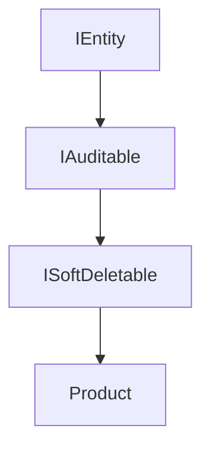
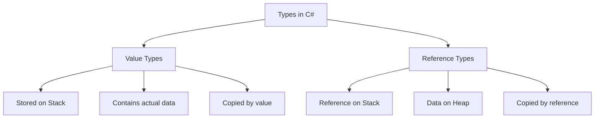

# Sessions 5-6: Interfaces, Value Types & Arrays

## 📚 Interfaces in C#

An **interface** defines a contract that implementing classes must follow.

### Interface Declaration
```csharp
public interface IShape
{
    // Property signature
    double Area { get; }
    
    // Method signature
    double CalculatePerimeter();
    
    // Event signature
    event EventHandler OnCalculated;
    
    // Indexer signature
    int this[int index] { get; set; }
}
```

---

## 🔧 Implementing an Interface

```csharp
public interface IVehicle
{
    string Brand { get; set; }
    void Start();
    void Stop();
}

public class Car : IVehicle
{
    public string Brand { get; set; }
    
    public void Start()
    {
        Console.WriteLine($"{Brand} car is starting...");
    }
    
    public void Stop()
    {
        Console.WriteLine($"{Brand} car is stopping...");
    }
}
```

### Multiple Interface Implementation
```csharp
public interface IPlayable
{
    void Play();
}

public interface IRecordable
{
    void Record();
}

// Class implementing multiple interfaces
public class MediaPlayer : IPlayable, IRecordable
{
    public void Play() => Console.WriteLine("Playing...");
    public void Record() => Console.WriteLine("Recording...");
}
```

---

## 🎯 Explicit Interface Implementation

Used when there are naming conflicts or to hide interface members.

```csharp
public interface ILogger
{
    void Log(string message);
}

public interface IFileWriter
{
    void Log(string message);  // Same method name!
}

public class FileLogger : ILogger, IFileWriter
{
    // Explicit implementation for ILogger
    void ILogger.Log(string message)
    {
        Console.WriteLine($"[LOG] {message}");
    }
    
    // Explicit implementation for IFileWriter
    void IFileWriter.Log(string message)
    {
        File.WriteAllText("log.txt", message);
    }
}

// Usage - must cast to access
FileLogger logger = new FileLogger();
((ILogger)logger).Log("Test");      // Calls ILogger.Log
((IFileWriter)logger).Log("Test");  // Calls IFileWriter.Log
```

> **MCQ Tip:** Explicitly implemented members can only be accessed through the interface type.

---

## 👪 Interface Inheritance

```csharp
public interface IEntity
{
    int Id { get; set; }
}

public interface IAuditable : IEntity
{
    DateTime CreatedAt { get; set; }
    DateTime UpdatedAt { get; set; }
}

public interface ISoftDeletable : IAuditable
{
    bool IsDeleted { get; set; }
    DateTime? DeletedAt { get; set; }
}

// Must implement ALL inherited members
public class Product : ISoftDeletable
{
    public int Id { get; set; }
    public DateTime CreatedAt { get; set; }
    public DateTime UpdatedAt { get; set; }
    public bool IsDeleted { get; set; }
    public DateTime? DeletedAt { get; set; }
}
```



---

## 🆕 Default Interface Methods (C# 8+)

```csharp
public interface ILogger
{
    void Log(string message);
    
    // Default implementation - classes don't need to override
    void LogWarning(string message)
    {
        Log($"[WARNING] {message}");
    }
    
    void LogError(string message)
    {
        Log($"[ERROR] {message}");
    }
}

public class ConsoleLogger : ILogger
{
    public void Log(string message)
    {
        Console.WriteLine(message);
    }
    // LogWarning and LogError use default implementations
}
```

---

## ➕ Operator Overloading

```csharp
public class Complex
{
    public double Real { get; set; }
    public double Imaginary { get; set; }
    
    public Complex(double real, double imaginary)
    {
        Real = real;
        Imaginary = imaginary;
    }
    
    // Overload + operator
    public static Complex operator +(Complex a, Complex b)
    {
        return new Complex(a.Real + b.Real, a.Imaginary + b.Imaginary);
    }
    
    // Overload - operator
    public static Complex operator -(Complex a, Complex b)
    {
        return new Complex(a.Real - b.Real, a.Imaginary - b.Imaginary);
    }
    
    // Overload == and != (must be in pairs)
    public static bool operator ==(Complex a, Complex b)
    {
        return a.Real == b.Real && a.Imaginary == b.Imaginary;
    }
    
    public static bool operator !=(Complex a, Complex b)
    {
        return !(a == b);
    }
    
    // Unary operator
    public static Complex operator -(Complex a)
    {
        return new Complex(-a.Real, -a.Imaginary);
    }
}

// Usage
var c1 = new Complex(1, 2);
var c2 = new Complex(3, 4);
var sum = c1 + c2;  // Real: 4, Imaginary: 6
```

### Overloadable Operators

| Category | Operators |
|----------|-----------|
| **Unary** | `+`, `-`, `!`, `~`, `++`, `--`, `true`, `false` |
| **Binary** | `+`, `-`, `*`, `/`, `%`, `&`, `|`, `^`, `<<`, `>>` |
| **Comparison** | `==`, `!=`, `<`, `>`, `<=`, `>=` |

> **MCQ Tip:** `==` and `!=` must be overloaded together. Same for `<`/`>` and `<=`/`>=`.

---

## 🔄 Reference Types vs Value Types



### Comparison Table

| Aspect | Value Type | Reference Type |
|--------|------------|----------------|
| **Storage** | Stack | Heap (reference on stack) |
| **Default** | Zero/false/null | null |
| **Assignment** | Copies data | Copies reference |
| **Comparison** | Compares values | Compares references |
| **Examples** | int, double, struct, enum | class, string, array, delegate |
| **Inheritance** | From System.ValueType | From System.Object |
| **Can be null** | No (unless nullable) | Yes |

### Example
```csharp
// Value Type
int a = 10;
int b = a;  // b gets copy of value
b = 20;     // a is still 10

// Reference Type
int[] arr1 = { 1, 2, 3 };
int[] arr2 = arr1;  // arr2 references same array
arr2[0] = 99;       // arr1[0] is also 99
```

---

## 📦 Struct (Value Type)

```csharp
public struct Point
{
    public int X { get; set; }
    public int Y { get; set; }
    
    // Parameterized constructor (required in older C#)
    public Point(int x, int y)
    {
        X = x;
        Y = y;
    }
    
    // Methods
    public double DistanceFromOrigin()
    {
        return Math.Sqrt(X * X + Y * Y);
    }
    
    // Override ToString
    public override string ToString()
    {
        return $"({X}, {Y})";
    }
}

// Usage
Point p1 = new Point(3, 4);
Point p2 = p1;  // Copy, not reference
p2.X = 10;      // p1.X is still 3
```

### Struct vs Class

| Feature | Struct | Class |
|---------|--------|-------|
| **Type** | Value type | Reference type |
| **Storage** | Stack | Heap |
| **Default Constructor** | Always present (parameterless) | Optional |
| **Inheritance** | Cannot inherit from class/struct | Can inherit |
| **Implement Interface** | Yes | Yes |
| **Can be abstract** | No | Yes |
| **Can be sealed** | Always sealed | Optional |
| **New keyword** | Optional | Required |

> **MCQ Tip:** Structs are best for small, immutable data structures (like Point, Color).

---

## 🔢 Enum (Enumeration)

```csharp
// Basic enum (default: int, starts at 0)
public enum DaysOfWeek
{
    Sunday,    // 0
    Monday,    // 1
    Tuesday,   // 2
    Wednesday, // 3
    Thursday,  // 4
    Friday,    // 5
    Saturday   // 6
}

// Enum with custom values
public enum HttpStatusCode : int
{
    OK = 200,
    Created = 201,
    BadRequest = 400,
    NotFound = 404,
    InternalServerError = 500
}

// Flags enum
[Flags]
public enum FilePermissions
{
    None = 0,
    Read = 1,       // 0001
    Write = 2,      // 0010
    Execute = 4,    // 0100
    All = Read | Write | Execute  // 0111
}

// Usage
DaysOfWeek today = DaysOfWeek.Monday;
int value = (int)today;  // 1
string name = today.ToString();  // "Monday"
DaysOfWeek parsed = Enum.Parse<DaysOfWeek>("Friday");

// Flags usage
FilePermissions perms = FilePermissions.Read | FilePermissions.Write;
bool canRead = (perms & FilePermissions.Read) == FilePermissions.Read;
```

---

## 🔀 out and ref Parameters

### ref Parameter
```csharp
// ref - must be initialized before passing
public void Triple(ref int number)
{
    number *= 3;
}

int x = 10;
Triple(ref x);  // x is now 30
```

### out Parameter
```csharp
// out - doesn't need initialization, must be assigned in method
public bool TryParse(string input, out int result)
{
    if (int.TryParse(input, out result))
        return true;
    result = 0;
    return false;
}

int value;
if (TryParse("123", out value))
    Console.WriteLine(value);  // 123

// Inline declaration (C# 7+)
if (TryParse("456", out int val))
    Console.WriteLine(val);
```

### in Parameter (C# 7.2+)
```csharp
// in - passed by reference but read-only
public double CalculateDistance(in Point p1, in Point p2)
{
    // Cannot modify p1 or p2
    return Math.Sqrt(Math.Pow(p2.X - p1.X, 2) + Math.Pow(p2.Y - p1.Y, 2));
}
```

### Comparison

| Modifier | Initialization | Assignment in Method | Modification |
|----------|----------------|---------------------|--------------|
| `ref` | Required before call | Optional | Allowed |
| `out` | Not required | Required | Allowed |
| `in` | Required before call | Not allowed | Not allowed |

---

## ❓ Nullable Types

### Nullable Value Types
```csharp
// Nullable<T> or T?
int? nullableInt = null;
nullableInt = 42;

// Check for value
if (nullableInt.HasValue)
    Console.WriteLine(nullableInt.Value);

// Null coalescing
int result = nullableInt ?? 0;  // Returns 0 if null

// Null coalescing assignment (C# 8+)
nullableInt ??= 10;  // Assigns 10 only if null

// Null conditional
int? length = nullableInt?.ToString()?.Length;
```

### Nullable Reference Types (C# 8+)
```csharp
#nullable enable

string nonNullable = "Hello";  // Cannot be null
string? nullable = null;       // Can be null

// Compiler warning if nullable used without check
if (nullable != null)
{
    Console.WriteLine(nullable.Length);  // Safe
}

// Null-forgiving operator (suppress warning)
string forcedValue = nullable!;  // Use with caution!
```

---

## ?? and ??= Operators

```csharp
// Null coalescing operator (??)
string name = null;
string displayName = name ?? "Unknown";  // "Unknown"

// Chained null coalescing
string result = firstName ?? lastName ?? "Anonymous";

// Null coalescing assignment (??=)
List<string> items = null;
items ??= new List<string>();  // Creates list if null

// Combining with null-conditional
int length = text?.Length ?? 0;
```

---

## 📊 Arrays in C#

### Single-Dimensional Array
```csharp
// Declaration and initialization
int[] numbers = new int[5];
int[] primes = { 2, 3, 5, 7, 11 };
int[] evens = new int[] { 2, 4, 6, 8, 10 };

// Access and modify
numbers[0] = 10;
int first = primes[0];  // 2
int length = primes.Length;  // 5
```

### Multi-Dimensional Array (2D)
```csharp
// 2D Array (matrix)
int[,] matrix = new int[3, 4];  // 3 rows, 4 columns

int[,] grid = 
{
    { 1, 2, 3 },
    { 4, 5, 6 },
    { 7, 8, 9 }
};

// Access
int value = grid[1, 2];  // 6 (row 1, column 2)
int rows = grid.GetLength(0);     // 3
int cols = grid.GetLength(1);     // 3
```

### Jagged Array (Array of Arrays)
```csharp
// Each row can have different length
int[][] jagged = new int[3][];
jagged[0] = new int[] { 1, 2 };
jagged[1] = new int[] { 3, 4, 5, 6 };
jagged[2] = new int[] { 7 };

// Alternative initialization
int[][] jaggedAlt = 
{
    new int[] { 1, 2, 3 },
    new int[] { 4, 5 },
    new int[] { 6, 7, 8, 9 }
};

// Access
int val = jagged[1][2];  // 5
```

### Array Type Comparison

| Type | Syntax | Row Lengths | Memory |
|------|--------|-------------|--------|
| Single | `int[]` | N/A | Contiguous |
| Multi-dimensional | `int[,]` | Same | Contiguous block |
| Jagged | `int[][]` | Can differ | Separate arrays |

---

## 📚 Array Class Members

```csharp
int[] arr = { 5, 2, 8, 1, 9, 3 };

// Static Methods
Array.Sort(arr);                     // Sorts in place: 1, 2, 3, 5, 8, 9
Array.Reverse(arr);                  // Reverses: 9, 8, 5, 3, 2, 1
int index = Array.IndexOf(arr, 5);   // Find index of value
Array.Clear(arr, 0, 2);              // Set elements to default
int[] copy = new int[6];
Array.Copy(arr, copy, 6);            // Copy array
bool exists = Array.Exists(arr, x => x > 5);  // Check condition
int found = Array.Find(arr, x => x > 5);      // Find first match

// Instance Properties/Methods
int length = arr.Length;             // Total elements
int rank = arr.Rank;                 // Number of dimensions
arr.GetValue(0);                     // Get value at index
arr.SetValue(10, 0);                 // Set value at index
arr.Clone();                         // Shallow copy
```

---

## 📍 Indices and Ranges (C# 8+)

### Index (^) Operator - From End
```csharp
int[] numbers = { 0, 1, 2, 3, 4, 5, 6, 7, 8, 9 };

int last = numbers[^1];       // 9 (last element)
int secondLast = numbers[^2]; // 8

// Index type
Index idx = ^3;
int value = numbers[idx];     // 7
```

### Range (..) Operator
```csharp
int[] numbers = { 0, 1, 2, 3, 4, 5, 6, 7, 8, 9 };

int[] slice1 = numbers[2..5];    // { 2, 3, 4 } (end exclusive)
int[] slice2 = numbers[..3];     // { 0, 1, 2 } (from start)
int[] slice3 = numbers[7..];     // { 7, 8, 9 } (to end)
int[] slice4 = numbers[^3..^1];  // { 7, 8 } (from end)
int[] all = numbers[..];         // Full copy

// Range type
Range range = 2..5;
int[] sliced = numbers[range];
```

---

## 🔢 Indexers

Indexers allow objects to be indexed like arrays.

```csharp
public class StringCollection
{
    private List<string> _items = new List<string>();
    
    // Indexer with int
    public string this[int index]
    {
        get => _items[index];
        set => _items[index] = value;
    }
    
    // Indexer with string (key)
    public string this[string key]
    {
        get => _items.FirstOrDefault(x => x.StartsWith(key));
        set
        {
            int idx = _items.FindIndex(x => x.StartsWith(key));
            if (idx >= 0) _items[idx] = value;
            else _items.Add(value);
        }
    }
    
    public void Add(string item) => _items.Add(item);
}

// Usage
var collection = new StringCollection();
collection.Add("Hello");
collection.Add("World");

string first = collection[0];      // "Hello"
collection[1] = "C#";              // Replace "World"
string byKey = collection["Hel"];  // "Hello"
```

### Multi-Parameter Indexer
```csharp
public class Matrix
{
    private int[,] _data;
    
    public Matrix(int rows, int cols)
    {
        _data = new int[rows, cols];
    }
    
    // Two-parameter indexer
    public int this[int row, int col]
    {
        get => _data[row, col];
        set => _data[row, col] = value;
    }
}

// Usage
Matrix m = new Matrix(3, 3);
m[0, 0] = 1;
m[1, 1] = 5;
int val = m[0, 0];  // 1
```

---

## 🔄 IComparable and IComparer

### IComparable<T>
```csharp
public class Student : IComparable<Student>
{
    public string Name { get; set; }
    public int Grade { get; set; }
    
    public int CompareTo(Student other)
    {
        if (other == null) return 1;
        return this.Grade.CompareTo(other.Grade);
    }
}

// Usage
List<Student> students = new List<Student>();
students.Sort();  // Uses CompareTo
```

### IComparer<T>
```csharp
public class StudentNameComparer : IComparer<Student>
{
    public int Compare(Student x, Student y)
    {
        if (x == null && y == null) return 0;
        if (x == null) return -1;
        if (y == null) return 1;
        return string.Compare(x.Name, y.Name);
    }
}

// Usage
students.Sort(new StudentNameComparer());
```

---

## 💡 Key MCQ Points

> **Critical Points for CCEE:**

1. **Interface** = contract, cannot have fields (only constants)
2. **Explicit implementation** = accessed only through interface type
3. **Multiple interfaces** allowed, multiple class inheritance NOT allowed
4. **Default interface methods** = C# 8+ feature
5. **Operator overloading** = `public static` methods
6. **`==` and `!=`** must be overloaded together
7. **Value types** = stored on stack, copied by value
8. **Reference types** = reference on stack, data on heap
9. **Struct** = value type, cannot inherit, always sealed
10. **Enum** = underlying type is int by default
11. **`[Flags]`** attribute for bitwise enum operations
12. **`ref`** = must be initialized, **`out`** = must be assigned in method
13. **`??`** = null coalescing, **`??=`** = null coalescing assignment
14. **Jagged array** = `int[][]`, different row lengths allowed
15. **`^1`** = last element, **`2..5`** = range (end exclusive)
16. **Indexer** = `this[type index]` syntax
