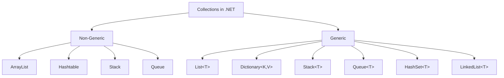

# Sessions 7-8: Generics, Collections & Delegates

## 📚 Generic Classes

**Generics** allow you to define type-safe data structures without committing to a specific data type.

### Basic Generic Class
```csharp
public class Box<T>
{
    private T _content;
    
    public T Content
    {
        get => _content;
        set => _content = value;
    }
    
    public bool IsEmpty => _content == null;
}

// Usage
Box<int> intBox = new Box<int> { Content = 42 };
Box<string> strBox = new Box<string> { Content = "Hello" };
```

### Multiple Type Parameters
```csharp
public class Pair<TKey, TValue>
{
    public TKey Key { get; set; }
    public TValue Value { get; set; }
    
    public Pair(TKey key, TValue value)
    {
        Key = key;
        Value = value;
    }
}

// Usage
var pair = new Pair<string, int>("Age", 25);
```

### Generic Inheritance
```csharp
// Generic class inheriting from generic class
public class SpecialBox<T> : Box<T>
{
    public bool HasContent => !IsEmpty;
}

// Non-generic class inheriting from generic class
public class IntBox : Box<int>
{
    public int GetDoubled() => Content * 2;
}
```

---

## 🔧 Generic Methods

```csharp
public class Utilities
{
    // Generic method
    public static void Swap<T>(ref T a, ref T b)
    {
        T temp = a;
        a = b;
        b = temp;
    }
    
    // Generic method with multiple type parameters
    public static TOutput Convert<TInput, TOutput>(TInput input, Func<TInput, TOutput> converter)
    {
        return converter(input);
    }
    
    // Generic method in non-generic class
    public T CreateDefault<T>() where T : new()
    {
        return new T();
    }
}

// Usage
int x = 5, y = 10;
Utilities.Swap(ref x, ref y);  // x=10, y=5

string numStr = Utilities.Convert(42, n => n.ToString());  // "42"
```

---

## 🔒 Generic Constraints

Constraints restrict the types that can be used as type arguments.

```csharp
// where T : struct - Value type only
public class ValueContainer<T> where T : struct
{
    public T Value { get; set; }
}

// where T : class - Reference type only
public class RefContainer<T> where T : class
{
    public T Value { get; set; }
}

// where T : new() - Must have parameterless constructor
public class Factory<T> where T : new()
{
    public T Create() => new T();
}

// where T : BaseClass - Must inherit from BaseClass
public class EntityManager<T> where T : Entity
{
    public void Save(T entity) { /* ... */ }
}

// where T : IInterface - Must implement interface
public class Processor<T> where T : IProcessable
{
    public void Process(T item) => item.Process();
}

// where T : U - T must derive from U
public class Derived<T, U> where T : U
{
    // T must be assignable to U
}

// Multiple constraints
public class Repository<T> where T : class, IEntity, new()
{
    public T CreateNew() => new T();
    public void Save(T entity) { /* ... */ }
}
```

### Constraint Summary Table

| Constraint | Description |
|------------|-------------|
| `where T : struct` | Must be value type (not nullable) |
| `where T : class` | Must be reference type |
| `where T : class?` | Reference type (nullable) |
| `where T : notnull` | Non-nullable type |
| `where T : new()` | Must have parameterless constructor |
| `where T : BaseClass` | Must derive from BaseClass |
| `where T : IInterface` | Must implement IInterface |
| `where T : U` | Must derive from type parameter U |
| `where T : unmanaged` | Must be unmanaged type |

> **MCQ Tip:** `new()` constraint must be specified last.

---

## 📦 Collections Overview



### Generic vs Non-Generic

| Feature | Non-Generic | Generic |
|---------|-------------|---------|
| **Namespace** | System.Collections | System.Collections.Generic |
| **Type Safety** | No (stores Object) | Yes |
| **Boxing/Unboxing** | Required for value types | No |
| **Performance** | Slower | Faster |
| **Recommended** | Legacy code only | Always use |

---

## 📋 ICollection<T> Interface

```csharp
public interface ICollection<T> : IEnumerable<T>
{
    int Count { get; }
    bool IsReadOnly { get; }
    void Add(T item);
    void Clear();
    bool Contains(T item);
    void CopyTo(T[] array, int arrayIndex);
    bool Remove(T item);
}
```

---

## 📝 IList<T> - List Collections

### List<T>
```csharp
// Creation
List<int> numbers = new List<int>();
List<string> names = new List<string> { "Alice", "Bob", "Charlie" };
List<int> fromArray = new List<int>(new[] { 1, 2, 3 });

// Adding elements
numbers.Add(10);
numbers.AddRange(new[] { 20, 30, 40 });
numbers.Insert(1, 15);  // Insert at index

// Accessing elements
int first = numbers[0];
int last = numbers[^1];

// Removing elements
numbers.Remove(20);           // Remove first occurrence
numbers.RemoveAt(0);          // Remove at index
numbers.RemoveAll(x => x > 30);  // Remove matching

// Searching
int index = names.IndexOf("Bob");
bool exists = names.Contains("Alice");
string found = names.Find(x => x.StartsWith("C"));
List<string> all = names.FindAll(x => x.Length > 3);

// Sorting
numbers.Sort();
numbers.Sort((a, b) => b.CompareTo(a));  // Descending
names.Sort(StringComparer.OrdinalIgnoreCase);

// Other operations
numbers.Reverse();
numbers.Clear();
int count = numbers.Count;
int[] array = numbers.ToArray();
```

### Non-Generic ArrayList (Legacy)
```csharp
ArrayList list = new ArrayList();
list.Add(1);
list.Add("string");  // Mixed types - not type-safe!
list.Add(3.14);

int value = (int)list[0];  // Casting required
```

---

## 📖 IDictionary<TKey, TValue>

### Dictionary<TKey, TValue>
```csharp
// Creation
Dictionary<string, int> ages = new Dictionary<string, int>();
Dictionary<int, string> lookup = new Dictionary<int, string>
{
    { 1, "One" },
    { 2, "Two" },
    { 3, "Three" }
};

// C# 6+ collection initializer
var countries = new Dictionary<string, string>
{
    ["US"] = "United States",
    ["UK"] = "United Kingdom",
    ["IN"] = "India"
};

// Adding
ages.Add("Alice", 25);
ages["Bob"] = 30;  // Add or update

// Accessing
int aliceAge = ages["Alice"];
bool hasKey = ages.ContainsKey("Charlie");
bool hasValue = ages.ContainsValue(25);

// Safe access
if (ages.TryGetValue("Bob", out int bobAge))
{
    Console.WriteLine(bobAge);
}

// Removing
ages.Remove("Alice");

// Iterating
foreach (KeyValuePair<string, int> kvp in ages)
{
    Console.WriteLine($"{kvp.Key}: {kvp.Value}");
}

foreach (string key in ages.Keys)
{
    Console.WriteLine(key);
}

// Properties
int count = ages.Count;
var keys = ages.Keys;
var values = ages.Values;
```

### Non-Generic Hashtable (Legacy)
```csharp
Hashtable table = new Hashtable();
table.Add("key", "value");
string val = (string)table["key"];  // Casting required
```

---

## 📚 Other Generic Collections

### Stack<T> - LIFO
```csharp
Stack<int> stack = new Stack<int>();
stack.Push(1);
stack.Push(2);
stack.Push(3);

int top = stack.Peek();     // 3 (doesn't remove)
int popped = stack.Pop();   // 3 (removes)
bool has = stack.Contains(2);
int count = stack.Count;
```

### Queue<T> - FIFO
```csharp
Queue<string> queue = new Queue<string>();
queue.Enqueue("First");
queue.Enqueue("Second");
queue.Enqueue("Third");

string front = queue.Peek();      // "First"
string dequeued = queue.Dequeue(); // "First"
```

### HashSet<T> - Unique Elements
```csharp
HashSet<int> set = new HashSet<int> { 1, 2, 3 };
set.Add(4);
set.Add(2);  // Duplicate - not added

bool added = set.Add(5);  // true
bool exists = set.Contains(3);

// Set operations
HashSet<int> other = new HashSet<int> { 3, 4, 5, 6 };
set.UnionWith(other);        // All elements
set.IntersectWith(other);    // Common elements
set.ExceptWith(other);       // Remove other's elements
set.SymmetricExceptWith(other);  // Elements in either but not both
```

### LinkedList<T>
```csharp
LinkedList<string> list = new LinkedList<string>();
list.AddFirst("First");
list.AddLast("Last");

LinkedListNode<string> node = list.First;
list.AddAfter(node, "After First");
list.AddBefore(list.Last, "Before Last");

list.Remove("First");
list.RemoveFirst();
list.RemoveLast();
```

### SortedList<TKey, TValue> / SortedDictionary<TKey, TValue>
```csharp
SortedList<string, int> sortedList = new SortedList<string, int>
{
    ["Charlie"] = 3,
    ["Alice"] = 1,
    ["Bob"] = 2
};
// Keys are automatically sorted: Alice, Bob, Charlie

SortedDictionary<string, int> sortedDict = new SortedDictionary<string, int>();
// Same as SortedList but faster insertion/removal for large sets
```

### Collection Comparison

| Collection | Ordered | Unique Keys | Access | Best For |
|------------|---------|-------------|--------|----------|
| `List<T>` | Yes (by index) | No | O(1) by index | Sequential data |
| `Dictionary<K,V>` | No | Yes | O(1) by key | Key-value lookups |
| `SortedDictionary<K,V>` | Yes (by key) | Yes | O(log n) | Sorted key-value |
| `HashSet<T>` | No | Yes (elements) | O(1) | Unique elements |
| `SortedSet<T>` | Yes | Yes | O(log n) | Sorted unique |
| `Stack<T>` | LIFO | No | O(1) push/pop | Undo operations |
| `Queue<T>` | FIFO | No | O(1) enq/deq | Task processing |
| `LinkedList<T>` | Yes | No | O(1) insert | Frequent insert/delete |

---

## 🔄 Iterating Collections

### foreach Loop
```csharp
List<string> names = new List<string> { "Alice", "Bob", "Charlie" };

foreach (string name in names)
{
    Console.WriteLine(name);
}

// With index (LINQ)
foreach (var (name, index) in names.Select((n, i) => (n, i)))
{
    Console.WriteLine($"{index}: {name}");
}
```

### IEnumerable and IEnumerator
```csharp
public class NumberRange : IEnumerable<int>
{
    private int _start;
    private int _end;
    
    public NumberRange(int start, int end)
    {
        _start = start;
        _end = end;
    }
    
    public IEnumerator<int> GetEnumerator()
    {
        for (int i = _start; i <= _end; i++)
        {
            yield return i;  // Returns one element at a time
        }
    }
    
    IEnumerator IEnumerable.GetEnumerator() => GetEnumerator();
}

// Usage
foreach (int n in new NumberRange(1, 5))
{
    Console.WriteLine(n);  // 1, 2, 3, 4, 5
}
```

---

## 📦 Tuples

### ValueTuple (C# 7+)
```csharp
// Creating tuples
var tuple = (1, "Hello", 3.14);
(int id, string name, double value) = tuple;

// Named tuple elements
var person = (Name: "John", Age: 30, City: "Mumbai");
Console.WriteLine(person.Name);

// Return multiple values
public (int Min, int Max, double Average) CalculateStats(int[] numbers)
{
    return (numbers.Min(), numbers.Max(), numbers.Average());
}

var stats = CalculateStats(new[] { 1, 2, 3, 4, 5 });
Console.WriteLine($"Min: {stats.Min}, Max: {stats.Max}, Avg: {stats.Average}");

// Deconstruction
var (min, max, avg) = CalculateStats(new[] { 10, 20, 30 });

// Tuple comparison
var t1 = (1, 2);
var t2 = (1, 2);
bool equal = t1 == t2;  // true
```

### Tuple Class (Legacy)
```csharp
Tuple<int, string, double> oldTuple = Tuple.Create(1, "Hello", 3.14);
int item1 = oldTuple.Item1;
string item2 = oldTuple.Item2;
```

### Tuple vs Anonymous Type

| Feature | Tuple | Anonymous Type |
|---------|-------|----------------|
| **Syntax** | `(int, string)` | `new { Id = 1, Name = "x" }` |
| **Named Members** | Yes (ValueTuple) | Yes |
| **Return Type** | Yes | No (local scope only) |
| **Type** | Value type | Reference type |
| **Deconstruction** | Yes | No |

---

## 🎯 Delegates

A **delegate** is a type-safe function pointer.

### Declaring and Using Delegates
```csharp
// Delegate declaration
public delegate int MathOperation(int a, int b);

// Methods matching delegate signature
public static int Add(int a, int b) => a + b;
public static int Subtract(int a, int b) => a - b;
public static int Multiply(int a, int b) => a * b;

// Usage
MathOperation op = Add;
int result = op(5, 3);  // 8

op = Subtract;
result = op(5, 3);  // 2

// Passing delegate as parameter
public static int Calculate(int a, int b, MathOperation operation)
{
    return operation(a, b);
}

int sum = Calculate(10, 5, Add);  // 15
```

### Multicast Delegates
```csharp
public delegate void Notifier(string message);

public static void EmailNotify(string msg) 
    => Console.WriteLine($"Email: {msg}");

public static void SmsNotify(string msg) 
    => Console.WriteLine($"SMS: {msg}");

public static void PushNotify(string msg) 
    => Console.WriteLine($"Push: {msg}");

// Combine delegates
Notifier notifier = EmailNotify;
notifier += SmsNotify;
notifier += PushNotify;

notifier("Hello!");  // Calls all three methods

// Remove delegate
notifier -= SmsNotify;
notifier("World!");  // Calls Email and Push only

// Get invocation list
Delegate[] list = notifier.GetInvocationList();
```

> **MCQ Tip:** Multicast delegates call methods in the order they were added.

---

## 📌 Built-in Delegates

### Action<T> - Returns void
```csharp
// Action - no parameters, no return
Action greet = () => Console.WriteLine("Hello");

// Action<T> - parameters, no return
Action<string> print = msg => Console.WriteLine(msg);
Action<int, int> printSum = (a, b) => Console.WriteLine(a + b);

// Up to 16 type parameters
Action<int, string, double> action3 = (i, s, d) => { /* ... */ };
```

### Func<T, TResult> - Returns value
```csharp
// Func<TResult> - no parameters, returns value
Func<int> getRandome = () => new Random().Next();

// Func<T, TResult> - one parameter, returns value
Func<int, int> square = x => x * x;

// Func<T1, T2, TResult> - multiple parameters
Func<int, int, int> add = (a, b) => a + b;
Func<string, int> length = s => s.Length;

// Usage
int result = add(5, 3);  // 8
```

### Predicate<T> - Returns bool
```csharp
// Predicate<T> - takes T, returns bool
Predicate<int> isEven = x => x % 2 == 0;
Predicate<string> isEmpty = s => string.IsNullOrEmpty(s);

// Usage
bool result = isEven(4);  // true

// Common usage with List
List<int> numbers = new List<int> { 1, 2, 3, 4, 5, 6 };
List<int> evens = numbers.FindAll(isEven);  // 2, 4, 6
int found = numbers.Find(x => x > 3);  // 4
```

### Delegate Comparison

| Delegate | Parameters | Return Type | Use Case |
|----------|------------|-------------|----------|
| `Action` | 0-16 | void | Side effects, callbacks |
| `Func` | 0-16 | TResult | Transformations, calculations |
| `Predicate` | 1 | bool | Filtering, conditions |

---

## 🔒 Anonymous Methods

```csharp
// Anonymous method syntax
Func<int, int, int> add = delegate (int a, int b)
{
    return a + b;
};

Action<string> print = delegate (string msg)
{
    Console.WriteLine(msg);
};

// Capturing outer variables
int multiplier = 3;
Func<int, int> multiplyBy = delegate (int x)
{
    return x * multiplier;  // Captures 'multiplier'
};

Console.WriteLine(multiplyBy(5));  // 15
```

---

## ➡️ Lambda Expressions

```csharp
// Expression lambda - single expression
Func<int, int> square = x => x * x;
Func<int, int, int> add = (a, b) => a + b;

// Statement lambda - multiple statements
Func<int, int> factorial = n =>
{
    int result = 1;
    for (int i = 2; i <= n; i++)
        result *= i;
    return result;
};

// With explicit types
Func<int, int, bool> areEqual = (int a, int b) => a == b;

// Discards
Func<object, int> getOne = _ => 1;  // Ignores parameter

// Common usage
List<int> numbers = new List<int> { 1, 2, 3, 4, 5 };
var evens = numbers.Where(x => x % 2 == 0);
var doubled = numbers.Select(x => x * 2);
var sum = numbers.Aggregate((a, b) => a + b);
```

### Lambda Captures (Closures)
```csharp
int factor = 10;
Func<int, int> multiply = x => x * factor;

Console.WriteLine(multiply(5));  // 50

factor = 20;
Console.WriteLine(multiply(5));  // 100 (uses current value!)
```

> **MCQ Tip:** Captured variables use their current value at invocation time, not capture time.

---

## 💡 Key MCQ Points

> **Critical Points for CCEE:**

1. **Generics** provide type safety without boxing/unboxing
2. **Constraints** restrict type arguments (`where T : class`)
3. **`new()`** constraint must be last
4. **`List<T>`** replaces `ArrayList` (type-safe)
5. **`Dictionary<K,V>`** replaces `Hashtable`
6. **`Stack<T>`** = LIFO, **`Queue<T>`** = FIFO
7. **`HashSet<T>`** = unique elements, O(1) lookup
8. **Delegate** = type-safe function pointer
9. **Multicast delegate** = combines multiple methods
10. **`Action`** = void return, **`Func`** = returns value
11. **`Predicate<T>`** = returns bool, used for filtering
12. **Lambda** = `=>` syntax, concise anonymous function
13. **Closure** = lambda captures outer variables
14. **ValueTuple** = C# 7+, named elements, value type
15. **`yield return`** = implements IEnumerable easily
