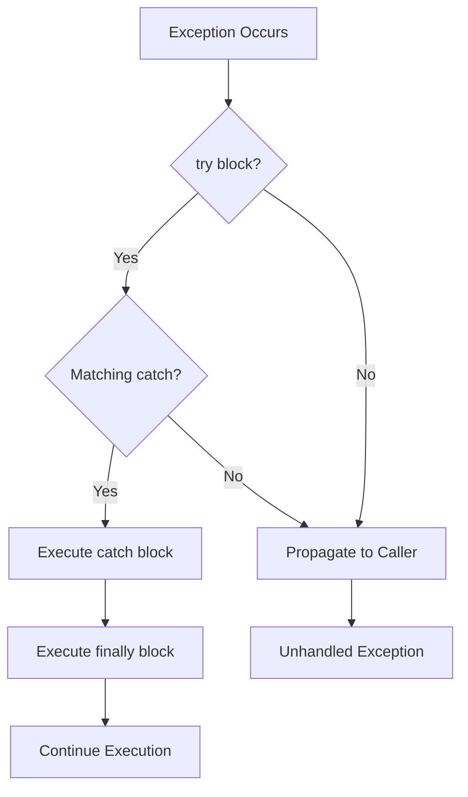
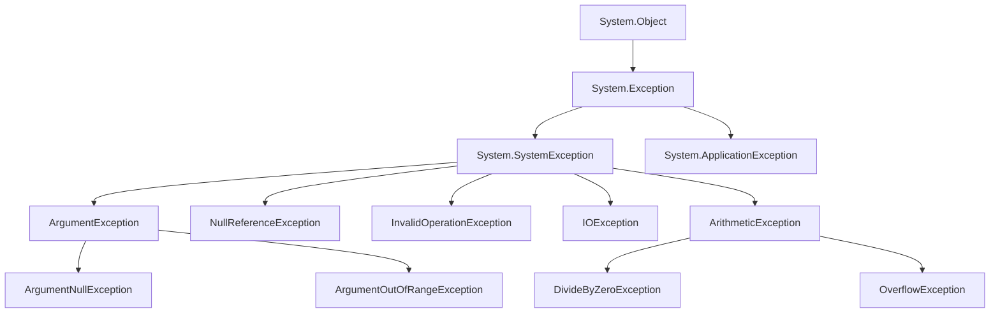
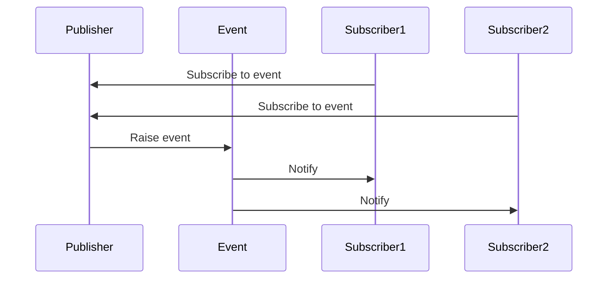

# Session 9: Error Handling & Events

## 📚 Exception Handling in C#

**Exceptions** are runtime errors that disrupt the normal flow of program execution.



---

## 🔧 try, catch, finally

### Basic Syntax
```csharp
try
{
    // Code that might throw exception
    int result = 10 / 0;
}
catch (DivideByZeroException ex)
{
    // Handle specific exception
    Console.WriteLine($"Error: {ex.Message}");
}
catch (Exception ex)
{
    // Handle any other exception
    Console.WriteLine($"General error: {ex.Message}");
}
finally
{
    // Always executed (cleanup)
    Console.WriteLine("Cleanup code");
}
```

### Exception Hierarchy


### Common Exception Types

| Exception | Description | Common Cause |
|-----------|-------------|--------------|
| `NullReferenceException` | Object reference is null | Accessing null object member |
| `ArgumentNullException` | Argument is null | Passing null to method |
| `ArgumentException` | Invalid argument | Invalid parameter value |
| `InvalidOperationException` | Invalid state | Operation on invalid state |
| `IndexOutOfRangeException` | Array index out of bounds | Invalid array access |
| `DivideByZeroException` | Division by zero | Dividing by 0 |
| `FileNotFoundException` | File not found | Missing file |
| `FormatException` | Invalid format | Parse failures |
| `OverflowException` | Arithmetic overflow | Number too large |
| `StackOverflowException` | Stack overflow | Infinite recursion |

---

## 🔢 checked and unchecked

### checked - Throws OverflowException
```csharp
checked
{
    int max = int.MaxValue;
    int result = max + 1;  // Throws OverflowException
}

// Or use checked expression
int value = checked(int.MaxValue + 1);  // Throws
```

### unchecked - Silently Overflows (Default)
```csharp
unchecked
{
    int max = int.MaxValue;
    int result = max + 1;  // No exception, result = int.MinValue
}

// Default behavior
int value = int.MaxValue + 1;  // int.MinValue (wrap around)
```

> **MCQ Tip:** By default, integer overflow is unchecked in C#. Use `checked` for safe arithmetic.

---

## 📝 Multiple catch Blocks

```csharp
try
{
    // Some code
    string input = Console.ReadLine();
    int number = int.Parse(input);
    int result = 100 / number;
}
catch (FormatException)
{
    Console.WriteLine("Invalid number format");
}
catch (DivideByZeroException)
{
    Console.WriteLine("Cannot divide by zero");
}
catch (Exception ex) when (ex.InnerException != null)
{
    // Exception filter (C# 6+)
    Console.WriteLine($"Inner: {ex.InnerException.Message}");
}
catch (Exception ex)
{
    // Catch-all (should be last)
    Console.WriteLine($"Error: {ex.Message}");
}
```

### Exception Filters (C# 6+)
```csharp
try
{
    // Code
}
catch (HttpRequestException ex) when (ex.StatusCode == HttpStatusCode.NotFound)
{
    Console.WriteLine("Resource not found");
}
catch (HttpRequestException ex) when (ex.StatusCode == HttpStatusCode.Unauthorized)
{
    Console.WriteLine("Authentication required");
}
```

---

## 🔄 finally Block

```csharp
FileStream file = null;
try
{
    file = new FileStream("data.txt", FileMode.Open);
    // Read file
}
catch (FileNotFoundException)
{
    Console.WriteLine("File not found");
}
finally
{
    // ALWAYS executes, even if exception occurs
    file?.Close();
}
```

### finally Guarantees

| Scenario | finally Executes? |
|---------|-------------------|
| No exception | ✅ Yes |
| Exception caught | ✅ Yes |
| Exception uncaught | ✅ Yes |
| Return in try | ✅ Yes |
| Return in catch | ✅ Yes |
| Environment.Exit() | ❌ No |
| StackOverflowException | ❌ No |
| Power failure | ❌ No |

---

## ⚠️ Throwing Exceptions

### throw Statement
```csharp
public void ProcessData(string data)
{
    if (data == null)
        throw new ArgumentNullException(nameof(data), "Data cannot be null");
    
    if (data.Length == 0)
        throw new ArgumentException("Data cannot be empty", nameof(data));
    
    // Process data
}
```

### Rethrowing Exceptions
```csharp
try
{
    // Some operation
}
catch (Exception ex)
{
    // Log the exception
    Logger.Log(ex);
    
    // Rethrow preserving stack trace
    throw;
    
    // DON'T DO THIS - loses original stack trace
    // throw ex;
}
```

### Throw Expression (C# 7+)
```csharp
public string Name
{
    get => _name;
    set => _name = value ?? throw new ArgumentNullException(nameof(value));
}

// Null coalescing with throw
string text = input ?? throw new ArgumentNullException(nameof(input));

// Conditional expression
int result = x >= 0 ? x : throw new ArgumentOutOfRangeException(nameof(x));
```

---

## 🏗️ User-Defined Exception Classes

```csharp
// Custom exception class
public class ValidationException : Exception
{
    public string PropertyName { get; }
    public object AttemptedValue { get; }
    
    public ValidationException(string propertyName, object value, string message)
        : base(message)
    {
        PropertyName = propertyName;
        AttemptedValue = value;
    }
    
    public ValidationException(string message) 
        : base(message)
    {
    }
    
    public ValidationException(string message, Exception innerException) 
        : base(message, innerException)
    {
    }
}

// Serializable custom exception
[Serializable]
public class BusinessRuleException : Exception
{
    public string RuleCode { get; }
    
    public BusinessRuleException() { }
    
    public BusinessRuleException(string ruleCode, string message) 
        : base(message)
    {
        RuleCode = ruleCode;
    }
    
    public BusinessRuleException(string message, Exception inner) 
        : base(message, inner) { }
    
    protected BusinessRuleException(SerializationInfo info, StreamingContext context) 
        : base(info, context)
    {
        RuleCode = info.GetString(nameof(RuleCode));
    }
    
    public override void GetObjectData(SerializationInfo info, StreamingContext context)
    {
        base.GetObjectData(info, context);
        info.AddValue(nameof(RuleCode), RuleCode);
    }
}

// Usage
throw new ValidationException("Email", "invalid@", "Invalid email format");
throw new BusinessRuleException("BR001", "Minimum order quantity is 10");
```

---

## ✅ Exception Handling Best Practices

### Do's ✅

```csharp
// 1. Catch specific exceptions
try { /* */ }
catch (FileNotFoundException) { /* specific handling */ }

// 2. Use using for disposable resources
using (var file = File.OpenRead("data.txt"))
{
    // File automatically closed
}

// 3. Use parameterized messages
throw new ArgumentException($"Invalid value: {value}", nameof(parameter));

// 4. Include inner exception for wrapping
catch (SqlException ex)
{
    throw new DataAccessException("Database error", ex);
}

// 5. Log exceptions
catch (Exception ex)
{
    _logger.LogError(ex, "Operation failed");
    throw;
}
```

### Don'ts ❌

```csharp
// 1. DON'T catch and swallow exceptions
try { /* */ }
catch (Exception) { }  // Bad - hides errors

// 2. DON'T use exceptions for flow control
try
{
    return dictionary[key];
}
catch (KeyNotFoundException)
{
    return defaultValue;  // Use TryGetValue instead
}

// 3. DON'T throw Exception base class
throw new Exception("Error");  // Too generic

// 4. DON'T catch everything without reason
catch (Exception) { return null; }  // Hides bug

// 5. DON'T throw in finally
finally
{
    throw new Exception();  // Can hide original exception
}
```

### Better Patterns

```csharp
// TryParse pattern
if (int.TryParse(input, out int result))
{
    // Use result
}
else
{
    // Handle invalid input
}

// TryGetValue pattern
if (dictionary.TryGetValue(key, out var value))
{
    // Use value
}

// Null checking before use
if (obj != null)
{
    obj.Process();
}
```

---

## 📢 Events in C#

**Events** provide a way for objects to notify other objects when something happens.



---

## 🎯 Declaring and Raising Events

### Event Declaration
```csharp
public class Account
{
    // 1. Define delegate type (or use EventHandler)
    public delegate void BalanceChangedHandler(decimal oldBalance, decimal newBalance);
    
    // 2. Declare event
    public event BalanceChangedHandler BalanceChanged;
    
    private decimal _balance;
    
    public decimal Balance
    {
        get => _balance;
        set
        {
            decimal old = _balance;
            _balance = value;
            
            // 3. Raise event
            OnBalanceChanged(old, _balance);
        }
    }
    
    // 4. Protected method to raise event
    protected virtual void OnBalanceChanged(decimal oldBalance, decimal newBalance)
    {
        // Null check and invoke
        BalanceChanged?.Invoke(oldBalance, newBalance);
    }
}
```

### Using Standard EventHandler
```csharp
public class Button
{
    // Using standard EventHandler delegate
    public event EventHandler Clicked;
    
    public void Click()
    {
        OnClicked(EventArgs.Empty);
    }
    
    protected virtual void OnClicked(EventArgs e)
    {
        Clicked?.Invoke(this, e);
    }
}

// With custom EventArgs
public class TemperatureChangedEventArgs : EventArgs
{
    public double OldTemperature { get; }
    public double NewTemperature { get; }
    
    public TemperatureChangedEventArgs(double oldTemp, double newTemp)
    {
        OldTemperature = oldTemp;
        NewTemperature = newTemp;
    }
}

public class Thermostat
{
    public event EventHandler<TemperatureChangedEventArgs> TemperatureChanged;
    
    private double _temperature;
    
    public double Temperature
    {
        get => _temperature;
        set
        {
            double old = _temperature;
            _temperature = value;
            OnTemperatureChanged(new TemperatureChangedEventArgs(old, value));
        }
    }
    
    protected virtual void OnTemperatureChanged(TemperatureChangedEventArgs e)
    {
        TemperatureChanged?.Invoke(this, e);
    }
}
```

---

## 📥 Handling Events

### Subscribing to Events
```csharp
// 1. Create handler method
void Account_BalanceChanged(decimal oldBalance, decimal newBalance)
{
    Console.WriteLine($"Balance changed from {oldBalance} to {newBalance}");
}

// 2. Subscribe to event
Account account = new Account();
account.BalanceChanged += Account_BalanceChanged;

// 3. Trigger the event
account.Balance = 1000;  // Fires BalanceChanged event

// 4. Unsubscribe when done
account.BalanceChanged -= Account_BalanceChanged;
```

### Using Lambda Expressions
```csharp
Button button = new Button();

// Subscribe with lambda
button.Clicked += (sender, e) => Console.WriteLine("Button clicked!");

// For more complex handling
button.Clicked += (sender, e) =>
{
    Console.WriteLine("Processing click...");
    DoSomething();
};
```

### Using Anonymous Methods
```csharp
button.Clicked += delegate (object sender, EventArgs e)
{
    Console.WriteLine("Anonymous handler");
};
```

---

## 🔒 Event Patterns

### Thread-Safe Event Invocation
```csharp
// Safe invocation pattern
protected virtual void OnEvent(EventArgs e)
{
    // Copy to local variable for thread safety
    EventHandler handler = MyEvent;
    handler?.Invoke(this, e);
}

// Or using null-conditional (C# 6+)
protected virtual void OnEvent(EventArgs e)
{
    MyEvent?.Invoke(this, e);
}
```

### Custom add/remove
```csharp
public class Publisher
{
    private EventHandler _customEvent;
    private readonly object _lock = new object();
    
    public event EventHandler CustomEvent
    {
        add
        {
            lock (_lock)
            {
                _customEvent += value;
                Console.WriteLine("Handler added");
            }
        }
        remove
        {
            lock (_lock)
            {
                _customEvent -= value;
                Console.WriteLine("Handler removed");
            }
        }
    }
}
```

---

## 📊 Event vs Delegate

| Aspect | Event | Delegate |
|--------|-------|----------|
| **Declaration** | `event` keyword | Just delegate type |
| **External Invocation** | Not allowed | Allowed |
| **Assignment** | Only `+=` / `-=` from outside | Can use `=` |
| **Encapsulation** | Better encapsulated | Less controlled |
| **Purpose** | Pub/Sub pattern | Callback mechanism |

```csharp
public class Comparison
{
    // Delegate - can be assigned and invoked externally
    public Action<string> MyDelegate;
    
    // Event - can only be subscribed from outside
    public event Action<string> MyEvent;
    
    public void Demo()
    {
        // External code:
        MyDelegate = msg => Console.WriteLine(msg);  // OK
        MyDelegate("Hello");  // OK - external invoke
        
        MyEvent += msg => Console.WriteLine(msg);  // OK - subscribe
        // MyEvent = msg => { };  // ERROR - cannot assign
        // MyEvent("Hello");       // ERROR - cannot invoke
    }
}
```

---

## 🔄 Common Event Patterns

### Observable Pattern
```csharp
public interface IObserver<T>
{
    void OnNext(T value);
    void OnError(Exception error);
    void OnCompleted();
}

public interface IObservable<T>
{
    IDisposable Subscribe(IObserver<T> observer);
}
```

### Weak Event Pattern
```csharp
// For preventing memory leaks with long-lived publishers
public class WeakEventManager
{
    private readonly WeakReference<EventHandler> _handler;
    
    public void AddHandler(EventHandler handler)
    {
        _handler = new WeakReference<EventHandler>(handler);
    }
    
    public void RaiseEvent(object sender, EventArgs e)
    {
        if (_handler.TryGetTarget(out EventHandler handler))
        {
            handler(sender, e);
        }
    }
}
```

---

## 💡 Key MCQ Points

> **Critical Points for CCEE:**

1. **try-catch-finally** = exception handling structure
2. **finally** always executes (except Environment.Exit, StackOverflow)
3. **throw;** preserves stack trace, **throw ex;** loses it
4. **checked** throws OverflowException on overflow
5. **unchecked** wraps around silently (default)
6. Catch blocks are evaluated **top to bottom, specific first**
7. Custom exceptions should inherit from **Exception**
8. Use **TryParse pattern** instead of catching FormatException
9. **event** = restricted delegate, cannot invoke externally
10. **EventHandler<T>** = standard event delegate
11. **+=** subscribes, **-=** unsubscribes
12. Use **?.Invoke()** for null-safe event invocation
13. **EventArgs** = base class for event data
14. **ArgumentNullException** = for null parameter
15. **InvalidOperationException** = for invalid state
