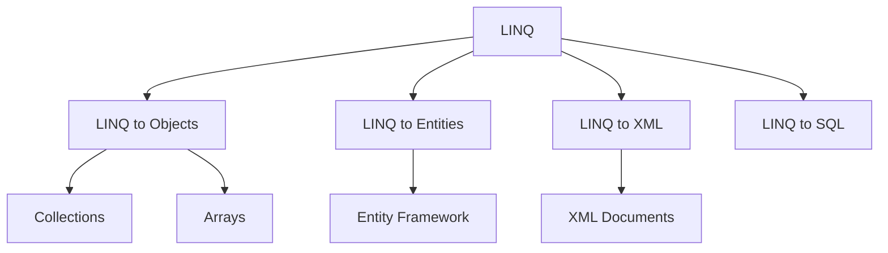

# Sessions 10-11: LINQ, Reflection & File I/O

## 📚 Anonymous Types

**Anonymous types** allow you to create objects without defining a class.

```csharp
// Creating anonymous type
var person = new 
{
    Name = "John",
    Age = 30,
    City = "Mumbai"
};

Console.WriteLine(person.Name);  // John
// person.Name = "Jane";  // ERROR - properties are read-only

// Type is generated by compiler
// Actual type: <>f__AnonymousType0`3[System.String, System.Int32, System.String]

// Useful in LINQ
var results = employees
    .Select(e => new { e.Name, e.Department, Yearly = e.Salary * 12 });
```

> **MCQ Tip:** Anonymous type properties are **read-only** and type is generated at compile-time.

---

## 🔧 Extension Methods

**Extension methods** add new methods to existing types without modifying them.

```csharp
public static class StringExtensions
{
    // Extension method - 'this' keyword for target type
    public static bool IsNullOrEmpty(this string str)
    {
        return string.IsNullOrEmpty(str);
    }
    
    public static string Reverse(this string str)
    {
        char[] chars = str.ToCharArray();
        Array.Reverse(chars);
        return new string(chars);
    }
    
    public static int WordCount(this string str)
    {
        if (str.IsNullOrEmpty()) return 0;
        return str.Split(' ', StringSplitOptions.RemoveEmptyEntries).Length;
    }
}

// Usage
string text = "Hello World";
bool isEmpty = text.IsNullOrEmpty();     // false
string reversed = text.Reverse();         // "dlroW olleH"
int words = text.WordCount();            // 2

// Can call on null (be careful!)
string nullStr = null;
bool isNull = nullStr.IsNullOrEmpty();   // true (doesn't throw)
```

### Extension Method Rules:
1. Must be in a **static class**
2. Method must be **static**
3. First parameter must have **this** modifier
4. Can extend any type (value types, interfaces, sealed classes)

```csharp
// Extending interfaces
public static class EnumerableExtensions
{
    public static T SecondOrDefault<T>(this IEnumerable<T> source)
    {
        return source.Skip(1).FirstOrDefault();
    }
}

// Extending value types
public static class IntExtensions
{
    public static bool IsEven(this int number)
    {
        return number % 2 == 0;
    }
}

int num = 10;
bool isEven = num.IsEven();  // true
```

---

## 📦 Partial Classes

**Partial classes** allow a class definition to be split across multiple files.

```csharp
// File: Student.Part1.cs
public partial class Student
{
    public int Id { get; set; }
    public string Name { get; set; }
    
    public void DisplayInfo()
    {
        Console.WriteLine($"{Id}: {Name}");
    }
}

// File: Student.Part2.cs
public partial class Student
{
    public int Age { get; set; }
    public string Email { get; set; }
    
    public void SendEmail()
    {
        Console.WriteLine($"Sending email to {Email}");
    }
}

// Compiler combines into single class
Student s = new Student
{
    Id = 1, Name = "John", Age = 20, Email = "john@example.com"
};
```

### Use Cases:
- **Generated Code** - Designer files (WinForms, EF)
- **Large Classes** - Split for maintainability
- **Multiple Developers** - Work on different parts

---

## 📝 Partial Methods

**Partial methods** allow optional method implementations in partial classes.

```csharp
// File: Order.Generated.cs (auto-generated)
public partial class Order
{
    public void Save()
    {
        OnSaving();  // Call partial method
        // Save logic...
        OnSaved();
    }
    
    // Partial method declarations
    partial void OnSaving();
    partial void OnSaved();
}

// File: Order.Custom.cs (manual implementation)
public partial class Order
{
    partial void OnSaving()
    {
        Console.WriteLine("About to save...");
    }
    
    // OnSaved not implemented - compiler removes call
}
```

### Partial Method Rules:
- Can only be in partial classes/structs
- Return type must be `void` (or `partial` return in C# 9+)
- Cannot have `out` parameters (before C# 9)
- If not implemented, call is removed at compile time

---

## 🔍 LINQ (Language Integrated Query)

**LINQ** provides a consistent query syntax for various data sources.



---

## 📋 LINQ Query Syntax vs Method Syntax

### Query Syntax (SQL-like)
```csharp
var numbers = new[] { 1, 2, 3, 4, 5, 6, 7, 8, 9, 10 };

var query = from n in numbers
            where n % 2 == 0
            orderby n descending
            select n * 2;

// Result: 20, 16, 12, 8, 4
```

### Method Syntax (Fluent)
```csharp
var query = numbers
    .Where(n => n % 2 == 0)
    .OrderByDescending(n => n)
    .Select(n => n * 2);

// Same result: 20, 16, 12, 8, 4
```

---

## 🔧 Common LINQ Methods

### Filtering
```csharp
int[] numbers = { 1, 2, 3, 4, 5, 6, 7, 8, 9, 10 };

// Where - filter elements
var evens = numbers.Where(n => n % 2 == 0);  // 2, 4, 6, 8, 10

// OfType - filter by type
object[] mixed = { 1, "hello", 2, "world", 3 };
var strings = mixed.OfType<string>();  // "hello", "world"

// Distinct - remove duplicates
int[] withDups = { 1, 2, 2, 3, 3, 3 };
var unique = withDups.Distinct();  // 1, 2, 3
```

### Projection
```csharp
var students = new[] 
{
    new { Name = "Alice", Age = 20 },
    new { Name = "Bob", Age = 22 },
    new { Name = "Charlie", Age = 21 }
};

// Select - transform elements
var names = students.Select(s => s.Name);

// SelectMany - flatten collections
var words = new[] { "hello world", "foo bar" };
var allWords = words.SelectMany(s => s.Split(' '));  // hello, world, foo, bar
```

### Ordering
```csharp
// OrderBy, OrderByDescending
var sorted = students.OrderBy(s => s.Age);
var sortedDesc = students.OrderByDescending(s => s.Name);

// ThenBy, ThenByDescending - secondary sort
var multiSort = students
    .OrderBy(s => s.Age)
    .ThenBy(s => s.Name);

// Reverse
var reversed = numbers.Reverse();
```

### Aggregation
```csharp
int[] numbers = { 1, 2, 3, 4, 5 };

int count = numbers.Count();           // 5
int countEven = numbers.Count(n => n % 2 == 0);  // 2
int sum = numbers.Sum();               // 15
double avg = numbers.Average();        // 3.0
int min = numbers.Min();               // 1
int max = numbers.Max();               // 5

// Aggregate - custom aggregation
int product = numbers.Aggregate((a, b) => a * b);  // 120
string concat = names.Aggregate((a, b) => a + ", " + b);
```

### Element Operators
```csharp
// First, FirstOrDefault
var first = students.First();
var firstOrNull = students.FirstOrDefault(s => s.Age > 25);

// Last, LastOrDefault
var last = students.Last();

// Single, SingleOrDefault (exactly one element)
var single = students.Single(s => s.Name == "Alice");

// ElementAt, ElementAtOrDefault
var third = students.ElementAt(2);

// DefaultIfEmpty
var empty = new int[0];
var withDefault = empty.DefaultIfEmpty(0);  // [0]
```

### Quantifiers
```csharp
// Any - at least one match
bool hasAdults = students.Any(s => s.Age >= 18);  // true

// All - all match
bool allAdults = students.All(s => s.Age >= 18);  // true

// Contains
bool hasAlice = students.Select(s => s.Name).Contains("Alice");
```

### Set Operations
```csharp
int[] set1 = { 1, 2, 3, 4 };
int[] set2 = { 3, 4, 5, 6 };

var union = set1.Union(set2);           // 1, 2, 3, 4, 5, 6
var intersect = set1.Intersect(set2);   // 3, 4
var except = set1.Except(set2);         // 1, 2
```

### Joining
```csharp
var departments = new[]
{
    new { Id = 1, Name = "IT" },
    new { Id = 2, Name = "HR" }
};

var employees = new[]
{
    new { Name = "Alice", DeptId = 1 },
    new { Name = "Bob", DeptId = 2 },
    new { Name = "Charlie", DeptId = 1 }
};

// Join
var joined = departments.Join(
    employees,
    d => d.Id,
    e => e.DeptId,
    (d, e) => new { e.Name, Department = d.Name }
);

// GroupJoin (left outer join-like)
var grouped = departments.GroupJoin(
    employees,
    d => d.Id,
    e => e.DeptId,
    (d, emps) => new { Dept = d.Name, Employees = emps }
);
```

### Grouping
```csharp
var byAge = students.GroupBy(s => s.Age);

foreach (var group in byAge)
{
    Console.WriteLine($"Age {group.Key}:");
    foreach (var student in group)
    {
        Console.WriteLine($"  {student.Name}");
    }
}

// With projection
var byAgeNames = students
    .GroupBy(s => s.Age, s => s.Name);
```

---

## ⏳ Deferred Execution

**LINQ queries are not executed until you iterate over them.**

```csharp
List<int> numbers = new List<int> { 1, 2, 3 };

// Query is defined but NOT executed
var query = numbers.Where(n => n > 1);

// Add more data
numbers.Add(4);
numbers.Add(5);

// NOW query executes - includes 4 and 5!
foreach (var n in query)
{
    Console.WriteLine(n);  // 2, 3, 4, 5
}
```

### Forcing Immediate Execution
```csharp
// These methods execute immediately
var list = numbers.Where(n => n > 1).ToList();
var array = numbers.Where(n => n > 1).ToArray();
int count = numbers.Count(n => n > 1);
int first = numbers.First(n => n > 1);
```

> **MCQ Tip:** `ToList()`, `ToArray()`, `Count()`, `First()` cause immediate execution.

---

## 🚀 PLINQ (Parallel LINQ)

```csharp
int[] numbers = Enumerable.Range(1, 1000000).ToArray();

// Sequential LINQ
var result1 = numbers.Where(n => IsPrime(n)).ToList();

// Parallel LINQ
var result2 = numbers.AsParallel()
    .Where(n => IsPrime(n))
    .ToList();

// With degree of parallelism
var result3 = numbers.AsParallel()
    .WithDegreeOfParallelism(4)
    .Where(n => IsPrime(n))
    .ToList();

// Ordered results
var result4 = numbers.AsParallel()
    .AsOrdered()
    .Where(n => IsPrime(n))
    .ToList();
```

---

## 🔮 Custom Attributes

**Attributes** add metadata to code elements.

### Predefined Attributes
```csharp
[Obsolete("Use NewMethod instead", true)]  // Compiler error if used
[Serializable]
[Conditional("DEBUG")]
[DllImport("user32.dll")]
```

### Creating Custom Attributes
```csharp
// Define attribute class
[AttributeUsage(AttributeTargets.Class | AttributeTargets.Method, 
                AllowMultiple = true)]
public class AuthorAttribute : Attribute
{
    public string Name { get; }
    public string Email { get; set; }
    public string Version { get; set; } = "1.0";
    
    public AuthorAttribute(string name)
    {
        Name = name;
    }
}

// Apply attribute
[Author("John Doe", Email = "john@example.com")]
[Author("Jane Smith", Version = "2.0")]
public class MyClass
{
    [Author("Bob")]
    public void MyMethod() { }
}
```

### AttributeUsage Options

| Property | Description |
|----------|-------------|
| `AttributeTargets` | What can be decorated |
| `AllowMultiple` | Can apply multiple times |
| `Inherited` | Applies to derived classes |

---

## 🔍 Reflection

**Reflection** allows examining and manipulating types at runtime.

### Getting Type Information
```csharp
// Get type
Type type = typeof(Student);
Type type2 = student.GetType();
Type type3 = Type.GetType("MyNamespace.Student");

// Type information
string name = type.Name;           // "Student"
string fullName = type.FullName;   // "MyNamespace.Student"
bool isClass = type.IsClass;
bool isAbstract = type.IsAbstract;
Type baseType = type.BaseType;
Type[] interfaces = type.GetInterfaces();
```

### Getting Members
```csharp
// Get properties
PropertyInfo[] properties = type.GetProperties();
PropertyInfo prop = type.GetProperty("Name");

// Get methods
MethodInfo[] methods = type.GetMethods();
MethodInfo method = type.GetMethod("Display");

// Get fields
FieldInfo[] fields = type.GetFields(BindingFlags.NonPublic | BindingFlags.Instance);

// Get constructors
ConstructorInfo[] ctors = type.GetConstructors();

// Get custom attributes
AuthorAttribute[] authors = (AuthorAttribute[])type.GetCustomAttributes(typeof(AuthorAttribute), true);
```

### Creating Instances Dynamically
```csharp
// Create instance
object instance = Activator.CreateInstance(type);

// With parameters
object instance2 = Activator.CreateInstance(type, new object[] { 1, "John" });

// Invoke method
method.Invoke(instance, null);

// Set property
prop.SetValue(instance, "New Name");

// Get property value
string value = (string)prop.GetValue(instance);
```

### Loading Assemblies
```csharp
// Load assembly
Assembly assembly = Assembly.LoadFrom("MyLibrary.dll");
Assembly assembly2 = Assembly.Load("MyLibrary");

// Get types
Type[] types = assembly.GetTypes();

// Get specific type
Type type = assembly.GetType("MyNamespace.MyClass");
```

---

## 📁 File I/O and Streams

### Working with Directories
```csharp
// Directory operations
Directory.CreateDirectory(@"C:\NewFolder");
Directory.Delete(@"C:\OldFolder", recursive: true);
bool exists = Directory.Exists(@"C:\Folder");
string[] files = Directory.GetFiles(@"C:\Folder", "*.txt");
string[] dirs = Directory.GetDirectories(@"C:\Folder");
Directory.Move(@"C:\Old", @"C:\New");

// DirectoryInfo
DirectoryInfo dir = new DirectoryInfo(@"C:\Folder");
FileInfo[] fileInfos = dir.GetFiles();
DirectoryInfo[] subDirs = dir.GetDirectories();
dir.MoveTo(@"C:\NewPath");
```

### Working with Files
```csharp
// File operations
bool exists = File.Exists(@"C:\file.txt");
File.Copy(@"C:\source.txt", @"C:\dest.txt", overwrite: true);
File.Move(@"C:\old.txt", @"C:\new.txt");
File.Delete(@"C:\file.txt");

// Read/Write all at once
string content = File.ReadAllText(@"C:\file.txt");
string[] lines = File.ReadAllLines(@"C:\file.txt");
byte[] bytes = File.ReadAllBytes(@"C:\file.bin");

File.WriteAllText(@"C:\file.txt", "Hello");
File.WriteAllLines(@"C:\file.txt", new[] { "Line1", "Line2" });
File.WriteAllBytes(@"C:\file.bin", new byte[] { 1, 2, 3 });

// Append
File.AppendAllText(@"C:\file.txt", "More text");
```

### FileStream
```csharp
// Reading with FileStream
using (FileStream fs = new FileStream(@"C:\file.txt", FileMode.Open))
{
    byte[] buffer = new byte[1024];
    int bytesRead = fs.Read(buffer, 0, buffer.Length);
}

// Writing with FileStream
using (FileStream fs = new FileStream(@"C:\file.txt", FileMode.Create))
{
    byte[] data = Encoding.UTF8.GetBytes("Hello World");
    fs.Write(data, 0, data.Length);
}
```

### FileMode Options

| Mode | Description |
|------|-------------|
| `Create` | Create new or overwrite |
| `CreateNew` | Create new, error if exists |
| `Open` | Open existing, error if not exists |
| `OpenOrCreate` | Open existing or create new |
| `Append` | Open and seek to end |
| `Truncate` | Open and truncate |

### StreamReader/StreamWriter
```csharp
// Reading
using (StreamReader reader = new StreamReader(@"C:\file.txt"))
{
    string line;
    while ((line = reader.ReadLine()) != null)
    {
        Console.WriteLine(line);
    }
    // Or read all
    string all = reader.ReadToEnd();
}

// Writing
using (StreamWriter writer = new StreamWriter(@"C:\file.txt", append: true))
{
    writer.WriteLine("Hello");
    writer.Write("World");
}
```

### BinaryReader/BinaryWriter
```csharp
// Writing binary data
using (BinaryWriter writer = new BinaryWriter(File.Create(@"C:\data.bin")))
{
    writer.Write(42);
    writer.Write(3.14);
    writer.Write("Hello");
    writer.Write(true);
}

// Reading binary data
using (BinaryReader reader = new BinaryReader(File.OpenRead(@"C:\data.bin")))
{
    int num = reader.ReadInt32();
    double dbl = reader.ReadDouble();
    string str = reader.ReadString();
    bool flag = reader.ReadBoolean();
}
```

### DriveInfo
```csharp
DriveInfo[] drives = DriveInfo.GetDrives();

foreach (DriveInfo drive in drives)
{
    if (drive.IsReady)
    {
        Console.WriteLine($"Drive: {drive.Name}");
        Console.WriteLine($"Type: {drive.DriveType}");
        Console.WriteLine($"Total: {drive.TotalSize / 1024 / 1024 / 1024} GB");
        Console.WriteLine($"Free: {drive.AvailableFreeSpace / 1024 / 1024 / 1024} GB");
    }
}
```

---

## 💡 Key MCQ Points

> **Critical Points for CCEE:**

1. **Anonymous types** = `new { }`, read-only properties
2. **Extension methods** = `this` keyword, static class, static method
3. **Partial classes** = split across files, combined at compile time
4. **Partial methods** = can be unimplemented, removed if no implementation
5. **LINQ Query Syntax** = `from`, `where`, `select`, `orderby`
6. **LINQ Method Syntax** = `Where()`, `Select()`, `OrderBy()`
7. **Deferred execution** = query executes on iteration
8. **`ToList()`, `ToArray()`** = immediate execution
9. **`AsParallel()`** = PLINQ, parallel processing
10. **Attributes** = `[AttributeName]`, metadata
11. **Reflection** = `typeof()`, `GetType()`, examine types at runtime
12. **`Activator.CreateInstance()`** = create instance dynamically
13. **FileMode.Create** = create or overwrite
14. **FileMode.CreateNew** = error if exists
15. **`using` statement** = auto-dispose resources
