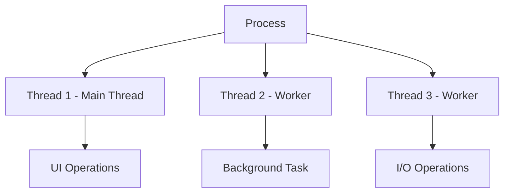

# Session 12: Threading, Tasks & Async Programming

## 📚 Introduction to Threading

**Threading** allows multiple operations to run concurrently within a single process.



### Process vs Thread

| Aspect | Process | Thread |
|--------|---------|--------|
| **Memory** | Separate address space | Shared address space |
| **Resources** | Own resources | Shares process resources |
| **Creation** | Heavy, expensive | Light, cheap |
| **Communication** | IPC mechanisms | Direct memory access |
| **Isolation** | Crash doesn't affect others | Can crash entire process |

---

## 🔧 Creating Threads

### ThreadStart Delegate
```csharp
public class ThreadExample
{
    public void DoWork()
    {
        Console.WriteLine($"Thread ID: {Thread.CurrentThread.ManagedThreadId}");
        for (int i = 1; i <= 5; i++)
        {
            Console.WriteLine($"Working... {i}");
            Thread.Sleep(1000);
        }
    }
}

// Usage
ThreadExample example = new ThreadExample();
Thread thread = new Thread(new ThreadStart(example.DoWork));
// Or shorter syntax
Thread thread2 = new Thread(example.DoWork);

thread.Start();  // Start execution
thread.Join();   // Wait for completion

Console.WriteLine("Thread completed");
```

### ParameterizedThreadStart
```csharp
public void DoWorkWithParam(object data)
{
    string message = (string)data;
    Console.WriteLine($"Received: {message}");
}

// Passing parameter
Thread thread = new Thread(new ParameterizedThreadStart(DoWorkWithParam));
thread.Start("Hello from main thread");

// Or with lambda
Thread thread2 = new Thread(obj => 
{
    int value = (int)obj;
    Console.WriteLine($"Value: {value}");
});
thread2.Start(42);
```

---

## 🔄 Thread Properties and Methods

```csharp
Thread thread = new Thread(() => { /* work */ });

// Properties
thread.Name = "WorkerThread";           // Set name for debugging
thread.Priority = ThreadPriority.Normal; // Lowest, BelowNormal, Normal, AboveNormal, Highest
thread.IsBackground = true;              // Won't keep app alive
bool isAlive = thread.IsAlive;           // Is thread running
int id = thread.ManagedThreadId;         // Thread identifier

// Current thread
Thread current = Thread.CurrentThread;

// Methods
thread.Start();                          // Begin execution
thread.Join();                           // Wait for completion
thread.Join(5000);                       // Wait with timeout (5 seconds)
Thread.Sleep(1000);                      // Pause current thread
Thread.Yield();                          // Let other threads run
```

### Foreground vs Background Threads

| Type | Description | Application Exit |
|------|-------------|------------------|
| **Foreground** | Default type | App waits for all foreground threads |
| **Background** | `IsBackground = true` | App can exit anytime |

```csharp
// Background thread - won't prevent app exit
Thread bgThread = new Thread(LongRunningTask);
bgThread.IsBackground = true;
bgThread.Start();

// Main thread ends, background thread is terminated
```

---

## 🏊 ThreadPool

**ThreadPool** efficiently manages a pool of worker threads.

```csharp
// Queue work to thread pool
ThreadPool.QueueUserWorkItem(state =>
{
    Console.WriteLine($"Thread from pool: {Thread.CurrentThread.ManagedThreadId}");
    // Do work
});

// With state
ThreadPool.QueueUserWorkItem(state =>
{
    string message = (string)state;
    Console.WriteLine(message);
}, "Hello from ThreadPool");

// Configure thread pool
ThreadPool.SetMinThreads(4, 4);
ThreadPool.SetMaxThreads(100, 100);

// Get thread pool info
ThreadPool.GetMinThreads(out int workerMin, out int ioMin);
ThreadPool.GetMaxThreads(out int workerMax, out int ioMax);
ThreadPool.GetAvailableThreads(out int workerAvail, out int ioAvail);
```

### ThreadPool vs Manual Thread

| Aspect | ThreadPool | Manual Thread |
|--------|------------|---------------|
| **Creation Cost** | Low (reuses) | High (new each time) |
| **Control** | Limited | Full control |
| **Priority** | Normal only | Configurable |
| **Best For** | Short tasks | Long-running tasks |

---

## 🔒 Thread Synchronization

### Race Condition Problem
```csharp
public class Counter
{
    private int _count = 0;
    
    public void Increment()
    {
        _count++;  // Not thread-safe!
    }
    
    public int Count => _count;
}

// Multiple threads incrementing causes incorrect results
```

### lock Statement
```csharp
public class SafeCounter
{
    private int _count = 0;
    private readonly object _lockObject = new object();
    
    public void Increment()
    {
        lock (_lockObject)
        {
            _count++;  // Only one thread can execute at a time
        }
    }
    
    public int Count
    {
        get
        {
            lock (_lockObject)
            {
                return _count;
            }
        }
    }
}
```

> **MCQ Tip:** Always lock on a private object, never on `this` or public objects.

### Monitor Class
```csharp
public class MonitorExample
{
    private readonly object _lockObj = new object();
    
    public void SafeMethod()
    {
        bool lockTaken = false;
        try
        {
            Monitor.Enter(_lockObj, ref lockTaken);
            // Critical section
        }
        finally
        {
            if (lockTaken)
                Monitor.Exit(_lockObj);
        }
    }
    
    // With timeout
    public bool TryProcess()
    {
        if (Monitor.TryEnter(_lockObj, TimeSpan.FromSeconds(5)))
        {
            try
            {
                // Critical section
                return true;
            }
            finally
            {
                Monitor.Exit(_lockObj);
            }
        }
        return false;
    }
}
```

### Interlocked Class
```csharp
public class AtomicCounter
{
    private int _count = 0;
    
    public void Increment()
    {
        Interlocked.Increment(ref _count);
    }
    
    public void Decrement()
    {
        Interlocked.Decrement(ref _count);
    }
    
    public void Add(int value)
    {
        Interlocked.Add(ref _count, value);
    }
    
    public int Exchange(int newValue)
    {
        return Interlocked.Exchange(ref _count, newValue);
    }
    
    public int CompareExchange(int newValue, int comparand)
    {
        // If _count == comparand, set to newValue
        return Interlocked.CompareExchange(ref _count, newValue, comparand);
    }
    
    public int Count => _count;
}
```

### Synchronization Comparison

| Method | Use Case | Performance |
|--------|----------|-------------|
| `lock` | General-purpose, blocks | Good |
| `Monitor` | More control than lock | Good |
| `Interlocked` | Simple atomic operations | Best |
| `Mutex` | Cross-process sync | Slower |
| `Semaphore` | Limit concurrent access | Moderate |
| `ReaderWriterLock` | Many readers, few writers | Moderate |

---

## 📋 Other Synchronization Primitives

### Mutex (Cross-Process)
```csharp
// Named mutex for cross-process synchronization
using (Mutex mutex = new Mutex(false, "MyAppMutex"))
{
    if (mutex.WaitOne(TimeSpan.FromSeconds(5)))
    {
        try
        {
            // Critical section
        }
        finally
        {
            mutex.ReleaseMutex();
        }
    }
}
```

### Semaphore
```csharp
// Limit concurrent access to 3 threads
SemaphoreSlim semaphore = new SemaphoreSlim(3, 3);

async Task AccessResource()
{
    await semaphore.WaitAsync();
    try
    {
        // Only 3 threads can be here simultaneously
    }
    finally
    {
        semaphore.Release();
    }
}
```

### AutoResetEvent / ManualResetEvent
```csharp
AutoResetEvent autoResetEvent = new AutoResetEvent(false);

// Signaling thread
autoResetEvent.Set();  // Signal one waiting thread

// Waiting thread
autoResetEvent.WaitOne();  // Wait for signal

// ManualResetEvent - stays signaled until Reset()
ManualResetEvent manualResetEvent = new ManualResetEvent(false);
manualResetEvent.Set();    // Signal all waiting threads
manualResetEvent.Reset();  // Back to unsignaled state
```

---

## ⚡ Task Parallel Library (TPL)

### Creating Tasks
```csharp
// Using Task.Run (preferred)
Task task = Task.Run(() =>
{
    Console.WriteLine("Task running");
});

// Using Task constructor
Task task2 = new Task(() => Console.WriteLine("Another task"));
task2.Start();

// With return value
Task<int> taskWithResult = Task.Run(() =>
{
    Thread.Sleep(1000);
    return 42;
});

int result = taskWithResult.Result;  // Blocks until complete
```

### Task Methods
```csharp
Task task = Task.Run(() => DoWork());

// Wait for task
task.Wait();                         // Block until complete
task.Wait(TimeSpan.FromSeconds(5));  // Wait with timeout

// Task status
bool isCompleted = task.IsCompleted;
bool isFaulted = task.IsFaulted;
bool isCanceled = task.IsCanceled;
TaskStatus status = task.Status;

// Continue when done
Task continuation = task.ContinueWith(t =>
{
    Console.WriteLine($"Previous task completed: {t.Status}");
});
```

### Multiple Tasks
```csharp
Task task1 = Task.Run(() => DoWork1());
Task task2 = Task.Run(() => DoWork2());
Task task3 = Task.Run(() => DoWork3());

// Wait for all
Task.WaitAll(task1, task2, task3);

// Wait for any
int completedIndex = Task.WaitAny(task1, task2, task3);

// Combine results
Task<int> t1 = Task.Run(() => 10);
Task<int> t2 = Task.Run(() => 20);
Task<int[]> allResults = Task.WhenAll(t1, t2);
int[] results = await allResults;  // [10, 20]

// First to complete
Task<int> firstDone = await Task.WhenAny(t1, t2);
int firstResult = await firstDone;
```

---

## 🌟 async and await

### Basic async/await Pattern
```csharp
public async Task<string> GetDataAsync()
{
    // Simulate async operation
    await Task.Delay(1000);
    return "Data loaded";
}

// Usage
public async Task ProcessAsync()
{
    Console.WriteLine("Starting...");
    
    string data = await GetDataAsync();  // Non-blocking wait
    
    Console.WriteLine(data);
}
```

### async Method Rules
```csharp
// Return void (event handlers only)
public async void Button_Click(object sender, EventArgs e)
{
    await DoWorkAsync();
}

// Return Task (no result)
public async Task ProcessAsync()
{
    await Task.Delay(1000);
}

// Return Task<T> (with result)
public async Task<int> CalculateAsync()
{
    await Task.Delay(1000);
    return 42;
}

// ValueTask<T> (performance optimization)
public async ValueTask<int> GetValueAsync()
{
    if (IsCached)
        return _cachedValue;
    
    return await ComputeValueAsync();
}
```

### async/await Best Practices
```csharp
// DO: Use ConfigureAwait(false) in library code
public async Task<string> LibraryMethodAsync()
{
    var result = await httpClient.GetStringAsync(url)
        .ConfigureAwait(false);
    return result;
}

// DO: Async all the way
public async Task TopLevelAsync()
{
    await MiddleAsync();
}

private async Task MiddleAsync()
{
    await LowLevelAsync();
}

// DON'T: Block on async code
public void BadMethod()
{
    var result = GetDataAsync().Result;  // Can cause deadlock!
}

// DO: Use async version
public async Task GoodMethod()
{
    var result = await GetDataAsync();
}
```

### Common async Operations
```csharp
// File I/O
string content = await File.ReadAllTextAsync("file.txt");
await File.WriteAllTextAsync("file.txt", "content");

// HTTP requests
using HttpClient client = new HttpClient();
string data = await client.GetStringAsync("https://api.example.com");

// Multiple parallel operations
var task1 = GetData1Async();
var task2 = GetData2Async();
var task3 = GetData3Async();

await Task.WhenAll(task1, task2, task3);

var result1 = task1.Result;
var result2 = task2.Result;
```

---

## ❌ Task Cancellation

```csharp
CancellationTokenSource cts = new CancellationTokenSource();
CancellationToken token = cts.Token;

// Pass token to task
Task task = Task.Run(() =>
{
    for (int i = 0; i < 100; i++)
    {
        // Check for cancellation
        token.ThrowIfCancellationRequested();
        
        DoWork();
    }
}, token);

// Cancel from another thread
cts.Cancel();

// With timeout
CancellationTokenSource ctsWithTimeout = new CancellationTokenSource(
    TimeSpan.FromSeconds(30)
);

// Handle cancellation
try
{
    await task;
}
catch (OperationCanceledException)
{
    Console.WriteLine("Task was cancelled");
}
```

---

## 🔀 Parallel Programming

### Parallel.For
```csharp
Parallel.For(0, 1000, i =>
{
    // Each iteration can run on different thread
    ProcessItem(i);
});

// With ParallelOptions
ParallelOptions options = new ParallelOptions
{
    MaxDegreeOfParallelism = 4,
    CancellationToken = token
};

Parallel.For(0, 1000, options, i =>
{
    ProcessItem(i);
});
```

### Parallel.ForEach
```csharp
List<string> files = GetFileList();

Parallel.ForEach(files, file =>
{
    ProcessFile(file);
});

// With local state
Parallel.ForEach(
    files,
    () => 0,  // Initialize local state
    (file, state, localTotal) =>
    {
        return localTotal + ProcessFile(file);
    },
    localTotal =>
    {
        // Combine local totals
        Interlocked.Add(ref total, localTotal);
    }
);
```

### Parallel.Invoke
```csharp
// Run multiple actions in parallel
Parallel.Invoke(
    () => DoTask1(),
    () => DoTask2(),
    () => DoTask3()
);
```

---

## 📊 Comparison: Thread vs Task

| Feature | Thread | Task |
|---------|--------|------|
| **Level** | Low-level | High-level abstraction |
| **Return Value** | Cannot return directly | Task<T> returns value |
| **Continuation** | Manual | ContinueWith, await |
| **Cancellation** | Abort (deprecated) | CancellationToken |
| **Exception** | Handled in thread | Propagates to caller |
| **Pool** | Manual ThreadPool | Uses ThreadPool |
| **Recommended** | Legacy, specific needs | Modern code |

---

## 🔄 Async Streams (C# 8+)

```csharp
// Async enumerable
public async IAsyncEnumerable<int> GetNumbersAsync()
{
    for (int i = 1; i <= 10; i++)
    {
        await Task.Delay(100);
        yield return i;
    }
}

// Consuming async stream
await foreach (int number in GetNumbersAsync())
{
    Console.WriteLine(number);
}

// With cancellation
await foreach (int number in GetNumbersAsync().WithCancellation(token))
{
    Console.WriteLine(number);
}
```

---

## 💡 Key MCQ Points

> **Critical Points for CCEE:**

1. **ThreadStart** = no parameters, **ParameterizedThreadStart** = one object parameter
2. **ThreadPool** = reuses threads, efficient for short tasks
3. **`lock`** = syntactic sugar for `Monitor.Enter/Exit`
4. **Interlocked** = atomic operations, fastest for simple updates
5. **Task.Run()** = preferred way to create background tasks
6. **`async`** method returns `Task`, `Task<T>`, or `void`
7. **`await`** = non-blocking wait for async operation
8. **Task.WaitAll** = wait for all tasks (blocks)
9. **Task.WhenAll** = async wait for all tasks
10. **ConfigureAwait(false)** = use in library code
11. **CancellationToken** = cooperative cancellation
12. **Parallel.For/ForEach** = parallel loops
13. **IsBackground = true** = thread won't prevent app exit
14. **thread.Join()** = wait for thread to complete
15. **Deadlock** = don't block on async code (`.Result`, `.Wait()`)
