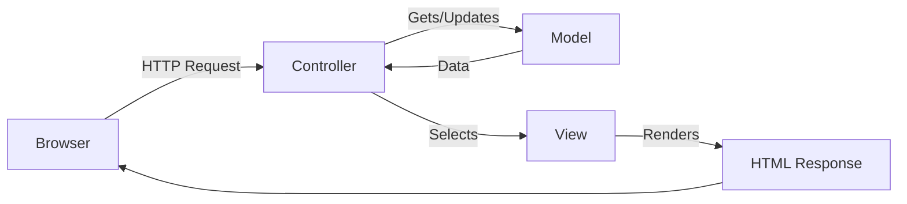
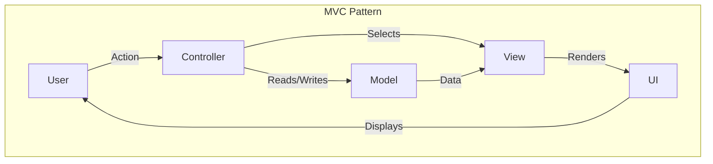

# Sessions 13-15: ASP.NET MVC Core Fundamentals

## 📚 Introduction to ASP.NET MVC Core

**ASP.NET MVC** is a web application framework implementing the Model-View-Controller pattern.



---

## 🏗️ MVC Architecture

### Model-View-Controller Pattern



| Component | Responsibility | Example |
|-----------|---------------|---------|
| **Model** | Data + Business Logic | `Student.cs`, `ProductService.cs` |
| **View** | UI Presentation | `Index.cshtml`, `Details.cshtml` |
| **Controller** | User Input + Flow | `HomeController.cs`, `ProductController.cs` |

### Advantages of MVC:
- **Separation of Concerns** - Clean code structure
- **Testability** - Easy unit testing
- **Parallel Development** - Teams work on different layers
- **SEO Friendly** - Clean URLs
- **Full Control** - Over HTML output

---

## 📁 Folder Structure

```
MyMvcApp/
├── Controllers/           # Controller classes
│   ├── HomeController.cs
│   └── ProductController.cs
├── Models/               # Data models and ViewModels
│   ├── Product.cs
│   └── ProductViewModel.cs
├── Views/                # Razor view files
│   ├── Home/
│   │   ├── Index.cshtml
│   │   └── About.cshtml
│   ├── Product/
│   │   └── Index.cshtml
│   ├── Shared/           # Shared views
│   │   ├── _Layout.cshtml
│   │   └── _ValidationScriptsPartial.cshtml
│   ├── _ViewImports.cshtml
│   └── _ViewStart.cshtml
├── wwwroot/              # Static files (CSS, JS, images)
│   ├── css/
│   ├── js/
│   └── lib/
├── appsettings.json      # Configuration
├── Program.cs            # Entry point
└── Startup.cs            # App configuration (older .NET)
```

---

## 🎮 Controllers

### Creating a Controller
```csharp
using Microsoft.AspNetCore.Mvc;

public class HomeController : Controller
{
    // Action method - responds to /Home/Index
    public IActionResult Index()
    {
        return View();  // Returns Views/Home/Index.cshtml
    }
    
    // Returns specific view
    public IActionResult About()
    {
        ViewData["Message"] = "About page";
        return View();
    }
    
    // Returns view with model
    public IActionResult Contact()
    {
        var model = new ContactInfo { Name = "CDAC" };
        return View(model);
    }
}
```

### Action Method Return Types

| Return Type | Usage |
|-------------|-------|
| `ViewResult` | Returns a view |
| `JsonResult` | Returns JSON data |
| `RedirectResult` | Redirects to URL |
| `RedirectToActionResult` | Redirects to action |
| `ContentResult` | Returns raw content |
| `FileResult` | Returns file |
| `StatusCodeResult` | Returns status code |
| `IActionResult` | Any of the above |

```csharp
public class DemoController : Controller
{
    // Return View
    public IActionResult Index()
    {
        return View();
    }
    
    // Return JSON
    public IActionResult GetData()
    {
        var data = new { Name = "John", Age = 30 };
        return Json(data);
    }
    
    // Redirect to URL
    public IActionResult GoToGoogle()
    {
        return Redirect("https://google.com");
    }
    
    // Redirect to action
    public IActionResult GoHome()
    {
        return RedirectToAction("Index", "Home");
    }
    
    // Return content
    public IActionResult GetText()
    {
        return Content("Hello World", "text/plain");
    }
    
    // Return file
    public IActionResult Download()
    {
        byte[] fileBytes = System.IO.File.ReadAllBytes("file.pdf");
        return File(fileBytes, "application/pdf", "download.pdf");
    }
    
    // Return status code
    public IActionResult NotFoundExample()
    {
        return NotFound();  // 404
    }
}
```

---

## 🏷️ Action Attributes

### HTTP Method Attributes
```csharp
public class ProductController : Controller
{
    // GET: /Product/Create
    [HttpGet]
    public IActionResult Create()
    {
        return View();
    }
    
    // POST: /Product/Create
    [HttpPost]
    public IActionResult Create(Product product)
    {
        if (ModelState.IsValid)
        {
            _repository.Add(product);
            return RedirectToAction("Index");
        }
        return View(product);
    }
    
    // PUT: /Product/Update/5
    [HttpPut]
    public IActionResult Update(int id, Product product)
    {
        // Update logic
        return Ok();
    }
    
    // DELETE: /Product/Delete/5
    [HttpDelete]
    public IActionResult Delete(int id)
    {
        // Delete logic
        return Ok();
    }
}
```

### Other Action Attributes
```csharp
// Not an action method
[NonAction]
public string GetMessage() => "Internal helper";

// Custom action name
[ActionName("List")]
public IActionResult Index() => View();

// Restrict to specific route
[Route("products/{id:int}")]
public IActionResult Details(int id) => View();
```

---

## 📦 Models

### Data Model
```csharp
public class Product
{
    public int Id { get; set; }
    public string Name { get; set; }
    public decimal Price { get; set; }
    public int CategoryId { get; set; }
    
    public Category Category { get; set; }  // Navigation property
}
```

### ViewModel
```csharp
// Combines data for a view
public class ProductListViewModel
{
    public List<Product> Products { get; set; }
    public List<Category> Categories { get; set; }
    public string SearchTerm { get; set; }
    public int TotalCount { get; set; }
}
```

### Form Model with Validation
```csharp
using System.ComponentModel.DataAnnotations;

public class RegisterViewModel
{
    [Required(ErrorMessage = "Name is required")]
    [StringLength(100, MinimumLength = 2)]
    [Display(Name = "Full Name")]
    public string Name { get; set; }
    
    [Required]
    [EmailAddress(ErrorMessage = "Invalid email format")]
    public string Email { get; set; }
    
    [Required]
    [DataType(DataType.Password)]
    [MinLength(8, ErrorMessage = "Password must be at least 8 characters")]
    public string Password { get; set; }
    
    [Compare("Password", ErrorMessage = "Passwords do not match")]
    [DataType(DataType.Password)]
    public string ConfirmPassword { get; set; }
    
    [Range(18, 120, ErrorMessage = "Age must be between 18 and 120")]
    public int Age { get; set; }
    
    [Phone]
    public string PhoneNumber { get; set; }
    
    [Url]
    public string Website { get; set; }
}
```

---

## 🎨 Views with Razor

### Razor Syntax
```html
@* This is a Razor comment *@

@{
    // C# code block
    var message = "Hello";
    ViewData["Title"] = "Home Page";
}

<!-- Output expression -->
<h1>@message</h1>

<!-- HTML encoded output (default) -->
<p>@Model.Name</p>

<!-- Raw HTML output (use carefully!) -->
<p>@Html.Raw(Model.HtmlContent)</p>

<!-- Conditional -->
@if (Model.IsActive)
{
    <span class="active">Active</span>
}
else
{
    <span class="inactive">Inactive</span>
}

<!-- Loop -->
@foreach (var item in Model.Items)
{
    <li>@item.Name - @item.Price.ToString("C")</li>
}

<!-- Switch -->
@switch (Model.Status)
{
    case "Active":
        <span class="badge-success">Active</span>
        break;
    case "Pending":
        <span class="badge-warning">Pending</span>
        break;
    default:
        <span class="badge-secondary">Unknown</span>
        break;
}
```

### Strongly Typed Views
```html
@model ProductViewModel

<h1>@Model.Name</h1>
<p>Price: @Model.Price.ToString("C")</p>
```

### ViewData and ViewBag
```csharp
// Controller
public IActionResult Index()
{
    ViewData["Title"] = "Welcome";        // Dictionary
    ViewBag.Message = "Hello World";      // Dynamic
    TempData["Notice"] = "Saved!";        // Survives redirect
    
    return View();
}
```

```html
<!-- View -->
<title>@ViewData["Title"]</title>
<h1>@ViewBag.Message</h1>

@if (TempData["Notice"] != null)
{
    <div class="alert">@TempData["Notice"]</div>
}
```

### ViewData vs ViewBag vs TempData

| Feature | ViewData | ViewBag | TempData |
|---------|----------|---------|----------|
| **Type** | Dictionary | Dynamic | Dictionary |
| **Type-safe** | No (casting) | No | No (casting) |
| **Null Check** | Required | Required | Required |
| **Lifespan** | Current request | Current request | Redirect survives |
| **Syntax** | `ViewData["key"]` | `ViewBag.Key` | `TempData["key"]` |

---

## 🔧 HTML Helper Functions

### Form Helpers
```html
@using (Html.BeginForm("Create", "Product", FormMethod.Post))
{
    <div class="form-group">
        @Html.LabelFor(m => m.Name)
        @Html.TextBoxFor(m => m.Name, new { @class = "form-control" })
        @Html.ValidationMessageFor(m => m.Name)
    </div>
    
    <div class="form-group">
        @Html.LabelFor(m => m.Category)
        @Html.DropDownListFor(m => m.CategoryId, 
            new SelectList(ViewBag.Categories, "Id", "Name"),
            "-- Select --",
            new { @class = "form-control" })
    </div>
    
    <div class="form-group">
        @Html.LabelFor(m => m.IsActive)
        @Html.CheckBoxFor(m => m.IsActive)
    </div>
    
    <button type="submit" class="btn btn-primary">Save</button>
}
```

### Common HTML Helpers

| Helper | HTML Output |
|--------|-------------|
| `@Html.TextBoxFor(m => m.Name)` | `<input type="text">` |
| `@Html.TextAreaFor(m => m.Desc)` | `<textarea>` |
| `@Html.PasswordFor(m => m.Pass)` | `<input type="password">` |
| `@Html.CheckBoxFor(m => m.Active)` | `<input type="checkbox">` |
| `@Html.RadioButtonFor(m => m.Type, "A")` | `<input type="radio">` |
| `@Html.DropDownListFor(m => m.Id, list)` | `<select>` |
| `@Html.HiddenFor(m => m.Id)` | `<input type="hidden">` |
| `@Html.LabelFor(m => m.Name)` | `<label>` |
| `@Html.DisplayFor(m => m.Name)` | Display text |
| `@Html.EditorFor(m => m.Name)` | Best input for type |

### Link and URL Helpers
```html
<!-- Action link -->
@Html.ActionLink("Home", "Index", "Home", null, new { @class = "nav-link" })

<!-- URL generation -->
@Url.Action("Details", "Product", new { id = 5 })
<!-- Output: /Product/Details/5 -->
```

---

## 🏷️ Tag Helpers (Preferred in Core)

```html
<!-- Form tag helper -->
<form asp-controller="Product" asp-action="Create" method="post">
    <div class="form-group">
        <label asp-for="Name"></label>
        <input asp-for="Name" class="form-control" />
        <span asp-validation-for="Name" class="text-danger"></span>
    </div>
    
    <div class="form-group">
        <label asp-for="CategoryId"></label>
        <select asp-for="CategoryId" 
                asp-items="@(new SelectList(ViewBag.Categories, "Id", "Name"))"
                class="form-control">
            <option value="">-- Select --</option>
        </select>
    </div>
    
    <button type="submit" class="btn btn-primary">Save</button>
</form>

<!-- Link tag helper -->
<a asp-controller="Product" asp-action="Details" asp-route-id="5">View</a>

<!-- Image tag helper -->

```

### Common Tag Helpers

| Tag Helper | Purpose |
|------------|---------|
| `asp-controller` | Target controller |
| `asp-action` | Target action |
| `asp-route-*` | Route values |
| `asp-for` | Model binding |
| `asp-items` | Select list items |
| `asp-validation-for` | Validation message |
| `asp-validation-summary` | All validation errors |
| `asp-append-version` | Cache busting |

---

## ✅ Validation

### Data Annotations
```csharp
public class LoginViewModel
{
    [Required(ErrorMessage = "Email is required")]
    [EmailAddress]
    public string Email { get; set; }
    
    [Required]
    [DataType(DataType.Password)]
    public string Password { get; set; }
    
    [Display(Name = "Remember Me")]
    public bool RememberMe { get; set; }
}
```

### Common Validation Attributes

| Attribute | Purpose |
|-----------|---------|
| `[Required]` | Field is required |
| `[StringLength(max, MinimumLength)]` | String length |
| `[Range(min, max)]` | Numeric range |
| `[RegularExpression(pattern)]` | Regex validation |
| `[Compare("OtherProperty")]` | Compare two properties |
| `[EmailAddress]` | Valid email format |
| `[Phone]` | Valid phone format |
| `[Url]` | Valid URL format |
| `[CreditCard]` | Valid credit card |
| `[DataType(DataType.X)]` | Data type hint |

### Server-Side Validation
```csharp
[HttpPost]
public IActionResult Create(ProductViewModel model)
{
    if (!ModelState.IsValid)
    {
        return View(model);  // Return with errors
    }
    
    // Custom validation
    if (model.EndDate < model.StartDate)
    {
        ModelState.AddModelError("EndDate", "End date must be after start date");
        return View(model);
    }
    
    // Save and redirect
    _repository.Add(model);
    return RedirectToAction("Index");
}
```

### Client-Side Validation
```html
<!-- Add to view -->
@section Scripts {
    @{ await Html.RenderPartialAsync("_ValidationScriptsPartial"); }
}

<!-- Or include scripts manually -->
<script src="~/lib/jquery-validation/dist/jquery.validate.min.js"></script>
<script src="~/lib/jquery-validation-unobtrusive/jquery.validate.unobtrusive.min.js"></script>
```

### Custom Validation Attribute
```csharp
public class FutureDateAttribute : ValidationAttribute
{
    protected override ValidationResult IsValid(object value, ValidationContext context)
    {
        if (value is DateTime date)
        {
            if (date <= DateTime.Today)
            {
                return new ValidationResult("Date must be in the future");
            }
        }
        return ValidationResult.Success;
    }
}

// Usage
[FutureDate]
public DateTime EventDate { get; set; }
```

### Self-Validating Model
```csharp
public class OrderViewModel : IValidatableObject
{
    public DateTime OrderDate { get; set; }
    public DateTime ShipDate { get; set; }
    public List<OrderItem> Items { get; set; }
    
    public IEnumerable<ValidationResult> Validate(ValidationContext context)
    {
        if (ShipDate < OrderDate)
        {
            yield return new ValidationResult(
                "Ship date cannot be before order date",
                new[] { nameof(ShipDate) }
            );
        }
        
        if (Items == null || !Items.Any())
        {
            yield return new ValidationResult(
                "Order must have at least one item",
                new[] { nameof(Items) }
            );
        }
    }
}
```

---

## 📐 Scaffold Templates

Visual Studio provides scaffolding for CRUD operations:

| Template | Generated Views |
|----------|-----------------|
| **Create** | Form to create new entity |
| **Edit** | Form to edit existing entity |
| **Delete** | Confirmation page |
| **Details** | Display entity details |
| **List** | Table of all entities |

```bash
# Scaffold using CLI
dotnet aspnet-codegenerator controller -name ProductController -m Product -dc AppDbContext --relativeFolderPath Controllers --useDefaultLayout --referenceScriptLibraries
```

---

## 💡 Key MCQ Points

> **Critical Points for CCEE:**

1. **MVC** = Model-View-Controller pattern
2. **Controller** handles user input and returns ActionResult
3. **Model** contains data and business logic
4. **View** is the UI, uses Razor syntax
5. **`@`** = Razor syntax for C# code in views
6. **ViewData** = dictionary, current request only
7. **ViewBag** = dynamic, current request only
8. **TempData** = survives redirect
9. **`[HttpGet]`, `[HttpPost]`** = HTTP method attributes
10. **`[Required]`** = validation attribute
11. **`ModelState.IsValid`** = check all validations
12. **`Html.BeginForm`** = HTML helper for forms
13. **`asp-for`** = Tag helper for model binding
14. **`_Layout.cshtml`** = master page template
15. **`_ViewStart.cshtml`** = sets default layout
