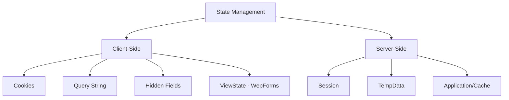
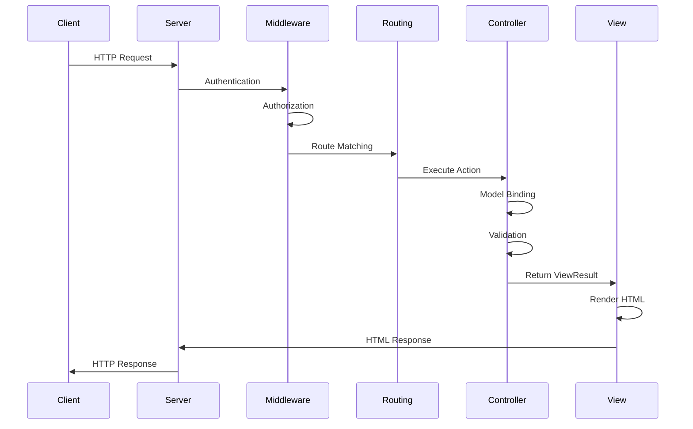

# Sessions 16-17: State Management, ADO.NET & Routing

## 📚 MVC State Management

Web applications need to maintain state across HTTP requests (which are stateless).



---

## 📦 ViewBag, ViewData, TempData

### ViewData
```csharp
// Controller
public IActionResult Index()
{
    ViewData["Title"] = "Home Page";
    ViewData["Products"] = GetProducts();
    return View();
}
```

```html
<!-- View -->
<h1>@ViewData["Title"]</h1>
@{
    var products = ViewData["Products"] as List<Product>;
}
@foreach (var p in products)
{
    <p>@p.Name</p>
}
```

### ViewBag (Dynamic)
```csharp
// Controller
public IActionResult Index()
{
    ViewBag.Title = "Home Page";
    ViewBag.Products = GetProducts();
    return View();
}
```

```html
<!-- View -->
<h1>@ViewBag.Title</h1>
@foreach (var p in ViewBag.Products)
{
    <p>@p.Name</p>
}
```

### TempData (Survives Redirect)
```csharp
// Controller
public IActionResult Create(Product product)
{
    _repository.Add(product);
    TempData["SuccessMessage"] = "Product created successfully!";
    return RedirectToAction("Index");  // TempData survives this!
}

public IActionResult Index()
{
    // TempData is still available here
    return View();
}
```

```html
<!-- View -->
@if (TempData["SuccessMessage"] != null)
{
    <div class="alert alert-success">
        @TempData["SuccessMessage"]
    </div>
}
```

### TempData with Keep/Peek
```csharp
// Peek - read without removing
var message = TempData.Peek("Message");

// Keep - mark for next request
TempData.Keep("Message");

// Or view and keep
if (TempData.ContainsKey("Message"))
{
    var msg = TempData["Message"];
    TempData.Keep("Message");  // Keep for next request
}
```

---

## 🍪 Cookies

### Setting Cookies
```csharp
public IActionResult SetCookie()
{
    // Simple cookie
    Response.Cookies.Append("UserName", "John");
    
    // Cookie with options
    var options = new CookieOptions
    {
        Expires = DateTime.Now.AddDays(7),
        HttpOnly = true,      // Not accessible via JavaScript
        Secure = true,        // HTTPS only
        SameSite = SameSiteMode.Strict,
        Path = "/",
        Domain = ".example.com"
    };
    
    Response.Cookies.Append("AuthToken", "abc123", options);
    
    return Ok("Cookie set");
}
```

### Reading Cookies
```csharp
public IActionResult GetCookie()
{
    // Read cookie
    string userName = Request.Cookies["UserName"];
    
    // Check if exists
    if (Request.Cookies.ContainsKey("AuthToken"))
    {
        string token = Request.Cookies["AuthToken"];
    }
    
    return Ok($"User: {userName}");
}
```

### Deleting Cookies
```csharp
public IActionResult DeleteCookie()
{
    Response.Cookies.Delete("UserName");
    return Ok("Cookie deleted");
}
```

### Cookie Options

| Option | Description |
|--------|-------------|
| `Expires` | Cookie expiration date |
| `MaxAge` | Cookie lifetime (TimeSpan) |
| `HttpOnly` | Prevents JavaScript access |
| `Secure` | HTTPS only |
| `SameSite` | CSRF protection |
| `Path` | URL path scope |
| `Domain` | Domain scope |

---

## 🗄️ Session State

### Configuring Session
```csharp
// Program.cs
builder.Services.AddDistributedMemoryCache();
builder.Services.AddSession(options =>
{
    options.IdleTimeout = TimeSpan.FromMinutes(30);
    options.Cookie.HttpOnly = true;
    options.Cookie.IsEssential = true;
});

// ...

app.UseSession();  // Enable session middleware
```

### Using Session
```csharp
// Store values
HttpContext.Session.SetString("UserName", "John");
HttpContext.Session.SetInt32("UserId", 123);

// Store complex objects (requires JSON serialization)
var cart = new ShoppingCart();
HttpContext.Session.SetString("Cart", JsonSerializer.Serialize(cart));

// Retrieve values
string userName = HttpContext.Session.GetString("UserName");
int? userId = HttpContext.Session.GetInt32("UserId");

// Retrieve complex objects
string cartJson = HttpContext.Session.GetString("Cart");
var cart = JsonSerializer.Deserialize<ShoppingCart>(cartJson);

// Remove session value
HttpContext.Session.Remove("UserName");

// Clear all session
HttpContext.Session.Clear();
```

### Session Extension Methods
```csharp
public static class SessionExtensions
{
    public static void SetObject<T>(this ISession session, string key, T value)
    {
        session.SetString(key, JsonSerializer.Serialize(value));
    }
    
    public static T GetObject<T>(this ISession session, string key)
    {
        var value = session.GetString(key);
        return value == null ? default : JsonSerializer.Deserialize<T>(value);
    }
}

// Usage
HttpContext.Session.SetObject("Cart", shoppingCart);
var cart = HttpContext.Session.GetObject<ShoppingCart>("Cart");
```

---

## 🗄️ Application State (IMemoryCache)

In ASP.NET Core, "Application State" (global data shared across all users) is handled using **Dependency Injection (Singleton services)** or **IMemoryCache**. The old `HttpContext.Application` is no longer available.

### Using IMemoryCache
```csharp
// Program.cs
builder.Services.AddMemoryCache();

// Controller
public class HomeController : Controller
{
    private readonly IMemoryCache _cache;

    public HomeController(IMemoryCache cache)
    {
        _cache = cache;
    }

    public IActionResult Index()
    {
        // Get or Create
        string timestamp = _cache.GetOrCreate("GlobalTimestamp", entry =>
        {
            entry.SlidingExpiration = TimeSpan.FromHours(1);
            return DateTime.Now.ToString();
        });

        return View("Index", timestamp);
    }
}
```

### Application State vs Session vs Cache

| Feature | Session | Application (Singleton/Cache) |
|---------|---------|-------------------------------|
| **Scope** | Single User | All Users |
| **Duration** | User Session | App Lifetime / Expiration |
| **Storage** | Server Memory / Dist. Cache | Server Memory |
| **Use Case** | User Cart, User Prefs | Global Config, Reference Data |

---

## ❓ Query String

```csharp
// URL: /Products?category=electronics&page=2
public IActionResult Index(string category, int page = 1)
{
    // Parameters bound automatically
    var products = _service.GetProducts(category, page);
    return View(products);
}

// Manual access
public IActionResult Search()
{
    string query = Request.Query["q"];
    string sort = Request.Query["sort"];
    
    return View();
}

// Generating URLs with query string
@Url.Action("Index", "Products", new { category = "electronics", page = 2 })
<!-- Output: /Products?category=electronics&page=2 -->
```

---

## 🔲 Partial Views

### Creating Partial View
```html
<!-- Views/Shared/_ProductCard.cshtml -->
@model Product

<div class="card">
    
    <div class="card-body">
        <h5 class="card-title">@Model.Name</h5>
        <p class="card-text">@Model.Price.ToString("C")</p>
        <a asp-action="Details" asp-route-id="@Model.Id" class="btn btn-primary">
            View Details
        </a>
    </div>
</div>
```

### Rendering Partial Views
```html
<!-- Method 1: Html.PartialAsync -->
@await Html.PartialAsync("_ProductCard", product)

<!-- Method 2: Html.RenderPartialAsync (slightly faster, writes directly) -->
@{ await Html.RenderPartialAsync("_ProductCard", product); }

<!-- Method 3: Partial tag helper -->
<partial name="_ProductCard" model="product" />

<!-- In a loop -->
@foreach (var product in Model.Products)
{
    <partial name="_ProductCard" model="product" />
}
```

---

## 🎯 Child Actions (View Components in Core)

### Creating View Component
```csharp
// ViewComponents/ShoppingCartViewComponent.cs
public class ShoppingCartViewComponent : ViewComponent
{
    private readonly ICartService _cartService;
    
    public ShoppingCartViewComponent(ICartService cartService)
    {
        _cartService = cartService;
    }
    
    public async Task<IViewComponentResult> InvokeAsync()
    {
        var cart = await _cartService.GetCartAsync(HttpContext.Session.Id);
        return View(cart);  // Views/Shared/Components/ShoppingCart/Default.cshtml
    }
}
```

### View Component View
```html
<!-- Views/Shared/Components/ShoppingCart/Default.cshtml -->
@model ShoppingCart

<div class="cart-widget">
    <i class="fa fa-shopping-cart"></i>
    <span class="badge">@Model.ItemCount</span>
</div>
```

### Invoking View Component
```html
<!-- In layout or view -->
@await Component.InvokeAsync("ShoppingCart")

<!-- With parameters -->
@await Component.InvokeAsync("ProductList", new { category = "Electronics" })

<!-- Tag helper syntax -->
<vc:shopping-cart></vc:shopping-cart>
```

---

## 🔌 ADO.NET with Microsoft.Data.SqlClient

### Connection Object
```csharp
using Microsoft.Data.SqlClient;

string connectionString = configuration.GetConnectionString("DefaultConnection");

using (SqlConnection connection = new SqlConnection(connectionString))
{
    connection.Open();
    // Use connection
}
```

### Command Object
```csharp
using (SqlConnection connection = new SqlConnection(connectionString))
{
    connection.Open();
    
    // Simple command
    string sql = "SELECT * FROM Products WHERE CategoryId = @CategoryId";
    using (SqlCommand command = new SqlCommand(sql, connection))
    {
        command.Parameters.AddWithValue("@CategoryId", 1);
        
        // Execute and read
        using (SqlDataReader reader = command.ExecuteReader())
        {
            while (reader.Read())
            {
                Console.WriteLine(reader["Name"]);
            }
        }
    }
}
```

### Command Types

| Method | Return | Use Case |
|--------|--------|----------|
| `ExecuteReader()` | DataReader | SELECT queries |
| `ExecuteScalar()` | Object | Single value (COUNT, MAX) |
| `ExecuteNonQuery()` | int (rows affected) | INSERT, UPDATE, DELETE |

### DataReader
```csharp
public List<Product> GetProducts()
{
    var products = new List<Product>();
    
    using (SqlConnection connection = new SqlConnection(_connectionString))
    {
        connection.Open();
        
        using (SqlCommand command = new SqlCommand("SELECT * FROM Products", connection))
        using (SqlDataReader reader = command.ExecuteReader())
        {
            while (reader.Read())
            {
                products.Add(new Product
                {
                    Id = reader.GetInt32(reader.GetOrdinal("Id")),
                    Name = reader.GetString(reader.GetOrdinal("Name")),
                    Price = reader.GetDecimal(reader.GetOrdinal("Price")),
                    // Handle nullable
                    Description = reader.IsDBNull(reader.GetOrdinal("Description")) 
                        ? null 
                        : reader.GetString(reader.GetOrdinal("Description"))
                });
            }
        }
    }
    
    return products;
}
```

### DataAdapter and DataSet
```csharp
public DataSet GetProductsDataSet()
{
    DataSet dataSet = new DataSet();
    
    using (SqlConnection connection = new SqlConnection(_connectionString))
    {
        SqlDataAdapter adapter = new SqlDataAdapter("SELECT * FROM Products", connection);
        adapter.Fill(dataSet, "Products");
    }
    
    return dataSet;
}

// Usage
DataSet ds = GetProductsDataSet();
DataTable productsTable = ds.Tables["Products"];

foreach (DataRow row in productsTable.Rows)
{
    Console.WriteLine(row["Name"]);
}
```

### DataTable
```csharp
DataTable table = new DataTable("Products");

// Define columns
table.Columns.Add("Id", typeof(int));
table.Columns.Add("Name", typeof(string));
table.Columns.Add("Price", typeof(decimal));

// Add rows
DataRow row = table.NewRow();
row["Id"] = 1;
row["Name"] = "Product 1";
row["Price"] = 99.99m;
table.Rows.Add(row);
```

### Async Command Execution
```csharp
public async Task<List<Product>> GetProductsAsync()
{
    var products = new List<Product>();
    
    using (SqlConnection connection = new SqlConnection(_connectionString))
    {
        await connection.OpenAsync();
        
        using (SqlCommand command = new SqlCommand("SELECT * FROM Products", connection))
        using (SqlDataReader reader = await command.ExecuteReaderAsync())
        {
            while (await reader.ReadAsync())
            {
                products.Add(new Product
                {
                    Id = reader.GetInt32(0),
                    Name = reader.GetString(1)
                });
            }
        }
    }
    
    return products;
}
```

### Stored Procedures
```csharp
public Product GetProductById(int id)
{
    using (SqlConnection connection = new SqlConnection(_connectionString))
    {
        connection.Open();
        
        using (SqlCommand command = new SqlCommand("sp_GetProductById", connection))
        {
            command.CommandType = CommandType.StoredProcedure;
            command.Parameters.AddWithValue("@Id", id);
            
            using (SqlDataReader reader = command.ExecuteReader())
            {
                if (reader.Read())
                {
                    return new Product
                    {
                        Id = reader.GetInt32(0),
                        Name = reader.GetString(1)
                    };
                }
            }
        }
    }
    
    return null;
}
```

---

## 🛣️ Routing

### Conventional Routing
```csharp
// Program.cs
app.MapControllerRoute(
    name: "default",
    pattern: "{controller=Home}/{action=Index}/{id?}");

// Custom routes
app.MapControllerRoute(
    name: "blog",
    pattern: "blog/{year}/{month}/{slug}",
    defaults: new { controller = "Blog", action = "Post" });
```

### Attribute Routing
```csharp
[Route("api/[controller]")]
public class ProductsController : Controller
{
    // GET: api/products
    [HttpGet]
    public IActionResult GetAll() => Ok(_products);
    
    // GET: api/products/5
    [HttpGet("{id}")]
    public IActionResult GetById(int id) => Ok(_products.Find(p => p.Id == id));
    
    // GET: api/products/category/electronics
    [HttpGet("category/{name}")]
    public IActionResult GetByCategory(string name) => Ok(_filtered);
    
    // Custom route
    [Route("~/special-products")]  // ~ overrides controller route
    public IActionResult Special() => Ok();
}
```

### Route Constraints
```csharp
[HttpGet("{id:int}")]               // Must be integer
[HttpGet("{id:int:min(1)}")]        // Integer >= 1
[HttpGet("{name:alpha}")]           // Alphabetic only
[HttpGet("{slug:regex(^[a-z]+$)}")] // Custom regex
[HttpGet("{date:datetime}")]        // Valid datetime
[HttpGet("{id:guid}")]              // Valid GUID
```

### Common Route Constraints

| Constraint | Description | Example |
|------------|-------------|---------|
| `int` | Integer | `{id:int}` |
| `bool` | Boolean | `{active:bool}` |
| `datetime` | DateTime | `{date:datetime}` |
| `decimal` | Decimal | `{price:decimal}` |
| `double` | Double | `{lat:double}` |
| `float` | Float | `{value:float}` |
| `guid` | GUID | `{id:guid}` |
| `long` | Long integer | `{id:long}` |
| `minlength(n)` | Minimum length | `{name:minlength(4)}` |
| `maxlength(n)` | Maximum length | `{name:maxlength(50)}` |
| `length(n)` | Exact length | `{code:length(6)}` |
| `length(min,max)` | Length range | `{code:length(4,8)}` |
| `min(n)` | Minimum value | `{age:min(18)}` |
| `max(n)` | Maximum value | `{age:max(120)}` |
| `range(min,max)` | Value range | `{age:range(18,120)}` |
| `alpha` | Alphabetic | `{name:alpha}` |
| `regex(expr)` | Regex pattern | `{slug:regex(^[a-z]+$)}` |
| `required` | Required | `{name:required}` |

---

## 🔄 Request Life Cycle



### Request Pipeline Stages

1. **Request Arrives** - HTTP request received
2. **Middleware Pipeline** - Authentication, Authorization, etc.
3. **Routing** - Match URL to controller/action
4. **Model Binding** - Bind request data to parameters
5. **Filters** - Authorization, Action, Result, Exception filters
6. **Action Execution** - Controller action runs
7. **Result Execution** - View rendering or JSON serialization
8. **Response** - HTTP response sent

---

## 🚫 Handling 404 Errors

```csharp
// Program.cs

// Development - detailed errors
if (app.Environment.IsDevelopment())
{
    app.UseDeveloperExceptionPage();
}
else
{
    // Production - custom error pages
    app.UseExceptionHandler("/Home/Error");
    app.UseStatusCodePagesWithReExecute("/Error/{0}");
}

// Controller
public class ErrorController : Controller
{
    [Route("Error/{statusCode}")]
    public IActionResult HttpStatusCodeHandler(int statusCode)
    {
        switch (statusCode)
        {
            case 404:
                ViewBag.ErrorMessage = "Page not found";
                break;
            default:
                ViewBag.ErrorMessage = "An error occurred";
                break;
        }
        return View("NotFound");
    }
}
```

---

## 💡 Key MCQ Points

> **Critical Points for CCEE:**

1. **ViewData** = dictionary, current request only
2. **ViewBag** = dynamic wrapper for ViewData
3. **TempData** = survives redirect, uses session
4. **TempData.Peek()** = read without removing
5. **TempData.Keep()** = keep for next request
6. **Session** requires `AddSession()` and `UseSession()`
7. **Cookies** = `Response.Cookies.Append()`, `Request.Cookies[]`
8. **HttpOnly** cookie = not accessible via JavaScript
9. **Partial View** = reusable view component
10. **View Component** = replaces Child Actions in Core
11. **SqlCommand.ExecuteReader()** = returns DataReader
12. **SqlCommand.ExecuteScalar()** = single value
13. **SqlCommand.ExecuteNonQuery()** = rows affected
14. **DataAdapter** fills DataSet/DataTable
15. **Attribute Routing** = `[Route()]`, `[HttpGet()]`
16. **`{id:int}`** = route constraint
