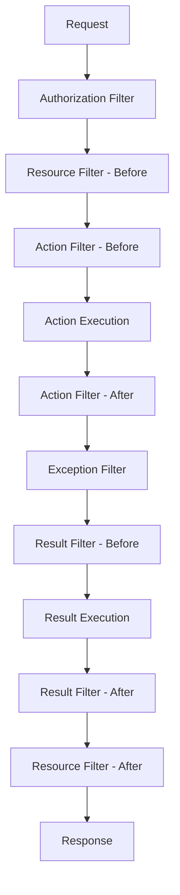

# Sessions 18-19: Layouts, Bundling, Filters & Security

## 📚 Layouts in ASP.NET MVC

**Layouts** provide a consistent look and feel across pages (like master pages).

### _Layout.cshtml
```html
<!-- Views/Shared/_Layout.cshtml -->
<!DOCTYPE html>
<html>
<head>
    <meta charset="utf-8" />
    <meta name="viewport" content="width=device-width, initial-scale=1.0" />
    <title>@ViewData["Title"] - My App</title>
    
    <link rel="stylesheet" href="~/lib/bootstrap/dist/css/bootstrap.min.css" />
    <link rel="stylesheet" href="~/css/site.css" />
    
    @RenderSection("Styles", required: false)
</head>
<body>
    <header>
        <nav class="navbar navbar-expand-lg navbar-dark bg-dark">
            <a class="navbar-brand" asp-controller="Home" asp-action="Index">My App</a>
            <div class="navbar-nav">
                <a class="nav-link" asp-controller="Home" asp-action="Index">Home</a>
                <a class="nav-link" asp-controller="Home" asp-action="About">About</a>
            </div>
        </nav>
    </header>
    
    <main class="container py-4">
        @RenderBody()
    </main>
    
    <footer class="footer bg-light py-3">
        <div class="container text-center">
            &copy; @DateTime.Now.Year - My App
        </div>
    </footer>
    
    <script src="~/lib/jquery/dist/jquery.min.js"></script>
    <script src="~/lib/bootstrap/dist/js/bootstrap.bundle.min.js"></script>
    
    @RenderSection("Scripts", required: false)
</body>
</html>
```

### _ViewStart.cshtml
```csharp
// Views/_ViewStart.cshtml - Sets default layout for all views
@{
    Layout = "_Layout";
}
```

### Using Sections in Views
```html
@{
    ViewData["Title"] = "Contact";
}

<h1>Contact Us</h1>
<p>Contact content here...</p>

@section Styles {
    <link rel="stylesheet" href="~/css/contact.css" />
}

@section Scripts {
    <script src="~/js/contact.js"></script>
}
```

### Section Methods

| Method | Description |
|--------|-------------|
| `@RenderBody()` | Renders view content |
| `@RenderSection("name")` | Renders required section |
| `@RenderSection("name", false)` | Renders optional section |
| `@IsSectionDefined("name")` | Checks if section exists |

---

## 📦 Bundling and Minification

### Why Bundle and Minify?
- **Reduce HTTP requests** - Combine multiple files
- **Reduce file size** - Remove whitespace, comments
- **Improve load time** - Faster page loads
- **Cache busting** - Version stamping

### WebOptimizer Package (ASP.NET Core)
```csharp
// Program.cs
builder.Services.AddWebOptimizer(pipeline =>
{
    // Bundle CSS files
    pipeline.AddCssBundle("/css/bundle.css",
        "css/site.css",
        "css/custom.css");
    
    // Bundle JS files
    pipeline.AddJavaScriptBundle("/js/bundle.js",
        "js/site.js",
        "js/custom.js");
    
    // Minify all CSS
    pipeline.MinifyCssFiles();
    
    // Minify all JS
    pipeline.MinifyJsFiles();
});

app.UseWebOptimizer();
```

### Using Bundles
```html
<!-- Reference bundles -->
<link rel="stylesheet" href="/css/bundle.css" />
<script src="/js/bundle.js"></script>

<!-- With asp-append-version for cache busting -->
<link rel="stylesheet" href="/css/bundle.css" asp-append-version="true" />
```

### LibMan (Library Manager)
```json
// libman.json
{
  "version": "1.0",
  "libraries": [
    {
      "library": "bootstrap@5.3.0",
      "destination": "wwwroot/lib/bootstrap/"
    },
    {
      "library": "jquery@3.7.0",
      "destination": "wwwroot/lib/jquery/"
    }
  ]
}
```

---

## 🎨 Custom HTML Helpers

### Creating Custom HTML Helper
```csharp
public static class CustomHtmlHelpers
{
    // Simple helper
    public static IHtmlContent SubmitButton(this IHtmlHelper html, string text)
    {
        return new HtmlString($"<button type='submit' class='btn btn-primary'>{text}</button>");
    }
    
    // Helper with TagBuilder
    public static IHtmlContent PageHeader(this IHtmlHelper html, string title, string subtitle = null)
    {
        var header = new TagBuilder("div");
        header.AddCssClass("page-header");
        
        var h1 = new TagBuilder("h1");
        h1.InnerHtml.Append(title);
        header.InnerHtml.AppendHtml(h1);
        
        if (!string.IsNullOrEmpty(subtitle))
        {
            var p = new TagBuilder("p");
            p.AddCssClass("lead");
            p.InnerHtml.Append(subtitle);
            header.InnerHtml.AppendHtml(p);
        }
        
        return header;
    }
}
```

### Using Custom Helpers
```html
@Html.SubmitButton("Save Changes")

@Html.PageHeader("Welcome", "This is the subtitle")
```

---

## 🎨 Custom Tag Helpers

### Creating Tag Helper
```csharp
using Microsoft.AspNetCore.Razor.TagHelpers;

[HtmlTargetElement("email")]  // Usage: <email>john@example.com</email>
public class EmailTagHelper : TagHelper
{
    public string Address { get; set; }
    
    public override void Process(TagHelperContext context, TagHelperOutput output)
    {
        output.TagName = "a";
        output.Attributes.SetAttribute("href", $"mailto:{Address}");
        output.Content.SetContent(Address);
    }
}

// More complex example
[HtmlTargetElement("alert")]
public class AlertTagHelper : TagHelper
{
    public string Type { get; set; } = "info";
    public bool Dismissible { get; set; } = false;
    
    public override void Process(TagHelperContext context, TagHelperOutput output)
    {
        output.TagName = "div";
        output.Attributes.SetAttribute("class", $"alert alert-{Type}" + 
            (Dismissible ? " alert-dismissible fade show" : ""));
        output.Attributes.SetAttribute("role", "alert");
        
        if (Dismissible)
        {
            output.PreContent.SetHtmlContent(
                "<button type='button' class='btn-close' data-bs-dismiss='alert'></button>");
        }
    }
}
```

### Register Tag Helpers
```csharp
// Views/_ViewImports.cshtml
@addTagHelper *, Microsoft.AspNetCore.Mvc.TagHelpers
@addTagHelper *, MyApp  // Your custom tag helpers
```

### Using Custom Tag Helpers
```html
<email address="contact@example.com"></email>

<alert type="success" dismissible="true">
    Operation completed successfully!
</alert>

<alert type="danger">
    An error occurred.
</alert>
```

---

## ⏳ Asynchronous Actions

### Async Controller Actions
```csharp
public class ProductController : Controller
{
    private readonly IProductService _productService;
    private readonly HttpClient _httpClient;
    
    public async Task<IActionResult> Index()
    {
        var products = await _productService.GetAllAsync();
        return View(products);
    }
    
    public async Task<IActionResult> Details(int id)
    {
        var product = await _productService.GetByIdAsync(id);
        if (product == null)
            return NotFound();
            
        return View(product);
    }
    
    public async Task<IActionResult> ExternalData()
    {
        var response = await _httpClient.GetAsync("https://api.example.com/data");
        var data = await response.Content.ReadAsStringAsync();
        return Content(data);
    }
}
```

---

## ⚠️ Error Handling in MVC

### Global Exception Handling
```csharp
// Program.cs
if (app.Environment.IsDevelopment())
{
    app.UseDeveloperExceptionPage();
}
else
{
    app.UseExceptionHandler("/Home/Error");
    app.UseHsts();
}

app.UseStatusCodePagesWithReExecute("/Error/{0}");
```

### Error Controller
```csharp
public class HomeController : Controller
{
    [Route("Home/Error")]
    [ResponseCache(Duration = 0, Location = ResponseCacheLocation.None, NoStore = true)]
    public IActionResult Error()
    {
        var exceptionDetails = HttpContext.Features.Get<IExceptionHandlerFeature>();
        
        ViewBag.ErrorMessage = exceptionDetails?.Error.Message;
        
        // Log the error
        _logger.LogError(exceptionDetails?.Error, "Unhandled exception");
        
        return View(new ErrorViewModel 
        { 
            RequestId = Activity.Current?.Id ?? HttpContext.TraceIdentifier 
        });
    }
}
```

### Custom Exception Middleware
```csharp
public class ExceptionMiddleware
{
    private readonly RequestDelegate _next;
    private readonly ILogger<ExceptionMiddleware> _logger;
    
    public ExceptionMiddleware(RequestDelegate next, ILogger<ExceptionMiddleware> logger)
    {
        _next = next;
        _logger = logger;
    }
    
    public async Task InvokeAsync(HttpContext context)
    {
        try
        {
            await _next(context);
        }
        catch (Exception ex)
        {
            _logger.LogError(ex, "An unhandled exception occurred");
            
            context.Response.StatusCode = 500;
            context.Response.ContentType = "application/json";
            
            await context.Response.WriteAsJsonAsync(new
            {
                StatusCode = 500,
                Message = "Internal Server Error"
            });
        }
    }
}

// Register in Program.cs
app.UseMiddleware<ExceptionMiddleware>();
```

---

## 🔍 Filters

**Filters** allow code to run before or after specific stages in the request pipeline.

### Filter Types



| Filter Type | Interface | Purpose |
|-------------|-----------|---------|
| **Authorization** | `IAuthorizationFilter` | Check access rights |
| **Resource** | `IResourceFilter` | Caching, short-circuiting |
| **Action** | `IActionFilter` | Before/after action execution |
| **Exception** | `IExceptionFilter` | Handle exceptions |
| **Result** | `IResultFilter` | Before/after result execution |

### Creating Custom Action Filter
```csharp
public class LogActionFilter : IActionFilter
{
    private readonly ILogger<LogActionFilter> _logger;
    
    public LogActionFilter(ILogger<LogActionFilter> logger)
    {
        _logger = logger;
    }
    
    public void OnActionExecuting(ActionExecutingContext context)
    {
        _logger.LogInformation($"Action starting: {context.ActionDescriptor.DisplayName}");
    }
    
    public void OnActionExecuted(ActionExecutedContext context)
    {
        _logger.LogInformation($"Action completed: {context.ActionDescriptor.DisplayName}");
    }
}

// Async version
public class AsyncLogActionFilter : IAsyncActionFilter
{
    public async Task OnActionExecutionAsync(
        ActionExecutingContext context, 
        ActionExecutionDelegate next)
    {
        // Before action
        _logger.LogInformation("Before action");
        
        var result = await next();
        
        // After action
        _logger.LogInformation("After action");
    }
}
```

### Applying Filters
```csharp
// Global filter - applies to all actions
builder.Services.AddControllersWithViews(options =>
{
    options.Filters.Add<LogActionFilter>();
});

// Controller level
[ServiceFilter(typeof(LogActionFilter))]
public class HomeController : Controller
{
    // ...
}

// Action level
[ServiceFilter(typeof(LogActionFilter))]
public IActionResult Index()
{
    return View();
}
```

### Exception Filter
```csharp
public class GlobalExceptionFilter : IExceptionFilter
{
    private readonly ILogger<GlobalExceptionFilter> _logger;
    
    public GlobalExceptionFilter(ILogger<GlobalExceptionFilter> logger)
    {
        _logger = logger;
    }
    
    public void OnException(ExceptionContext context)
    {
        _logger.LogError(context.Exception, "Unhandled exception");
        
        context.Result = new ViewResult
        {
            ViewName = "Error",
            ViewData = new ViewDataDictionary<ErrorViewModel>(
                new EmptyModelMetadataProvider(), 
                context.ModelState)
            {
                Model = new ErrorViewModel 
                { 
                    Message = context.Exception.Message 
                }
            }
        };
        
        context.ExceptionHandled = true;
    }
}
```

### ActionFilterAttribute
```csharp
public class ExecutionTimeAttribute : ActionFilterAttribute
{
    private Stopwatch _stopwatch;
    
    public override void OnActionExecuting(ActionExecutingContext context)
    {
        _stopwatch = Stopwatch.StartNew();
    }
    
    public override void OnActionExecuted(ActionExecutedContext context)
    {
        _stopwatch.Stop();
        context.HttpContext.Response.Headers.Add(
            "X-Execution-Time", 
            _stopwatch.ElapsedMilliseconds.ToString());
    }
}

// Usage
[ExecutionTime]
public IActionResult Index()
{
    return View();
}
```

---

## 🔒 MVC Security

### Authentication vs Authorization

| Concept | Description | Question Answered |
|---------|-------------|-------------------|
| **Authentication** | Verifying identity | Who are you? |
| **Authorization** | Checking permissions | What can you do? |

### [Authorize] Attribute
```csharp
// Require authentication
[Authorize]
public class AccountController : Controller
{
    public IActionResult Profile()
    {
        return View();
    }
}

// Require specific role
[Authorize(Roles = "Admin")]
public IActionResult AdminPanel()
{
    return View();
}

// Require specific policy
[Authorize(Policy = "RequireAdmin")]
public IActionResult AdminOnly()
{
    return View();
}

// Multiple roles (OR)
[Authorize(Roles = "Admin,Manager")]
public IActionResult Management()
{
    return View();
}
```

### [AllowAnonymous] Attribute
```csharp
[Authorize]
public class AccountController : Controller
{
    // Requires authentication
    public IActionResult Profile() => View();
    
    // Allows anonymous access
    [AllowAnonymous]
    public IActionResult Login() => View();
    
    [AllowAnonymous]
    public IActionResult Register() => View();
}
```

### Forms Authentication (Cookie)
```csharp
// Program.cs
builder.Services.AddAuthentication(CookieAuthenticationDefaults.AuthenticationScheme)
    .AddCookie(options =>
    {
        options.LoginPath = "/Account/Login";
        options.LogoutPath = "/Account/Logout";
        options.AccessDeniedPath = "/Account/AccessDenied";
        options.ExpireTimeSpan = TimeSpan.FromHours(2);
        options.SlidingExpiration = true;
    });

app.UseAuthentication();
app.UseAuthorization();

// Login action
public async Task<IActionResult> Login(LoginViewModel model)
{
    if (IsValidUser(model.Username, model.Password))
    {
        var claims = new List<Claim>
        {
            new Claim(ClaimTypes.Name, model.Username),
            new Claim(ClaimTypes.Role, "User")
        };
        
        var identity = new ClaimsIdentity(claims, 
            CookieAuthenticationDefaults.AuthenticationScheme);
        var principal = new ClaimsPrincipal(identity);
        
        await HttpContext.SignInAsync(
            CookieAuthenticationDefaults.AuthenticationScheme,
            principal,
            new AuthenticationProperties { IsPersistent = model.RememberMe });
        
        return RedirectToAction("Index", "Home");
    }
    
    ModelState.AddModelError("", "Invalid credentials");
    return View(model);
}

// Logout action
public async Task<IActionResult> Logout()
{
    await HttpContext.SignOutAsync(CookieAuthenticationDefaults.AuthenticationScheme);
    return RedirectToAction("Login");
}
```

---

## 🛡️ Preventing CSRF (Cross-Site Request Forgery)

### Anti-Forgery Token
```csharp
// Controller - automatically validates on POST
[HttpPost]
[ValidateAntiForgeryToken]
public IActionResult Create(ProductViewModel model)
{
    // Token is validated automatically
    return View();
}
```

```html
<!-- View - Include token in form -->
<form asp-action="Create" method="post">
    @Html.AntiForgeryToken()
    <!-- OR - Tag helper automatically adds it -->
    <input asp-for="Name" />
    <button type="submit">Submit</button>
</form>
```

### Global Anti-Forgery
```csharp
// Apply to all POST actions globally
builder.Services.AddControllersWithViews(options =>
{
    options.Filters.Add(new AutoValidateAntiforgeryTokenAttribute());
});

// For AJAX requests
builder.Services.AddAntiforgery(options =>
{
    options.HeaderName = "X-XSRF-TOKEN";
});
```

```javascript
// AJAX with anti-forgery token
$.ajax({
    url: '/api/products',
    type: 'POST',
    headers: {
        'X-XSRF-TOKEN': $('input[name="__RequestVerificationToken"]').val()
    },
    data: { name: 'Product' }
});
```

---

## 🛡️ Preventing XSS (Cross-Site Scripting)

### Razor Auto-Encoding
```html
<!-- Razor automatically HTML-encodes output -->
@Model.UserInput  <!-- Safe: <script> becomes &lt;script&gt; -->

<!-- Raw HTML (dangerous!) - only use for trusted content -->
@Html.Raw(Model.TrustedHtml)
```

### Encoding Helpers
```csharp
using System.Web;
using System.Text.Encodings.Web;

// HTML encode
string safe = HtmlEncoder.Default.Encode(userInput);

// URL encode
string urlSafe = UrlEncoder.Default.Encode(userInput);

// JavaScript encode
string jsSafe = JavaScriptEncoder.Default.Encode(userInput);
```

### Content Security Policy
```csharp
// Add CSP header
app.Use(async (context, next) =>
{
    context.Response.Headers.Add(
        "Content-Security-Policy",
        "default-src 'self'; script-src 'self' 'unsafe-inline'");
    await next();
});
```

---

## 🌍 Localization (Session 20)

**Localization (L10n)** is the process of adapting an application to different languages and cultures.

### Configuring Localization
```csharp
// Program.cs
builder.Services.AddLocalization(options => options.ResourcesPath = "Resources");

builder.Services.AddControllersWithViews()
    .AddViewLocalization()
    .AddDataAnnotationsLocalization();

// ...

var supportedCultures = new[] { "en-US", "fr-FR", "es-ES" };
app.UseRequestLocalization(new RequestLocalizationOptions()
    .SetDefaultCulture("en-US")
    .AddSupportedCultures(supportedCultures)
    .AddSupportedUICultures(supportedCultures));
```

### Resource Files
Create `.resx` files in `Resources` folder:
- `Controllers.HomeController.fr.resx` -> Key: "Welcome", Value: "Bienvenue"
- `Views.Home.Index.fr.resx` -> Key: "Title", Value: "Titre"

### Using Localizer
```csharp
// Controller
public class HomeController : Controller
{
    private readonly IStringLocalizer<HomeController> _localizer;

    public HomeController(IStringLocalizer<HomeController> localizer)
    {
        _localizer = localizer;
    }

    public IActionResult Index()
    {
        ViewData["Title"] = _localizer["Welcome"];
        return View();
    }
}
```

```html
<!-- View -->
@using Microsoft.AspNetCore.Mvc.Localization
@inject IViewLocalizer Localizer

<h1>@Localizer["Title"]</h1>
```

---

## 🚀 Deployment (Session 20)

Deploying an ASP.NET Core application involves publishing the app and hosting it on a server (IIS, Nginx, Docker, Azure).

### Publishing
```bash
# Publish to folder
dotnet publish -c Release -o ./publish

# Self-contained (no .NET runtime required on server)
dotnet publish -c Release -r win-x64 --self-contained true
```

### Hosting Models
1.  **Kestrel**: Cross-platform web server included in ASP.NET Core. Fast, but usually sits behind a reverse proxy.
2.  **IIS (In-Process)**: Runs inside IIS worker process (`w3wp.exe`). Highest performance on Windows.
3.  **IIS (Out-of-Process)**: Kestrel runs the app, IIS acts as proxy.

### web.config (generated on publish)
```xml
<configuration>
  <system.webServer>
    <handlers>
      <add name="aspNetCore" path="*" verb="*" modules="AspNetCoreModuleV2" resourceType="Unspecified" />
    </handlers>
    <aspNetCore processPath="dotnet" arguments=".\MyApp.dll" stdoutLogEnabled="false" hostingModel="inprocess" />
  </system.webServer>
</configuration>
```

---

## 💡 Key MCQ Points

> **Critical Points for CCEE:**

1. **_Layout.cshtml** = master page in MVC
2. **_ViewStart.cshtml** = sets default layout
3. **@RenderBody()** = renders child view content
4. **@RenderSection()** = renders named section
5. **Bundling** = combines multiple files
6. **Minification** = removes whitespace, reduces size
7. **IActionFilter** = before/after action execution
8. **IExceptionFilter** = handles exceptions
9. **[Authorize]** = requires authentication
10. **[AllowAnonymous]** = allows unauthenticated access
11. **[ValidateAntiForgeryToken]** = prevents CSRF
12. **@Html.AntiForgeryToken()** = generates CSRF token
13. **Razor auto-encodes** output for XSS prevention
14. **@Html.Raw()** = outputs unencoded HTML (dangerous)
15. **SignInAsync()** = creates authentication cookie

---

## 🚀 Deployment Basics

### Publishing Options

| Option | Description | Use Case |
|--------|-------------|----------|
| **Folder** | Publishes to a local folder | Manual copy to IIS/Server |
| **Azure** | Publishes directly to Azure Cloud | Cloud deployment |
| **Docker** | Publishes as a container image | Containers/Kubernetes |
| **IIS** | Web Deploy to IIS Server | Windows Server hosting |

### Deployment Steps (Folder Publish)
1. Right-click Project -> **Publish**
2. Select **Folder** target
3. Choose location (e.g., `bin\Release\net6.0\publish`)
4. Click **Publish** button
5. Copy the contents of the publish folder to the web server (e.g., `C:\inetpub\wwwroot\MyApp`)

### Environment Variables
- **`ASPNETCORE_ENVIRONMENT`**: Controls the environment (Development, Staging, Production).
  - `Development`: Shows detailed errors (Developer Exception Page).
  - `Production`: Secure, custom error pages, optimized.

### Configuration
- **`appsettings.json`**: Base configuration.
- **`appsettings.Production.json`**: Overrides for production (e.g., live DB connection string).

```json
// appsettings.Production.json
{
  "Logging": {
    "LogLevel": {
      "Default": "Error"
    }
  },
  "ConnectionStrings": {
    "DefaultConnection": "Server=ProdDB;Database=MyApp;User Id=user;Password=pass;"
  }
}
```

