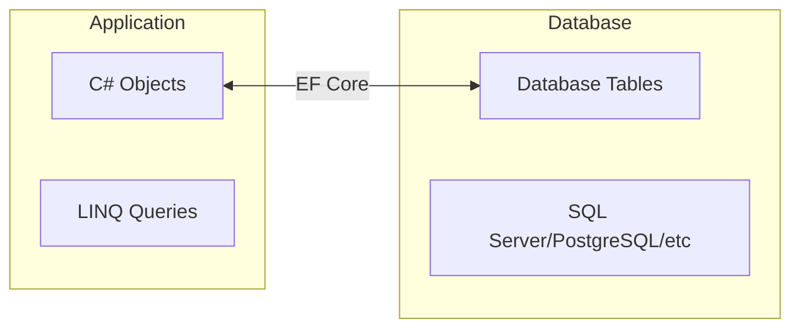
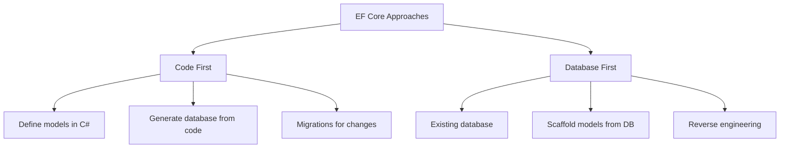

# Sessions 19-20: Entity Framework Core

## 📚 Introduction to Entity Framework

**Entity Framework (EF)** is an Object-Relational Mapper (ORM) that enables .NET developers to work with databases using .NET objects.



### Benefits of EF Core:
- **No SQL knowledge required** - Write C# code, not SQL
- **Automatic mapping** - Objects map to tables
- **LINQ support** - Query with C# syntax
- **Cross-database** - Works with SQL Server, PostgreSQL, MySQL, SQLite
- **Migrations** - Version control for database schema

---

## 🔄 EF Core Approaches



| Approach | When to Use |
|----------|-------------|
| **Code First** | New projects, full control over database |
| **Database First** | Existing database, DBA-managed schema |

---

## 🏗️ Code First Approach

### Step 1: Define Entity Models
```csharp
public class Product
{
    public int Id { get; set; }
    
    [Required]
    [MaxLength(100)]
    public string Name { get; set; }
    
    [Column(TypeName = "decimal(18,2)")]
    public decimal Price { get; set; }
    
    public string Description { get; set; }
    
    public int CategoryId { get; set; }
    
    // Navigation property
    public Category Category { get; set; }
}

public class Category
{
    public int Id { get; set; }
    
    [Required]
    [MaxLength(50)]
    public string Name { get; set; }
    
    // Collection navigation property
    public ICollection<Product> Products { get; set; }
}

public class Order
{
    public int Id { get; set; }
    public DateTime OrderDate { get; set; }
    public decimal TotalAmount { get; set; }
    
    public int CustomerId { get; set; }
    public Customer Customer { get; set; }
    
    public ICollection<OrderItem> OrderItems { get; set; }
}
```

### Step 2: Create DbContext
```csharp
using Microsoft.EntityFrameworkCore;

public class AppDbContext : DbContext
{
    public AppDbContext(DbContextOptions<AppDbContext> options) 
        : base(options)
    {
    }
    
    // DbSet properties represent tables
    public DbSet<Product> Products { get; set; }
    public DbSet<Category> Categories { get; set; }
    public DbSet<Order> Orders { get; set; }
    public DbSet<OrderItem> OrderItems { get; set; }
    
    protected override void OnModelCreating(ModelBuilder modelBuilder)
    {
        // Fluent API configuration
        modelBuilder.Entity<Product>()
            .HasIndex(p => p.Name)
            .IsUnique();
            
        modelBuilder.Entity<Product>()
            .Property(p => p.Price)
            .HasPrecision(18, 2);
        
        // Seed data
        modelBuilder.Entity<Category>().HasData(
            new Category { Id = 1, Name = "Electronics" },
            new Category { Id = 2, Name = "Clothing" }
        );
    }
}
```

### Step 3: Configure in Program.cs
```csharp
// Program.cs
builder.Services.AddDbContext<AppDbContext>(options =>
    options.UseSqlServer(builder.Configuration.GetConnectionString("DefaultConnection")));

// appsettings.json
{
  "ConnectionStrings": {
    "DefaultConnection": "Server=(localdb)\\mssqllocaldb;Database=MyApp;Trusted_Connection=True;"
  }
}
```

---

## 📋 Data Annotations

### Common Data Annotations

| Annotation | Purpose |
|------------|---------|
| `[Key]` | Primary key |
| `[Required]` | Not nullable |
| `[MaxLength(n)]` | Max string length |
| `[StringLength(n)]` | Max string length with validation |
| `[Column("name")]` | Column name override |
| `[Table("name")]` | Table name override |
| `[NotMapped]` | Exclude from database |
| `[ForeignKey("prop")]` | Foreign key relationship |
| `[Index]` | Create index |
| `[DatabaseGenerated(option)]` | Value generation |

### Examples
```csharp
public class Employee
{
    [Key]
    public int EmployeeId { get; set; }
    
    [Required]
    [StringLength(100)]
    [Column("FullName")]
    public string Name { get; set; }
    
    [Required]
    [EmailAddress]
    public string Email { get; set; }
    
    [Range(18, 65)]
    public int Age { get; set; }
    
    [Column(TypeName = "decimal(18,2)")]
    public decimal Salary { get; set; }
    
    [NotMapped]  // Won't be in database
    public string DisplayName => $"{Name} ({Email})";
    
    [DatabaseGenerated(DatabaseGeneratedOption.Identity)]
    public DateTime CreatedAt { get; set; }
    
    [ForeignKey("Department")]
    public int DepartmentId { get; set; }
    
    public Department Department { get; set; }
}

[Table("Departments")]
public class Department
{
    [Key]
    public int Id { get; set; }
    
    [Required]
    [MaxLength(50)]
    public string Name { get; set; }
    
    public ICollection<Employee> Employees { get; set; }
}
```

---

## 🔧 Fluent API

Fluent API provides more configuration options than Data Annotations.

```csharp
protected override void OnModelCreating(ModelBuilder modelBuilder)
{
    // Table configuration
    modelBuilder.Entity<Product>()
        .ToTable("Products", "sales");
    
    // Primary key
    modelBuilder.Entity<Product>()
        .HasKey(p => p.Id);
    
    // Composite key
    modelBuilder.Entity<OrderItem>()
        .HasKey(oi => new { oi.OrderId, oi.ProductId });
    
    // Property configuration
    modelBuilder.Entity<Product>()
        .Property(p => p.Name)
        .IsRequired()
        .HasMaxLength(100);
    
    modelBuilder.Entity<Product>()
        .Property(p => p.Price)
        .HasColumnType("decimal(18,2)")
        .HasDefaultValue(0);
    
    // Relationships
    // One-to-Many
    modelBuilder.Entity<Product>()
        .HasOne(p => p.Category)
        .WithMany(c => c.Products)
        .HasForeignKey(p => p.CategoryId)
        .OnDelete(DeleteBehavior.Restrict);
    
    // One-to-One
    modelBuilder.Entity<Employee>()
        .HasOne(e => e.Address)
        .WithOne(a => a.Employee)
        .HasForeignKey<Address>(a => a.EmployeeId);
    
    // Many-to-Many
    modelBuilder.Entity<Student>()
        .HasMany(s => s.Courses)
        .WithMany(c => c.Students)
        .UsingEntity<StudentCourse>();
    
    // Indexes
    modelBuilder.Entity<Product>()
        .HasIndex(p => p.Name)
        .IsUnique();
    
    modelBuilder.Entity<Product>()
        .HasIndex(p => new { p.Name, p.CategoryId });
    
    // Ignore property
    modelBuilder.Entity<Product>()
        .Ignore(p => p.TemporaryField);
}
```

---

## 🔄 Relationships

### One-to-Many
```csharp
// Category has many Products
public class Category
{
    public int Id { get; set; }
    public string Name { get; set; }
    public ICollection<Product> Products { get; set; }
}

public class Product
{
    public int Id { get; set; }
    public string Name { get; set; }
    public int CategoryId { get; set; }  // FK
    public Category Category { get; set; }  // Navigation
}
```

### One-to-One
```csharp
public class Employee
{
    public int Id { get; set; }
    public string Name { get; set; }
    public EmployeeDetails Details { get; set; }
}

public class EmployeeDetails
{
    public int Id { get; set; }
    public string Address { get; set; }
    public int EmployeeId { get; set; }  // FK
    public Employee Employee { get; set; }
}
```

### Many-to-Many
```csharp
// Implicit join table (EF Core 5+)
public class Student
{
    public int Id { get; set; }
    public string Name { get; set; }
    public ICollection<Course> Courses { get; set; }
}

public class Course
{
    public int Id { get; set; }
    public string Title { get; set; }
    public ICollection<Student> Students { get; set; }
}

// Explicit join table
public class StudentCourse
{
    public int StudentId { get; set; }
    public Student Student { get; set; }
    
    public int CourseId { get; set; }
    public Course Course { get; set; }
    
    public DateTime EnrollmentDate { get; set; }  // Extra data
}
```

---

## 📊 Database Migrations

### Creating Migrations
```bash
# Package Manager Console
Add-Migration InitialCreate
Add-Migration AddProductDescription

# .NET CLI
dotnet ef migrations add InitialCreate
dotnet ef migrations add AddProductDescription
```

### Applying Migrations
```bash
# Package Manager Console
Update-Database

# .NET CLI
dotnet ef database update

# Update to specific migration
dotnet ef database update InitialCreate
```

### Reverting Migrations
```bash
# Rollback to previous migration
dotnet ef database update PreviousMigrationName

# Remove last migration (if not applied)
dotnet ef migrations remove
```

### Migration File
```csharp
public partial class AddProductDescription : Migration
{
    protected override void Up(MigrationBuilder migrationBuilder)
    {
        migrationBuilder.AddColumn<string>(
            name: "Description",
            table: "Products",
            type: "nvarchar(500)",
            maxLength: 500,
            nullable: true);
    }

    protected override void Down(MigrationBuilder migrationBuilder)
    {
        migrationBuilder.DropColumn(
            name: "Description",
            table: "Products");
    }
}
```

---

## ✏️ CRUD Operations

### Create
```csharp
public async Task<Product> CreateProduct(Product product)
{
    _context.Products.Add(product);
    await _context.SaveChangesAsync();
    return product;
}

// Add multiple
_context.Products.AddRange(products);
await _context.SaveChangesAsync();
```

### Read
```csharp
// Get all
var products = await _context.Products.ToListAsync();

// Get by ID
var product = await _context.Products.FindAsync(id);

// Get with condition
var expensive = await _context.Products
    .Where(p => p.Price > 100)
    .ToListAsync();

// Include related data (eager loading)
var productsWithCategory = await _context.Products
    .Include(p => p.Category)
    .ToListAsync();

// Multiple levels
var orders = await _context.Orders
    .Include(o => o.Customer)
    .Include(o => o.OrderItems)
        .ThenInclude(oi => oi.Product)
    .ToListAsync();

// Projection
var productDtos = await _context.Products
    .Select(p => new ProductDto
    {
        Id = p.Id,
        Name = p.Name,
        CategoryName = p.Category.Name
    })
    .ToListAsync();

// First or default
var product = await _context.Products
    .FirstOrDefaultAsync(p => p.Name == "Laptop");
```

### Update
```csharp
public async Task UpdateProduct(Product product)
{
    _context.Products.Update(product);
    await _context.SaveChangesAsync();
}

// Update specific properties
var product = await _context.Products.FindAsync(id);
if (product != null)
{
    product.Price = newPrice;
    await _context.SaveChangesAsync();
}

// Attach and modify
_context.Entry(product).State = EntityState.Modified;
await _context.SaveChangesAsync();
```

### Delete
```csharp
public async Task DeleteProduct(int id)
{
    var product = await _context.Products.FindAsync(id);
    if (product != null)
    {
        _context.Products.Remove(product);
        await _context.SaveChangesAsync();
    }
}

// Delete multiple
var oldProducts = await _context.Products
    .Where(p => p.CreatedAt < DateTime.Now.AddYears(-1))
    .ToListAsync();

_context.Products.RemoveRange(oldProducts);
await _context.SaveChangesAsync();
```

---

## 🔍 Querying with LINQ

### Basic Queries
```csharp
// Filtering
var electronics = await _context.Products
    .Where(p => p.CategoryId == 1)
    .ToListAsync();

// Ordering
var sorted = await _context.Products
    .OrderBy(p => p.Name)
    .ThenByDescending(p => p.Price)
    .ToListAsync();

// Paging
var page = await _context.Products
    .Skip(20)
    .Take(10)
    .ToListAsync();

// Aggregates
var count = await _context.Products.CountAsync();
var total = await _context.Products.SumAsync(p => p.Price);
var avg = await _context.Products.AverageAsync(p => p.Price);
var max = await _context.Products.MaxAsync(p => p.Price);
```

### Advanced Queries
```csharp
// Grouping
var byCategory = await _context.Products
    .GroupBy(p => p.CategoryId)
    .Select(g => new
    {
        CategoryId = g.Key,
        Count = g.Count(),
        TotalPrice = g.Sum(p => p.Price)
    })
    .ToListAsync();

// Joining
var result = await _context.Products
    .Join(_context.Categories,
        p => p.CategoryId,
        c => c.Id,
        (p, c) => new { p.Name, Category = c.Name })
    .ToListAsync();

// Any/All
bool hasExpensive = await _context.Products.AnyAsync(p => p.Price > 1000);
bool allInStock = await _context.Products.AllAsync(p => p.Stock > 0);

// Contains
var ids = new[] { 1, 2, 3 };
var products = await _context.Products
    .Where(p => ids.Contains(p.Id))
    .ToListAsync();
```

---

## 🔄 Loading Related Data

### Eager Loading (Include)
```csharp
// Load related data immediately
var products = await _context.Products
    .Include(p => p.Category)
    .Include(p => p.Reviews)
    .ToListAsync();
```

### Explicit Loading
```csharp
// Load related data on demand
var product = await _context.Products.FindAsync(id);

_context.Entry(product)
    .Reference(p => p.Category)
    .Load();

_context.Entry(product)
    .Collection(p => p.Reviews)
    .Load();
```

### Lazy Loading
```csharp
// Requires proxies package
// Install-Package Microsoft.EntityFrameworkCore.Proxies

builder.Services.AddDbContext<AppDbContext>(options =>
    options.UseLazyLoadingProxies()
           .UseSqlServer(connectionString));

// Properties must be virtual
public class Product
{
    public int Id { get; set; }
    public virtual Category Category { get; set; }  // virtual!
}
```

### Loading Comparison

| Type | When Loaded | Use Case |
|------|-------------|----------|
| **Eager** | With main query | Need related data usually |
| **Explicit** | When requested | Sometimes need related data |
| **Lazy** | When accessed | Simple cases, be careful with N+1 |

---

## 📄 Razor Pages

### Introduction
**Razor Pages** is a page-based programming model that makes building web UI easier.

```
Pages/
├── Index.cshtml           # View
├── Index.cshtml.cs        # PageModel (code-behind)
├── Products/
│   ├── Index.cshtml
│   ├── Create.cshtml
│   ├── Edit.cshtml
│   └── Delete.cshtml
└── _ViewStart.cshtml
```

### PageModel
```csharp
// Pages/Products/Index.cshtml.cs
public class IndexModel : PageModel
{
    private readonly AppDbContext _context;
    
    public IndexModel(AppDbContext context)
    {
        _context = context;
    }
    
    public IList<Product> Products { get; set; }
    
    public async Task OnGetAsync()
    {
        Products = await _context.Products
            .Include(p => p.Category)
            .ToListAsync();
    }
}
```

### Razor Page View
```html
@page
@model IndexModel

<h1>Products</h1>

<table class="table">
    <thead>
        <tr>
            <th>Name</th>
            <th>Price</th>
            <th>Category</th>
        </tr>
    </thead>
    <tbody>
        @foreach (var product in Model.Products)
        {
            <tr>
                <td>@product.Name</td>
                <td>@product.Price.ToString("C")</td>
                <td>@product.Category.Name</td>
            </tr>
        }
    </tbody>
</table>
```

### Handler Methods
```csharp
public class CreateModel : PageModel
{
    [BindProperty]
    public Product Product { get; set; }
    
    // GET handler
    public void OnGet()
    {
    }
    
    // POST handler
    public async Task<IActionResult> OnPostAsync()
    {
        if (!ModelState.IsValid)
            return Page();
        
        _context.Products.Add(Product);
        await _context.SaveChangesAsync();
        
        return RedirectToPage("./Index");
    }
    
    // Named handler: asp-page-handler="Delete"
    public async Task<IActionResult> OnPostDeleteAsync(int id)
    {
        var product = await _context.Products.FindAsync(id);
        if (product != null)
        {
            _context.Products.Remove(product);
            await _context.SaveChangesAsync();
        }
        return RedirectToPage();
    }
}
```

---

## 💡 Key MCQ Points

> **Critical Points for CCEE:**

1. **EF Core** = ORM, object-relational mapper
2. **Code First** = define models, generate database
3. **Database First** = scaffold from existing database
4. **DbContext** = main class for database operations
5. **DbSet<T>** = represents a table
6. **Add-Migration** = creates migration file
7. **Update-Database** = applies migrations
8. **[Key]** = primary key annotation
9. **[Required]** = not null constraint
10. **Include()** = eager loading
11. **ThenInclude()** = nested eager loading
12. **Fluent API** = advanced configuration in OnModelCreating
13. **SaveChangesAsync()** = persists all changes
14. **FindAsync()** = finds by primary key
15. **Razor Pages** = page-based model, PageModel class
