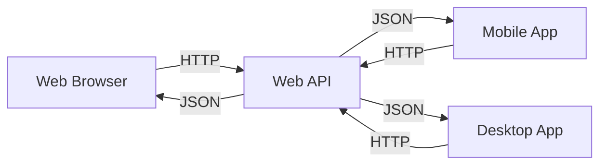
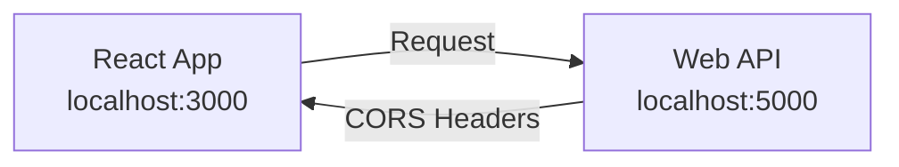

# Sessions 21-25: Web API & React Integration

## 📚 Introduction to Web APIs

**Web API** is a framework for building HTTP-based services that can be consumed by various clients.



---

## 🏗️ Creating ASP.NET Core Web API

### Controller Setup
```csharp
using Microsoft.AspNetCore.Mvc;

[ApiController]
[Route("api/[controller]")]
public class ProductsController : ControllerBase
{
    private readonly IProductService _productService;
    
    public ProductsController(IProductService productService)
    {
        _productService = productService;
    }
    
    // GET: api/products
    [HttpGet]
    public async Task<ActionResult<IEnumerable<Product>>> GetProducts()
    {
        var products = await _productService.GetAllAsync();
        return Ok(products);
    }
    
    // GET: api/products/5
    [HttpGet("{id}")]
    public async Task<ActionResult<Product>> GetProduct(int id)
    {
        var product = await _productService.GetByIdAsync(id);
        
        if (product == null)
            return NotFound();
            
        return Ok(product);
    }
    
    // POST: api/products
    [HttpPost]
    public async Task<ActionResult<Product>> CreateProduct(Product product)
    {
        var created = await _productService.CreateAsync(product);
        return CreatedAtAction(nameof(GetProduct), 
            new { id = created.Id }, created);
    }
    
    // PUT: api/products/5
    [HttpPut("{id}")]
    public async Task<IActionResult> UpdateProduct(int id, Product product)
    {
        if (id != product.Id)
            return BadRequest();
            
        await _productService.UpdateAsync(product);
        return NoContent();
    }
    
    // DELETE: api/products/5
    [HttpDelete("{id}")]
    public async Task<IActionResult> DeleteProduct(int id)
    {
        var exists = await _productService.ExistsAsync(id);
        if (!exists)
            return NotFound();
            
        await _productService.DeleteAsync(id);
        return NoContent();
    }
}
```

---

## 📋 HTTP Verbs/Methods

| Verb | Purpose | Request Body | Response | Idempotent |
|------|---------|--------------|----------|------------|
| **GET** | Read data | No | Data | Yes |
| **POST** | Create new | Yes | Created item | No |
| **PUT** | Replace entire | Yes | Updated/None | Yes |
| **PATCH** | Partial update | Yes | Updated/None | No |
| **DELETE** | Remove | No | None | Yes |

### HTTP Status Codes in API

| Code | Meaning | When to Use |
|------|---------|-------------|
| **200** | OK | GET success |
| **201** | Created | POST success |
| **204** | No Content | PUT/DELETE success |
| **400** | Bad Request | Invalid input |
| **401** | Unauthorized | Not authenticated |
| **403** | Forbidden | Not authorized |
| **404** | Not Found | Resource doesn't exist |
| **409** | Conflict | Duplicate/conflict |
| **500** | Server Error | Unhandled exception |

### Return Types
```csharp
// Return data
return Ok(product);                // 200 with data
return Created("uri", product);    // 201 with data
return CreatedAtAction(action, routeValues, product);

// Return no data
return NoContent();                // 204
return NotFound();                 // 404
return BadRequest();               // 400
return Unauthorized();             // 401
return Forbid();                   // 403

// With message
return BadRequest("Invalid ID");
return NotFound($"Product {id} not found");

// Problem details
return Problem(
    title: "Validation Error",
    detail: "The name field is required",
    statusCode: 400);
```

---

## 🔄 Model Binding and Validation

### Data Transfer Objects (DTOs)
```csharp
public class CreateProductDto
{
    [Required]
    [StringLength(100)]
    public string Name { get; set; }
    
    [Range(0, 10000)]
    public decimal Price { get; set; }
    
    public string Description { get; set; }
    
    [Required]
    public int CategoryId { get; set; }
}

public class ProductResponseDto
{
    public int Id { get; set; }
    public string Name { get; set; }
    public decimal Price { get; set; }
    public string CategoryName { get; set; }
}
```

### Binding Sources
```csharp
[HttpPost]
public IActionResult Create(
    [FromBody] ProductDto product,     // Request body
    [FromQuery] string category,       // Query string
    [FromRoute] int id,                // Route parameter
    [FromHeader] string authorization) // Header
{
    return Ok();
}

// Multiple binding
[HttpPost("upload")]
public IActionResult Upload(
    [FromForm] string name,
    [FromForm] IFormFile file)
{
    return Ok();
}
```

### Validation
```csharp
[HttpPost]
public async Task<ActionResult<Product>> Create(CreateProductDto dto)
{
    // ModelState is automatically checked for [ApiController]
    if (!ModelState.IsValid)
        return BadRequest(ModelState);
    
    var product = new Product
    {
        Name = dto.Name,
        Price = dto.Price
    };
    
    await _service.CreateAsync(product);
    return CreatedAtAction(nameof(GetById), new { id = product.Id }, product);
}
```

---

## 🌐 CORS (Cross-Origin Resource Sharing)

### What is CORS?
CORS allows controlled access to resources from different origins (domains).



### Configuring CORS
```csharp
// Program.cs

// Define CORS policy
builder.Services.AddCors(options =>
{
    // Allow specific origin
    options.AddPolicy("AllowReact", policy =>
    {
        policy.WithOrigins("http://localhost:3000")
              .AllowAnyHeader()
              .AllowAnyMethod()
              .AllowCredentials();
    });
    
    // Allow any origin (development only!)
    options.AddPolicy("AllowAll", policy =>
    {
        policy.AllowAnyOrigin()
              .AllowAnyHeader()
              .AllowAnyMethod();
    });
});

// Apply CORS globally
app.UseCors("AllowReact");

// Or per controller
[EnableCors("AllowReact")]
[ApiController]
public class ProductsController : ControllerBase
{
}

// Or per action
[EnableCors("AllowAll")]
[HttpGet]
public IActionResult GetPublicData()
{
    return Ok();
}

// Disable CORS for specific action
[DisableCors]
[HttpGet("internal")]
public IActionResult GetInternalData()
{
    return Ok();
}
```

### CORS Options

| Option | Description |
|--------|-------------|
| `WithOrigins(...)` | Allowed origins |
| `AllowAnyOrigin()` | Allow all origins |
| `WithMethods(...)` | Allowed HTTP methods |
| `AllowAnyMethod()` | Allow all methods |
| `WithHeaders(...)` | Allowed headers |
| `AllowAnyHeader()` | Allow all headers |
| `AllowCredentials()` | Allow cookies |
| `WithExposedHeaders(...)` | Headers client can access |

---

## 📦 Working with JSON

### System.Text.Json (Default)
```csharp
// Configure JSON options
builder.Services.AddControllers()
    .AddJsonOptions(options =>
    {
        options.JsonSerializerOptions.PropertyNamingPolicy = JsonNamingPolicy.CamelCase;
        options.JsonSerializerOptions.WriteIndented = true;
        options.JsonSerializerOptions.DefaultIgnoreCondition = JsonIgnoreCondition.WhenWritingNull;
    });

// Manual serialization
string json = JsonSerializer.Serialize(product);
Product product = JsonSerializer.Deserialize<Product>(json);
```

### Newtonsoft.Json (Alternative)
```csharp
// Install package: Microsoft.AspNetCore.Mvc.NewtonsoftJson

builder.Services.AddControllers()
    .AddNewtonsoftJson(options =>
    {
        options.SerializerSettings.ReferenceLoopHandling = ReferenceLoopHandling.Ignore;
        options.SerializerSettings.ContractResolver = new CamelCasePropertyNamesContractResolver();
        options.SerializerSettings.NullValueHandling = NullValueHandling.Ignore;
    });

// Manual serialization
string json = JsonConvert.SerializeObject(product);
Product product = JsonConvert.DeserializeObject<Product>(json);
```

### JSON Attributes
```csharp
public class ProductDto
{
    [JsonPropertyName("productId")]  // Custom name
    public int Id { get; set; }
    
    public string Name { get; set; }
    
    [JsonIgnore]  // Exclude from JSON
    public string InternalCode { get; set; }
    
    [JsonIgnore(Condition = JsonIgnoreCondition.WhenWritingNull)]
    public string Description { get; set; }
}
```

---

## 🔌 Consuming Web API

### HttpClient
```csharp
public class ProductApiClient
{
    private readonly HttpClient _httpClient;
    
    public ProductApiClient(HttpClient httpClient)
    {
        _httpClient = httpClient;
        _httpClient.BaseAddress = new Uri("https://api.example.com/");
    }
    
    public async Task<List<Product>> GetAllAsync()
    {
        var response = await _httpClient.GetAsync("api/products");
        response.EnsureSuccessStatusCode();
        
        var content = await response.Content.ReadAsStringAsync();
        return JsonSerializer.Deserialize<List<Product>>(content);
    }
    
    public async Task<Product> GetByIdAsync(int id)
    {
        return await _httpClient.GetFromJsonAsync<Product>($"api/products/{id}");
    }
    
    public async Task<Product> CreateAsync(Product product)
    {
        var response = await _httpClient.PostAsJsonAsync("api/products", product);
        response.EnsureSuccessStatusCode();
        
        return await response.Content.ReadFromJsonAsync<Product>();
    }
    
    public async Task UpdateAsync(int id, Product product)
    {
        var response = await _httpClient.PutAsJsonAsync($"api/products/{id}", product);
        response.EnsureSuccessStatusCode();
    }
    
    public async Task DeleteAsync(int id)
    {
        var response = await _httpClient.DeleteAsync($"api/products/{id}");
        response.EnsureSuccessStatusCode();
    }
}

// Register in DI
builder.Services.AddHttpClient<ProductApiClient>();
```

---

## ⚛️ React Integration

### Setting Up React App
```bash
# Create React app
npx create-react-app frontend
cd frontend

# Install axios for HTTP requests
npm install axios
```

### API Service (React)
```javascript
// src/services/api.js
import axios from 'axios';

const API_BASE_URL = 'http://localhost:5000/api';

const api = axios.create({
    baseURL: API_BASE_URL,
    headers: {
        'Content-Type': 'application/json'
    }
});

export const productService = {
    getAll: async () => {
        const response = await api.get('/products');
        return response.data;
    },
    
    getById: async (id) => {
        const response = await api.get(`/products/${id}`);
        return response.data;
    },
    
    create: async (product) => {
        const response = await api.post('/products', product);
        return response.data;
    },
    
    update: async (id, product) => {
        const response = await api.put(`/products/${id}`, product);
        return response.data;
    },
    
    delete: async (id) => {
        await api.delete(`/products/${id}`);
    }
};
```

### React Component
```jsx
// src/components/ProductList.js
import React, { useState, useEffect } from 'react';
import { productService } from '../services/api';

function ProductList() {
    const [products, setProducts] = useState([]);
    const [loading, setLoading] = useState(true);
    const [error, setError] = useState(null);
    
    useEffect(() => {
        fetchProducts();
    }, []);
    
    const fetchProducts = async () => {
        try {
            setLoading(true);
            const data = await productService.getAll();
            setProducts(data);
        } catch (err) {
            setError('Failed to load products');
            console.error(err);
        } finally {
            setLoading(false);
        }
    };
    
    const handleDelete = async (id) => {
        if (window.confirm('Are you sure?')) {
            try {
                await productService.delete(id);
                setProducts(products.filter(p => p.id !== id));
            } catch (err) {
                setError('Failed to delete product');
            }
        }
    };
    
    if (loading) return <div>Loading...</div>;
    if (error) return <div className="error">{error}</div>;
    
    return (
        <div className="product-list">
            <h1>Products</h1>
            <table>
                <thead>
                    <tr>
                        <th>Name</th>
                        <th>Price</th>
                        <th>Actions</th>
                    </tr>
                </thead>
                <tbody>
                    {products.map(product => (
                        <tr key={product.id}>
                            <td>{product.name}</td>
                            <td>${product.price}</td>
                            <td>
                                <button onClick={() => handleDelete(product.id)}>
                                    Delete
                                </button>
                            </td>
                        </tr>
                    ))}
                </tbody>
            </table>
        </div>
    );
}

export default ProductList;
```

### Form Component with State
```jsx
// src/components/ProductForm.js
import React, { useState } from 'react';
import { productService } from '../services/api';

function ProductForm({ onProductCreated }) {
    const [product, setProduct] = useState({
        name: '',
        price: '',
        description: ''
    });
    const [submitting, setSubmitting] = useState(false);
    const [error, setError] = useState(null);
    
    const handleChange = (e) => {
        const { name, value } = e.target;
        setProduct(prev => ({
            ...prev,
            [name]: value
        }));
    };
    
    const handleSubmit = async (e) => {
        e.preventDefault();
        setSubmitting(true);
        setError(null);
        
        try {
            const created = await productService.create({
                ...product,
                price: parseFloat(product.price)
            });
            onProductCreated(created);
            setProduct({ name: '', price: '', description: '' });
        } catch (err) {
            setError('Failed to create product');
        } finally {
            setSubmitting(false);
        }
    };
    
    return (
        <form onSubmit={handleSubmit}>
            {error && <div className="error">{error}</div>}
            
            <div className="form-group">
                <label>Name:</label>
                <input
                    type="text"
                    name="name"
                    value={product.name}
                    onChange={handleChange}
                    required
                />
            </div>
            
            <div className="form-group">
                <label>Price:</label>
                <input
                    type="number"
                    name="price"
                    value={product.price}
                    onChange={handleChange}
                    step="0.01"
                    required
                />
            </div>
            
            <div className="form-group">
                <label>Description:</label>
                <textarea
                    name="description"
                    value={product.description}
                    onChange={handleChange}
                />
            </div>
            
            <button type="submit" disabled={submitting}>
                {submitting ? 'Creating...' : 'Create Product'}
            </button>
        </form>
    );
}

export default ProductForm;
```

---

## 🔄 State Management with React Hooks

### useState
```jsx
const [count, setCount] = useState(0);
const [user, setUser] = useState(null);
const [items, setItems] = useState([]);

// Update state
setCount(count + 1);
setUser({ name: 'John' });
setItems([...items, newItem]);
```

### useEffect
```jsx
// Run on mount
useEffect(() => {
    fetchData();
}, []);

// Run when dependency changes
useEffect(() => {
    fetchProducts(categoryId);
}, [categoryId]);

// Cleanup
useEffect(() => {
    const subscription = subscribe();
    return () => subscription.unsubscribe();
}, []);
```

### useContext
```jsx

// Create context
const AuthContext = React.createContext();

// Provider
function AuthProvider({ children }) {
    const [user, setUser] = useState(null);
    
    return (
        <AuthContext.Provider value={{ user, setUser }}>
            {children}
        </AuthContext.Provider>
    );
}

// Consume
function Header() {
    const { user } = useContext(AuthContext);
    return <div>Welcome, {user?.name}</div>;
}

```

---

## 🔐 Authentication & Authorization

### JWT Authentication in API
```csharp
// Program.cs
builder.Services.AddAuthentication(JwtBearerDefaults.AuthenticationScheme)
    .AddJwtBearer(options =>
    {
        options.TokenValidationParameters = new TokenValidationParameters
        {
            ValidateIssuer = true,
            ValidateAudience = true,
            ValidateLifetime = true,
            ValidateIssuerSigningKey = true,
            ValidIssuer = builder.Configuration["Jwt:Issuer"],
            ValidAudience = builder.Configuration["Jwt:Audience"],
            IssuerSigningKey = new SymmetricSecurityKey(
                Encoding.UTF8.GetBytes(builder.Configuration["Jwt:Key"]))
        };
    });

app.UseAuthentication();
app.UseAuthorization();
```

### Generate JWT Token
```csharp
public class AuthController : ControllerBase
{
    private readonly IConfiguration _config;
    
    [HttpPost("login")]
    public IActionResult Login(LoginDto login)
    {
        // Validate credentials
        if (!ValidateCredentials(login))
            return Unauthorized();
        
        var token = GenerateToken(login.Username);
        return Ok(new { token });
    }
    
    private string GenerateToken(string username)
    {
        var securityKey = new SymmetricSecurityKey(
            Encoding.UTF8.GetBytes(_config["Jwt:Key"]));
        var credentials = new SigningCredentials(
            securityKey, SecurityAlgorithms.HmacSha256);
        
        var claims = new[]
        {
            new Claim(ClaimTypes.Name, username),
            new Claim(ClaimTypes.Role, "User")
        };
        
        var token = new JwtSecurityToken(
            issuer: _config["Jwt:Issuer"],
            audience: _config["Jwt:Audience"],
            claims: claims,
            expires: DateTime.Now.AddHours(1),
            signingCredentials: credentials);
        
        return new JwtSecurityTokenHandler().WriteToken(token);
    }
}
```

### Using JWT in React
```jsx
// Store token
localStorage.setItem('token', response.data.token);

// Add to requests
const api = axios.create({
    baseURL: API_BASE_URL
});

api.interceptors.request.use(config => {
    const token = localStorage.getItem('token');
    if (token) {
        config.headers.Authorization = `Bearer ${token}`;
    }
    return config;
});
```

---

## 🛣️ React Router

```jsx
import { BrowserRouter, Routes, Route, Link } from 'react-router-dom';

function App() {
    return (
        <BrowserRouter>
            <nav>
                <Link to="/">Home</Link>
                <Link to="/products">Products</Link>
                <Link to="/about">About</Link>
            </nav>
            
            <Routes>
                <Route path="/" element={<Home />} />
                <Route path="/products" element={<ProductList />} />
                <Route path="/products/:id" element={<ProductDetail />} />
                <Route path="/about" element={<About />} />
                <Route path="*" element={<NotFound />} />
            </Routes>
        </BrowserRouter>
    );
}

// Access route params
function ProductDetail() {
    const { id } = useParams();
    const navigate = useNavigate();
    
    const handleDelete = async () => {
        await productService.delete(id);
        navigate('/products');
    };
    
    return <div>Product {id}</div>;
}
```

---

## 📊 React Component Structure

```
src/
├── components/
│   ├── common/
│   │   ├── Button.jsx
│   │   ├── Input.jsx
│   │   └── Modal.jsx
│   ├── products/
│   │   ├── ProductList.jsx
│   │   ├── ProductForm.jsx
│   │   └── ProductCard.jsx
│   └── layout/
│       ├── Header.jsx
│       ├── Footer.jsx
│       └── Sidebar.jsx
├── pages/
│   ├── Home.jsx
│   ├── Products.jsx
│   └── About.jsx
├── services/
│   └── api.js
├── context/
│   └── AuthContext.js
├── hooks/
│   └── useProducts.js
└── App.jsx
```

---

## 💡 Key MCQ Points

> **Critical Points for CCEE:**

1. **[ApiController]** = automatic model validation, binding source inference
2. **GET** = read, **POST** = create, **PUT** = update, **DELETE** = remove
3. **200** = OK, **201** = Created, **204** = No Content
4. **400** = Bad Request, **404** = Not Found, **401** = Unauthorized
5. **CORS** = Cross-Origin Resource Sharing
6. **WithOrigins()** = specify allowed domains
7. **AllowAnyOrigin()** = allow all (not recommended for production)
8. **[FromBody]** = bind from request body
9. **[FromQuery]** = bind from query string
10. **JWT** = JSON Web Token for authentication
11. **useState** = React state hook
12. **useEffect** = React side effect hook
13. **axios** = HTTP client library for React
14. **React Router** = client-side routing
15. **useParams** = access route parameters

---

## ⚛️ React within MVC Views (Mixed Mode)

Instead of a full Single Page Application (SPA), you can use React components within specific MVC views.

### 1. Setup
Include React and ReactDOM scripts in your `_Layout.cshtml` or specific view.

```html
<script crossorigin src="https://unpkg.com/react@18/umd/react.development.js"></script>
<script crossorigin src="https://unpkg.com/react-dom@18/umd/react-dom.development.js"></script>
<script src="https://unpkg.com/babel-standalone@6/babel.min.js"></script>
```

### 2. Create a Root Element
In your Razor view (e.g., `Views/Home/Index.cshtml`):

```html
<div id="react-root"></div>

<script type="text/babel">
    function HelloButton() {
        const [clicked, setClicked] = React.useState(false);

        if (clicked) {
            return <div>You clicked the button!</div>;
        }

        return (
            <button className="btn btn-primary" onClick={() => setClicked(true)}>
                Click me (React)
            </button>
        );
    }

    const root = ReactDOM.createRoot(document.getElementById('react-root'));
    root.render(<HelloButton />);
</script>
```

### Use Case
- Adding interactivity to legacy MVC apps.
- Migrating to React piece by piece.
- Dynamic widgets (calendars, complex forms) on server-rendered pages.

