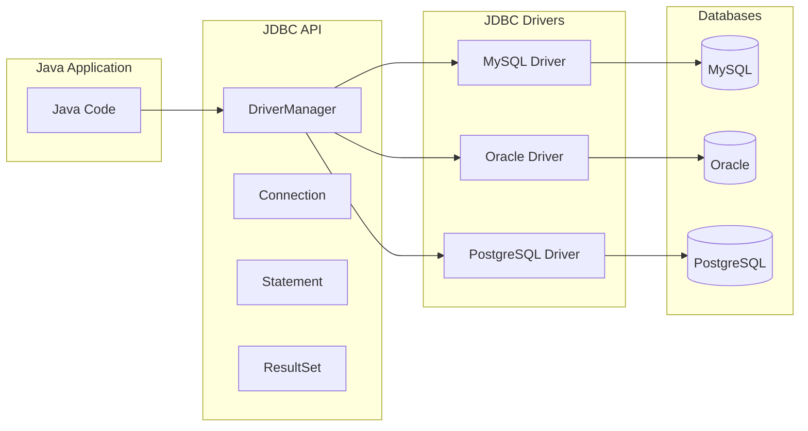
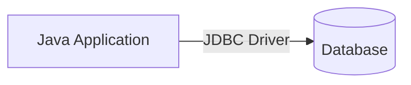
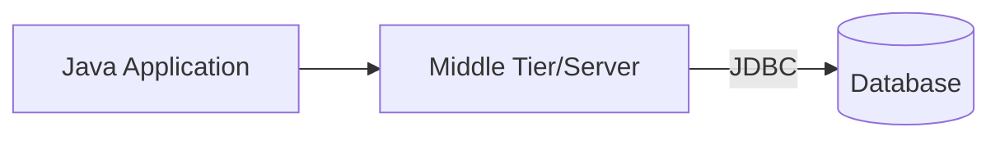
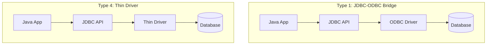
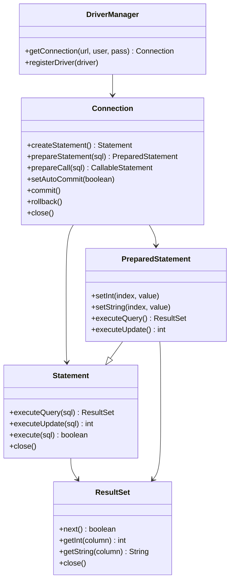
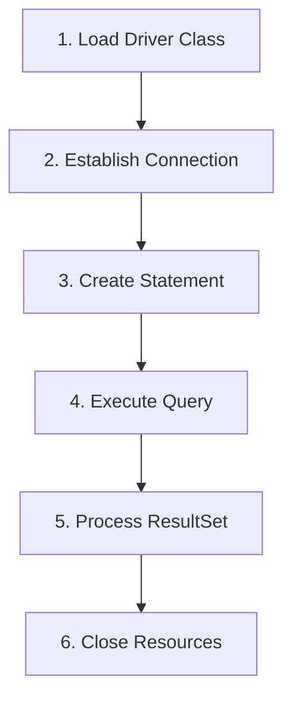
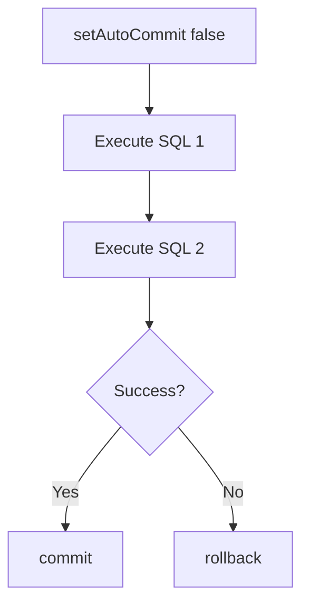
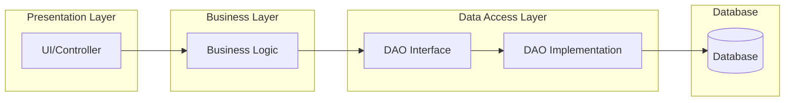

# Sessions 1-2: JDBC & Transaction Management

## Introduction to JDBC

**JDBC (Java Database Connectivity)** is a standard Java API for connecting Java applications to relational databases. It provides a common interface to interact with any database that has a JDBC driver.



## JDBC Architecture

JDBC follows a **two-tier** or **three-tier** architecture:

### Two-Tier Architecture

- Direct connection between application and database
- Simple but less scalable

### Three-Tier Architecture

- Application communicates via middle tier
- Better security, scalability, and maintainability

---

## JDBC Drivers

JDBC drivers translate Java calls into database-specific protocols.

| Type | Name | Description | Performance | Portability |
|------|------|-------------|-------------|-------------|
| **Type 1** | JDBC-ODBC Bridge | Converts JDBC to ODBC calls | Poor | Low (requires ODBC) |
| **Type 2** | Native-API | Uses native database client libraries | Good | Low (requires native libs) |
| **Type 3** | Network Protocol | Converts to middleware protocol | Good | High |
| **Type 4** | Thin Driver (Pure Java) | Direct database protocol in Java | Best | High |



> **MCQ Tip**: Type 4 (Thin/Pure Java) driver is most commonly used and provides best performance.

---

## JDBC Classes & Interfaces

### Core JDBC Components



### Interface/Class Comparison

| Component | Purpose | Key Methods |
|-----------|---------|-------------|
| **DriverManager** | Manages database drivers | `getConnection()` |
| **Connection** | Represents database session | `createStatement()`, `prepareStatement()`, `commit()`, `rollback()` |
| **Statement** | Execute static SQL | `executeQuery()`, `executeUpdate()` |
| **PreparedStatement** | Execute parameterized SQL (precompiled) | `setXxx()`, `executeQuery()` |
| **CallableStatement** | Execute stored procedures | `registerOutParameter()` |
| **ResultSet** | Holds query results | `next()`, `getXxx()` |

---

## JDBC Connection Steps



### Code Example

```java
// 1. Load Driver (optional in JDBC 4.0+)
Class.forName("com.mysql.cj.jdbc.Driver");

// 2. Establish Connection
Connection conn = DriverManager.getConnection(
    "jdbc:mysql://localhost:3306/mydb", "user", "password");

// 3. Create Statement
Statement stmt = conn.createStatement();

// 4. Execute Query
ResultSet rs = stmt.executeQuery("SELECT * FROM employees");

// 5. Process ResultSet
while (rs.next()) {
    System.out.println(rs.getInt("id") + " - " + rs.getString("name"));
}

// 6. Close Resources (reverse order)
rs.close();
stmt.close();
conn.close();
```

---

## Statement vs PreparedStatement

| Feature | Statement | PreparedStatement |
|---------|-----------|-------------------|
| **SQL Type** | Static SQL | Parameterized SQL |
| **Compilation** | Compiled every time | Precompiled once |
| **Performance** | Slower for repeated queries | Faster for repeated queries |
| **SQL Injection** | Vulnerable | Protected |
| **Parameters** | Concatenated in SQL string | Set using setXxx() methods |
| **Use Case** | One-time queries | Repeated queries with parameters |

### PreparedStatement Example

```java
String sql = "INSERT INTO employees (name, salary) VALUES (?, ?)";
PreparedStatement pstmt = conn.prepareStatement(sql);
pstmt.setString(1, "John");
pstmt.setDouble(2, 50000.0);
pstmt.executeUpdate();
```

---

## Transaction Management

### ACID Properties

| Property | Description |
|----------|-------------|
| **Atomicity** | All operations complete or none do |
| **Consistency** | Database remains in valid state |
| **Isolation** | Concurrent transactions don't interfere |
| **Durability** | Committed changes are permanent |

### Transaction Methods

```java
conn.setAutoCommit(false);  // Start transaction

try {
    stmt.executeUpdate("UPDATE accounts SET balance = balance - 100 WHERE id = 1");
    stmt.executeUpdate("UPDATE accounts SET balance = balance + 100 WHERE id = 2");
    conn.commit();  // Commit if successful
} catch (SQLException e) {
    conn.rollback();  // Rollback on error
}
```



---

## Stored Procedures & Functions

### Stored Procedure
A **stored procedure** is a precompiled SQL code stored in the database.

```java
// Calling a stored procedure
CallableStatement cstmt = conn.prepareCall("{call getEmployee(?)}");
cstmt.setInt(1, 101);
ResultSet rs = cstmt.executeQuery();
```

### Stored Function
A **stored function** returns a value.

```java
// Calling a stored function
CallableStatement cstmt = conn.prepareCall("{? = call getEmployeeCount()}");
cstmt.registerOutParameter(1, Types.INTEGER);
cstmt.execute();
int count = cstmt.getInt(1);
```

| Feature | Stored Procedure | Stored Function |
|---------|-----------------|-----------------|
| **Return Value** | Optional (via OUT params) | Mandatory |
| **Call Syntax** | `{call procName(?)}` | `{? = call funcName()}` |
| **Use in SQL** | Cannot use in SELECT | Can use in SELECT |
| **DML Operations** | Allowed | May be restricted |

---

## SQL Injection

### What is SQL Injection?
A security vulnerability where malicious SQL code is inserted into queries through user input.

### Vulnerable Code
```java
// DANGEROUS - SQL Injection vulnerable!
String sql = "SELECT * FROM users WHERE username = '" + username + 
             "' AND password = '" + password + "'";
```

If user enters: `username = ' OR '1'='1' --`

The query becomes:
```sql
SELECT * FROM users WHERE username = '' OR '1'='1' --' AND password = ''
```

### Prevention Methods

| Method | Description |
|--------|-------------|
| **PreparedStatement** | Use parameterized queries (recommended) |
| **Input Validation** | Validate and sanitize user input |
| **Escape Special Chars** | Escape quotes and special characters |
| **Stored Procedures** | Use precompiled stored procedures |
| **Least Privilege** | Limit database user permissions |

### Safe Code with PreparedStatement
```java
String sql = "SELECT * FROM users WHERE username = ? AND password = ?";
PreparedStatement pstmt = conn.prepareStatement(sql);
pstmt.setString(1, username);  // Automatically escaped
pstmt.setString(2, password);
ResultSet rs = pstmt.executeQuery();
```

---

## DAO Design Pattern

**Data Access Object (DAO)** pattern separates data access logic from business logic.



### DAO Components

| Component | Purpose |
|-----------|---------|
| **Model/POJO** | Represents data entity (e.g., Employee) |
| **DAO Interface** | Defines data operations (CRUD) |
| **DAO Implementation** | Implements interface with JDBC code |
| **Service Layer** | Business logic using DAO |

### Example Structure

```java
// 1. Model/POJO
public class Employee {
    private int id;
    private String name;
    private double salary;
    // getters, setters
}

// 2. DAO Interface
public interface EmployeeDAO {
    void insert(Employee emp);
    Employee findById(int id);
    List<Employee> findAll();
    void update(Employee emp);
    void delete(int id);
}

// 3. DAO Implementation
public class EmployeeDAOImpl implements EmployeeDAO {
    private Connection conn;
    
    public void insert(Employee emp) {
        String sql = "INSERT INTO employees (name, salary) VALUES (?, ?)";
        PreparedStatement pstmt = conn.prepareStatement(sql);
        pstmt.setString(1, emp.getName());
        pstmt.setDouble(2, emp.getSalary());
        pstmt.executeUpdate();
    }
    // other CRUD methods...
}
```

### Benefits of DAO Pattern

| Benefit | Description |
|---------|-------------|
| **Separation of Concerns** | Data access logic isolated |
| **Maintainability** | Easy to modify database code |
| **Testability** | Can mock DAO for testing |
| **Flexibility** | Easy to switch databases |
| **Reusability** | DAO can be reused across application |

---

## Key MCQ Points to Remember

1. **JDBC** stands for Java Database Connectivity
2. **Type 4 driver** (Thin/Pure Java) is most commonly used and fastest
3. **DriverManager.getConnection()** returns a Connection object
4. **PreparedStatement** is precompiled and prevents SQL injection
5. **Statement** is used for static SQL, **PreparedStatement** for parameterized
6. **CallableStatement** is used for stored procedures and functions
7. **ResultSet.next()** moves cursor to next row and returns boolean
8. **setAutoCommit(false)** starts a transaction
9. **commit()** saves changes, **rollback()** undoes changes
10. **SQL Injection** is prevented using PreparedStatement
11. **DAO Pattern** separates data access from business logic
12. **POJO** = Plain Old Java Object (simple data class)
13. Connection URL format: `jdbc:mysql://host:port/database`
14. JDBC 4.0+ **auto-loads drivers** (no need for Class.forName)
15. Always close resources in **reverse order** (ResultSet → Statement → Connection)
16. **executeQuery()** returns ResultSet, **executeUpdate()** returns int (rows affected)
17. **Stored Procedure** may not return value; **Function** must return value
18. **ACID** = Atomicity, Consistency, Isolation, Durability
19. **Batch Processing** uses `addBatch()` and `executeBatch()`
20. **Connection pooling** improves performance by reusing connections
