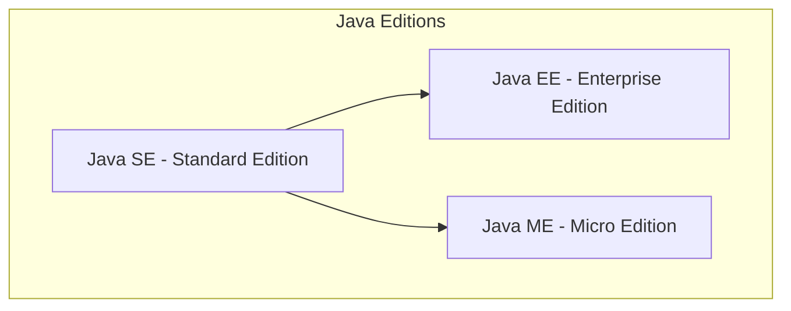
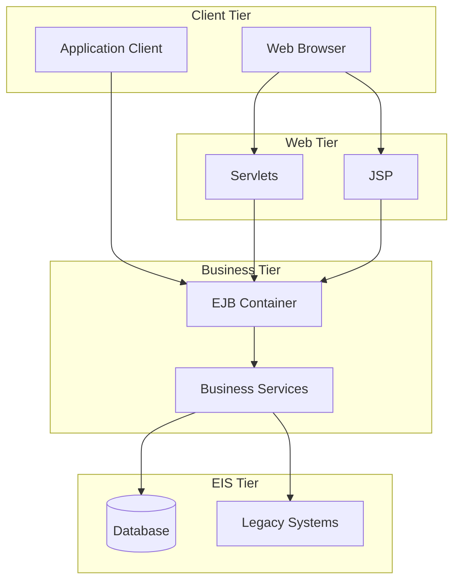
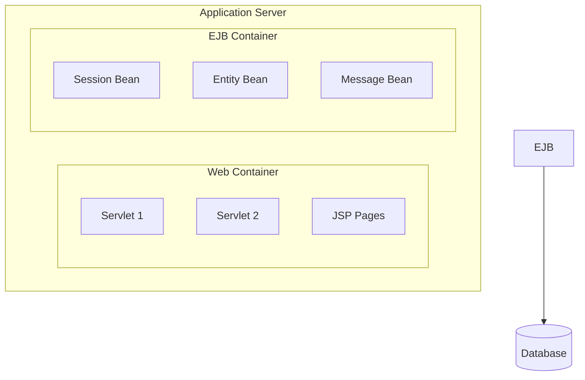
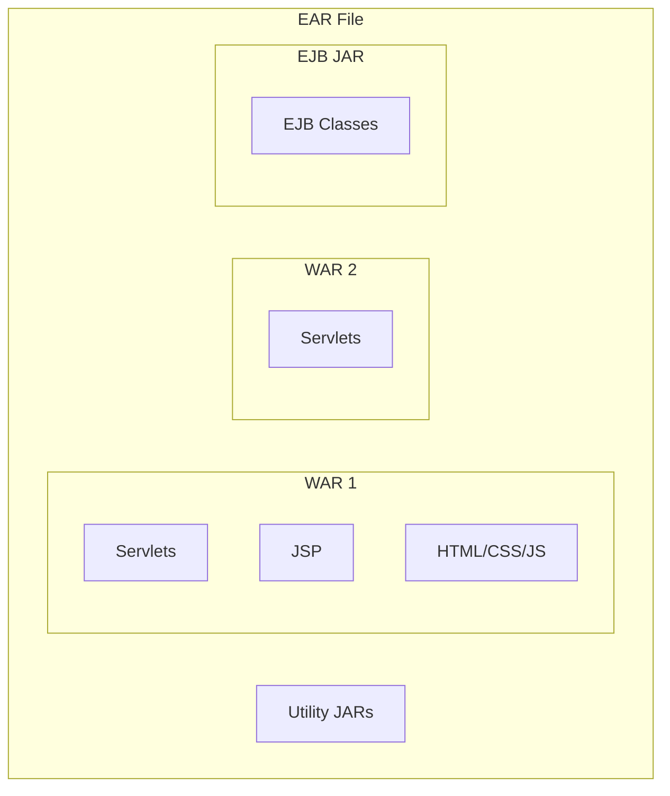
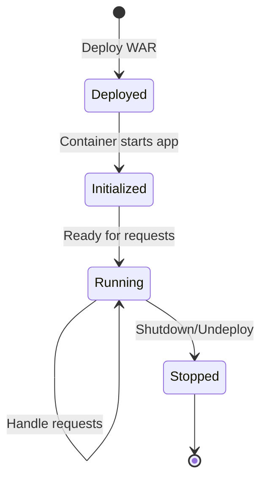

# Session 3: J2EE Overview

## What is J2EE/Java EE?

**Java 2 Platform, Enterprise Edition (J2EE)** is a platform-independent, Java-centric environment for developing, building, and deploying web-based enterprise applications.

> **Note**: J2EE was renamed to **Java EE** (Java Platform, Enterprise Edition) and is now **Jakarta EE** under Eclipse Foundation.



---

## J2EE Architecture



### Multi-Tier Architecture

| Tier | Components | Purpose |
|------|------------|---------|
| **Client Tier** | Browser, Application Client | User interface |
| **Web Tier** | Servlets, JSP, Filters | Request handling, presentation |
| **Business Tier** | EJB, Business Logic | Core application logic |
| **EIS Tier** | Database, Legacy Systems | Data storage |

---

## J2EE Container

A **Container** provides runtime support for J2EE components, managing lifecycle, security, transactions, and resource pooling.

### Container Types

| Container | Components | Features |
|-----------|------------|----------|
| **Web Container** | Servlets, JSP | HTTP handling, session management |
| **EJB Container** | Enterprise JavaBeans | Transaction, security, persistence |
| **Application Client Container** | Client applications | JNDI, security |
| **Applet Container** | Applets | Browser integration |



### Container Services

| Service | Description |
|---------|-------------|
| **Lifecycle Management** | Creates, destroys components |
| **Dependency Injection** | Injects required resources |
| **Security** | Authentication, authorization |
| **Transaction Management** | ACID transactions |
| **Concurrency** | Thread management |
| **Resource Pooling** | Connection, object pools |
| **JNDI** | Naming and directory services |

---

## Packaging Web Applications

### Archive Types

| Archive | Extension | Contents |
|---------|-----------|----------|
| **JAR** | .jar | Java classes, resources |
| **WAR** | .war | Web application (Servlets, JSP, HTML) |
| **EAR** | .ear | Enterprise app (WARs + JARs + EJBs) |



### WAR File Structure

```
myapp.war
├── WEB-INF/
│   ├── web.xml          (Deployment Descriptor)
│   ├── classes/         (Compiled classes)
│   └── lib/             (JAR dependencies)
├── META-INF/
│   └── MANIFEST.MF
├── index.html
├── *.jsp
└── static files (CSS, JS, images)
```

| Directory/File | Purpose |
|---------------|---------|
| **WEB-INF/** | Protected directory (not accessible via URL) |
| **WEB-INF/web.xml** | Deployment descriptor (config) |
| **WEB-INF/classes/** | Compiled Java classes |
| **WEB-INF/lib/** | JAR library files |
| **META-INF/** | Metadata directory |

---

## Deployment Descriptor (web.xml)

The **web.xml** file configures servlets, filters, listeners, and other web application settings.

```xml
<?xml version="1.0" encoding="UTF-8"?>
<web-app xmlns="http://xmlns.jcp.org/xml/ns/javaee" version="4.0">
    
    <!-- Servlet Configuration -->
    <servlet>
        <servlet-name>MyServlet</servlet-name>
        <servlet-class>com.example.MyServlet</servlet-class>
    </servlet>
    
    <servlet-mapping>
        <servlet-name>MyServlet</servlet-name>
        <url-pattern>/hello</url-pattern>
    </servlet-mapping>
    
    <!-- Welcome File -->
    <welcome-file-list>
        <welcome-file>index.html</welcome-file>
    </welcome-file-list>
    
</web-app>
```

### Key Elements

| Element | Purpose |
|---------|---------|
| `<servlet>` | Defines servlet name and class |
| `<servlet-mapping>` | Maps URL to servlet |
| `<filter>` | Defines filter |
| `<listener>` | Defines event listener |
| `<welcome-file-list>` | Default pages |
| `<error-page>` | Custom error pages |
| `<session-config>` | Session timeout settings |

---

## Web Application Lifecycle



### Lifecycle Phases

| Phase | Description |
|-------|-------------|
| **Deployment** | WAR file placed in server directory |
| **Initialization** | Container loads classes, creates instances |
| **Running** | Application handles client requests |
| **Shutdown** | Container destroys instances, releases resources |

---

## Deployment Tools & Methods

| Method | Description |
|--------|-------------|
| **Hot Deploy** | Copy WAR to server's webapps folder |
| **Admin Console** | Use server's web-based admin interface |
| **IDE Integration** | Deploy from Eclipse, IntelliJ, etc. |
| **Maven/Gradle** | Build tool deployment plugins |
| **CLI Tools** | Command-line deployment utilities |

### Common Servers

| Server | Type | License |
|--------|------|---------|
| **Apache Tomcat** | Servlet Container | Free, Open Source |
| **Jetty** | Servlet Container | Free, Open Source |
| **WildFly (JBoss)** | Full Java EE | Free, Open Source |
| **GlassFish** | Reference Implementation | Free, Open Source |
| **WebLogic** | Full Java EE | Commercial (Oracle) |
| **WebSphere** | Full Java EE | Commercial (IBM) |

---

## Web Services Support

J2EE supports both **SOAP** and **RESTful** web services.

| Type | Protocol | Data Format | Standards |
|------|----------|-------------|-----------|
| **SOAP** | HTTP, SMTP | XML | WSDL, UDDI |
| **REST** | HTTP | JSON, XML | No strict standard |

### J2EE Web Service APIs

| API | Purpose |
|-----|---------|
| **JAX-WS** | SOAP web services |
| **JAX-RS** | RESTful web services |
| **JAXB** | XML binding |
| **JSON-P** | JSON processing |

---

## Key MCQ Points to Remember

1. **J2EE** = Java 2 Platform, Enterprise Edition (now Jakarta EE)
2. **WAR** = Web Application Archive (.war)
3. **EAR** = Enterprise Application Archive (.ear)
4. **web.xml** is the deployment descriptor
5. **WEB-INF** directory is NOT accessible via URL
6. **WEB-INF/classes** contains compiled Java classes
7. **WEB-INF/lib** contains JAR dependencies
8. **Web Container** manages Servlets and JSP
9. **EJB Container** manages Enterprise JavaBeans
10. **Tomcat** is a Servlet/JSP container (not full Java EE)
11. **Hot deployment** = copying WAR to webapps folder
12. **JNDI** = Java Naming and Directory Interface
13. **Container** provides lifecycle management, security, transactions
14. **4 tiers**: Client → Web → Business → EIS
15. **JAX-RS** is for RESTful services, **JAX-WS** for SOAP
