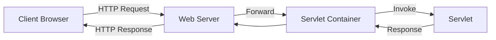
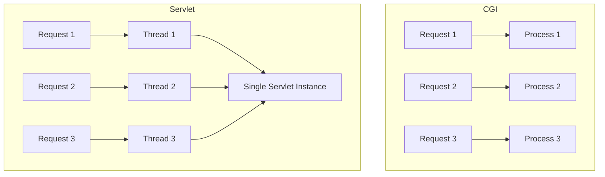
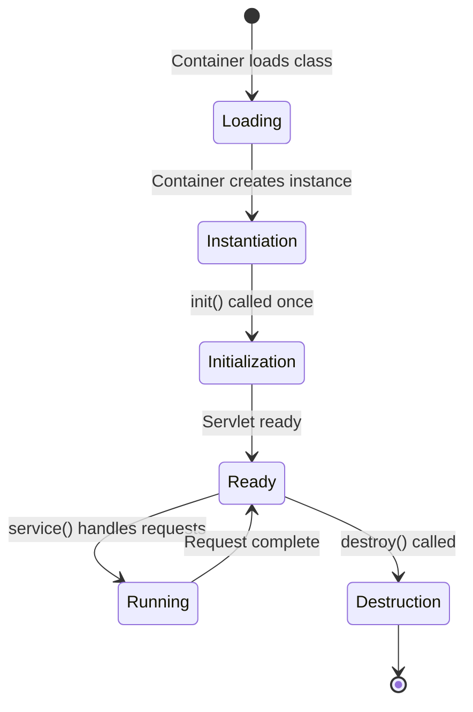
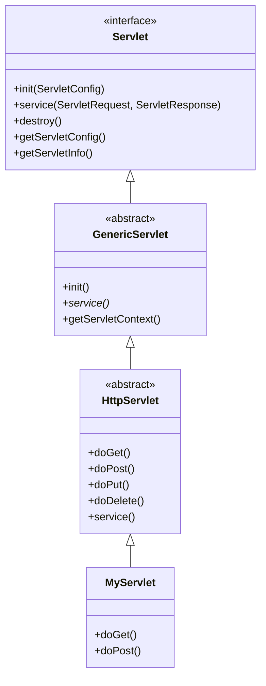
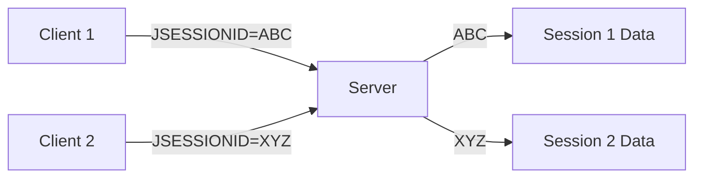
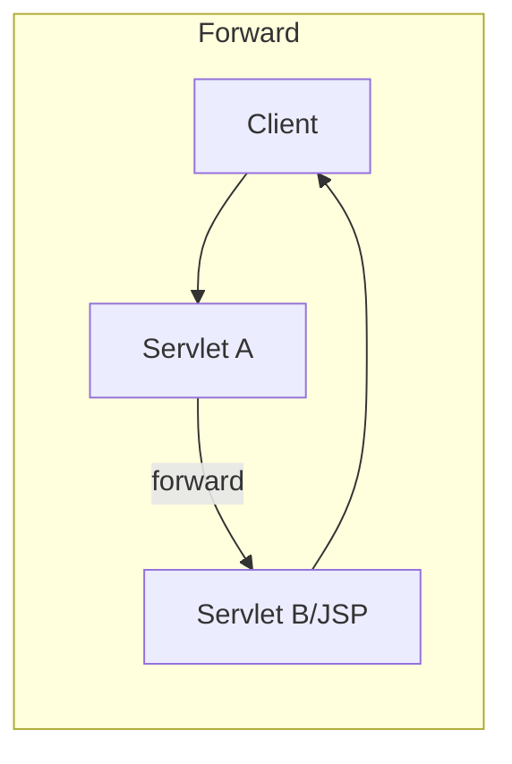
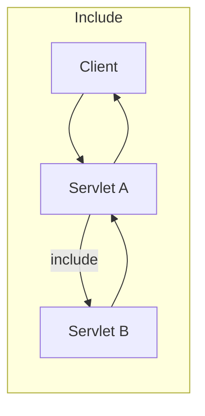
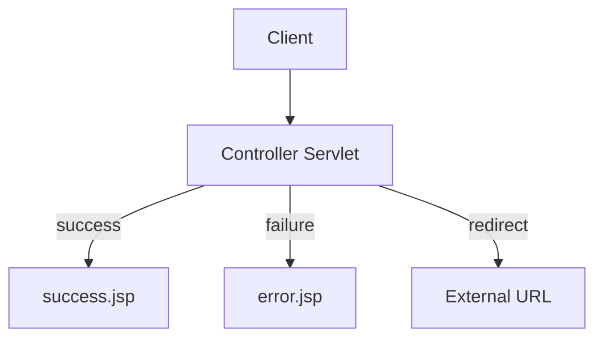
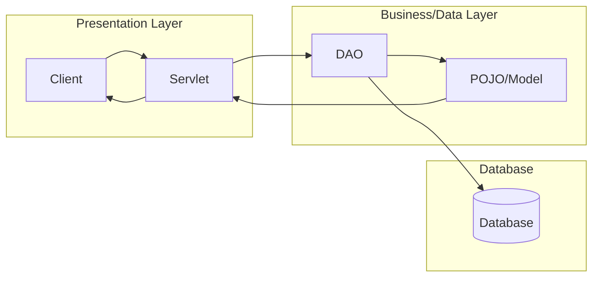

# Sessions 4-7: Servlets

## What is a Servlet?

A **Servlet** is a Java class that extends the capabilities of servers that host applications. Servlets handle client requests and generate dynamic responses.



---

## Servlet vs CGI

| Feature | CGI | Servlet |
|---------|-----|---------|
| **Process** | New process per request | Single instance, multiple threads |
| **Performance** | Slow (process overhead) | Fast (thread-based) |
| **Memory** | High (new process each time) | Low (shared instance) |
| **Platform** | Platform-dependent | Platform-independent (Java) |
| **Scalability** | Poor | Excellent |
| **Persistence** | No state between requests | Maintains state (sessions) |
| **Security** | Less secure | More secure (sandbox) |



---

## Servlet Lifecycle



### Lifecycle Methods

| Method | Called | Purpose |
|--------|--------|---------|
| **init()** | Once (on first request or startup) | Initialize resources |
| **service()** | Per request | Dispatch to doGet/doPost |
| **destroy()** | Once (shutdown) | Cleanup resources |

```java
public class MyServlet extends HttpServlet {
    
    @Override
    public void init() throws ServletException {
        // Called once - initialize resources
        System.out.println("Servlet initialized");
    }
    
    @Override
    protected void doGet(HttpServletRequest req, HttpServletResponse resp) 
            throws ServletException, IOException {
        // Handle GET requests
        resp.getWriter().println("Hello World");
    }
    
    @Override
    public void destroy() {
        // Called once - cleanup resources
        System.out.println("Servlet destroyed");
    }
}
```

---

## Servlet API Hierarchy



### Key Interfaces and Classes

| Component | Type | Purpose |
|-----------|------|---------|
| **Servlet** | Interface | Base servlet contract |
| **GenericServlet** | Abstract Class | Protocol-independent servlet |
| **HttpServlet** | Abstract Class | HTTP-specific servlet |
| **ServletConfig** | Interface | Servlet configuration |
| **ServletContext** | Interface | Application-wide context |
| **HttpServletRequest** | Interface | HTTP request data |
| **HttpServletResponse** | Interface | HTTP response handling |

---

## Servlet Configuration Methods

### 1. Using web.xml (Deployment Descriptor)

```xml
<servlet>
    <servlet-name>HelloServlet</servlet-name>
    <servlet-class>com.example.HelloServlet</servlet-class>
    <init-param>
        <param-name>message</param-name>
        <param-value>Welcome!</param-value>
    </init-param>
    <load-on-startup>1</load-on-startup>
</servlet>

<servlet-mapping>
    <servlet-name>HelloServlet</servlet-name>
    <url-pattern>/hello</url-pattern>
</servlet-mapping>
```

### 2. Using Annotations (Servlet 3.0+)

```java
@WebServlet(
    name = "HelloServlet",
    urlPatterns = {"/hello", "/hi"},
    loadOnStartup = 1,
    initParams = {
        @WebInitParam(name = "message", value = "Welcome!")
    }
)
public class HelloServlet extends HttpServlet {
    // ...
}
```

### Common Annotations

| Annotation | Purpose |
|------------|---------|
| **@WebServlet** | Declare servlet and mapping |
| **@WebFilter** | Declare filter |
| **@WebListener** | Declare listener |
| **@WebInitParam** | Define init parameters |
| **@MultipartConfig** | Enable file upload |

---

## HttpServletRequest Methods

| Method | Returns | Purpose |
|--------|---------|---------|
| `getParameter(name)` | String | Get form parameter |
| `getParameterValues(name)` | String[] | Get multi-value parameter |
| `getAttribute(name)` | Object | Get request attribute |
| `setAttribute(name, value)` | void | Set request attribute |
| `getSession()` | HttpSession | Get/create session |
| `getCookies()` | Cookie[] | Get all cookies |
| `getHeader(name)` | String | Get HTTP header |
| `getMethod()` | String | Get HTTP method (GET, POST) |
| `getRequestURI()` | String | Get request URI |
| `getContextPath()` | String | Get context path |
| `getQueryString()` | String | Get query string |

---

## HttpServletResponse Methods

| Method | Purpose |
|--------|---------|
| `setContentType(type)` | Set MIME type (text/html, application/json) |
| `getWriter()` | Get PrintWriter for text output |
| `getOutputStream()` | Get OutputStream for binary output |
| `sendRedirect(url)` | Redirect to another URL |
| `addCookie(cookie)` | Add cookie to response |
| `setHeader(name, value)` | Set HTTP header |
| `setStatus(code)` | Set HTTP status code |
| `sendError(code, msg)` | Send error response |

---

## Session Management

HTTP is **stateless** - each request is independent. Session management maintains user state across requests.

### Session Tracking Techniques

| Technique | Description | Pros | Cons |
|-----------|-------------|------|------|
| **Cookies** | Store session ID in browser cookie | Automatic, transparent | Can be disabled |
| **URL Rewriting** | Append session ID to URLs | Works without cookies | Ugly URLs, security risk |
| **Hidden Form Fields** | Include session ID in forms | Simple | Only works with forms |
| **HttpSession** | Server-side session storage | Secure, powerful | Server memory usage |

---

## Cookies

**Cookies** are small pieces of data stored on the client browser.

```java
// Creating a cookie
Cookie cookie = new Cookie("username", "john");
cookie.setMaxAge(60 * 60 * 24);  // 1 day in seconds
cookie.setPath("/");
response.addCookie(cookie);

// Reading cookies
Cookie[] cookies = request.getCookies();
if (cookies != null) {
    for (Cookie c : cookies) {
        if (c.getName().equals("username")) {
            String value = c.getValue();
        }
    }
}

// Deleting a cookie
Cookie cookie = new Cookie("username", "");
cookie.setMaxAge(0);  // 0 = delete immediately
response.addCookie(cookie);
```

### Cookie Properties

| Property | Method | Purpose |
|----------|--------|---------|
| **Name** | `getName()` | Cookie identifier |
| **Value** | `getValue()`, `setValue()` | Cookie data |
| **Max Age** | `setMaxAge(seconds)` | Expiration time (-1 = session) |
| **Path** | `setPath()` | URL path scope |
| **Domain** | `setDomain()` | Domain scope |
| **Secure** | `setSecure(true)` | HTTPS only |
| **HttpOnly** | `setHttpOnly(true)` | No JavaScript access |

---

## HttpSession

**HttpSession** provides server-side session storage.



```java
// Get or create session
HttpSession session = request.getSession();        // create if not exists
HttpSession session = request.getSession(true);    // same as above
HttpSession session = request.getSession(false);   // null if not exists

// Store data
session.setAttribute("user", userObject);
session.setAttribute("cart", cartList);

// Retrieve data
User user = (User) session.getAttribute("user");

// Remove data
session.removeAttribute("user");

// Invalidate entire session
session.invalidate();

// Session configuration
session.setMaxInactiveInterval(30 * 60);  // 30 minutes
String sessionId = session.getId();
```

### HttpSession Methods

| Method | Purpose |
|--------|---------|
| `getId()` | Get session ID (JSESSIONID) |
| `getAttribute(name)` | Get stored object |
| `setAttribute(name, value)` | Store object |
| `removeAttribute(name)` | Remove object |
| `invalidate()` | Destroy session |
| `isNew()` | Check if new session |
| `getCreationTime()` | When session was created |
| `getLastAccessedTime()` | Last access time |
| `setMaxInactiveInterval(sec)` | Set timeout |

### Cookies vs HttpSession

| Feature | Cookies | HttpSession |
|---------|---------|-------------|
| **Storage** | Client (browser) | Server |
| **Size Limit** | ~4KB per cookie | No practical limit |
| **Data Type** | String only | Any Object |
| **Security** | Less secure (visible) | More secure |
| **Performance** | Faster (no server lookup) | Requires server memory |
| **Persistence** | Can persist beyond session | Lost on server restart |

---

## RequestDispatcher

**RequestDispatcher** forwards requests or includes content from another resource.





### Forward vs Include

| Method | Behavior |
|--------|----------|
| **forward()** | Transfers control completely; original servlet cannot write to response |
| **include()** | Includes output; original servlet can write before/after |

```java
// Forward - transfers control completely
RequestDispatcher rd = request.getRequestDispatcher("/result.jsp");
rd.forward(request, response);

// Include - includes content in response
RequestDispatcher rd = request.getRequestDispatcher("/header.jsp");
rd.include(request, response);
// Can still write more content after include
```

### Forward vs Redirect

| Feature | Forward | Redirect |
|---------|---------|----------|
| **Speed** | Faster (server-side) | Slower (client round-trip) |
| **URL** | Original URL shown | New URL shown |
| **Request Data** | Preserved | Lost (new request) |
| **Scope** | Same server | Can go to external URL |
| **Method** | `rd.forward()` | `response.sendRedirect()` |

```java
// Forward (internal, fast)
request.getRequestDispatcher("/page.jsp").forward(request, response);

// Redirect (external, new request)
response.sendRedirect("http://example.com/page");
```

---

## Page Navigation Patterns



### Setting Attributes for JSP

```java
// In Servlet
request.setAttribute("message", "Success!");
request.setAttribute("userList", users);
request.getRequestDispatcher("/result.jsp").forward(request, response);

// In JSP
${message}
${userList}
```

---

## Exception Handling

### Using web.xml

```xml
<error-page>
    <error-code>404</error-code>
    <location>/error404.jsp</location>
</error-page>

<error-page>
    <error-code>500</error-code>
    <location>/error500.jsp</location>
</error-page>

<error-page>
    <exception-type>java.lang.Exception</exception-type>
    <location>/generalError.jsp</location>
</error-page>
```

### Programmatic Exception Handling

```java
try {
    // risky code
} catch (Exception e) {
    request.setAttribute("error", e.getMessage());
    request.getRequestDispatcher("/error.jsp").forward(request, response);
}
```

---

## Servlet, DAO, POJO Architecture



| Layer | Component | Responsibility |
|-------|-----------|----------------|
| **Presentation** | Servlet | Handle requests, call business logic |
| **Model** | POJO | Data representation |
| **Data Access** | DAO | Database operations |
| **Data** | Database | Persistent storage |

---

## Key MCQ Points to Remember

1. **Servlet** is a Java class that handles HTTP requests
2. **Servlet Container** (e.g., Tomcat) manages servlet lifecycle
3. **init()** called once, **service()** per request, **destroy()** once
4. **GenericServlet** is protocol-independent, **HttpServlet** is for HTTP
5. **doGet()** handles GET, **doPost()** handles POST requests
6. **@WebServlet** annotation replaces web.xml configuration (Servlet 3.0+)
7. **HttpSession** stores data on server, **Cookies** on client
8. **JSESSIONID** is the default session cookie name
9. **session.invalidate()** destroys the session
10. **forward()** is server-side, URL doesn't change
11. **sendRedirect()** is client-side, URL changes
12. **RequestDispatcher** obtained via `request.getRequestDispatcher()`
13. **getParameter()** gets form data, **getAttribute()** gets request attributes
14. **Cookie.setMaxAge(0)** deletes the cookie
15. **Cookie.setMaxAge(-1)** = session cookie (deleted when browser closes)
16. **HttpSession.setMaxInactiveInterval()** sets timeout in seconds
17. **CGI** creates new process per request; **Servlet** uses threads
18. **load-on-startup** > 0 means load when server starts
19. **WEB-INF** directory is protected and not accessible via URL
20. **include()** returns control to caller, **forward()** does not
