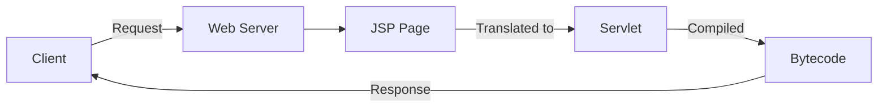
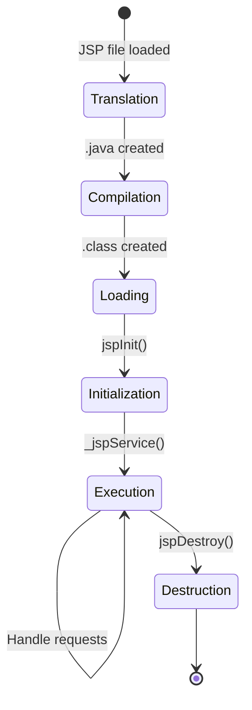
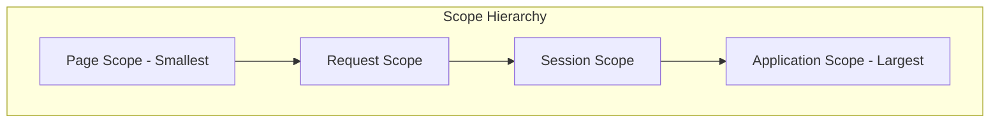
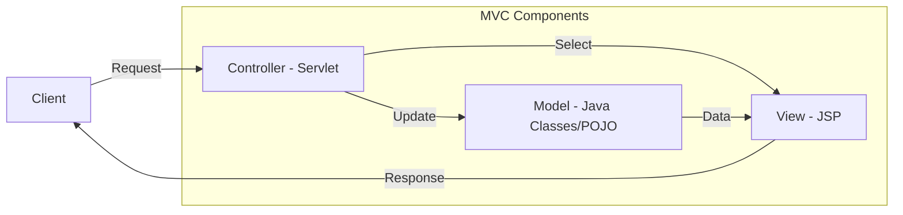
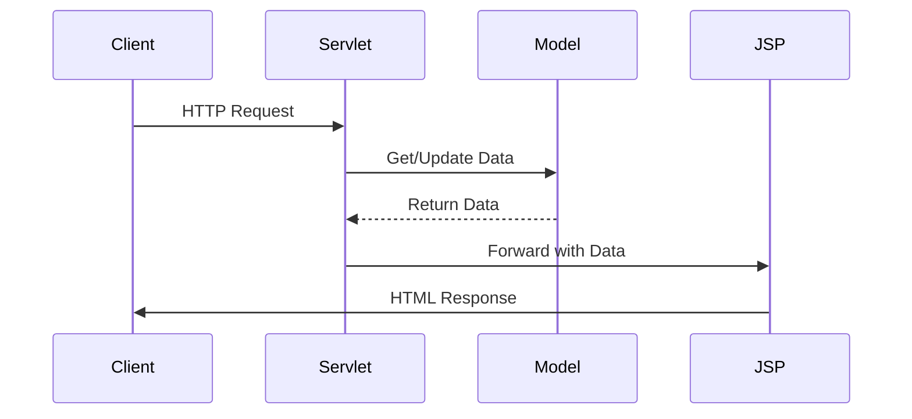

# Sessions 8-9: JavaServer Pages (JSP)

## What is JSP?

**JavaServer Pages (JSP)** is a server-side technology that allows embedding Java code in HTML pages to create dynamic web content. JSP separates presentation logic from business logic.



---

## JSP vs Servlet

| Feature | Servlet | JSP |
|---------|---------|-----|
| **Type** | Pure Java class | HTML with embedded Java |
| **Focus** | Business logic, control | Presentation, view |
| **Ease of Writing** | Complex for HTML output | Easy for HTML/CSS |
| **Compilation** | Manual compile | Auto-compiled by container |
| **Modifications** | Requires recompile | Just save and refresh |
| **In MVC** | Controller | View |

---

## JSP Lifecycle



### Lifecycle Methods

| Phase | Method | Called |
|-------|--------|--------|
| **Translation** | - | JSP → Servlet source (.java) |
| **Compilation** | - | .java → .class |
| **Initialization** | `jspInit()` | Once after loading |
| **Execution** | `_jspService()` | Per request |
| **Destruction** | `jspDestroy()` | Before unloading |

---

## JSP Elements

### 1. Directives

Provide global information about the JSP page.

| Directive | Syntax | Purpose |
|-----------|--------|---------|
| **page** | `<%@ page ... %>` | Page-level settings |
| **include** | `<%@ include file="..." %>` | Static file inclusion |
| **taglib** | `<%@ taglib ... %>` | Tag library declaration |

```jsp
<%@ page language="java" contentType="text/html" pageEncoding="UTF-8" %>
<%@ page import="java.util.*, java.sql.*" %>
<%@ page session="true" %>
<%@ page errorPage="error.jsp" %>
<%@ page isErrorPage="true" %>

<%@ include file="header.jsp" %>

<%@ taglib uri="http://java.sun.com/jsp/jstl/core" prefix="c" %>
```

### Page Directive Attributes

| Attribute | Default | Purpose |
|-----------|---------|---------|
| `language` | java | Scripting language |
| `import` | - | Import Java packages |
| `contentType` | text/html | MIME type |
| `session` | true | Enable/disable session |
| `errorPage` | - | Error page URL |
| `isErrorPage` | false | Mark as error page |
| `isELIgnored` | false | Ignore Expression Language |
| `buffer` | 8kb | Output buffer size |
| `autoFlush` | true | Auto-flush buffer |

---

### 2. Scripting Elements

| Element | Syntax | Purpose |
|---------|--------|---------|
| **Scriptlet** | `<% code %>` | Java code block |
| **Expression** | `<%= expression %>` | Output value |
| **Declaration** | `<%! declaration %>` | Declare variables/methods |

```jsp
<%-- Declaration: instance variable/method --%>
<%! 
    int count = 0;
    public int getCount() { return ++count; }
%>

<%-- Scriptlet: Java code --%>
<%
    String name = request.getParameter("name");
    if (name == null) {
        name = "Guest";
    }
%>

<%-- Expression: Output value --%>
<p>Welcome, <%= name %>!</p>
<p>Visit count: <%= getCount() %></p>
```

### Scriptlet vs Declaration

| Feature | Scriptlet `<% %>` | Declaration `<%! %>` |
|---------|-------------------|---------------------|
| **Scope** | _jspService() method | Class level |
| **Thread Safety** | Thread-safe (local vars) | Not thread-safe (shared) |
| **Use** | Request processing logic | Instance variables, methods |

---

### 3. Comments

| Type | Syntax | Visible in HTML |
|------|--------|-----------------|
| **JSP Comment** | `<%-- comment --%>` | No |
| **HTML Comment** | `<!-- comment -->` | Yes (in source) |
| **Java Comment** | `<% // comment %>` | No |

---

## JSP Implicit Objects

JSP provides 9 implicit objects available without declaration.

| Object | Type | Scope | Description |
|--------|------|-------|-------------|
| **request** | HttpServletRequest | Request | Client request data |
| **response** | HttpServletResponse | Page | Server response |
| **out** | JspWriter | Page | Output stream |
| **session** | HttpSession | Session | User session |
| **application** | ServletContext | Application | Global context |
| **config** | ServletConfig | Page | Servlet config |
| **pageContext** | PageContext | Page | Access to all scopes |
| **page** | Object (this) | Page | Current servlet instance |
| **exception** | Throwable | Page | Error page only |



---

## JSP Scopes

| Scope | Duration | Shared Across |
|-------|----------|---------------|
| **page** | Current page only | Nothing |
| **request** | Single request | Forwarded pages |
| **session** | User session | All user pages |
| **application** | Application lifetime | All users |

```jsp
<%-- Setting attributes in different scopes --%>
<%
    pageContext.setAttribute("pageVar", "Page Data");
    request.setAttribute("reqVar", "Request Data");
    session.setAttribute("sessVar", "Session Data");
    application.setAttribute("appVar", "Application Data");
%>

<%-- Getting attributes --%>
Page: <%= pageContext.getAttribute("pageVar") %>
Request: <%= request.getAttribute("reqVar") %>
Session: <%= session.getAttribute("sessVar") %>
Application: <%= application.getAttribute("appVar") %>
```

---

## Expression Language (EL)

EL provides a simpler way to access data without scriptlets.

### Syntax
```jsp
${expression}
```

### EL Implicit Objects

| Object | Maps To |
|--------|---------|
| `${param.name}` | request.getParameter("name") |
| `${paramValues.name}` | request.getParameterValues("name") |
| `${header.name}` | request.getHeader("name") |
| `${cookie.name.value}` | Cookie value |
| `${sessionScope.user}` | session.getAttribute("user") |
| `${requestScope.data}` | request.getAttribute("data") |
| `${applicationScope.config}` | application.getAttribute("config") |
| `${pageContext.request.method}` | Request method |

### EL Examples

```jsp
<%-- Without EL (old way) --%>
<%= request.getParameter("name") %>
<%= ((User)session.getAttribute("user")).getName() %>

<%-- With EL (modern way) --%>
${param.name}
${sessionScope.user.name}

<%-- EL Operators --%>
${10 + 5}           <%-- Arithmetic: 15 --%>
${5 > 3}            <%-- Comparison: true --%>
${empty list}       <%-- Check null/empty --%>
${not empty user}   <%-- Check not null --%>
${a ? b : c}        <%-- Ternary --%>
```

### EL Operators

| Type | Operators |
|------|-----------|
| **Arithmetic** | `+`, `-`, `*`, `/` (div), `%` (mod) |
| **Comparison** | `==` (eq), `!=` (ne), `<` (lt), `>` (gt), `<=` (le), `>=` (ge) |
| **Logical** | `&&` (and), `||` (or), `!` (not) |
| **Empty** | `empty` - checks null or empty |
| **Ternary** | `? :` |

---

## JSTL (JSP Standard Tag Library)

JSTL provides standard tags for common tasks, avoiding scriptlets.

### JSTL Tag Libraries

| Prefix | URI | Purpose |
|--------|-----|---------|
| **c** | `http://java.sun.com/jsp/jstl/core` | Core tags |
| **fmt** | `http://java.sun.com/jsp/jstl/fmt` | Formatting |
| **sql** | `http://java.sun.com/jsp/jstl/sql` | Database |
| **fn** | `http://java.sun.com/jsp/jstl/functions` | Functions |

### Core Tags (c:)

```jsp
<%@ taglib uri="http://java.sun.com/jsp/jstl/core" prefix="c" %>

<%-- c:out - Output with escaping --%>
<c:out value="${user.name}" default="Guest" />

<%-- c:set - Set variable --%>
<c:set var="count" value="10" scope="session" />

<%-- c:if - Conditional --%>
<c:if test="${user != null}">
    Welcome, ${user.name}!
</c:if>

<%-- c:choose/when/otherwise - Switch --%>
<c:choose>
    <c:when test="${score >= 90}">Grade: A</c:when>
    <c:when test="${score >= 80}">Grade: B</c:when>
    <c:otherwise>Grade: C</c:otherwise>
</c:choose>

<%-- c:forEach - Loop --%>
<c:forEach items="${products}" var="product" varStatus="status">
    ${status.index}: ${product.name} - $${product.price}
</c:forEach>

<%-- c:forTokens - Token loop --%>
<c:forTokens items="a,b,c,d" delims="," var="item">
    ${item}
</c:forTokens>

<%-- c:url - URL building --%>
<c:url value="/product" var="productUrl">
    <c:param name="id" value="123" />
</c:url>

<%-- c:redirect - Redirect --%>
<c:redirect url="/login.jsp" />

<%-- c:import - Include content --%>
<c:import url="/header.jsp" />
```

### JSTL Core Tags Summary

| Tag | Purpose |
|-----|---------|
| `<c:out>` | Output with HTML escaping |
| `<c:set>` | Set variable in scope |
| `<c:remove>` | Remove variable |
| `<c:if>` | Simple conditional |
| `<c:choose>`, `<c:when>`, `<c:otherwise>` | Multiple conditions |
| `<c:forEach>` | Loop over collection |
| `<c:forTokens>` | Loop over tokens |
| `<c:url>` | Build URL with params |
| `<c:redirect>` | Redirect |
| `<c:import>` | Include external content |

---

## MVC Architecture

**Model-View-Controller (MVC)** separates application into three components.



| Component | Java Technology | Responsibility |
|-----------|----------------|----------------|
| **Model** | POJO, JavaBeans | Data and business logic |
| **View** | JSP | Presentation, UI |
| **Controller** | Servlet | Request handling, flow control |

### MVC Flow



### MVC Example

```java
// Controller (Servlet)
@WebServlet("/products")
public class ProductServlet extends HttpServlet {
    private ProductDAO dao = new ProductDAO();
    
    protected void doGet(HttpServletRequest request, 
                         HttpServletResponse response) {
        List<Product> products = dao.findAll();  // Get Model data
        request.setAttribute("products", products);
        request.getRequestDispatcher("/products.jsp")
               .forward(request, response);  // Forward to View
    }
}
```

```jsp
<%-- View (JSP) --%>
<%@ taglib uri="http://java.sun.com/jsp/jstl/core" prefix="c" %>
<table>
    <c:forEach items="${products}" var="p">
        <tr>
            <td>${p.id}</td>
            <td>${p.name}</td>
            <td>${p.price}</td>
        </tr>
    </c:forEach>
</table>
```

---

## JSP Error Handling

### Declarative Error Handling

```jsp
<%-- In main page --%>
<%@ page errorPage="error.jsp" %>

<%-- In error.jsp --%>
<%@ page isErrorPage="true" %>
<h1>Error Occurred</h1>
<p>Message: ${pageContext.exception.message}</p>
```

### Global Error Pages (web.xml)

```xml
<error-page>
    <error-code>404</error-code>
    <location>/error/404.jsp</location>
</error-page>

<error-page>
    <exception-type>java.lang.Exception</exception-type>
    <location>/error/general.jsp</location>
</error-page>
```

---

## JSP Actions

Standard actions for common operations.

| Action | Purpose |
|--------|---------|
| `<jsp:include>` | Dynamic include |
| `<jsp:forward>` | Forward request |
| `<jsp:useBean>` | Create/access JavaBean |
| `<jsp:setProperty>` | Set bean property |
| `<jsp:getProperty>` | Get bean property |
| `<jsp:param>` | Pass parameters |

```jsp
<%-- Include --%>
<jsp:include page="header.jsp">
    <jsp:param name="title" value="Home Page" />
</jsp:include>

<%-- Forward --%>
<jsp:forward page="result.jsp" />

<%-- JavaBean usage --%>
<jsp:useBean id="user" class="com.example.User" scope="session" />
<jsp:setProperty name="user" property="name" value="John" />
Name: <jsp:getProperty name="user" property="name" />
```

### Include Directive vs Include Action

| Feature | `<%@ include %>` | `<jsp:include>` |
|---------|------------------|-----------------|
| **Time** | Translation time | Request time |
| **Type** | Static | Dynamic |
| **Content** | Merged into JSP | Included at runtime |
| **Changes** | Requires recompilation | Reflected immediately |

---

## Key MCQ Points to Remember

1. **JSP** = JavaServer Pages - HTML with embedded Java
2. **JSP is translated to Servlet** by the container
3. **jspInit()** called once, **_jspService()** per request
4. **9 implicit objects**: request, response, out, session, application, config, pageContext, page, exception
5. **exception** object only available in error pages
6. **<%@ page %>** is a directive, **<% %>** is a scriptlet
7. **<%= expression %>** outputs value (no semicolon)
8. **<%! declaration %>** for instance variables/methods
9. **EL syntax**: `${expression}`
10. **${empty variable}** checks if null or empty
11. **JSTL core prefix** is "c" (e.g., `<c:forEach>`)
12. **`<c:out>` escapes HTML** - prevents XSS
13. **`<c:forEach>`** iterates over collections
14. **`<%@ include %>`** is static (compile time)
15. **`<jsp:include>`** is dynamic (runtime)
16. **MVC**: Model=POJO, View=JSP, Controller=Servlet
17. **pageContext** can access all scopes
18. **Application scope** is shared across all users
19. **isELIgnored="true"** disables Expression Language
20. **`${param.name}`** = `request.getParameter("name")`
