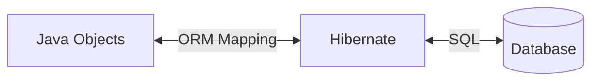
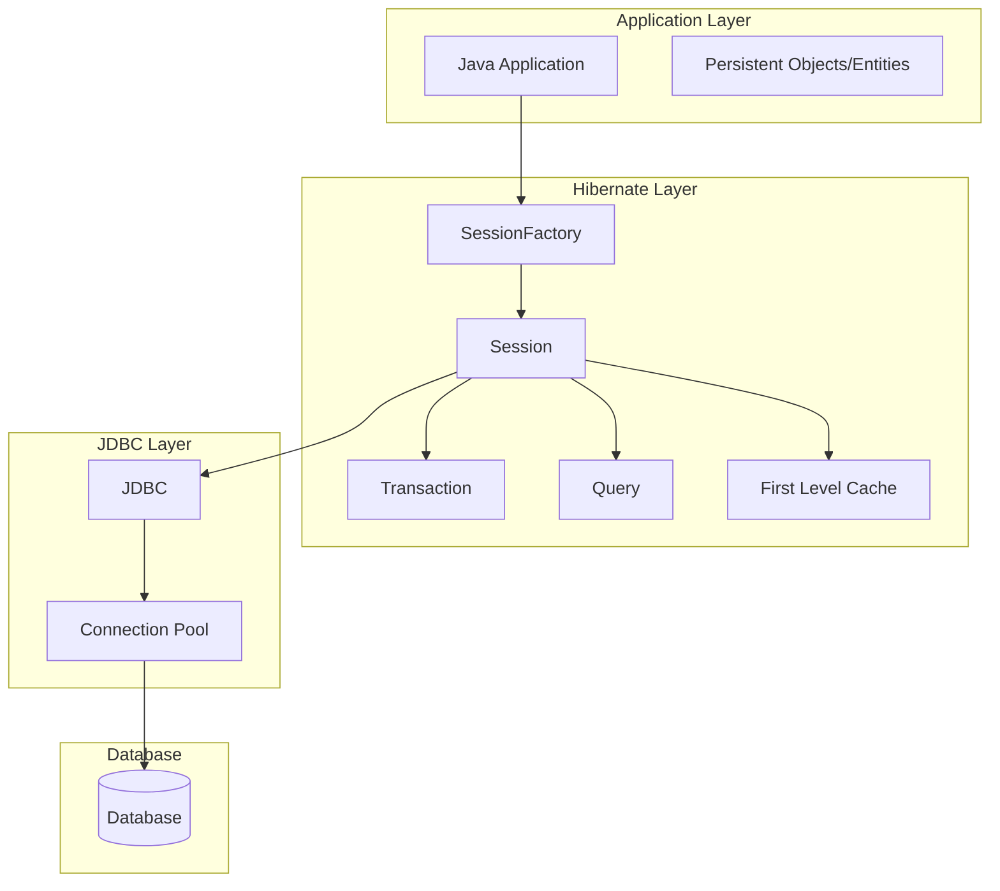
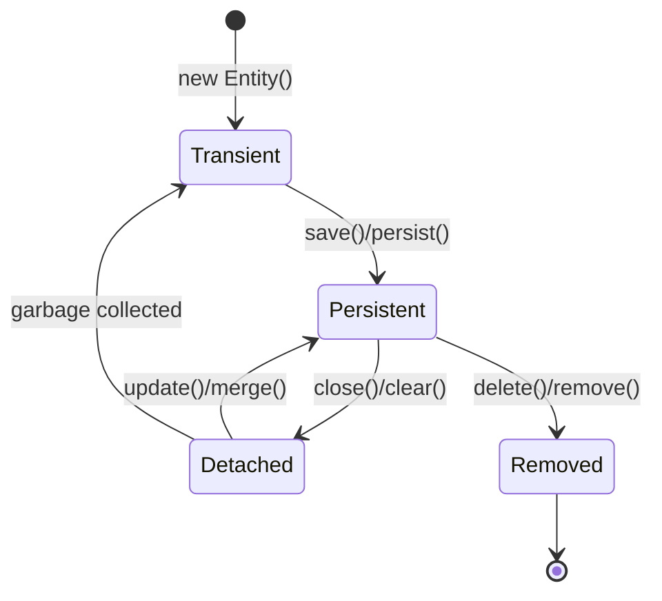
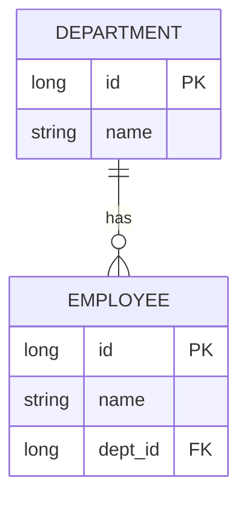
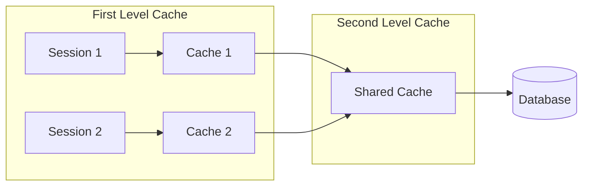

# Sessions 10-13: Hibernate Framework

## What is Hibernate?

**Hibernate** is an Object-Relational Mapping (ORM) framework that maps Java objects to database tables, eliminating the need for manual JDBC code.



### Why Hibernate?

| JDBC Challenges | Hibernate Solution |
|----------------|-------------------|
| Repetitive boilerplate code | Automatic CRUD operations |
| SQL in Java code | HQL/Criteria API |
| Manual object mapping | Automatic mapping |
| Database-specific SQL | Database-independent |
| Manual transaction handling | Built-in transaction support |
| No caching | First & second-level caching |

---

## Hibernate Architecture



### Core Components

| Component | Description | Scope |
|-----------|-------------|-------|
| **Configuration** | Loads hibernate.cfg.xml | Application |
| **SessionFactory** | Creates Session objects | Application (singleton) |
| **Session** | Main interface for DB operations | Single transaction |
| **Transaction** | Handles ACID transactions | Single unit of work |
| **Query** | Execute HQL/SQL queries | Session |
| **Criteria** | Object-oriented query API | Session |

---

## Configuration Files

### hibernate.cfg.xml

```xml
<?xml version="1.0" encoding="UTF-8"?>
<!DOCTYPE hibernate-configuration PUBLIC
    "-//Hibernate/Hibernate Configuration DTD 3.0//EN"
    "http://hibernate.org/dtd/hibernate-configuration-3.0.dtd">
    
<hibernate-configuration>
    <session-factory>
        <!-- Database connection settings -->
        <property name="connection.driver_class">com.mysql.cj.jdbc.Driver</property>
        <property name="connection.url">jdbc:mysql://localhost:3306/mydb</property>
        <property name="connection.username">root</property>
        <property name="connection.password">password</property>
        
        <!-- Hibernate properties -->
        <property name="dialect">org.hibernate.dialect.MySQL8Dialect</property>
        <property name="show_sql">true</property>
        <property name="format_sql">true</property>
        <property name="hbm2ddl.auto">update</property>
        
        <!-- Mapping files or classes -->
        <mapping class="com.example.entity.Employee"/>
    </session-factory>
</hibernate-configuration>
```

### Key Properties

| Property | Values | Purpose |
|----------|--------|---------|
| `dialect` | MySQL8Dialect, OracleDialect | Database-specific SQL |
| `show_sql` | true/false | Print SQL to console |
| `format_sql` | true/false | Pretty print SQL |
| `hbm2ddl.auto` | create, update, validate, create-drop | Schema management |

### hbm2ddl.auto Options

| Value | Behavior |
|-------|----------|
| **create** | Drop & create schema on startup |
| **create-drop** | Create on startup, drop on shutdown |
| **update** | Update schema (add columns, tables) |
| **validate** | Validate schema, no changes |
| **none** | No action |

---

## Entity Mapping with Annotations

```java
import javax.persistence.*;

@Entity
@Table(name = "employees")
public class Employee {
    
    @Id
    @GeneratedValue(strategy = GenerationType.IDENTITY)
    private Long id;
    
    @Column(name = "emp_name", nullable = false, length = 100)
    private String name;
    
    @Column(unique = true)
    private String email;
    
    @Temporal(TemporalType.DATE)
    private Date joiningDate;
    
    @Transient
    private int age;  // Not persisted
    
    // Getters and setters
}
```

### Core Annotations

| Annotation | Purpose |
|------------|---------|
| `@Entity` | Mark class as entity |
| `@Table` | Specify table name |
| `@Id` | Primary key field |
| `@GeneratedValue` | Auto-generate ID |
| `@Column` | Column mapping |
| `@Transient` | Exclude from mapping |
| `@Temporal` | Date/time mapping |
| `@Lob` | Large object (BLOB/CLOB) |

### Generation Strategies

| Strategy | Description |
|----------|-------------|
| `IDENTITY` | Auto-increment (MySQL) |
| `SEQUENCE` | Database sequence (Oracle) |
| `TABLE` | Simulated sequence using table |
| `AUTO` | Provider chooses strategy |

---

## Entity Lifecycle



### Lifecycle States

| State | Description | In Session? | In DB? |
|-------|-------------|-------------|--------|
| **Transient** | New object, not saved | No | No |
| **Persistent** | Attached to session | Yes | Yes |
| **Detached** | Session closed | No | Yes |
| **Removed** | Marked for deletion | Yes | Pending delete |

### Session Methods

| Method | From State | To State | Action |
|--------|------------|----------|--------|
| `save(obj)` | Transient | Persistent | INSERT |
| `persist(obj)` | Transient | Persistent | INSERT |
| `update(obj)` | Detached | Persistent | UPDATE |
| `merge(obj)` | Detached | Persistent | Return merged copy |
| `delete(obj)` | Persistent | Removed | DELETE |
| `get(Class, id)` | - | Persistent | SELECT (returns null) |
| `load(Class, id)` | - | Persistent | SELECT (throws exception) |

### get() vs load()

| Feature | get() | load() |
|---------|-------|--------|
| **If not found** | Returns null | Throws ObjectNotFoundException |
| **Loading** | Eager (immediate) | Lazy (proxy) |
| **Use when** | ID may not exist | ID definitely exists |

---

## CRUD Operations

```java
// Get SessionFactory
SessionFactory factory = new Configuration()
    .configure("hibernate.cfg.xml")
    .addAnnotatedClass(Employee.class)
    .buildSessionFactory();

// Create
Session session = factory.openSession();
Transaction tx = session.beginTransaction();
Employee emp = new Employee("John", "john@mail.com");
session.save(emp);  // or persist()
tx.commit();
session.close();

// Read
session = factory.openSession();
Employee emp = session.get(Employee.class, 1L);
session.close();

// Update
session = factory.openSession();
tx = session.beginTransaction();
Employee emp = session.get(Employee.class, 1L);
emp.setName("John Doe");  // Automatic dirty checking
tx.commit();  // UPDATE executed automatically
session.close();

// Delete
session = factory.openSession();
tx = session.beginTransaction();
Employee emp = session.get(Employee.class, 1L);
session.delete(emp);
tx.commit();
session.close();
```

---

## Hibernate Mappings & Relationships

### Relationship Types

| Type | Annotation | Example |
|------|------------|---------|
| **One-to-One** | `@OneToOne` | Employee ↔ Address |
| **One-to-Many** | `@OneToMany` | Department → Employees |
| **Many-to-One** | `@ManyToOne` | Employee → Department |
| **Many-to-Many** | `@ManyToMany` | Students ↔ Courses |

### One-to-Many / Many-to-One

```java
@Entity
public class Department {
    @Id
    @GeneratedValue(strategy = GenerationType.IDENTITY)
    private Long id;
    private String name;
    
    @OneToMany(mappedBy = "department", cascade = CascadeType.ALL)
    private List<Employee> employees = new ArrayList<>();
}

@Entity
public class Employee {
    @Id
    @GeneratedValue(strategy = GenerationType.IDENTITY)
    private Long id;
    private String name;
    
    @ManyToOne
    @JoinColumn(name = "dept_id")
    private Department department;
}
```



### Many-to-Many

```java
@Entity
public class Student {
    @Id
    @GeneratedValue(strategy = GenerationType.IDENTITY)
    private Long id;
    
    @ManyToMany
    @JoinTable(
        name = "student_course",
        joinColumns = @JoinColumn(name = "student_id"),
        inverseJoinColumns = @JoinColumn(name = "course_id")
    )
    private Set<Course> courses = new HashSet<>();
}

@Entity
public class Course {
    @Id
    @GeneratedValue(strategy = GenerationType.IDENTITY)
    private Long id;
    
    @ManyToMany(mappedBy = "courses")
    private Set<Student> students = new HashSet<>();
}
```

### Cascade Types

| Type | Description |
|------|-------------|
| `ALL` | All operations cascade |
| `PERSIST` | Cascade save |
| `MERGE` | Cascade merge |
| `REMOVE` | Cascade delete |
| `REFRESH` | Cascade refresh |
| `DETACH` | Cascade detach |

### Fetch Types

| Type | Description | Default For |
|------|-------------|-------------|
| `EAGER` | Load immediately | @ManyToOne, @OneToOne |
| `LAZY` | Load on access | @OneToMany, @ManyToMany |

```java
@OneToMany(mappedBy = "department", fetch = FetchType.LAZY)
private List<Employee> employees;

@ManyToOne(fetch = FetchType.EAGER)
private Department department;
```


---

## Component Mapping (@Embeddable)

**Component mapping** allows a class to be embedded as part of another entity's table, rather than having its own table. It is used for value types.

### Example: Address as Component

```java
// 1. Define the component (value type)
@Embeddable
public class Address {
    @Column(name = "street_name")
    private String street;
    
    @Column(name = "city_name")
    private String city;
    
    @Column(name = "zip_code")
    private String zipCode;
    
    // Getters and setters
}

// 2. Use in Entity
@Entity
@Table(name = "users")
public class User {
    @Id
    @GeneratedValue(strategy = GenerationType.IDENTITY)
    private Long id;
    
    private String name;
    
    @Embedded
    private Address address;  // Fields of Address will be columns in 'users' table
    
    // Start overriding column names if needed
    @Embedded
    @AttributeOverrides({
        @AttributeOverride(name = "street", column = @Column(name = "billing_street")),
        @AttributeOverride(name = "city", column = @Column(name = "billing_city")),
        @AttributeOverride(name = "zipCode", column = @Column(name = "billing_zip"))
    })
    private Address billingAddress;
}
```

### Key Annotations

| Annotation | Purpose |
|------------|---------|
| `@Embeddable` | Marks a class as a value type (component) |
| `@Embedded` | Used in the entity to embed the component |
| `@AttributeOverride` | Overrides column definitions of the component |

---

## Collection Mapping

```java
@Entity
public class Employee {
    @Id
    private Long id;
    
    @ElementCollection
    @CollectionTable(name = "emp_phones", joinColumns = @JoinColumn(name = "emp_id"))
    @Column(name = "phone")
    private Set<String> phoneNumbers = new HashSet<>();
    
    @ElementCollection
    @MapKeyColumn(name = "address_type")
    @Column(name = "address")
    private Map<String, String> addresses = new HashMap<>();
}
```

---

## HQL (Hibernate Query Language)

**HQL** is an object-oriented query language similar to SQL but uses entity names and properties.

```java
// Basic SELECT
Query<Employee> query = session.createQuery(
    "FROM Employee", Employee.class);
List<Employee> employees = query.getResultList();

// With WHERE clause
Query<Employee> query = session.createQuery(
    "FROM Employee e WHERE e.salary > :minSalary", Employee.class);
query.setParameter("minSalary", 50000);

// SELECT specific columns
Query<Object[]> query = session.createQuery(
    "SELECT e.name, e.salary FROM Employee e", Object[].class);

// JOIN
Query<Employee> query = session.createQuery(
    "FROM Employee e INNER JOIN e.department d WHERE d.name = :deptName",
    Employee.class);

// Aggregate functions
Query<Long> query = session.createQuery(
    "SELECT COUNT(e) FROM Employee e", Long.class);

// UPDATE
Query query = session.createQuery(
    "UPDATE Employee e SET e.salary = e.salary * 1.1");
int rowsUpdated = query.executeUpdate();

// DELETE
Query query = session.createQuery(
    "DELETE FROM Employee e WHERE e.status = :status");
query.setParameter("status", "INACTIVE");
query.executeUpdate();
```

### HQL vs SQL

| Feature | HQL | SQL |
|---------|-----|-----|
| **Uses** | Entity/Property names | Table/Column names |
| **Case Sensitive** | Entity names yes, keywords no | Varies by DB |
| **FROM required** | Yes | Yes |
| **SELECT optional** | Yes (for full entity) | No |
| **Joins** | Use property names | Use foreign keys |

---

## Named Queries

Define queries in entity class, reuse across application.

```java
@Entity
@NamedQueries({
    @NamedQuery(
        name = "Employee.findAll",
        query = "FROM Employee"
    ),
    @NamedQuery(
        name = "Employee.findByDept",
        query = "FROM Employee e WHERE e.department.name = :deptName"
    )
})
public class Employee {
    // ...
}

// Using named query
Query<Employee> query = session.createNamedQuery("Employee.findByDept", Employee.class);
query.setParameter("deptName", "IT");
List<Employee> employees = query.getResultList();
```

---

## Criteria API

Type-safe, object-oriented query API.

```java
CriteriaBuilder cb = session.getCriteriaBuilder();
CriteriaQuery<Employee> cq = cb.createQuery(Employee.class);
Root<Employee> root = cq.from(Employee.class);

// SELECT all
cq.select(root);

// WHERE clause
cq.where(cb.equal(root.get("department"), "IT"));

// Multiple conditions
cq.where(
    cb.and(
        cb.greaterThan(root.get("salary"), 50000),
        cb.like(root.get("name"), "J%")
    )
);

// ORDER BY
cq.orderBy(cb.desc(root.get("salary")));

// Execute
List<Employee> employees = session.createQuery(cq).getResultList();
```

### Criteria API Predicates

| Method | SQL Equivalent |
|--------|---------------|
| `cb.equal()` | = |
| `cb.notEqual()` | != |
| `cb.gt()`, `cb.greaterThan()` | > |
| `cb.lt()`, `cb.lessThan()` | < |
| `cb.ge()`, `cb.greaterThanOrEqualTo()` | >= |
| `cb.le()`, `cb.lessThanOrEqualTo()` | <= |
| `cb.like()` | LIKE |
| `cb.between()` | BETWEEN |
| `cb.isNull()` | IS NULL |
| `cb.and()` | AND |
| `cb.or()` | OR |

---

## Caching



| Level | Scope | Default | Configuration |
|-------|-------|---------|---------------|
| **First Level** | Session | Enabled | Cannot disable |
| **Second Level** | SessionFactory | Disabled | Need external provider |
| **Query Cache** | SessionFactory | Disabled | With second level cache |

---

## Key MCQ Points to Remember

1. **Hibernate** is an ORM framework for Java
2. **SessionFactory** is thread-safe and immutable (singleton)
3. **Session** is NOT thread-safe (one per request/transaction)
4. **@Entity** marks a class as persistent entity
5. **@Id** marks primary key field
6. **@GeneratedValue(strategy=IDENTITY)** for auto-increment
7. **@Transient** excludes field from persistence
8. **Transient** → save() → **Persistent** → close() → **Detached**
9. **get()** returns null if not found; **load()** throws exception
10. **load()** returns proxy (lazy loading)
11. **hbm2ddl.auto="update"** adds new columns/tables
12. **hbm2ddl.auto="create"** drops and recreates schema
13. **@OneToMany** default fetch is LAZY
14. **@ManyToOne** default fetch is EAGER
15. **mappedBy** indicates non-owning side of relationship
16. **HQL uses entity names**, not table names
17. **Criteria API** provides type-safe queries
18. **First-level cache** is session-scoped and always enabled
19. **Named queries** are defined with @NamedQuery annotation
20. **CascadeType.ALL** propagates all operations to related entities
