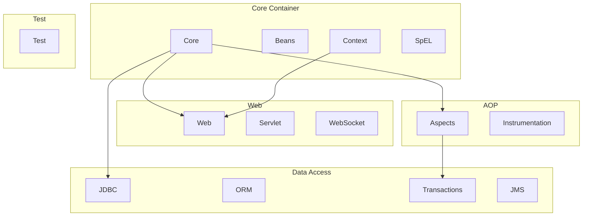
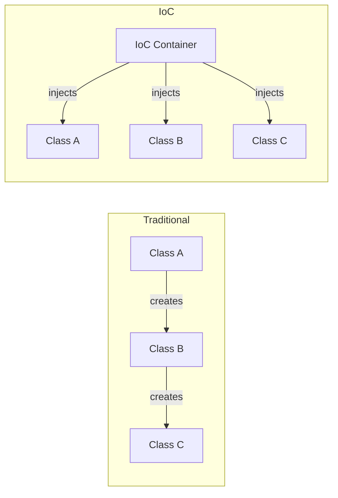
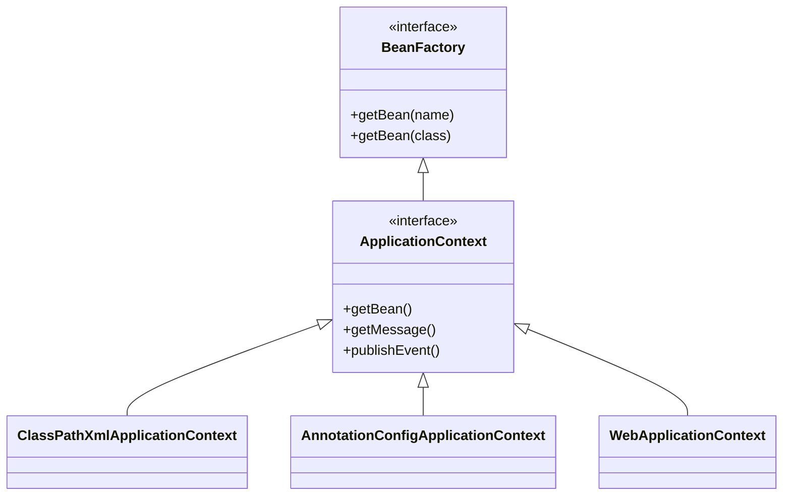
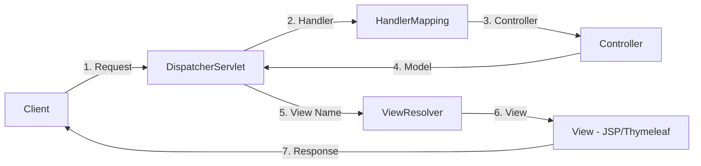
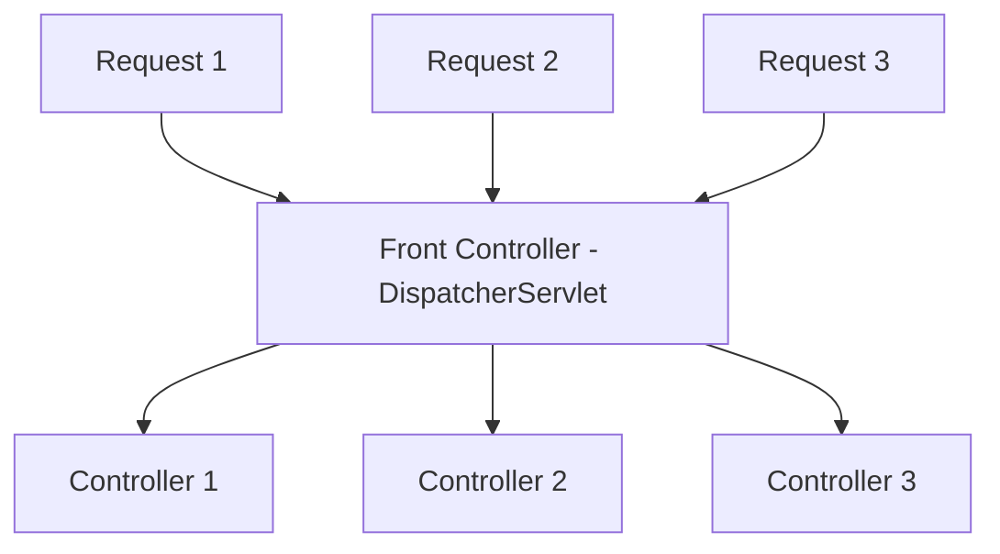

# Sessions 14-17: Spring Framework

## What is Spring Framework?

**Spring** is a comprehensive framework for building enterprise Java applications. It provides infrastructure support, allowing developers to focus on business logic.

### Spring Features
- **Lightweight** - Minimal overhead
- **Inversion of Control (IoC)** - Framework manages object lifecycle
- **Dependency Injection (DI)** - Loose coupling between components
- **Aspect-Oriented Programming (AOP)** - Separation of cross-cutting concerns
- **Modular** - Use only what you need

---

## Spring Architecture



### Spring Modules

| Module | Purpose |
|--------|---------|
| **Core** | IoC container, DI fundamentals |
| **Beans** | Bean factory, bean lifecycle |
| **Context** | ApplicationContext, i18n, events |
| **SpEL** | Spring Expression Language |
| **AOP** | Aspect-oriented programming |
| **JDBC** | JDBC abstraction layer |
| **ORM** | Hibernate, JPA integration |
| **Web MVC** | Web application framework |
| **Security** | Authentication, authorization |
| **Test** | Testing support |

---

## Inversion of Control (IoC)

**IoC** is a design principle where the framework controls object creation and lifecycle, not the application code.

### Traditional vs IoC



| Traditional | IoC |
|------------|-----|
| Class creates its dependencies | Container creates dependencies |
| Tight coupling | Loose coupling |
| Hard to test | Easy to mock and test |
| Class controls flow | Framework controls flow |

---

## Dependency Injection (DI)

**DI** is a pattern for implementing IoC where dependencies are "injected" into objects rather than created by them.

### DI Types

| Type | Description | Annotation |
|------|-------------|------------|
| **Constructor Injection** | Dependencies via constructor | `@Autowired` on constructor |
| **Setter Injection** | Dependencies via setter methods | `@Autowired` on setter |
| **Field Injection** | Dependencies injected directly | `@Autowired` on field |

```java
// Constructor Injection (Recommended)
@Component
public class UserService {
    private final UserRepository repository;
    
    @Autowired  // Optional in Spring 4.3+ with single constructor
    public UserService(UserRepository repository) {
        this.repository = repository;
    }
}

// Setter Injection
@Component
public class UserService {
    private UserRepository repository;
    
    @Autowired
    public void setRepository(UserRepository repository) {
        this.repository = repository;
    }
}

// Field Injection (Not recommended)
@Component
public class UserService {
    @Autowired
    private UserRepository repository;
}
```

### Why Constructor Injection is Preferred

| Reason | Explanation |
|--------|-------------|
| **Immutability** | Fields can be final |
| **Required dependencies** | All deps required at creation |
| **Testability** | Easy to pass mocks |
| **No reflection** | Works without Spring context |

---

## IoC Container

The Spring container creates, configures, and manages beans.

### Container Types

| Container | Interface | Description |
|-----------|-----------|-------------|
| **BeanFactory** | BeanFactory | Basic container, lazy initialization |
| **ApplicationContext** | ApplicationContext | Advanced container, eager, i18n, events |



### ApplicationContext Implementations

| Implementation | Configuration Source |
|----------------|---------------------|
| `ClassPathXmlApplicationContext` | XML from classpath |
| `FileSystemXmlApplicationContext` | XML from file system |
| `AnnotationConfigApplicationContext` | Java-based config |
| `WebApplicationContext` | Web application |

---

## Spring Beans

A **Bean** is an object managed by the Spring IoC container.

### Bean Definition Approaches

| Approach | Annotation/Config |
|----------|-------------------|
| **Component Scanning** | `@Component`, `@Service`, `@Repository`, `@Controller` |
| **Java Config** | `@Configuration` + `@Bean` |
| **XML Config** | `<bean>` elements |

### Stereotype Annotations

| Annotation | Layer | Purpose |
|------------|-------|---------|
| `@Component` | Generic | General-purpose bean |
| `@Service` | Service | Business logic |
| `@Repository` | DAO | Data access, exception translation |
| `@Controller` | Web | HTTP request handling |

```java
@Component
public class GenericComponent { }

@Service
public class UserService { }

@Repository
public class UserRepository { }

@Controller
public class UserController { }
```

### Java-Based Configuration

```java
@Configuration
public class AppConfig {
    
    @Bean
    public UserRepository userRepository() {
        return new UserRepositoryImpl();
    }
    
    @Bean
    public UserService userService() {
        return new UserService(userRepository());
    }
}
```

---

## Bean Scopes

| Scope | Description | Default |
|-------|-------------|---------|
| **singleton** | One instance per container | Yes |
| **prototype** | New instance each request | No |
| **request** | One per HTTP request (web) | No |
| **session** | One per HTTP session (web) | No |
| **application** | One per ServletContext (web) | No |

```java
@Component
@Scope("prototype")
public class PrototypeBean { }

@Component
@Scope(value = WebApplicationContext.SCOPE_REQUEST, proxyMode = ScopedProxyMode.TARGET_CLASS)
public class RequestScopedBean { }
```

### Singleton vs Prototype

| Feature | Singleton | Prototype |
|---------|-----------|-----------|
| **Instances** | One per container | New each time |
| **Stateful?** | Should be stateless | Can be stateful |
| **Performance** | Better (cached) | Overhead of creation |
| **Destruction** | Container manages | Client manages |

---

## Autowiring

Spring automatically resolves and injects dependencies.

### Autowiring Modes

| Mode | Description |
|------|-------------|
| **byType** | Match by bean type (default with @Autowired) |
| **byName** | Match by bean name |
| **constructor** | Match constructor parameters |
| **no** | No autowiring |

### @Autowired Qualifiers

```java
public interface MessageService { }

@Component("emailService")
public class EmailService implements MessageService { }

@Component("smsService")
public class SMSService implements MessageService { }

@Component
public class NotificationService {
    @Autowired
    @Qualifier("emailService")  // Specify which bean
    private MessageService messageService;
}
```

### @Primary Annotation

```java
@Component
@Primary  // Default when multiple candidates
public class EmailService implements MessageService { }
```

---

## Spring MVC Architecture



### MVC Components

| Component | Description |
|-----------|-------------|
| **DispatcherServlet** | Front controller, routes all requests |
| **HandlerMapping** | Maps URLs to controllers |
| **Controller** | Handles requests, returns model+view |
| **ViewResolver** | Resolves view names to actual views |
| **View** | Renders model data (JSP, Thymeleaf) |

---

## Front Controller Pattern

**DispatcherServlet** implements the Front Controller pattern - single entry point for all requests.



### Benefits

| Benefit | Description |
|---------|-------------|
| **Centralized Control** | Single entry point |
| **Common Processing** | Security, logging in one place |
| **Consistent Handling** | Uniform request processing |

---

## Spring MVC Controller

```java
@Controller
@RequestMapping("/users")
public class UserController {
    
    @Autowired
    private UserService userService;
    
    // GET /users
    @GetMapping
    public String listUsers(Model model) {
        model.addAttribute("users", userService.findAll());
        return "userList";  // View name
    }
    
    // GET /users/{id}
    @GetMapping("/{id}")
    public String getUser(@PathVariable Long id, Model model) {
        model.addAttribute("user", userService.findById(id));
        return "userDetail";
    }
    
    // GET /users/new
    @GetMapping("/new")
    public String showForm(Model model) {
        model.addAttribute("user", new User());
        return "userForm";
    }
    
    // POST /users
    @PostMapping
    public String saveUser(@ModelAttribute User user) {
        userService.save(user);
        return "redirect:/users";
    }
}
```

### Common Annotations

| Annotation | Purpose |
|------------|---------|
| `@Controller` | Marks as web controller |
| `@RequestMapping` | Base URL mapping |
| `@GetMapping` | Handle GET requests |
| `@PostMapping` | Handle POST requests |
| `@PathVariable` | Extract URL path variable |
| `@RequestParam` | Extract query parameter |
| `@ModelAttribute` | Bind form data to object |
| `@ResponseBody` | Return data (not view) |

---

## Model, ModelAndView, ModelMap

| Component | Description |
|-----------|-------------|
| **Model** | Interface to add attributes |
| **ModelMap** | LinkedHashMap implementation |
| **ModelAndView** | Combines model and view name |

```java
// Using Model
@GetMapping("/users")
public String list(Model model) {
    model.addAttribute("users", userService.findAll());
    return "userList";
}

// Using ModelAndView
@GetMapping("/users")
public ModelAndView list() {
    ModelAndView mav = new ModelAndView("userList");
    mav.addObject("users", userService.findAll());
    return mav;
}
```

---

## ViewResolver

Resolves logical view names to actual view files.

```java
@Configuration
public class WebConfig {
    
    @Bean
    public ViewResolver viewResolver() {
        InternalResourceViewResolver resolver = new InternalResourceViewResolver();
        resolver.setPrefix("/WEB-INF/views/");
        resolver.setSuffix(".jsp");
        return resolver;
    }
}
```

| View Name | Resolved Path |
|-----------|---------------|
| "userList" | /WEB-INF/views/userList.jsp |
| "home" | /WEB-INF/views/home.jsp |

---

## Thymeleaf Introduction

**Thymeleaf** is a modern template engine for Spring (alternative to JSP).

### Features

| Feature | Description |
|---------|-------------|
| **Natural Templates** | Valid HTML without server |
| **Spring Integration** | Seamless Spring MVC support |
| **Expression Language** | Powerful expressions |
| **Layout Support** | Template inheritance |

### Basic Syntax

```html
<!DOCTYPE html>
<html xmlns:th="http://www.thymeleaf.org">
<head>
    <title th:text="${title}">Default Title</title>
</head>
<body>
    <h1 th:text="${message}">Welcome</h1>
    
    <!-- Iteration -->
    <ul>
        <li th:each="user : ${users}" th:text="${user.name}">User</li>
    </ul>
    
    <!-- Conditionals -->
    <div th:if="${user != null}">
        Welcome, <span th:text="${user.name}">Guest</span>
    </div>
    
    <!-- Forms -->
    <form th:action="@{/users}" th:object="${user}" method="post">
        <input type="text" th:field="*{name}" />
        <input type="email" th:field="*{email}" />
        <button type="submit">Submit</button>
    </form>
</body>
</html>
```

---

## Spring Validations

```java
public class User {
    @NotNull(message = "Name is required")
    @Size(min = 2, max = 50)
    private String name;
    
    @Email(message = "Invalid email")
    @NotBlank
    private String email;
    
    @Min(18)
    @Max(100)
    private int age;
}

@Controller
public class UserController {
    
    @PostMapping("/users")
    public String saveUser(@Valid @ModelAttribute User user, 
                          BindingResult result) {
        if (result.hasErrors()) {
            return "userForm";  // Show form with errors
        }
        userService.save(user);
        return "redirect:/users";
    }
}
```

### Validation Annotations

| Annotation | Purpose |
|------------|---------|
| `@NotNull` | Not null |
| `@NotBlank` | Not null, not blank |
| `@NotEmpty` | Not null, not empty |
| `@Size(min, max)` | String/collection size |
| `@Min`, `@Max` | Numeric bounds |
| `@Email` | Valid email format |
| `@Pattern` | Regex pattern |
| `@Valid` | Trigger validation |

---

## Spring i18n & Localization

```java
@Configuration
public class I18nConfig {
    
    @Bean
    public MessageSource messageSource() {
        ResourceBundleMessageSource source = new ResourceBundleMessageSource();
        source.setBasename("messages");
        source.setDefaultEncoding("UTF-8");
        return source;
    }
    
    @Bean
    public LocaleResolver localeResolver() {
        SessionLocaleResolver resolver = new SessionLocaleResolver();
        resolver.setDefaultLocale(Locale.US);
        return resolver;
    }
}
```

### Message Properties

```properties
# messages_en.properties
welcome.message=Welcome to our application!

# messages_fr.properties
welcome.message=Bienvenue dans notre application!
```


---

## File Upload

Spring MVC makes it easy to handle file uploads using `MultipartFile` interface.

### 1. Configuration

**StandardServletMultipartResolver** is used (Servlet 3.0+).

```java
@Configuration
public class AppConfig {
    @Bean
    public MultipartResolver multipartResolver() {
        return new StandardServletMultipartResolver();
    }
}
```

In `application.properties` (Spring Boot):
```properties
spring.servlet.multipart.enabled=true
spring.servlet.multipart.max-file-size=10MB
spring.servlet.multipart.max-request-size=10MB
```

### 2. Controller

```java
@Controller
public class FileUploadController {

    @PostMapping("/upload")
    public String handleFileUpload(@RequestParam("file") MultipartFile file,
                                   RedirectAttributes redirectAttributes) {

        if (file.isEmpty()) {
            redirectAttributes.addFlashAttribute("message", "Please select a file");
            return "redirect:uploadStatus";
        }

        try {
            // Get original filename
            String fileName = file.getOriginalFilename();
            
            // Save file to disk
            byte[] bytes = file.getBytes();
            Path path = Paths.get("uploads/" + fileName);
            Files.write(path, bytes);
            
            redirectAttributes.addFlashAttribute("message", 
                "You successfully uploaded " + fileName + " (" + file.getSize() + " bytes)");
            
        } catch (IOException e) {
            e.printStackTrace();
        }

        return "redirect:/uploadStatus";
    }
}
```

### 3. HTML Form

Form must have `enctype="multipart/form-data"`.

```html
<form method="POST" action="/upload" enctype="multipart/form-data">
    <input type="file" name="file" /><br/><br/>
    <input type="submit" value="Upload" />
</form>
```

### MultipartFile Methods

| Method | Description |
|--------|-------------|
| `getOriginalFilename()` | Original name on client's filesystem |
| `getSize()` | Size in bytes |
| `getContentType()` | MIME type (e.g., image/jpeg) |
| `isEmpty()` | Check if file is empty |
| `getBytes()` | Get file contents as byte array |
| `getInputStream()` | Get input stream for reading |
| `transferTo(File dest)` | Save file to destination |

---

## Key MCQ Points to Remember

1. **IoC** = Inversion of Control - framework controls object lifecycle
2. **DI** = Dependency Injection - dependencies provided externally
3. **Spring container** manages bean lifecycle
4. **@Component** is generic, **@Service** for business, **@Repository** for DAO
5. **ApplicationContext** is preferred over BeanFactory
6. **singleton** is the default bean scope
7. **prototype** scope creates new instance each time
8. **@Autowired** injects dependencies by type
9. **@Qualifier** selects specific bean when multiple candidates
10. **@Primary** marks default bean for type
11. **DispatcherServlet** is the front controller
12. **HandlerMapping** maps URLs to controllers
13. **ViewResolver** resolves view names to actual views
14. **@Controller** + **@ResponseBody** = **@RestController**
15. **@GetMapping** = **@RequestMapping(method=GET)**
16. **@PathVariable** extracts from URL path
17. **@RequestParam** extracts from query string
18. **Model.addAttribute()** passes data to view
19. **@Valid** triggers bean validation
20. **Constructor injection** is preferred over field injection
