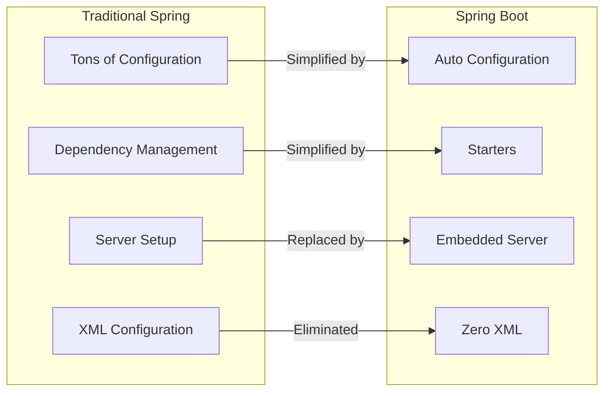
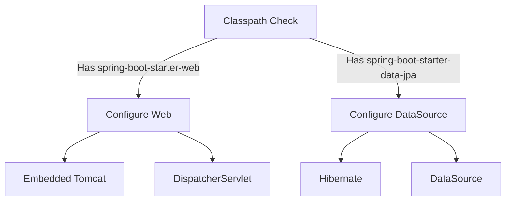

# Sessions 18-20: Spring Boot

## What is Spring Boot?

**Spring Boot** is a framework that simplifies Spring application development by providing auto-configuration, embedded servers, and opinionated defaults.

### Spring vs Spring Boot

| Feature | Spring | Spring Boot |
|---------|--------|-------------|
| **Configuration** | Manual, extensive | Auto-configuration |
| **Server** | External (Tomcat, etc.) | Embedded server |
| **Dependencies** | Manual management | Starter POMs |
| **Setup Time** | Longer | Quick start |
| **XML Config** | Often required | Minimal/none |
| **Deployment** | WAR file | JAR (executable) |

---

## Why Spring Boot?



### Key Benefits

| Benefit | Description |
|---------|-------------|
| **Auto-configuration** | Automatically configures based on classpath |
| **Starter Dependencies** | Pre-bundled dependency sets |
| **Embedded Servers** | Tomcat, Jetty, Undertow included |
| **Production-ready** | Metrics, health checks out of box |
| **No Code Generation** | No XML or generated code |

---

## Maven Basics

**Maven** is a build tool that manages dependencies and project lifecycle.

### Project Structure
```
my-project/
├── pom.xml                 # Project Object Model
├── src/
│   ├── main/
│   │   ├── java/          # Java source code
│   │   └── resources/     # Config files (application.properties)
│   └── test/
│       └── java/          # Test classes
└── target/                # Compiled output
```

### pom.xml Structure

```xml
<?xml version="1.0" encoding="UTF-8"?>
<project xmlns="http://maven.apache.org/POM/4.0.0">
    <modelVersion>4.0.0</modelVersion>
    
    <!-- Project coordinates -->
    <groupId>com.example</groupId>
    <artifactId>my-app</artifactId>
    <version>1.0.0</version>
    <packaging>jar</packaging>
    
    <!-- Parent POM (Spring Boot) -->
    <parent>
        <groupId>org.springframework.boot</groupId>
        <artifactId>spring-boot-starter-parent</artifactId>
        <version>3.2.0</version>
    </parent>
    
    <!-- Dependencies -->
    <dependencies>
        <dependency>
            <groupId>org.springframework.boot</groupId>
            <artifactId>spring-boot-starter-web</artifactId>
        </dependency>
    </dependencies>
    
    <!-- Build plugins -->
    <build>
        <plugins>
            <plugin>
                <groupId>org.springframework.boot</groupId>
                <artifactId>spring-boot-maven-plugin</artifactId>
            </plugin>
        </plugins>
    </build>
</project>
```

### Maven Lifecycle

| Phase | Description |
|-------|-------------|
| `validate` | Validate project structure |
| `compile` | Compile source code |
| `test` | Run unit tests |
| `package` | Create JAR/WAR |
| `install` | Install to local repository |
| `deploy` | Deploy to remote repository |

### Common Maven Commands

| Command | Description |
|---------|-------------|
| `mvn clean` | Delete target directory |
| `mvn compile` | Compile source code |
| `mvn test` | Run tests |
| `mvn package` | Create JAR/WAR |
| `mvn spring-boot:run` | Run Spring Boot app |

---

## Spring Boot Starters

**Starters** are convenient dependency descriptors that bundle related dependencies.

| Starter | Purpose |
|---------|---------|
| `spring-boot-starter` | Core starter with auto-config |
| `spring-boot-starter-web` | Web application (REST, MVC) |
| `spring-boot-starter-data-jpa` | JPA with Hibernate |
| `spring-boot-starter-security` | Spring Security |
| `spring-boot-starter-test` | Testing libraries |
| `spring-boot-starter-thymeleaf` | Thymeleaf templates |
| `spring-boot-starter-actuator` | Production monitoring |
| `spring-boot-starter-validation` | Bean validation |

```xml
<!-- All you need for a web app -->
<dependency>
    <groupId>org.springframework.boot</groupId>
    <artifactId>spring-boot-starter-web</artifactId>
</dependency>
```

---

## Spring Boot Application

### Main Class

```java
@SpringBootApplication
public class MyApplication {
    public static void main(String[] args) {
        SpringApplication.run(MyApplication.class, args);
    }
}
```

### @SpringBootApplication

This annotation combines three annotations:

| Annotation | Purpose |
|------------|---------|
| `@Configuration` | Java-based configuration |
| `@EnableAutoConfiguration` | Enable auto-configuration |
| `@ComponentScan` | Scan for components in package |

```mermaid
flowchart TB
    SBA[@SpringBootApplication]
    SBA --> C[@Configuration]
    SBA --> EAC[@EnableAutoConfiguration]
    SBA --> CS[@ComponentScan]
```

---

## Auto-Configuration

Spring Boot automatically configures beans based on:
- Classpath dependencies
- Defined beans
- Property settings

### How it Works



### Conditional Annotations

| Annotation | Condition |
|------------|-----------|
| `@ConditionalOnClass` | Class exists on classpath |
| `@ConditionalOnMissingBean` | No existing bean of type |
| `@ConditionalOnProperty` | Property has specific value |
| `@ConditionalOnWebApplication` | Is a web application |

---

## application.properties / application.yml

Configuration file for Spring Boot applications.

### application.properties

```properties
# Server configuration
server.port=8080
server.servlet.context-path=/api

# Database
spring.datasource.url=jdbc:mysql://localhost:3306/mydb
spring.datasource.username=root
spring.datasource.password=secret
spring.datasource.driver-class-name=com.mysql.cj.jdbc.Driver

# JPA/Hibernate
spring.jpa.hibernate.ddl-auto=update
spring.jpa.show-sql=true
spring.jpa.properties.hibernate.format_sql=true

# Logging
logging.level.root=INFO
logging.level.com.example=DEBUG

# Custom properties
app.name=My Application
app.version=1.0.0
```

### application.yml

```yaml
server:
  port: 8080
  servlet:
    context-path: /api

spring:
  datasource:
    url: jdbc:mysql://localhost:3306/mydb
    username: root
    password: secret
  jpa:
    hibernate:
      ddl-auto: update
    show-sql: true

logging:
  level:
    root: INFO
    com.example: DEBUG
```

### Property Profiles

```properties
# application.properties (default)
spring.profiles.active=dev

# application-dev.properties
server.port=8080
spring.datasource.url=jdbc:mysql://localhost:3306/devdb

# application-prod.properties
server.port=80
spring.datasource.url=jdbc:mysql://prod-server:3306/proddb
```

---

## Embedded Server

Spring Boot includes embedded web servers.

| Server | Description |
|--------|-------------|
| **Tomcat** | Default, most common |
| **Jetty** | Lightweight alternative |
| **Undertow** | High performance |

### Switching Servers

```xml
<!-- Exclude Tomcat -->
<dependency>
    <groupId>org.springframework.boot</groupId>
    <artifactId>spring-boot-starter-web</artifactId>
    <exclusions>
        <exclusion>
            <groupId>org.springframework.boot</groupId>
            <artifactId>spring-boot-starter-tomcat</artifactId>
        </exclusion>
    </exclusions>
</dependency>

<!-- Include Jetty -->
<dependency>
    <groupId>org.springframework.boot</groupId>
    <artifactId>spring-boot-starter-jetty</artifactId>
</dependency>
```

---

## Spring Boot Web Application

### Project Structure

```
src/main/
├── java/com/example/
│   ├── MyApplication.java
│   ├── controller/
│   │   └── ProductController.java
│   ├── service/
│   │   └── ProductService.java
│   ├── repository/
│   │   └── ProductRepository.java
│   └── model/
│       └── Product.java
└── resources/
    ├── application.properties
    ├── static/         # CSS, JS, images
    └── templates/      # Thymeleaf templates
```

### Controller Example

```java
@Controller
@RequestMapping("/products")
public class ProductController {
    
    @Autowired
    private ProductService productService;
    
    @GetMapping
    public String list(Model model) {
        model.addAttribute("products", productService.findAll());
        return "products/list";
    }
    
    @GetMapping("/new")
    public String showForm(Model model) {
        model.addAttribute("product", new Product());
        return "products/form";
    }
    
    @PostMapping
    public String save(@Valid @ModelAttribute Product product,
                      BindingResult result) {
        if (result.hasErrors()) {
            return "products/form";
        }
        productService.save(product);
        return "redirect:/products";
    }
    
    @GetMapping("/{id}/edit")
    public String edit(@PathVariable Long id, Model model) {
        model.addAttribute("product", productService.findById(id));
        return "products/form";
    }
    
    @GetMapping("/{id}/delete")
    public String delete(@PathVariable Long id) {
        productService.delete(id);
        return "redirect:/products";
    }
}
```

### Thymeleaf Template

```html
<!DOCTYPE html>
<html xmlns:th="http://www.thymeleaf.org">
<head>
    <title>Products</title>
    <link rel="stylesheet" th:href="@{/css/style.css}"/>
</head>
<body>
    <h1>Product List</h1>
    <a th:href="@{/products/new}">Add New Product</a>
    
    <table>
        <thead>
            <tr>
                <th>ID</th>
                <th>Name</th>
                <th>Price</th>
                <th>Actions</th>
            </tr>
        </thead>
        <tbody>
            <tr th:each="product : ${products}">
                <td th:text="${product.id}"></td>
                <td th:text="${product.name}"></td>
                <td th:text="${product.price}"></td>
                <td>
                    <a th:href="@{/products/{id}/edit(id=${product.id})}">Edit</a>
                    <a th:href="@{/products/{id}/delete(id=${product.id})}">Delete</a>
                </td>
            </tr>
        </tbody>
    </table>
</body>
</html>
```

---

## CRUD Operations (Static Data)

```java
@Service
public class ProductService {
    
    private List<Product> products = new ArrayList<>();
    private Long idCounter = 1L;
    
    public ProductService() {
        // Initialize with sample data
        products.add(new Product(idCounter++, "Laptop", 999.99));
        products.add(new Product(idCounter++, "Phone", 699.99));
    }
    
    public List<Product> findAll() {
        return new ArrayList<>(products);
    }
    
    public Product findById(Long id) {
        return products.stream()
            .filter(p -> p.getId().equals(id))
            .findFirst()
            .orElse(null);
    }
    
    public void save(Product product) {
        if (product.getId() == null) {
            product.setId(idCounter++);
            products.add(product);
        } else {
            delete(product.getId());
            products.add(product);
        }
    }
    
    public void delete(Long id) {
        products.removeIf(p -> p.getId().equals(id));
    }
}
```

---

## Running Spring Boot Application

| Method | Command/Action |
|--------|----------------|
| **From IDE** | Run main() method |
| **Maven** | `mvn spring-boot:run` |
| **JAR** | `java -jar app.jar` |
| **With Profile** | `java -jar app.jar --spring.profiles.active=prod` |

---

## Key MCQ Points to Remember

1. **Spring Boot** simplifies Spring application development
2. **@SpringBootApplication** = @Configuration + @EnableAutoConfiguration + @ComponentScan
3. **Auto-configuration** configures beans based on classpath
4. **Starters** are pre-bundled dependency sets
5. **spring-boot-starter-web** includes Tomcat and Spring MVC
6. **Tomcat** is the default embedded server
7. **application.properties** is the main config file
8. **application.yml** is YAML alternative to properties
9. **Maven** manages dependencies and build lifecycle
10. **pom.xml** is the Maven project file
11. **groupId + artifactId + version** = Maven coordinates
12. **mvn spring-boot:run** runs the application
13. **java -jar app.jar** runs packaged application
14. **@Value("${property}")** injects property values
15. **spring.profiles.active** sets active profile
16. **server.port** configures server port
17. **spring.jpa.hibernate.ddl-auto=update** auto-updates schema
18. **Static files** go in src/main/resources/static/
19. **Thymeleaf templates** go in src/main/resources/templates/
20. **DevTools** provides hot reload during development
