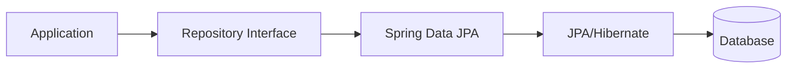
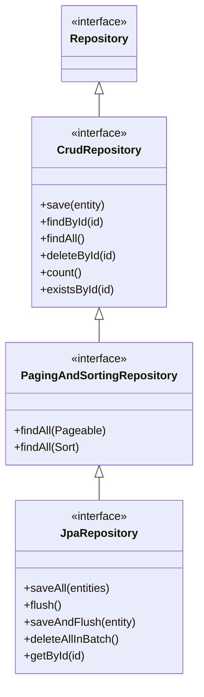

# Sessions 21-22: Spring Data JPA

## What is Spring Data JPA?

**Spring Data JPA** is a module that simplifies data access by reducing boilerplate code. It provides repository abstractions that automatically implement common CRUD operations.



---

## JPA vs Spring Data JPA

| Feature | JPA/Hibernate | Spring Data JPA |
|---------|--------------|-----------------|
| **CRUD Implementation** | Write manually | Auto-generated |
| **Boilerplate Code** | Lots | Minimal |
| **Query Methods** | HQL/JPQL required | Method naming conventions |
| **Pagination** | Manual | Built-in |
| **Custom Queries** | @NamedQuery | @Query annotation |

---

## Repository Hierarchy



### Repository Interfaces

| Interface | Features |
|-----------|----------|
| **Repository** | Marker interface |
| **CrudRepository** | Basic CRUD operations |
| **PagingAndSortingRepository** | CRUD + Pagination + Sorting |
| **JpaRepository** | Full JPA support + batch operations |

---

## CrudRepository Methods

| Method | Description |
|--------|-------------|
| `save(S entity)` | Save/update entity |
| `saveAll(Iterable<S>)` | Save multiple entities |
| `findById(ID id)` | Find by primary key |
| `existsById(ID id)` | Check if exists |
| `findAll()` | Get all entities |
| `findAllById(Iterable<ID>)` | Find by multiple IDs |
| `count()` | Count all entities |
| `deleteById(ID id)` | Delete by ID |
| `delete(S entity)` | Delete entity |
| `deleteAll()` | Delete all entities |

---

## JpaRepository Additional Methods

| Method | Description |
|--------|-------------|
| `flush()` | Flush changes to database |
| `saveAndFlush(S entity)` | Save and immediately flush |
| `deleteAllInBatch()` | Delete all in single query |
| `deleteAllByIdInBatch(Iterable<ID>)` | Batch delete by IDs |
| `getById(ID id)` | Get reference (lazy) |
| `getReferenceById(ID id)` | Same as getById |

---

## Setting Up Spring Data JPA

### Dependencies (pom.xml)

```xml
<dependency>
    <groupId>org.springframework.boot</groupId>
    <artifactId>spring-boot-starter-data-jpa</artifactId>
</dependency>

<dependency>
    <groupId>mysql</groupId>
    <artifactId>mysql-connector-java</artifactId>
    <scope>runtime</scope>
</dependency>
```

### application.properties

```properties
spring.datasource.url=jdbc:mysql://localhost:3306/mydb
spring.datasource.username=root
spring.datasource.password=secret
spring.datasource.driver-class-name=com.mysql.cj.jdbc.Driver

spring.jpa.hibernate.ddl-auto=update
spring.jpa.show-sql=true
spring.jpa.properties.hibernate.format_sql=true
spring.jpa.properties.hibernate.dialect=org.hibernate.dialect.MySQL8Dialect
```

---

## Entity Class

```java
import javax.persistence.*;

@Entity
@Table(name = "products")
public class Product {
    
    @Id
    @GeneratedValue(strategy = GenerationType.IDENTITY)
    private Long id;
    
    @Column(nullable = false, length = 100)
    private String name;
    
    @Column(nullable = false)
    private Double price;
    
    @Column(length = 500)
    private String description;
    
    // Constructors, getters, setters
}
```

---

## Repository Interface

```java
import org.springframework.data.jpa.repository.JpaRepository;
import org.springframework.stereotype.Repository;

@Repository
public interface ProductRepository extends JpaRepository<Product, Long> {
    // That's it! CRUD methods are automatically available
}
```

---

## Using Repository

```java
@Service
public class ProductService {
    
    @Autowired
    private ProductRepository productRepository;
    
    // Create
    public Product save(Product product) {
        return productRepository.save(product);
    }
    
    // Read
    public List<Product> findAll() {
        return productRepository.findAll();
    }
    
    public Optional<Product> findById(Long id) {
        return productRepository.findById(id);
    }
    
    // Update (save with existing ID)
    public Product update(Product product) {
        return productRepository.save(product);
    }
    
    // Delete
    public void delete(Long id) {
        productRepository.deleteById(id);
    }
    
    // Count
    public long count() {
        return productRepository.count();
    }
    
    // Exists
    public boolean exists(Long id) {
        return productRepository.existsById(id);
    }
}
```

---

## Query Methods (Derived Queries)

Spring Data JPA creates queries from method names automatically.

### Naming Conventions

| Keyword | Example | SQL Equivalent |
|---------|---------|----------------|
| `findBy` | `findByName(String name)` | `WHERE name = ?` |
| `findAllBy` | `findAllByCategory(String c)` | `WHERE category = ?` |
| `And` | `findByNameAndPrice(n, p)` | `WHERE name = ? AND price = ?` |
| `Or` | `findByNameOrDescription(n, d)` | `WHERE name = ? OR desc = ?` |
| `Between` | `findByPriceBetween(min, max)` | `WHERE price BETWEEN ? AND ?` |
| `LessThan` | `findByPriceLessThan(price)` | `WHERE price < ?` |
| `GreaterThan` | `findByPriceGreaterThan(p)` | `WHERE price > ?` |
| `Like` | `findByNameLike(pattern)` | `WHERE name LIKE ?` |
| `Containing` | `findByNameContaining(s)` | `WHERE name LIKE %?%` |
| `StartingWith` | `findByNameStartingWith(s)` | `WHERE name LIKE ?%` |
| `EndingWith` | `findByNameEndingWith(s)` | `WHERE name LIKE %?` |
| `OrderBy` | `findByNameOrderByPriceAsc()` | `ORDER BY price ASC` |
| `IsNull` | `findByDescriptionIsNull()` | `WHERE desc IS NULL` |
| `IsNotNull` | `findByDescriptionIsNotNull()` | `WHERE desc IS NOT NULL` |
| `In` | `findByIdIn(List<Long> ids)` | `WHERE id IN (...)` |
| `Not` | `findByNameNot(name)` | `WHERE name != ?` |
| `True/False` | `findByActiveTrue()` | `WHERE active = true` |

### Query Method Examples

```java
@Repository
public interface ProductRepository extends JpaRepository<Product, Long> {
    
    // Find by single field
    List<Product> findByName(String name);
    
    // Find by multiple fields
    List<Product> findByNameAndCategory(String name, String category);
    
    // Comparison
    List<Product> findByPriceGreaterThan(Double price);
    List<Product> findByPriceBetween(Double min, Double max);
    
    // String matching
    List<Product> findByNameContaining(String keyword);
    List<Product> findByNameStartingWith(String prefix);
    
    // Ordering
    List<Product> findByNameOrderByPriceDesc(String name);
    
    // Limiting results
    List<Product> findTop5ByOrderByPriceDesc();
    Product findFirstByOrderByCreatedAtDesc();
    
    // Counting
    long countByCategory(String category);
    
    // Exists
    boolean existsByName(String name);
    
    // Delete
    void deleteByName(String name);
}
```

---

## Custom Queries with @Query

### JPQL Queries

```java
@Repository
public interface ProductRepository extends JpaRepository<Product, Long> {
    
    // JPQL - uses entity/property names
    @Query("SELECT p FROM Product p WHERE p.price > :price")
    List<Product> findExpensiveProducts(@Param("price") Double price);
    
    @Query("SELECT p FROM Product p WHERE p.name LIKE %:keyword%")
    List<Product> searchByName(@Param("keyword") String keyword);
    
    @Query("SELECT p FROM Product p ORDER BY p.price DESC")
    List<Product> findAllOrderByPriceDesc();
    
    // Using indexed parameters
    @Query("SELECT p FROM Product p WHERE p.category = ?1 AND p.price < ?2")
    List<Product> findByCategoryAndMaxPrice(String category, Double maxPrice);
}
```

### Native SQL Queries

```java
@Repository
public interface ProductRepository extends JpaRepository<Product, Long> {
    
    // Native SQL - uses table/column names
    @Query(value = "SELECT * FROM products WHERE price > :price", nativeQuery = true)
    List<Product> findExpensiveProductsNative(@Param("price") Double price);
    
    @Query(value = "SELECT * FROM products ORDER BY created_at DESC LIMIT 10", 
           nativeQuery = true)
    List<Product> findLatest10Products();
}
```

### Modifying Queries

```java
@Repository
public interface ProductRepository extends JpaRepository<Product, Long> {
    
    @Modifying
    @Transactional
    @Query("UPDATE Product p SET p.price = p.price * 1.1 WHERE p.category = :category")
    int increasePriceByCategory(@Param("category") String category);
    
    @Modifying
    @Transactional
    @Query("DELETE FROM Product p WHERE p.price < :minPrice")
    int deleteCheapProducts(@Param("minPrice") Double minPrice);
}
```

---

## Pagination and Sorting

### Pageable

```java
// Repository
Page<Product> findByCategory(String category, Pageable pageable);

// Usage
Pageable pageable = PageRequest.of(0, 10);  // page 0, size 10
Page<Product> page = productRepository.findByCategory("Electronics", pageable);

// Page methods
List<Product> content = page.getContent();
int totalPages = page.getTotalPages();
long totalElements = page.getTotalElements();
int currentPage = page.getNumber();
boolean hasNext = page.hasNext();
boolean hasPrevious = page.hasPrevious();
```

### Sorting

```java
// Simple sort
Sort sort = Sort.by("price").descending();
List<Product> products = productRepository.findAll(sort);

// Multiple sort criteria
Sort sort = Sort.by(
    Sort.Order.desc("category"),
    Sort.Order.asc("price")
);

// Combined with pagination
Pageable pageable = PageRequest.of(0, 10, Sort.by("price").descending());
Page<Product> page = productRepository.findAll(pageable);
```

---

## Relationships with Spring Data JPA

```java
// One-to-Many
@Entity
public class Category {
    @Id
    @GeneratedValue(strategy = GenerationType.IDENTITY)
    private Long id;
    private String name;
    
    @OneToMany(mappedBy = "category", cascade = CascadeType.ALL)
    private List<Product> products = new ArrayList<>();
}

@Entity
public class Product {
    @Id
    @GeneratedValue(strategy = GenerationType.IDENTITY)
    private Long id;
    private String name;
    
    @ManyToOne
    @JoinColumn(name = "category_id")
    private Category category;
}

// Repository with join query
@Query("SELECT p FROM Product p JOIN p.category c WHERE c.name = :categoryName")
List<Product> findByCategoryName(@Param("categoryName") String categoryName);
```

---

## Key MCQ Points to Remember

1. **Spring Data JPA** reduces boilerplate for data access
2. **JpaRepository** extends CrudRepository and PagingAndSortingRepository
3. **CrudRepository** provides basic CRUD operations
4. **Repository interface** is a marker interface
5. **@Repository** annotation marks data access layer
6. **findById()** returns **Optional<T>**
7. **Query methods** are derived from method names
8. **findByNameContaining** = LIKE %keyword%
9. **@Query** annotation for custom JPQL/SQL
10. **nativeQuery = true** for raw SQL
11. **@Modifying** required for UPDATE/DELETE queries
12. **@Transactional** needed with @Modifying
13. **PageRequest.of(page, size)** creates Pageable
14. **Page.getContent()** returns the list of results
15. **Sort.by("field").descending()** for sorting
16. **findTop5By...** limits results to 5
17. **existsBy...** methods return boolean
18. **countBy...** methods return long
19. **deleteBy...** requires @Transactional
20. **save()** handles both INSERT and UPDATE
