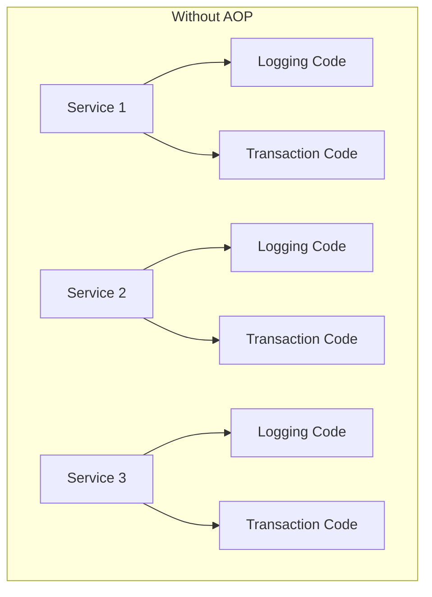
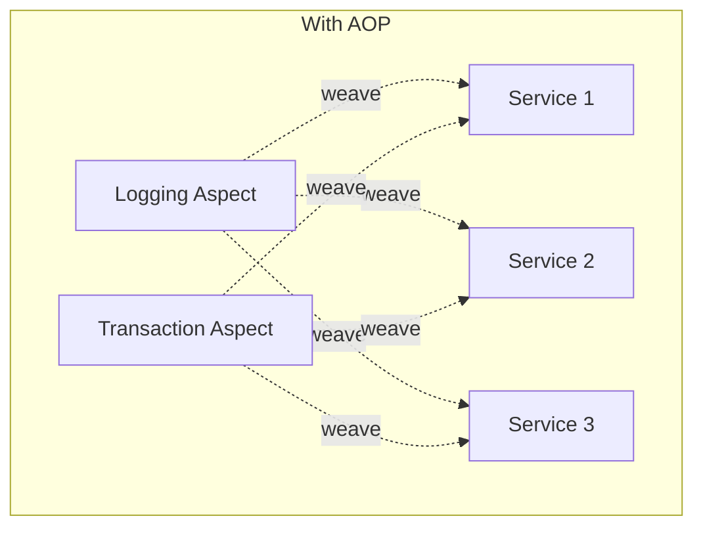
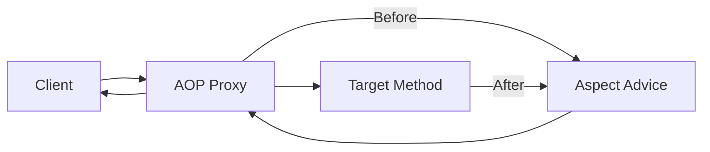
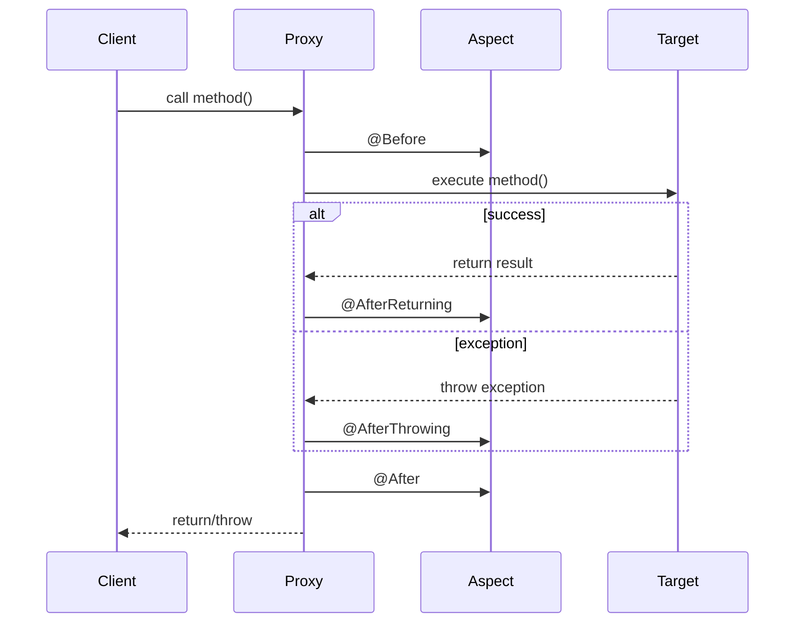

# Session 23: Spring AOP

## What is AOP?

**Aspect-Oriented Programming (AOP)** is a programming paradigm that separates cross-cutting concerns from business logic.

### Cross-Cutting Concerns

| Concern | Description |
|---------|-------------|
| **Logging** | Recording method calls, parameters |
| **Security** | Authentication, authorization checks |
| **Transactions** | Begin, commit, rollback |
| **Caching** | Store/retrieve cached data |
| **Exception Handling** | Centralized error handling |
| **Performance Monitoring** | Measure execution time |





---

## AOP Terminology

| Term | Description | Example |
|------|-------------|---------|
| **Aspect** | Module containing cross-cutting logic | LoggingAspect |
| **Join Point** | Point in execution (method call, exception) | Any method execution |
| **Advice** | Action taken at join point | Code that logs method entry |
| **Pointcut** | Expression selecting join points | "All methods in service package" |
| **Weaving** | Linking aspects with target objects | At compile/runtime |
| **Target Object** | Object being advised | UserService |
| **AOP Proxy** | Object created by AOP framework | Wraps target |



---

## Types of Advice

| Advice Type | When Executed | Annotation |
|-------------|---------------|------------|
| **Before** | Before method execution | `@Before` |
| **After** | After method (success or exception) | `@After` |
| **AfterReturning** | After successful return | `@AfterReturning` |
| **AfterThrowing** | After exception is thrown | `@AfterThrowing` |
| **Around** | Before and after (wraps method) | `@Around` |



---

## Setting Up Spring AOP

### Dependencies

```xml
<dependency>
    <groupId>org.springframework.boot</groupId>
    <artifactId>spring-boot-starter-aop</artifactId>
</dependency>
```

### Enable AOP

```java
@SpringBootApplication
@EnableAspectJAutoProxy  // Enable AOP (auto-enabled in Spring Boot)
public class Application {
    public static void main(String[] args) {
        SpringApplication.run(Application.class, args);
    }
}
```

---

## Creating an Aspect

```java
import org.aspectj.lang.annotation.*;
import org.springframework.stereotype.Component;

@Aspect
@Component
public class LoggingAspect {
    
    // Before advice
    @Before("execution(* com.example.service.*.*(..))")
    public void logBefore(JoinPoint joinPoint) {
        System.out.println("Before: " + joinPoint.getSignature().getName());
    }
    
    // After advice
    @After("execution(* com.example.service.*.*(..))")
    public void logAfter(JoinPoint joinPoint) {
        System.out.println("After: " + joinPoint.getSignature().getName());
    }
    
    // AfterReturning advice
    @AfterReturning(pointcut = "execution(* com.example.service.*.*(..))", 
                    returning = "result")
    public void logAfterReturning(JoinPoint joinPoint, Object result) {
        System.out.println("Returned: " + result);
    }
    
    // AfterThrowing advice
    @AfterThrowing(pointcut = "execution(* com.example.service.*.*(..))", 
                   throwing = "ex")
    public void logAfterThrowing(JoinPoint joinPoint, Exception ex) {
        System.out.println("Exception: " + ex.getMessage());
    }
}
```

---

## Around Advice

**Around** is the most powerful advice - it wraps the entire method execution.

```java
@Aspect
@Component
public class PerformanceAspect {
    
    @Around("execution(* com.example.service.*.*(..))")
    public Object measureTime(ProceedingJoinPoint joinPoint) throws Throwable {
        long start = System.currentTimeMillis();
        
        try {
            // Execute target method
            Object result = joinPoint.proceed();
            return result;
        } finally {
            long duration = System.currentTimeMillis() - start;
            System.out.println(joinPoint.getSignature() + " took " + duration + "ms");
        }
    }
}
```

### ProceedingJoinPoint Methods

| Method | Description |
|--------|-------------|
| `proceed()` | Execute target method |
| `proceed(Object[] args)` | Execute with modified args |
| `getArgs()` | Get method arguments |
| `getSignature()` | Get method signature |
| `getTarget()` | Get target object |

---

## Pointcut Expressions

### Execution Pointcut

```java
// Syntax: execution(modifiers? return-type declaring-type?.method-name(params) throws?)

// Any method in service package
@Pointcut("execution(* com.example.service.*.*(..))")

// Any public method
@Pointcut("execution(public * *.*(..))")

// Methods starting with 'get'
@Pointcut("execution(* com.example.*.get*(..))")

// Methods with specific return type
@Pointcut("execution(String com.example.service.*.*(..))")

// Methods with specific parameter
@Pointcut("execution(* com.example.service.*.*(Long, ..))")

// All methods in a class
@Pointcut("execution(* com.example.service.UserService.*(..))")
```

### Pointcut Wildcards

| Pattern | Meaning |
|---------|---------|
| `*` | Any single element |
| `..` | Any number of elements |
| `+` | Any subclass of type |

### Examples

| Expression | Matches |
|------------|---------|
| `execution(* *(..))` | Any method |
| `execution(* com.example..*.*(..))` | Any method in com.example and subpackages |
| `execution(* com.example.service.*.*(..))` | Any method in service classes |
| `execution(public * *(..))` | Any public method |
| `execution(* save*(..))` | Methods starting with 'save' |
| `execution(* *(.., String))` | Methods with String as last param |

---

## Reusable Pointcuts

```java
@Aspect
@Component
public class LoggingAspect {
    
    // Define reusable pointcuts
    @Pointcut("execution(* com.example.service.*.*(..))")
    public void serviceMethods() {}
    
    @Pointcut("execution(* com.example.repository.*.*(..))")
    public void repositoryMethods() {}
    
    @Pointcut("serviceMethods() || repositoryMethods()")
    public void businessMethods() {}
    
    // Use pointcuts
    @Before("serviceMethods()")
    public void logServiceMethods(JoinPoint jp) {
        System.out.println("Service: " + jp.getSignature());
    }
    
    @Before("businessMethods()")
    public void logBusinessMethods(JoinPoint jp) {
        System.out.println("Business: " + jp.getSignature());
    }
}
```

---

## Other Pointcut Types

| Pointcut | Description |
|----------|-------------|
| `within(type)` | All methods within type |
| `@within(annotation)` | Types annotated with annotation |
| `@annotation(annotation)` | Methods annotated with annotation |
| `bean(name)` | Specific Spring bean |
| `this(type)` | Proxy implementing type |
| `target(type)` | Target object of type |
| `args(types)` | Methods with specific args |

### Examples

```java
// All methods in classes annotated with @Service
@Before("within(@org.springframework.stereotype.Service *)")

// Methods annotated with custom @Loggable
@Before("@annotation(com.example.Loggable)")

// Specific bean
@Before("bean(userService)")

// Methods with Long as first argument
@Before("args(Long, ..)")
```

---

## JoinPoint Interface

```java
@Before("execution(* com.example.service.*.*(..))")
public void logDetails(JoinPoint joinPoint) {
    // Method name
    String methodName = joinPoint.getSignature().getName();
    
    // Class name
    String className = joinPoint.getTarget().getClass().getSimpleName();
    
    // Arguments
    Object[] args = joinPoint.getArgs();
    
    // Full signature
    String signature = joinPoint.getSignature().toLongString();
    
    System.out.println("Class: " + className);
    System.out.println("Method: " + methodName);
    System.out.println("Args: " + Arrays.toString(args));
}
```

---

## Practical Example: Request Logging

```java
@Aspect
@Component
@Slf4j
public class RequestLoggingAspect {
    
    @Pointcut("within(@org.springframework.web.bind.annotation.RestController *)")
    public void controllerMethods() {}
    
    @Around("controllerMethods()")
    public Object logRequest(ProceedingJoinPoint joinPoint) throws Throwable {
        HttpServletRequest request = ((ServletRequestAttributes) 
            RequestContextHolder.currentRequestAttributes()).getRequest();
        
        String method = request.getMethod();
        String uri = request.getRequestURI();
        
        log.info("Request: {} {}", method, uri);
        log.info("Method: {}", joinPoint.getSignature().toShortString());
        log.info("Args: {}", Arrays.toString(joinPoint.getArgs()));
        
        long start = System.currentTimeMillis();
        
        try {
            Object result = joinPoint.proceed();
            long duration = System.currentTimeMillis() - start;
            log.info("Response: {} ({}ms)", result, duration);
            return result;
        } catch (Exception e) {
            log.error("Exception: {}", e.getMessage());
            throw e;
        }
    }
}
```

---

## Aspect Ordering

When multiple aspects apply to the same join point:

```java
@Aspect
@Component
@Order(1)  // Lower number = higher priority
public class SecurityAspect {
    @Before("execution(* com.example.service.*.*(..))")
    public void checkSecurity() {
        // Security check first
    }
}

@Aspect
@Component
@Order(2)
public class LoggingAspect {
    @Before("execution(* com.example.service.*.*(..))")
    public void logMethod() {
        // Logging after security
    }
}
```

---

## Key MCQ Points to Remember

1. **AOP** = Aspect-Oriented Programming
2. **Aspect** = Module containing cross-cutting concerns
3. **Join Point** = Point of execution (method call)
4. **Advice** = Action taken at join point
5. **Pointcut** = Expression selecting join points
6. **@Aspect** marks a class as aspect
7. **@Before** executes before method
8. **@After** executes after method (success or exception)
9. **@AfterReturning** executes on successful return
10. **@AfterThrowing** executes when exception thrown
11. **@Around** wraps entire method (most powerful)
12. **ProceedingJoinPoint.proceed()** invokes target method
13. **execution()** is the most common pointcut designator
14. **`*`** matches single element, **`..`** matches any number
15. **@Pointcut** creates reusable pointcut
16. **@EnableAspectJAutoProxy** enables AOP (auto in Boot)
17. **JoinPoint.getArgs()** returns method arguments
18. **JoinPoint.getSignature()** returns method signature
19. **@Order** controls aspect execution order
20. Weaving in Spring is done at **runtime** (proxy-based)
