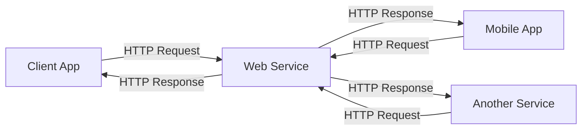
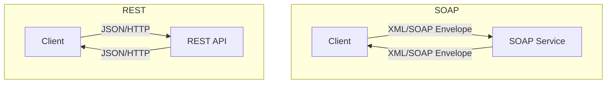

# Sessions 24-25: Building REST Services with Spring

## What is a Web Service?

A **Web Service** is a standardized way for applications to communicate over a network using standard protocols (HTTP, XML, JSON).



---

## SOAP vs REST

| Feature | SOAP | REST |
|---------|------|------|
| **Protocol** | Protocol (strict rules) | Architecture style (guidelines) |
| **Transport** | HTTP, SMTP, TCP | HTTP only |
| **Data Format** | XML only | JSON, XML, HTML, text |
| **Contract** | WSDL required | No contract required |
| **State** | Stateful or stateless | Stateless |
| **Performance** | Slower (XML overhead) | Faster (lightweight) |
| **Caching** | Not cacheable | Cacheable |
| **Security** | WS-Security (built-in) | HTTPS, OAuth |
| **Complexity** | Complex | Simple |



---

## REST Principles

**REST** (Representational State Transfer) is an architectural style with these constraints:

| Principle | Description |
|-----------|-------------|
| **Client-Server** | Separation of UI and data storage |
| **Stateless** | No client state stored on server |
| **Cacheable** | Responses can be cached |
| **Uniform Interface** | Consistent resource identification |
| **Layered System** | Client doesn't know if connected directly |
| **Code on Demand** (Optional) | Server can send executable code |

---

## HTTP Methods (CRUD)

| Method | CRUD | Description | Idempotent | Safe |
|--------|------|-------------|------------|------|
| **GET** | Read | Retrieve resource | Yes | Yes |
| **POST** | Create | Create new resource | No | No |
| **PUT** | Update | Replace entire resource | Yes | No |
| **PATCH** | Update | Partial update | No | No |
| **DELETE** | Delete | Remove resource | Yes | No |

### HTTP Status Codes

| Code | Category | Meaning |
|------|----------|---------|
| **200** | Success | OK |
| **201** | Success | Created |
| **204** | Success | No Content |
| **400** | Client Error | Bad Request |
| **401** | Client Error | Unauthorized |
| **403** | Client Error | Forbidden |
| **404** | Client Error | Not Found |
| **405** | Client Error | Method Not Allowed |
| **500** | Server Error | Internal Server Error |

---

## RESTful URL Design

| Operation | HTTP Method | URL | Description |
|-----------|-------------|-----|-------------|
| Get all | GET | `/api/products` | List all products |
| Get one | GET | `/api/products/{id}` | Get product by ID |
| Create | POST | `/api/products` | Create new product |
| Update | PUT | `/api/products/{id}` | Update product |
| Partial Update | PATCH | `/api/products/{id}` | Update some fields |
| Delete | DELETE | `/api/products/{id}` | Delete product |

### URL Best Practices

| Practice | Example |
|----------|---------|
| Use nouns (not verbs) | `/products` not `/getProducts` |
| Use plural names | `/products` not `/product` |
| Use hyphens for readability | `/product-categories` |
| Use lowercase | `/products` not `/Products` |
| Use path parameters for IDs | `/products/{id}` |
| Use query params for filtering | `/products?category=electronics` |

---

## Creating REST API with Spring Boot

### Dependencies

```xml
<dependency>
    <groupId>org.springframework.boot</groupId>
    <artifactId>spring-boot-starter-web</artifactId>
</dependency>
```

### REST Controller

```java
@RestController
@RequestMapping("/api/products")
public class ProductController {
    
    @Autowired
    private ProductService productService;
    
    // GET all products
    @GetMapping
    public List<Product> getAllProducts() {
        return productService.findAll();
    }
    
    // GET single product
    @GetMapping("/{id}")
    public ResponseEntity<Product> getProduct(@PathVariable Long id) {
        return productService.findById(id)
            .map(ResponseEntity::ok)
            .orElse(ResponseEntity.notFound().build());
    }
    
    // POST create product
    @PostMapping
    public ResponseEntity<Product> createProduct(@RequestBody Product product) {
        Product saved = productService.save(product);
        return ResponseEntity.status(HttpStatus.CREATED).body(saved);
    }
    
    // PUT update product
    @PutMapping("/{id}")
    public ResponseEntity<Product> updateProduct(@PathVariable Long id, 
                                                  @RequestBody Product product) {
        if (!productService.existsById(id)) {
            return ResponseEntity.notFound().build();
        }
        product.setId(id);
        return ResponseEntity.ok(productService.save(product));
    }
    
    // DELETE product
    @DeleteMapping("/{id}")
    public ResponseEntity<Void> deleteProduct(@PathVariable Long id) {
        if (!productService.existsById(id)) {
            return ResponseEntity.notFound().build();
        }
        productService.delete(id);
        return ResponseEntity.noContent().build();
    }
}
```

---

## @RestController vs @Controller

| Feature | @Controller | @RestController |
|---------|-------------|-----------------|
| **Returns** | View name | Data (JSON/XML) |
| **@ResponseBody** | Required per method | Implicit |
| **Use case** | Web pages (MVC) | REST APIs |

```java
// @Controller requires @ResponseBody
@Controller
public class MyController {
    @GetMapping("/data")
    @ResponseBody  // Required!
    public Data getData() {
        return data;
    }
}

// @RestController includes @ResponseBody
@RestController  // = @Controller + @ResponseBody
public class MyRestController {
    @GetMapping("/data")
    public Data getData() {
        return data;
    }
}
```

---

## Request/Response Annotations

| Annotation | Purpose |
|------------|---------|
| `@RequestBody` | Bind request body to object |
| `@ResponseBody` | Write return value to response body |
| `@PathVariable` | Extract from URL path |
| `@RequestParam` | Extract query parameter |
| `@RequestHeader` | Extract HTTP header |

```java
@GetMapping("/search")
public List<Product> search(
    @RequestParam String keyword,                    // ?keyword=laptop
    @RequestParam(required = false) String category, // optional
    @RequestParam(defaultValue = "0") int page,     // with default
    @RequestHeader("Authorization") String auth) {   // from header
    // ...
}

@PostMapping
public Product create(@RequestBody Product product) {  // from body
    // ...
}

@GetMapping("/{id}")
public Product get(@PathVariable Long id) {  // from path
    // ...
}
```

---

## JSON Response

Spring Boot uses **Jackson** library for JSON serialization.

### Entity

```java
public class Product {
    private Long id;
    private String name;
    private Double price;
    
    @JsonFormat(pattern = "yyyy-MM-dd")
    private LocalDate createdAt;
    
    @JsonIgnore  // Exclude from JSON
    private String internalCode;
    
    @JsonProperty("product_name")  // Custom JSON key
    public String getName() {
        return name;
    }
}
```

### Response

```json
{
    "id": 1,
    "product_name": "Laptop",
    "price": 999.99,
    "createdAt": "2024-01-15"
}
```

### Jackson Annotations

| Annotation | Purpose |
|------------|---------|
| `@JsonIgnore` | Exclude field from JSON |
| `@JsonProperty` | Custom property name |
| `@JsonFormat` | Date/time format |
| `@JsonInclude` | Include/exclude conditions |
| `@JsonIgnoreProperties` | Ignore multiple properties |

---

## ResponseEntity

**ResponseEntity** gives full control over HTTP response.

```java
@GetMapping("/{id}")
public ResponseEntity<Product> getProduct(@PathVariable Long id) {
    Optional<Product> product = productService.findById(id);
    
    if (product.isPresent()) {
        return ResponseEntity.ok(product.get());  // 200 OK
    } else {
        return ResponseEntity.notFound().build();  // 404
    }
}

@PostMapping
public ResponseEntity<Product> create(@RequestBody Product product) {
    Product saved = productService.save(product);
    URI location = URI.create("/api/products/" + saved.getId());
    
    return ResponseEntity
        .created(location)  // 201 Created + Location header
        .body(saved);
}

@DeleteMapping("/{id}")
public ResponseEntity<Void> delete(@PathVariable Long id) {
    productService.delete(id);
    return ResponseEntity.noContent().build();  // 204 No Content
}
```

### ResponseEntity Factory Methods

| Method | Status Code |
|--------|-------------|
| `ok(body)` | 200 OK |
| `created(uri)` | 201 Created |
| `noContent()` | 204 No Content |
| `badRequest()` | 400 Bad Request |
| `notFound()` | 404 Not Found |
| `status(code)` | Custom status |

---

## Exception Handling

### @ControllerAdvice

```java
@RestControllerAdvice
public class GlobalExceptionHandler {
    
    @ExceptionHandler(ResourceNotFoundException.class)
    public ResponseEntity<ErrorResponse> handleNotFound(ResourceNotFoundException ex) {
        ErrorResponse error = new ErrorResponse(
            HttpStatus.NOT_FOUND.value(),
            ex.getMessage(),
            LocalDateTime.now()
        );
        return ResponseEntity.status(HttpStatus.NOT_FOUND).body(error);
    }
    
    @ExceptionHandler(Exception.class)
    public ResponseEntity<ErrorResponse> handleGeneral(Exception ex) {
        ErrorResponse error = new ErrorResponse(
            HttpStatus.INTERNAL_SERVER_ERROR.value(),
            "An error occurred",
            LocalDateTime.now()
        );
        return ResponseEntity.status(HttpStatus.INTERNAL_SERVER_ERROR).body(error);
    }
}
```

---

## Using POSTMAN

**POSTMAN** is a tool for testing REST APIs.

| Feature | Usage |
|---------|-------|
| **Method** | Select GET, POST, PUT, DELETE |
| **URL** | Enter API endpoint |
| **Headers** | Add Content-Type, Authorization |
| **Body** | JSON data for POST/PUT |
| **Response** | View status, body, headers |

### Common Headers

| Header | Value |
|--------|-------|
| `Content-Type` | `application/json` |
| `Accept` | `application/json` |
| `Authorization` | `Bearer <token>` |

---

## RestTemplate

**RestTemplate** is used to call REST APIs from Java code.

```java
@Service
public class ExternalApiService {
    
    private final RestTemplate restTemplate;
    
    public ExternalApiService(RestTemplateBuilder builder) {
        this.restTemplate = builder.build();
    }
    
    // GET request
    public Product getProduct(Long id) {
        String url = "http://api.example.com/products/{id}";
        return restTemplate.getForObject(url, Product.class, id);
    }
    
    // GET with ResponseEntity
    public ResponseEntity<Product> getProductEntity(Long id) {
        String url = "http://api.example.com/products/{id}";
        return restTemplate.getForEntity(url, Product.class, id);
    }
    
    // POST request
    public Product createProduct(Product product) {
        String url = "http://api.example.com/products";
        return restTemplate.postForObject(url, product, Product.class);
    }
    
    // PUT request
    public void updateProduct(Long id, Product product) {
        String url = "http://api.example.com/products/{id}";
        restTemplate.put(url, product, id);
    }
    
    // DELETE request
    public void deleteProduct(Long id) {
        String url = "http://api.example.com/products/{id}";
        restTemplate.delete(url, id);
    }
    
    // Generic exchange
    public List<Product> getAllProducts() {
        String url = "http://api.example.com/products";
        ResponseEntity<List<Product>> response = restTemplate.exchange(
            url,
            HttpMethod.GET,
            null,
            new ParameterizedTypeReference<List<Product>>() {}
        );
        return response.getBody();
    }
}
```

### RestTemplate Methods

| Method | HTTP | Returns |
|--------|------|---------|
| `getForObject()` | GET | Body as object |
| `getForEntity()` | GET | ResponseEntity |
| `postForObject()` | POST | Body as object |
| `postForEntity()` | POST | ResponseEntity |
| `put()` | PUT | void |
| `delete()` | DELETE | void |
| `exchange()` | Any | ResponseEntity |

### RestTemplate Configuration

```java
@Configuration
public class RestTemplateConfig {
    
    @Bean
    public RestTemplate restTemplate(RestTemplateBuilder builder) {
        return builder
            .setConnectTimeout(Duration.ofSeconds(5))
            .setReadTimeout(Duration.ofSeconds(5))
            .build();
    }
}
```

---

## Key MCQ Points to Remember

1. **REST** = Representational State Transfer
2. **REST is stateless** - no client state on server
3. **GET** is safe and idempotent
4. **POST** creates resource, not idempotent
5. **PUT** replaces entire resource, idempotent
6. **DELETE** removes resource, idempotent
7. **@RestController** = @Controller + @ResponseBody
8. **@RequestBody** maps JSON to object
9. **@PathVariable** extracts from URL path
10. **@RequestParam** extracts query parameter
11. **Status 200** = OK, **201** = Created
12. **Status 404** = Not Found, **500** = Server Error
13. **SOAP uses XML** only; REST uses JSON primarily
14. **SOAP requires WSDL**; REST has no contract
15. **ResponseEntity** gives control over status/headers
16. **RestTemplate** calls external REST APIs
17. **Jackson** handles JSON serialization
18. **@JsonIgnore** excludes field from JSON
19. **@ControllerAdvice** handles exceptions globally
20. **Use nouns** in URLs, not verbs
