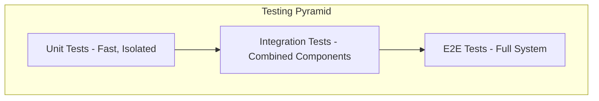
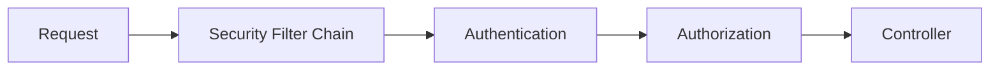
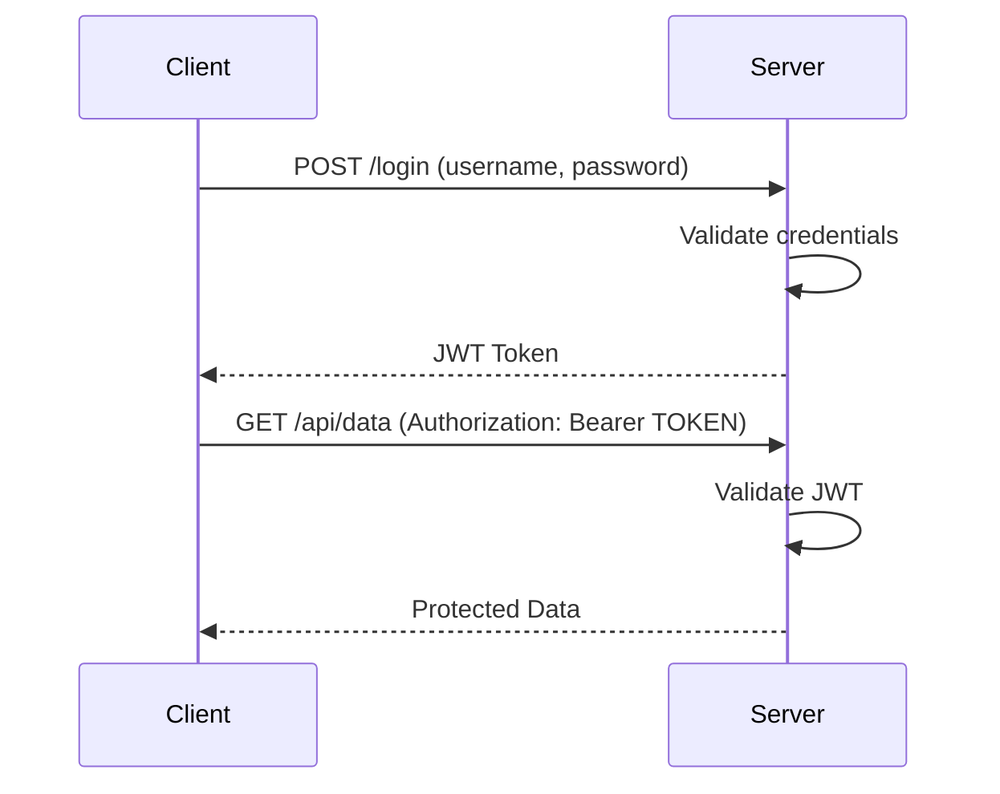

# Sessions 26-27: Testing & Spring Security

## Part 1: Testing in Spring

### Testing Layers



| Test Type | Scope | Speed | Dependencies |
|-----------|-------|-------|--------------|
| **Unit** | Single class/method | Fast | Mocked |
| **Integration** | Multiple components | Medium | Some real |
| **E2E** | Entire application | Slow | All real |

---

### Testing Dependencies

```xml
<dependency>
    <groupId>org.springframework.boot</groupId>
    <artifactId>spring-boot-starter-test</artifactId>
    <scope>test</scope>
</dependency>
```

Includes: JUnit 5, Mockito, AssertJ, Hamcrest, Spring Test

---

### Unit Testing Service Layer

```java
@ExtendWith(MockitoExtension.class)
class ProductServiceTest {
    
    @Mock
    private ProductRepository productRepository;
    
    @InjectMocks
    private ProductService productService;
    
    @Test
    void findById_ShouldReturnProduct_WhenExists() {
        // Arrange
        Product product = new Product(1L, "Laptop", 999.99);
        when(productRepository.findById(1L)).thenReturn(Optional.of(product));
        
        // Act
        Optional<Product> result = productService.findById(1L);
        
        // Assert
        assertTrue(result.isPresent());
        assertEquals("Laptop", result.get().getName());
        verify(productRepository).findById(1L);
    }
    
    @Test
    void findById_ShouldReturnEmpty_WhenNotExists() {
        when(productRepository.findById(99L)).thenReturn(Optional.empty());
        
        Optional<Product> result = productService.findById(99L);
        
        assertFalse(result.isPresent());
    }
}
```

### Mockito Annotations

| Annotation | Purpose |
|------------|---------|
| `@Mock` | Create mock object |
| `@InjectMocks` | Inject mocks into tested class |
| `@Spy` | Partial mock (real methods) |
| `@Captor` | Capture arguments |

### Mockito Methods

| Method | Purpose |
|--------|---------|
| `when().thenReturn()` | Stub return value |
| `when().thenThrow()` | Stub exception |
| `verify()` | Verify method called |
| `verify(times(n))` | Verify call count |
| `any()` | Match any argument |

---

### Unit Testing Controllers

```java
@WebMvcTest(ProductController.class)
class ProductControllerTest {
    
    @Autowired
    private MockMvc mockMvc;
    
    @MockBean
    private ProductService productService;
    
    @Autowired
    private ObjectMapper objectMapper;
    
    @Test
    void getProduct_ShouldReturn200_WhenExists() throws Exception {
        Product product = new Product(1L, "Laptop", 999.99);
        when(productService.findById(1L)).thenReturn(Optional.of(product));
        
        mockMvc.perform(get("/api/products/1")
                .contentType(MediaType.APPLICATION_JSON))
            .andExpect(status().isOk())
            .andExpect(jsonPath("$.name").value("Laptop"))
            .andExpect(jsonPath("$.price").value(999.99));
    }
    
    @Test
    void getProduct_ShouldReturn404_WhenNotExists() throws Exception {
        when(productService.findById(99L)).thenReturn(Optional.empty());
        
        mockMvc.perform(get("/api/products/99"))
            .andExpect(status().isNotFound());
    }
    
    @Test
    void createProduct_ShouldReturn201() throws Exception {
        Product product = new Product(null, "Phone", 699.99);
        Product saved = new Product(1L, "Phone", 699.99);
        when(productService.save(any(Product.class))).thenReturn(saved);
        
        mockMvc.perform(post("/api/products")
                .contentType(MediaType.APPLICATION_JSON)
                .content(objectMapper.writeValueAsString(product)))
            .andExpect(status().isCreated())
            .andExpect(jsonPath("$.id").value(1));
    }
}
```

### MockMvc Methods

| Method | Purpose |
|--------|---------|
| `perform()` | Execute request |
| `get()`, `post()`, etc. | HTTP method |
| `contentType()` | Set content type |
| `content()` | Set request body |
| `andExpect()` | Add assertion |
| `status()` | Check status code |
| `jsonPath()` | Check JSON response |

---

### Integration Testing

```java
@SpringBootTest(webEnvironment = SpringBootTest.WebEnvironment.RANDOM_PORT)
class ProductIntegrationTest {
    
    @Autowired
    private TestRestTemplate restTemplate;
    
    @Autowired
    private ProductRepository productRepository;
    
    @BeforeEach
    void setup() {
        productRepository.deleteAll();
    }
    
    @Test
    void createAndGetProduct() {
        // Create
        Product product = new Product(null, "Laptop", 999.99);
        ResponseEntity<Product> createResponse = restTemplate.postForEntity(
            "/api/products", product, Product.class);
        
        assertEquals(HttpStatus.CREATED, createResponse.getStatusCode());
        assertNotNull(createResponse.getBody().getId());
        
        // Get
        Long id = createResponse.getBody().getId();
        ResponseEntity<Product> getResponse = restTemplate.getForEntity(
            "/api/products/" + id, Product.class);
        
        assertEquals(HttpStatus.OK, getResponse.getStatusCode());
        assertEquals("Laptop", getResponse.getBody().getName());
    }
}
```

### Test Annotations

| Annotation | Purpose |
|------------|---------|
| `@SpringBootTest` | Load full application context |
| `@WebMvcTest` | Load web layer only |
| `@DataJpaTest` | Load JPA components only |
| `@MockBean` | Add mock to context |
| `@BeforeEach` | Run before each test |
| `@AfterEach` | Run after each test |

---

## Part 2: Spring Security

### What is Spring Security?

**Spring Security** provides authentication, authorization, and protection against common attacks.



### Core Concepts

| Concept | Description |
|---------|-------------|
| **Authentication** | Who are you? (identity verification) |
| **Authorization** | What can you do? (access control) |
| **Principal** | Currently authenticated user |
| **Granted Authority** | Permission/role |
| **Filter Chain** | Security filter pipeline |

---

### Adding Spring Security

```xml
<dependency>
    <groupId>org.springframework.boot</groupId>
    <artifactId>spring-boot-starter-security</artifactId>
</dependency>
```

Default behavior:
- All endpoints require authentication
- Default user: "user"
- Password: Generated at startup (check console)

---

### Security Configuration

```java
@Configuration
@EnableWebSecurity
public class SecurityConfig {
    
    @Bean
    public SecurityFilterChain filterChain(HttpSecurity http) throws Exception {
        http
            .csrf(csrf -> csrf.disable())
            .authorizeHttpRequests(auth -> auth
                .requestMatchers("/api/public/**").permitAll()
                .requestMatchers("/api/admin/**").hasRole("ADMIN")
                .requestMatchers("/api/**").authenticated()
                .anyRequest().authenticated()
            )
            .httpBasic(Customizer.withDefaults());
        
        return http.build();
    }
    
    @Bean
    public UserDetailsService userDetailsService() {
        UserDetails user = User.builder()
            .username("user")
            .password(passwordEncoder().encode("password"))
            .roles("USER")
            .build();
        
        UserDetails admin = User.builder()
            .username("admin")
            .password(passwordEncoder().encode("admin"))
            .roles("ADMIN", "USER")
            .build();
        
        return new InMemoryUserDetailsManager(user, admin);
    }
    
    @Bean
    public PasswordEncoder passwordEncoder() {
        return new BCryptPasswordEncoder();
    }
}
```

### Authorization Rules

| Method | Description |
|--------|-------------|
| `permitAll()` | No authentication required |
| `authenticated()` | Must be logged in |
| `hasRole("ROLE")` | Must have specific role |
| `hasAuthority("AUTH")` | Must have authority |
| `hasAnyRole("R1", "R2")` | Any of these roles |
| `denyAll()` | Block all access |

---

### Basic Authentication

HTTP Basic Authentication sends credentials in header:

```
Authorization: Basic base64(username:password)
```

```java
http.httpBasic(Customizer.withDefaults());
```

---

### Database Authentication

```java
@Entity
@Table(name = "users")
public class User {
    @Id
    @GeneratedValue(strategy = GenerationType.IDENTITY)
    private Long id;
    private String username;
    private String password;
    private String role;
    private boolean enabled;
}

@Service
public class CustomUserDetailsService implements UserDetailsService {
    
    @Autowired
    private UserRepository userRepository;
    
    @Override
    public UserDetails loadUserByUsername(String username) 
            throws UsernameNotFoundException {
        User user = userRepository.findByUsername(username)
            .orElseThrow(() -> new UsernameNotFoundException("User not found"));
        
        return org.springframework.security.core.userdetails.User
            .withUsername(user.getUsername())
            .password(user.getPassword())
            .roles(user.getRole())
            .disabled(!user.isEnabled())
            .build();
    }
}

@Configuration
@EnableWebSecurity
public class SecurityConfig {
    
    @Autowired
    private CustomUserDetailsService userDetailsService;
    
    @Bean
    public SecurityFilterChain filterChain(HttpSecurity http) throws Exception {
        http
            .userDetailsService(userDetailsService)
            .authorizeHttpRequests(auth -> auth
                .anyRequest().authenticated()
            )
            .httpBasic(Customizer.withDefaults());
        
        return http.build();
    }
}
```

---

### JWT Authentication

**JWT (JSON Web Token)** is a compact, self-contained token for authentication.



### JWT Structure

```
header.payload.signature
```

| Part | Content |
|------|---------|
| **Header** | Algorithm, token type |
| **Payload** | Claims (sub, exp, roles) |
| **Signature** | Verification hash |

### JWT Dependencies

```xml
<dependency>
    <groupId>io.jsonwebtoken</groupId>
    <artifactId>jjwt-api</artifactId>
    <version>0.11.5</version>
</dependency>
<dependency>
    <groupId>io.jsonwebtoken</groupId>
    <artifactId>jjwt-impl</artifactId>
    <version>0.11.5</version>
</dependency>
<dependency>
    <groupId>io.jsonwebtoken</groupId>
    <artifactId>jjwt-jackson</artifactId>
    <version>0.11.5</version>
</dependency>
```

### JWT Utility Class

```java
@Component
public class JwtUtils {
    
    @Value("${jwt.secret}")
    private String secret;
    
    @Value("${jwt.expiration}")
    private long expiration;
    
    public String generateToken(UserDetails userDetails) {
        return Jwts.builder()
            .setSubject(userDetails.getUsername())
            .setIssuedAt(new Date())
            .setExpiration(new Date(System.currentTimeMillis() + expiration))
            .signWith(getSigningKey())
            .compact();
    }
    
    public String extractUsername(String token) {
        return extractClaim(token, Claims::getSubject);
    }
    
    public boolean validateToken(String token, UserDetails userDetails) {
        String username = extractUsername(token);
        return username.equals(userDetails.getUsername()) && !isTokenExpired(token);
    }
    
    private Key getSigningKey() {
        return Keys.hmacShaKeyFor(secret.getBytes());
    }
}
```

### JWT Authentication Flow

1. User sends username/password to `/login`
2. Server validates and returns JWT
3. Client stores JWT (localStorage/cookie)
4. Client sends JWT in `Authorization: Bearer <token>` header
5. Server validates JWT on each request

---

### Method-Level Security

```java
@Configuration
@EnableMethodSecurity
public class SecurityConfig {
    // ...
}

@Service
public class ProductService {
    
    @PreAuthorize("hasRole('ADMIN')")
    public void deleteProduct(Long id) {
        // Only ADMIN can delete
    }
    
    @PreAuthorize("hasRole('USER') or hasRole('ADMIN')")
    public Product getProduct(Long id) {
        // USER or ADMIN can read
    }
    
    @PreAuthorize("#username == authentication.principal.username")
    public User getUser(String username) {
        // Only own profile
    }
}
```

### Security Annotations

| Annotation | Purpose |
|------------|---------|
| `@PreAuthorize` | Check before method |
| `@PostAuthorize` | Check after method |
| `@Secured` | Role-based (simpler) |
| `@RolesAllowed` | JSR-250 standard |

---

## Key MCQ Points to Remember

### Testing
1. **@SpringBootTest** loads full application context
2. **@WebMvcTest** loads web layer only (controllers)
3. **@MockBean** creates mock and adds to context
4. **@Mock** creates mock (Mockito only)
5. **MockMvc** tests controllers without HTTP
6. **TestRestTemplate** for integration tests
7. **when().thenReturn()** stubs method behavior
8. **verify()** checks if method was called

### Security
9. **Spring Security** provides authentication & authorization
10. **Authentication** = who you are
11. **Authorization** = what you can do
12. **BCryptPasswordEncoder** is recommended encoder
13. **permitAll()** allows all access
14. **authenticated()** requires login
15. **hasRole("ADMIN")** checks for role
16. **JWT** = JSON Web Token (stateless)
17. **JWT has 3 parts**: header, payload, signature
18. **Bearer token** sent in Authorization header
19. **@PreAuthorize** checks before method execution
20. **@EnableWebSecurity** enables security configuration
