# Sessions 28-29: Microservices

## What are Microservices?

**Microservices** is an architectural style where an application is composed of small, independent services that:
- Run in their own process
- Communicate via lightweight protocols (HTTP/REST)
- Are independently deployable
- Are organized around business capabilities

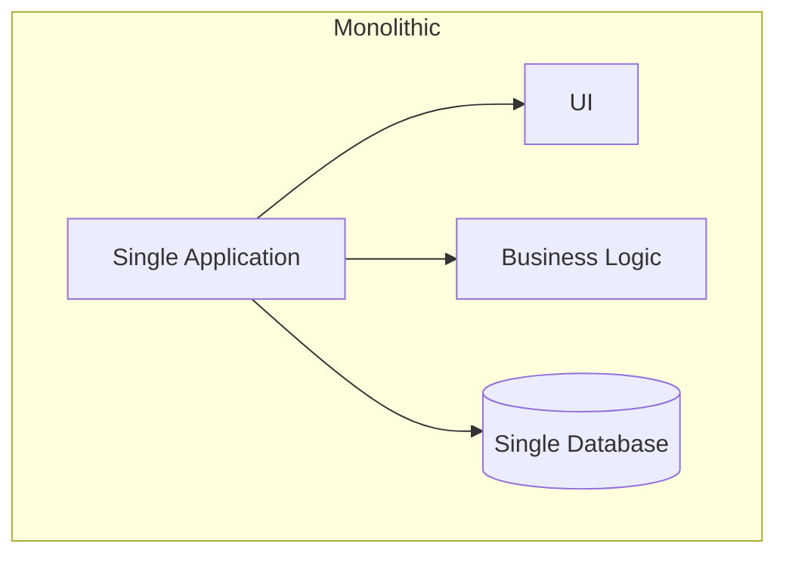

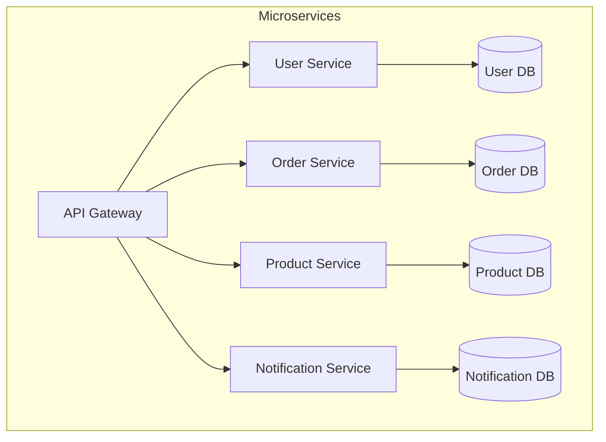

---

## Monolithic vs Microservices

| Feature | Monolithic | Microservices |
|---------|------------|---------------|
| **Structure** | Single deployable unit | Multiple small services |
| **Scaling** | Scale entire application | Scale individual services |
| **Technology** | Single tech stack | Polyglot (multiple techs) |
| **Deployment** | Entire app redeploy | Individual service deploy |
| **Database** | Single shared database | Database per service |
| **Team** | Large team on one codebase | Small teams per service |
| **Failure** | Full application affected | Isolated failures |
| **Complexity** | Simple initially | Complex infrastructure |

---

## Microservices Characteristics

| Characteristic | Description |
|----------------|-------------|
| **Single Responsibility** | Each service does one thing well |
| **Autonomy** | Services are independently deployable |
| **Decentralized** | Decentralized data management |
| **Failure Isolation** | One service failure doesn't crash all |
| **Observable** | Logging, monitoring, tracing |
| **Automation** | CI/CD, automated testing |

---

## Microservices Architecture

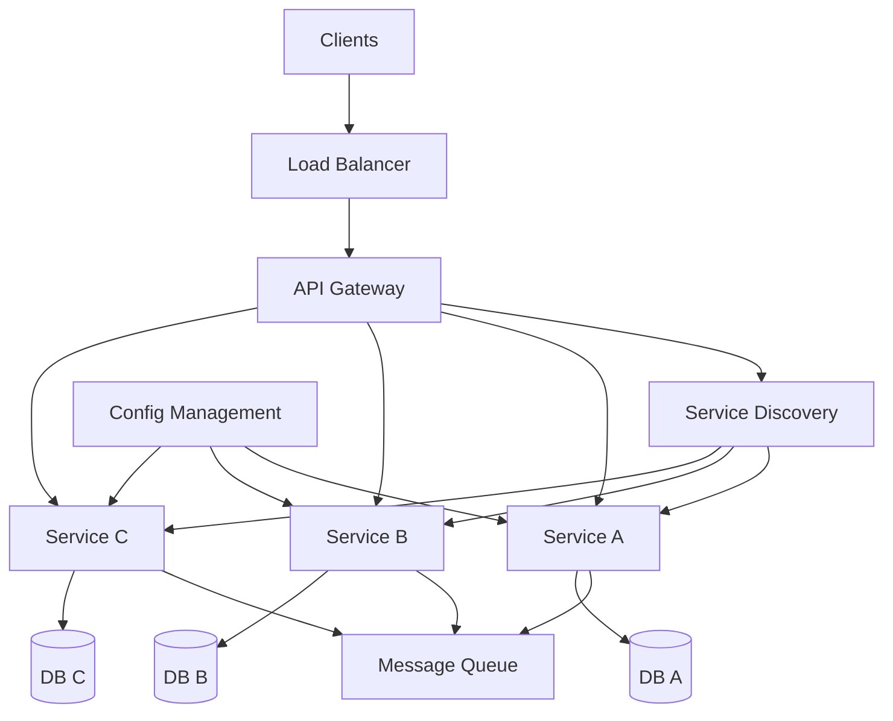

---

## Key Components

### 1. API Gateway

**API Gateway** is the single entry point for all client requests.

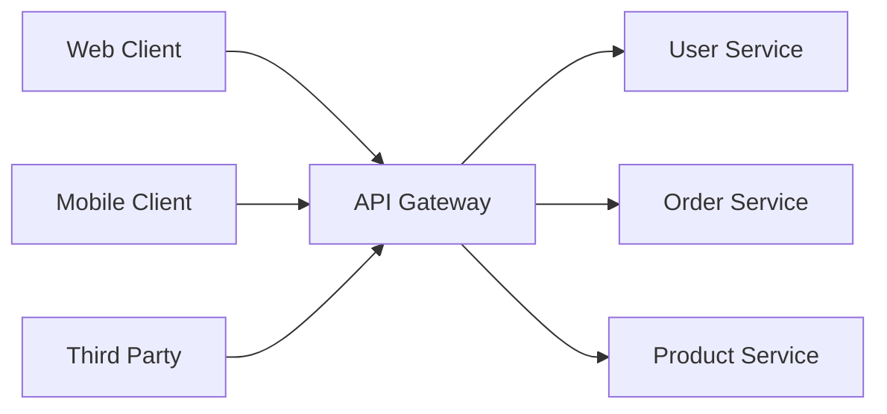

| Responsibility | Description |
|----------------|-------------|
| **Routing** | Route requests to services |
| **Authentication** | Verify user identity |
| **Rate Limiting** | Limit request frequency |
| **Load Balancing** | Distribute load |
| **Caching** | Cache responses |
| **Logging** | Request/response logging |
| **SSL Termination** | Handle HTTPS |

**Tools**: Spring Cloud Gateway, Netflix Zuul, Kong, AWS API Gateway

---

### 2. Service Discovery

**Service Discovery** allows services to find and communicate with each other without hard-coded addresses.

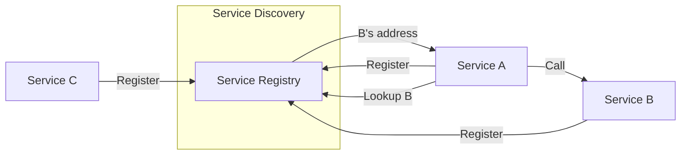

| Type | Description |
|------|-------------|
| **Client-side** | Client queries registry and chooses instance |
| **Server-side** | Load balancer queries registry and routes |

**Tools**: Netflix Eureka, Consul, Zookeeper

#### Eureka Server

```java
@SpringBootApplication
@EnableEurekaServer
public class ServiceRegistryApplication {
    public static void main(String[] args) {
        SpringApplication.run(ServiceRegistryApplication.class, args);
    }
}
```

```yaml
# application.yml
server:
  port: 8761

eureka:
  client:
    register-with-eureka: false
    fetch-registry: false
```

#### Eureka Client

```java
@SpringBootApplication
@EnableDiscoveryClient
public class ProductServiceApplication {
    public static void main(String[] args) {
        SpringApplication.run(ProductServiceApplication.class, args);
    }
}
```

```yaml
# application.yml
spring:
  application:
    name: product-service

eureka:
  client:
    service-url:
      defaultZone: http://localhost:8761/eureka/
```

---

### 3. Load Balancing

Distributes incoming requests across multiple service instances.

| Type | Location |
|------|----------|
| **Server-side** | External load balancer (Nginx, HAProxy) |
| **Client-side** | Client chooses instance (Ribbon, Spring Cloud LoadBalancer) |

---

### 4. Circuit Breaker

Prevents cascading failures when a service is unavailable.

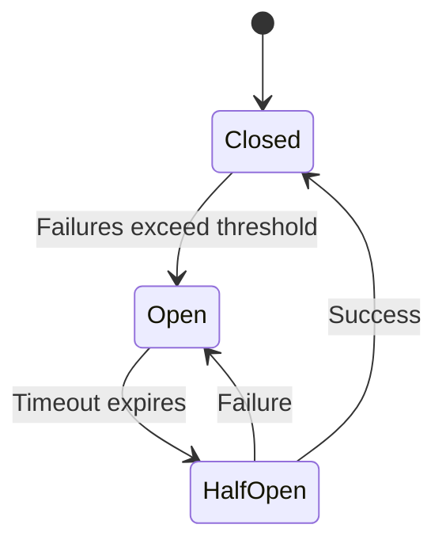

| State | Behavior |
|-------|----------|
| **Closed** | Normal operation, requests pass through |
| **Open** | Requests fail immediately (fallback) |
| **Half-Open** | Limited requests to test recovery |

**Tools**: Resilience4j, Netflix Hystrix (deprecated)

```java
@Service
public class ProductService {
    
    @CircuitBreaker(name = "inventoryService", fallbackMethod = "fallback")
    public String checkInventory(Long productId) {
        // Call inventory service
        return restTemplate.getForObject(
            "http://inventory-service/api/inventory/" + productId, 
            String.class);
    }
    
    public String fallback(Long productId, Exception ex) {
        return "Inventory service unavailable";
    }
}
```

---

### 5. Configuration Management

Centralized configuration for all services.

**Spring Cloud Config Server**:

```java
@SpringBootApplication
@EnableConfigServer
public class ConfigServerApplication {
    public static void main(String[] args) {
        SpringApplication.run(ConfigServerApplication.class, args);
    }
}
```

```yaml
# Config Server
spring:
  cloud:
    config:
      server:
        git:
          uri: https://github.com/config-repo
```

```yaml
# Client
spring:
  config:
    import: configserver:http://localhost:8888
```

---

## Database Per Service

Each microservice owns its data and database.

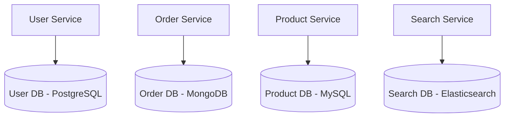

| Pattern | Description |
|---------|-------------|
| **Private Tables** | Tables owned by single service |
| **Schema per Service** | Each service has own schema |
| **Database per Service** | Separate database instances |

### Data Consistency

| Approach | Description |
|----------|-------------|
| **Saga Pattern** | Sequence of local transactions |
| **Event Sourcing** | Store events, rebuild state |
| **CQRS** | Separate read/write models |

---

## Inter-Service Communication

### Synchronous (REST/gRPC)

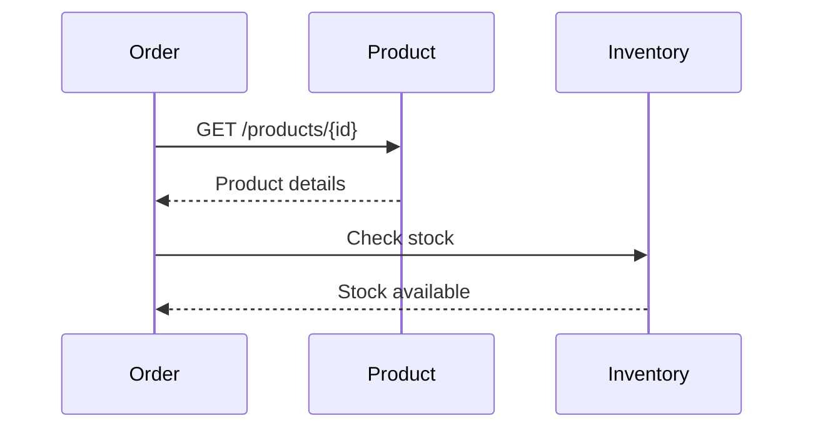

### Asynchronous (Message Queue)

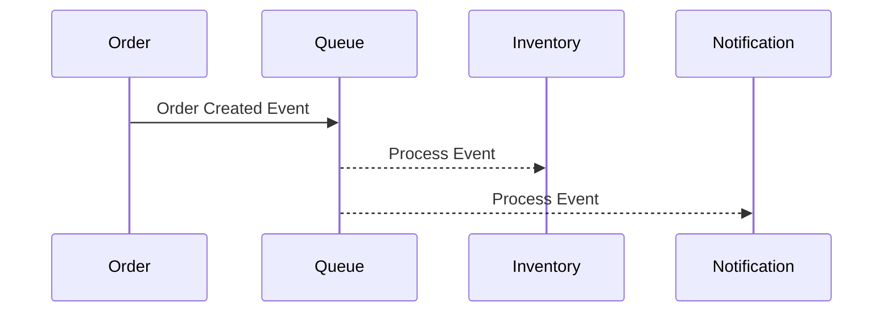

| Communication | Pros | Cons |
|---------------|------|------|
| **Sync (REST)** | Simple, immediate response | Tight coupling, blocking |
| **Async (Queue)** | Loose coupling, resilient | Complex, eventual consistency |

**Message Brokers**: RabbitMQ, Apache Kafka, AWS SQS

---

## Deployment Patterns

### 1. Multiple Instances per Host

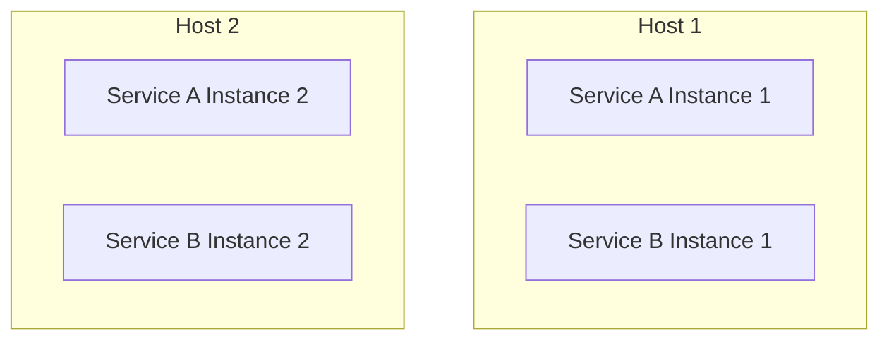

### 2. One Instance per Container (Recommended)

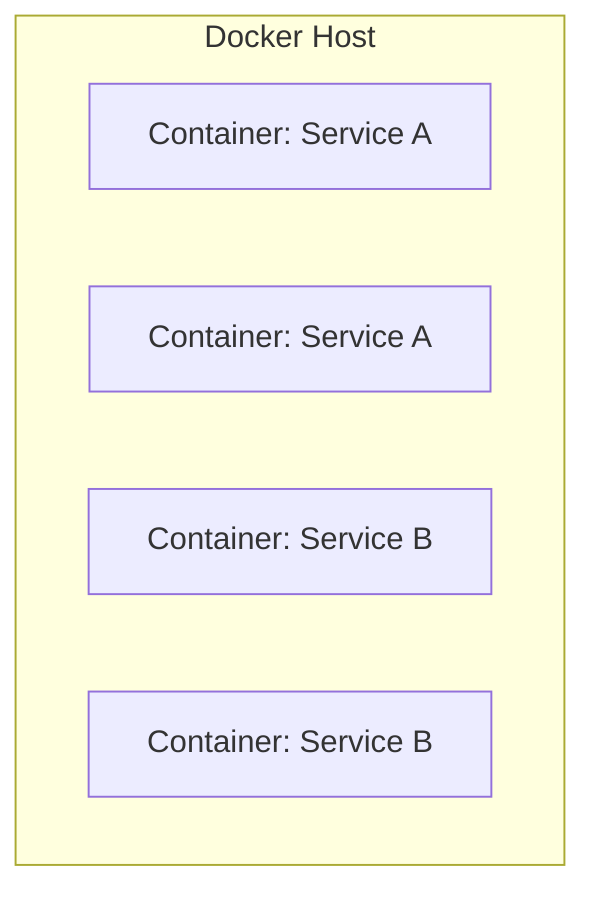

### 3. Kubernetes

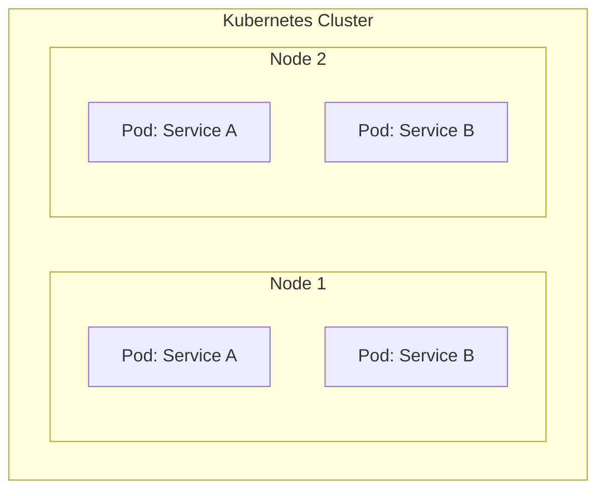

---

## Spring Boot Microservices Stack

| Component | Technology |
|-----------|------------|
| **Services** | Spring Boot |
| **API Gateway** | Spring Cloud Gateway |
| **Service Discovery** | Netflix Eureka |
| **Config Management** | Spring Cloud Config |
| **Load Balancing** | Spring Cloud LoadBalancer |
| **Circuit Breaker** | Resilience4j |
| **Messaging** | Spring Kafka, RabbitMQ |
| **Tracing** | Spring Cloud Sleuth, Zipkin |
| **Containerization** | Docker |
| **Orchestration** | Kubernetes |

---

## Key MCQ Points to Remember

1. **Microservices** = small, independent, deployable services
2. **Monolithic** = single deployable unit
3. **API Gateway** = single entry point for all clients
4. **Service Discovery** = find services without hard-coded URLs
5. **Eureka** = Netflix service registry (Spring Cloud)
6. **@EnableEurekaServer** = make app a registry
7. **@EnableDiscoveryClient** = register with Eureka
8. **Circuit Breaker** = prevents cascading failures
9. **Circuit Breaker states**: Closed, Open, Half-Open
10. **Resilience4j** replaces Netflix Hystrix
11. **Database per service** = each service owns its data
12. **REST** = synchronous communication
13. **Message Queue** = asynchronous communication
14. **Kafka, RabbitMQ** = message brokers
15. **Docker** = containerization
16. **Kubernetes** = container orchestration
17. **Spring Cloud Config** = centralized configuration
18. **Saga Pattern** = distributed transactions
19. **API Gateway handles**: routing, auth, rate limiting
20. Microservices can use **different technologies** (polyglot)
