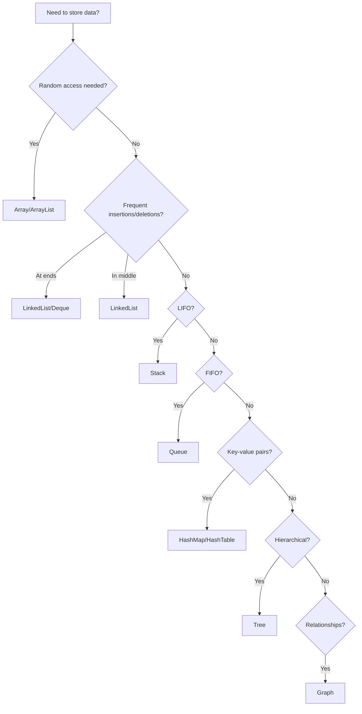

# Algorithms and Data Structures Using Java - CDAC CCEE 2026

## 📚 Complete Study Guide

Welcome to the comprehensive study notes for **Algorithms and Data Structures Using Java** module. This guide covers all 18 sessions designed to help you ace the CDAC CCEE 2026 MCQ exam.

---

## 📖 Course Overview

- **Duration**: 72 hours (36 theory + 36 lab hours)
- **Objective**: Reinforce problem-solving techniques, data structure concepts, and algorithm analysis using Java
- **Prerequisites**: Knowledge of C/C++ with OOP concepts
- **Evaluation**: 100 Marks
  - CCEE: 40%
  - Lab Exam: 40%
  - Internals & Mini Project: 20%

---

## 📑 Session-wise Navigation

  <a href="{{ '/docs/AlgorithmsDataStructures/session1-problem-solving' | relative_url }}" class="content-link">
    🧩
    Session 1: Problem Solving
  </a>

  <a href="{{ '/docs/AlgorithmsDataStructures/session2-3-algorithms-basics' | relative_url }}" class="content-link">
    ⚙️
    Sessions 2-3: Algorithms & Data Structures
  </a>

  <a href="{{ '/docs/AlgorithmsDataStructures/session4-5-linked-lists' | relative_url }}" class="content-link">
    ⛓️
    Sessions 4-5: Linked Lists
  </a>

  <a href="{{ '/docs/AlgorithmsDataStructures/session6-recursion' | relative_url }}" class="content-link">
    🔄
    Session 6: Recursion
  </a>

  <a href="{{ '/docs/AlgorithmsDataStructures/session7-9-trees' | relative_url }}" class="content-link">
    🌳
    Sessions 7-9: Trees & Applications
  </a>

  <a href="{{ '/docs/AlgorithmsDataStructures/session10-12-searching-sorting' | relative_url }}" class="content-link">
    🔍
    Sessions 10-12: Searching & Sorting
  </a>

  <a href="{{ '/docs/AlgorithmsDataStructures/session13-hashing' | relative_url }}" class="content-link">
    #️⃣
    Session 13: Hash Functions
  </a>

  <a href="{{ '/docs/AlgorithmsDataStructures/session14-16-graphs' | relative_url }}" class="content-link">
    🕸️
    Sessions 14-16: Graphs
  </a>

  <a href="{{ '/docs/AlgorithmsDataStructures/session17-18-algorithm-design' | relative_url }}" class="content-link">
    🧠
    Sessions 17-18: Algorithm Design
  </a>

---

## 🎯 Practice Tests

  <a href="{{ '/docs/AlgorithmsDataStructures/practice/mcq-test-1' | relative_url }}" class="content-link mcq">
    ✅
    MCQ Test 1
  </a>
  
  <a href="{{ '/docs/AlgorithmsDataStructures/practice/mcq-test-2' | relative_url }}" class="content-link mcq">
    ✅
    MCQ Test 2
  </a>
  
  <a href="{{ '/docs/AlgorithmsDataStructures/practice/mcq-test-3' | relative_url }}" class="content-link mcq">
    ✅
    MCQ Test 3
  </a>
  
  <a href="{{ '/docs/AlgorithmsDataStructures/practice/mcq-test-4' | relative_url }}" class="content-link mcq">
    ✅
    MCQ Test 4
  </a>

---

## 📚 Quick Reference Materials

### Complexity Analysis Cheat Sheet

| Notation | Name | Example |
|----------|------|---------|
| O(1) | Constant | Array access |
| O(log n) | Logarithmic | Binary search |
| O(n) | Linear | Linear search |
| O(n log n) | Linearithmic | Merge sort, Quick sort |
| O(n²) | Quadratic | Bubble sort, Selection sort |
| O(2ⁿ) | Exponential | Recursive Fibonacci |
| O(n!) | Factorial | Permutations |

### Data Structure Selection Guide

---

## 📚 Recommended Study Approach

### Week 1-2: Foundation
1. Master problem-solving techniques
2. Understand Big O notation thoroughly
3. Implement basic data structures (arrays, stacks, queues)
4. Practice complexity analysis

### Week 3-4: Linear Structures
1. Deep dive into linked lists (all variants)
2. Master recursion concepts
3. Practice recursive vs iterative solutions
4. Understand stack frames and memory allocation

### Week 5-7: Trees and Sorting
1. Binary trees and BST operations
2. Tree traversals (all methods)
3. All sorting algorithms with complexity analysis
4. Searching techniques

### Week 8-9: Advanced Structures
1. Hash tables and collision resolution
2. Graph representations
3. Graph traversals (BFS, DFS)
4. Shortest path algorithms

### Week 10: Algorithm Design
1. Different algorithm paradigms
2. When to use which approach
3. Practice mixed problems
4. Mock tests

---

## 💡 Exam Preparation Tips

### For MCQ Excellence

1. **Understand, Don't Memorize**
   - Focus on understanding why algorithms work
   - Know the trade-offs between different approaches

2. **Complexity Analysis is Key**
   - Every algorithm question will test Big O knowledge
   - Practice identifying time and space complexity quickly

3. **Code Tracing**
   - Be able to trace code execution mentally
   - Understand what happens at each step

4. **Edge Cases**
   - Empty inputs
   - Single element
   - Duplicate elements
   - Already sorted/reverse sorted data

5. **Common Pitfalls**
   - Off-by-one errors
   - Null pointer exceptions
   - Stack overflow in recursion
   - Integer overflow

---

## 🔗 Additional Resources

### Text Book
- **Data Abstraction and Problem Solving with Java: Walls and Mirrors**
   - Authors: Janet Prichard, Frank M. Carrano
   - Publisher: Pearson

### References
- **Introduction to Algorithms** by Cormen, Leiserson, Rivest, and Stein
- **Problem Solving: Best Strategies** by Thomas Richards
- **Object-oriented Analysis and Design Using UML** by Mahesh P. Matha

---

## 🎓 Learning Outcomes

By the end of this course, you will be able to:

✅ Analyze and solve complex problems using computational thinking  
✅ Choose appropriate data structures for specific problems  
✅ Implement and analyze various algorithms  
✅ Calculate time and space complexity  
✅ Design efficient solutions using different algorithm paradigms  
✅ Apply data structures to real-world problems  

---

## 📝 Practice Strategy

### Daily Practice (2-3 hours)
- 30 min: Theory review
- 60 min: Coding practice
- 30 min: MCQ practice
- 30 min: Complexity analysis

### Weekly Goals
- Complete 1-2 sessions thoroughly
- Solve 20-30 practice problems
- Take 1 mock test
- Review mistakes and weak areas

---

> **Pro Tip**: Focus on understanding the "why" behind each algorithm and data structure. MCQ questions often test conceptual understanding rather than just syntax.

---

**Last Updated**: January 2026  
**Version**: 1.0 - Comprehensive CDAC CCEE 2026 Preparation Guide
