# Session 1: Problem Solving & Computational Thinking

[← Back to Module Index]({{ '/docs/AlgorithmsDataStructures/' | relative_url }})

---

## 🎯 Learning Objectives

By the end of this session, you should be able to:
- Define and identify problems systematically
- Apply computational thinking to real-world problems
- Use structured problem-solving techniques
- Break down complex problems into manageable parts

---

## 1. Introduction to Problem Solving

### What is a Problem?

A **problem** is a situation where there is a gap between the current state and the desired state, and the path to bridge this gap is not immediately obvious.

**Components of a Problem:**
1. **Initial State**: Where you are now
2. **Goal State**: Where you want to be
3. **Constraints**: Limitations and rules
4. **Resources**: Available tools and methods

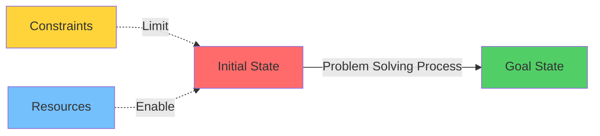

---

## 2. Problem Solving Process

### The 5-Step Framework

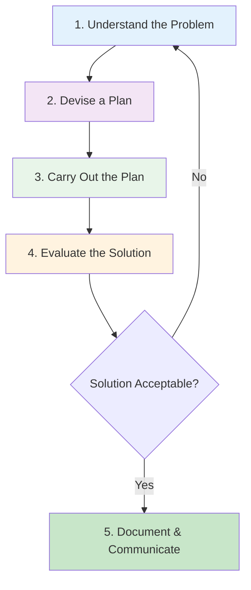

### Step 1: Understand the Problem

**Key Questions to Ask:**
- What is given? (Input)
- What is required? (Output)
- What are the constraints?
- Can I restate the problem in my own words?
- Have I seen a similar problem before?

**Example:**
```
Problem: Find the largest number in an array
- Input: Array of integers [5, 2, 9, 1, 7]
- Output: Single integer (9)
- Constraints: Array has at least one element
```

### Step 2: Devise a Plan

**Common Problem-Solving Strategies:**


| Strategy | Description | When to Use |
|----------|-------------|-------------|
| **Divide and Conquer** | Break problem into smaller sub-problems | Large, complex problems |
| **Pattern Recognition** | Find similarities with known problems | Familiar problem types |
| **Abstraction** | Remove unnecessary details | Complex scenarios |
| **Algorithm Design** | Create step-by-step procedure | Well-defined problems |
| **Trial and Error** | Test different approaches | Exploratory phase |

### Step 3: Carry Out the Plan

- Implement your solution systematically
- Test each step as you go
- Be prepared to try alternative approaches
- Keep track of what works and what doesn't

### Step 4: Evaluate the Solution

**Evaluation Criteria:**
- ✅ **Correctness**: Does it solve the problem?
- ✅ **Efficiency**: Is it fast enough?
- ✅ **Scalability**: Does it work for larger inputs?
- ✅ **Maintainability**: Is the code readable?
- ✅ **Robustness**: Does it handle edge cases?

### Step 5: Document & Communicate

- Write clear comments
- Document assumptions
- Explain your approach
- Note any limitations

---

## 3. Computational Thinking

### Four Pillars of Computational Thinking

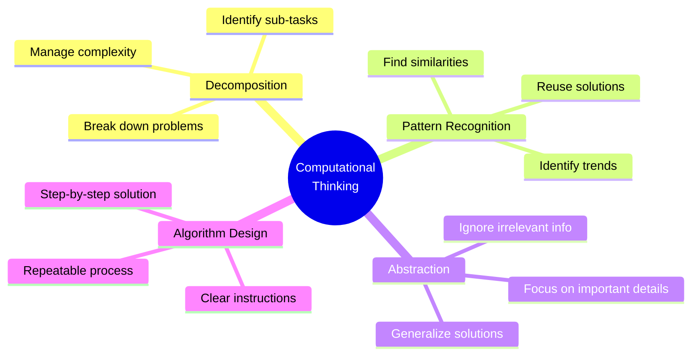

### 3.1 Decomposition

**Breaking down complex problems into smaller, manageable parts.**

**Example: Online Shopping System**

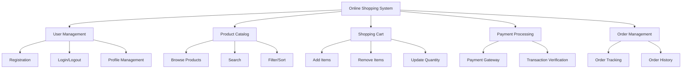

### 3.2 Pattern Recognition

**Identifying similarities and patterns in problems.**

**Common Patterns in Programming:**

1. **Counting Pattern**
   ```java
   // Count occurrences
   int count = 0;
   for (int i = 0; i < array.length; i++) {
       if (condition) count++;
   }
   ```

2. **Accumulation Pattern**
   ```java
   // Sum all elements
   int sum = 0;
   for (int num : array) {
       sum += num;
   }
   ```

3. **Search Pattern**
   ```java
   // Find element
   for (int i = 0; i < array.length; i++) {
       if (array[i] == target) {
           return i;
       }
   }
   return -1;
   ```

### 3.3 Abstraction

**Focusing on essential features while hiding unnecessary details.**

**Levels of Abstraction:**

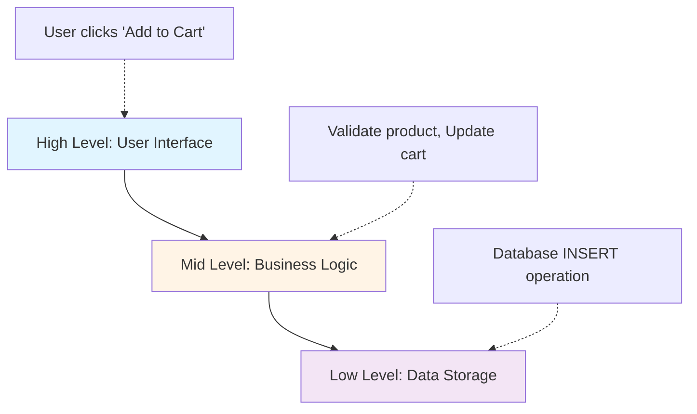

**Example: Abstract Data Type (ADT)**
```java
// Abstract interface - what it does
interface Stack {
    void push(int item);
    int pop();
    int peek();
    boolean isEmpty();
}

// Implementation details hidden
// Could use array, linked list, etc.
```

### 3.4 Algorithm Design

**Creating step-by-step procedures to solve problems.**

**Algorithm Characteristics:**
- **Finiteness**: Must terminate after finite steps
- **Definiteness**: Each step must be precisely defined
- **Input**: Zero or more inputs
- **Output**: One or more outputs
- **Effectiveness**: Steps must be basic enough to execute

**Example: Find Maximum in Array**

```
Algorithm: FindMaximum
Input: Array A of n integers
Output: Maximum value in A

1. Set max = A[0]
2. For i = 1 to n-1:
   a. If A[i] > max:
      - Set max = A[i]
3. Return max
```

---

## 4. Problem Definition & Identification

### 4.1 Defining the Problem

**SMART Problem Definition:**
- **S**pecific: Clearly defined
- **M**easurable: Can verify solution
- **A**chievable: Realistic to solve
- **R**elevant: Worth solving
- **T**ime-bound: Has deadline

### 4.2 Problem Identification Techniques

#### Root Cause Analysis

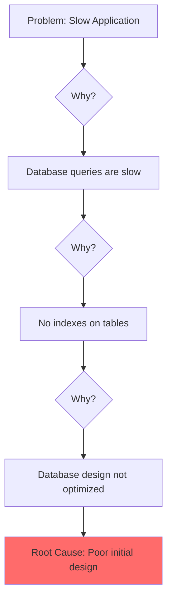

#### 5 Whys Technique

Keep asking "Why?" to drill down to the root cause.

**Example:**
1. **Problem**: Program crashes
2. **Why?** Null pointer exception
3. **Why?** Object not initialized
4. **Why?** Constructor not called
5. **Why?** Incorrect object creation
6. **Root Cause**: Misunderstanding of object lifecycle

---

## 5. Problem-Solving Techniques

### 5.1 Top-Down Approach

Start with the big picture and break it down.

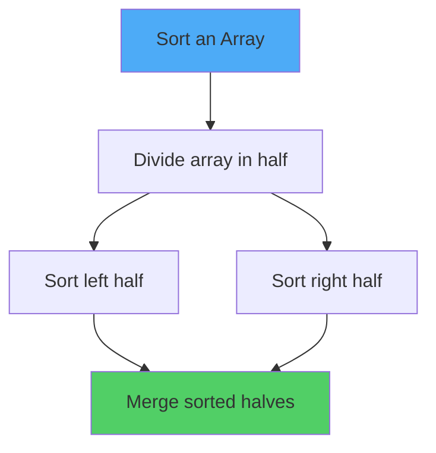

### 5.2 Bottom-Up Approach

Start with small pieces and build up.

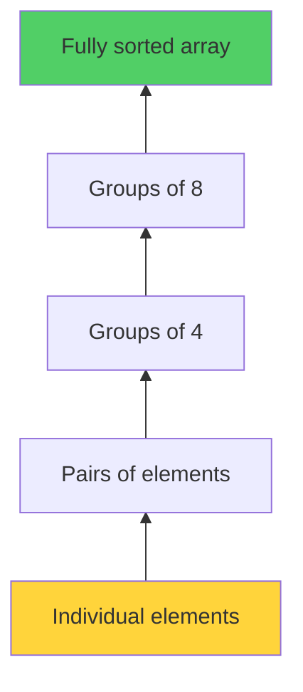

### 5.3 Greedy Approach

Make locally optimal choices at each step.

**Example: Coin Change Problem**
```
Problem: Make change for 67 cents
Coins: 25¢, 10¢, 5¢, 1¢

Greedy Solution:
1. Use 2 × 25¢ = 50¢ (remaining: 17¢)
2. Use 1 × 10¢ = 10¢ (remaining: 7¢)
3. Use 1 × 5¢ = 5¢ (remaining: 2¢)
4. Use 2 × 1¢ = 2¢ (remaining: 0¢)

Total: 6 coins
```

### 5.4 Divide and Conquer

Break problem into independent sub-problems.

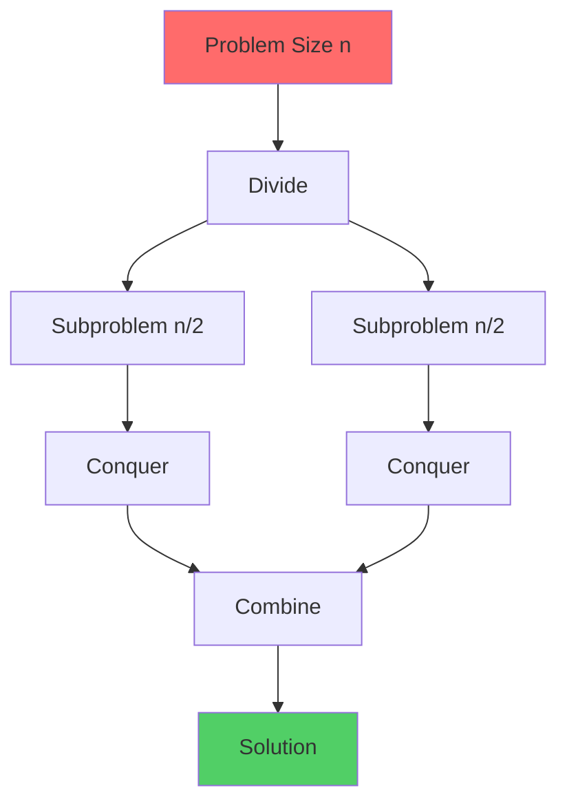

---

## 6. Real-World Problem-Solving Examples

### Example 1: Student Grade Management

**Problem Statement:**
Design a system to manage student grades for a class.

**Step 1: Understand**
- Input: Student names, assignment scores
- Output: Final grades, class statistics
- Constraints: Multiple assignments, different weights

**Step 2: Decompose**
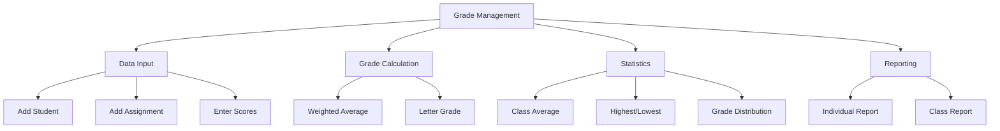

**Step 3: Plan**
- Use ArrayList to store students
- Each student has Map of assignments
- Calculate weighted average
- Determine letter grade based on scale

**Step 4: Pseudocode**
```
Class Student:
    name: String
    scores: Map<String, Double>
    
    calculateAverage():
        sum = 0
        for each score in scores:
            sum += score
        return sum / scores.size()
    
    getLetterGrade():
        avg = calculateAverage()
        if avg >= 90: return 'A'
        if avg >= 80: return 'B'
        if avg >= 70: return 'C'
        if avg >= 60: return 'D'
        return 'F'
```

### Example 2: Traffic Light System

**Problem:** Design a traffic light control system for a 4-way intersection.

**Decomposition:**
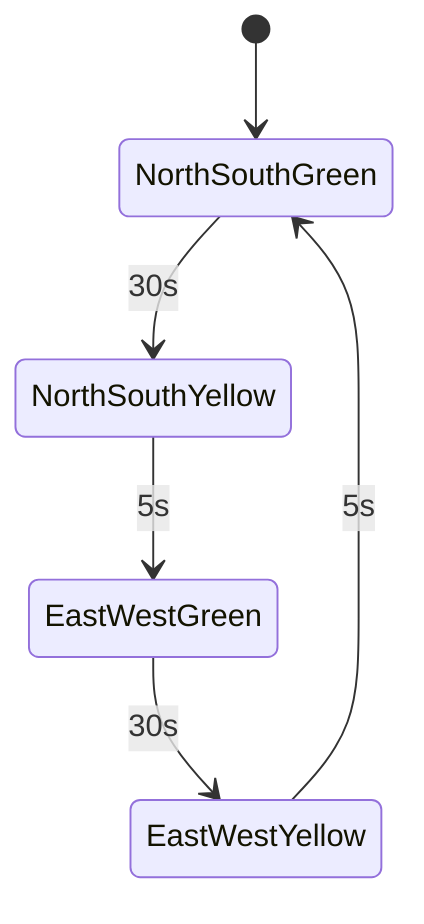

**Key Considerations:**
- Safety: Never have conflicting green lights
- Timing: Appropriate duration for each phase
- Sensors: Detect vehicles waiting
- Emergency: Override for emergency vehicles

---

## 7. Problem-Solving Strategies for Programming

### Strategy Selection Guide

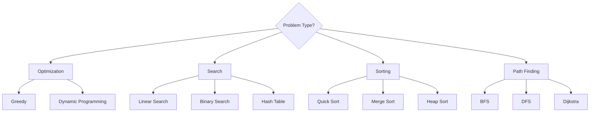

### Common Problem Patterns


| Pattern | Description | Example |
|---------|-------------|---------|
| **Two Pointers** | Use two indices to traverse | Find pair with sum |
| **Sliding Window** | Maintain window of elements | Maximum subarray |
| **Fast & Slow Pointers** | Two pointers at different speeds | Detect cycle |
| **Merge Intervals** | Combine overlapping ranges | Meeting rooms |
| **Cyclic Sort** | Sort in-place using indices | Find missing number |

---

## 8. Mini Project Ideas

### Beginner Level
1. **Library Management System**
   - Add/remove books
   - Issue/return books
   - Search by title/author
   - Track due dates

2. **Student Attendance System**
   - Mark attendance
   - Generate reports
   - Calculate attendance percentage
   - Alert for low attendance

3. **Simple Calculator**
   - Basic operations
   - Expression evaluation
   - History of calculations

### Intermediate Level
1. **Banking System**
   - Account management
   - Transactions
   - Balance inquiry
   - Transaction history

2. **Inventory Management**
   - Product catalog
   - Stock tracking
   - Low stock alerts
   - Sales reporting

3. **Task Management System**
   - Create/edit/delete tasks
   - Priority levels
   - Due dates
   - Status tracking

---

## 9. Practice Problems

### Problem 1: Find Duplicate
```
Given an array of integers, find if there are any duplicates.

Input: [1, 2, 3, 4, 5, 2]
Output: true (2 appears twice)

Approach 1: Brute Force - O(n²)
Approach 2: Sorting - O(n log n)
Approach 3: Hash Set - O(n)
```

### Problem 2: Reverse String
```
Reverse a string without using built-in reverse function.

Input: "hello"
Output: "olleh"

Approach 1: Two pointers
Approach 2: Stack
Approach 3: Recursion
```

### Problem 3: Palindrome Check
```
Check if a string is a palindrome.

Input: "racecar"
Output: true

Input: "hello"
Output: false
```

---

## 10. Key Takeaways

### ✅ Essential Concepts

1. **Problem solving is systematic**
   - Understand → Plan → Execute → Evaluate → Document

2. **Computational thinking has 4 pillars**
   - Decomposition, Pattern Recognition, Abstraction, Algorithm Design

3. **Multiple approaches exist**
   - Choose based on problem constraints and requirements

4. **Practice is crucial**
   - Solve diverse problems to build intuition

### 🎯 For MCQ Exam

**Focus Areas:**
- Problem-solving steps and their order
- Computational thinking definitions
- When to use which approach
- Identifying problem patterns
- Algorithm characteristics

**Common Question Types:**
1. "Which step comes first in problem solving?"
2. "What is decomposition in computational thinking?"
3. "Which approach is best for [specific problem]?"
4. "Identify the pattern in [code snippet]"

---

## 📝 Quick Revision Notes

### Problem Solving Process
1. **Understand** - What is given? What is needed?
2. **Plan** - Choose strategy
3. **Execute** - Implement solution
4. **Evaluate** - Test and verify
5. **Document** - Record solution

### Computational Thinking
- **Decomposition**: Break down
- **Patterns**: Find similarities
- **Abstraction**: Essential features only
- **Algorithms**: Step-by-step solution

### Common Strategies
- Top-Down: Start big, break down
- Bottom-Up: Start small, build up
- Greedy: Local optimum
- Divide & Conquer: Split and merge

---

[Next: Sessions 2-3 - Algorithms & Data Structures →](session2-3-algorithms-basics.md)

[← Back to Index](index.md)
