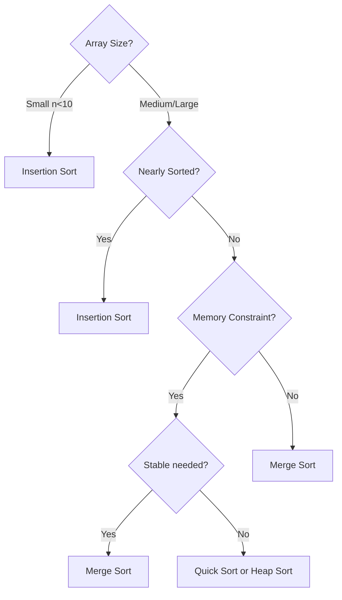

# Sessions 10, 11 & 12: Searching and Sorting Algorithms

[← Back to Module Index]({{ '/docs/AlgorithmsDataStructures/' | relative_url }})

---

## 🎯 Learning Objectives

- Master searching algorithms (Sequential, Binary)
- Understand all major sorting algorithms
- Analyze time and space complexity
- Know when to use which sorting algorithm
- Implement efficient sorting techniques

---

## 1. Searching Algorithms

### 1.1 Sequential Search (Linear Search)

```java
// Time: O(n), Space: O(1)
int linearSearch(int[] arr, int target) {
    for (int i = 0; i < arr.length; i++) {
        if (arr[i] == target) {
            return i;  // Found
        }
    }
    return -1;  // Not found
}
```

**Complexity:**
- Best: O(1) - element at first position
- Average: O(n/2) = O(n)
- Worst: O(n) - element at last or not present

### 1.2 Binary Search

**Prerequisite**: Array must be sorted!

```java
// Iterative - Time: O(log n), Space: O(1)
int binarySearch(int[] arr, int target) {
    int left = 0, right = arr.length - 1;
    
    while (left <= right) {
        int mid = left + (right - left) / 2;
        
        if (arr[mid] == target) return mid;
        
        if (arr[mid] < target) {
            left = mid + 1;
        } else {
            right = mid - 1;
        }
    }
    
    return -1;
}

// Recursive - Time: O(log n), Space: O(log n)
int binarySearchRec(int[] arr, int left, int right, int target) {
    if (left > right) return -1;
    
    int mid = left + (right - left) / 2;
    
    if (arr[mid] == target) return mid;
    
    if (arr[mid] < target) {
        return binarySearchRec(arr, mid + 1, right, target);
    }
    return binarySearchRec(arr, left, mid - 1, target);
}
```

**How it works:**
```
Array: [2, 5, 8, 12, 16, 23, 38, 45, 56, 67, 78]
Target: 23

Step 1: mid = 5, arr[5] = 23 ✓ Found!
```

---

## 2. Sorting Algorithms Overview


| Algorithm | Best | Average | Worst | Space | Stable |
|-----------|------|---------|-------|-------|--------|
| **Bubble Sort** | O(n) | O(n²) | O(n²) | O(1) | Yes |
| **Selection Sort** | O(n²) | O(n²) | O(n²) | O(1) | No |
| **Insertion Sort** | O(n) | O(n²) | O(n²) | O(1) | Yes |
| **Merge Sort** | O(n log n) | O(n log n) | O(n log n) | O(n) | Yes |
| **Quick Sort** | O(n log n) | O(n log n) | O(n²) | O(log n) | No |
| **Heap Sort** | O(n log n) | O(n log n) | O(n log n) | O(1) | No |

---

## 3. Simple Sorting Algorithms

### 3.1 Bubble Sort

**Idea**: Repeatedly swap adjacent elements if they're in wrong order.

```java
// Time: O(n²), Space: O(1)
void bubbleSort(int[] arr) {
    int n = arr.length;
    
    for (int i = 0; i < n - 1; i++) {
        boolean swapped = false;
        
        for (int j = 0; j < n - i - 1; j++) {
            if (arr[j] > arr[j + 1]) {
                // Swap
                int temp = arr[j];
                arr[j] = arr[j + 1];
                arr[j + 1] = temp;
                swapped = true;
            }
        }
        
        if (!swapped) break;  // Already sorted
    }
}
```

**Visualization:**
```
Pass 1: [5, 2, 8, 1, 9] → [2, 5, 1, 8, 9]
Pass 2: [2, 5, 1, 8, 9] → [2, 1, 5, 8, 9]
Pass 3: [2, 1, 5, 8, 9] → [1, 2, 5, 8, 9]
```

### 3.2 Selection Sort

**Idea**: Find minimum element and place it at beginning.

```java
// Time: O(n²), Space: O(1)
void selectionSort(int[] arr) {
    int n = arr.length;
    
    for (int i = 0; i < n - 1; i++) {
        int minIdx = i;
        
        // Find minimum in unsorted part
        for (int j = i + 1; j < n; j++) {
            if (arr[j] < arr[minIdx]) {
                minIdx = j;
            }
        }
        
        // Swap
        int temp = arr[i];
        arr[i] = arr[minIdx];
        arr[minIdx] = temp;
    }
}
```

### 3.3 Insertion Sort

**Idea**: Build sorted array one element at a time.

```java
// Time: O(n²), Space: O(1)
void insertionSort(int[] arr) {
    int n = arr.length;
    
    for (int i = 1; i < n; i++) {
        int key = arr[i];
        int j = i - 1;
        
        // Shift elements greater than key
        while (j >= 0 && arr[j] > key) {
            arr[j + 1] = arr[j];
            j--;
        }
        
        arr[j + 1] = key;
    }
}
```

**Best for**: Small arrays, nearly sorted data

---

## 4. Efficient Sorting Algorithms

### 4.1 Merge Sort (Divide and Conquer)

```java
// Time: O(n log n), Space: O(n)
void mergeSort(int[] arr, int left, int right) {
    if (left < right) {
        int mid = left + (right - left) / 2;
        
        mergeSort(arr, left, mid);      // Sort left half
        mergeSort(arr, mid + 1, right); // Sort right half
        merge(arr, left, mid, right);   // Merge
    }
}

void merge(int[] arr, int left, int mid, int right) {
    int n1 = mid - left + 1;
    int n2 = right - mid;
    
    int[] L = new int[n1];
    int[] R = new int[n2];
    
    // Copy data
    for (int i = 0; i < n1; i++) L[i] = arr[left + i];
    for (int j = 0; j < n2; j++) R[j] = arr[mid + 1 + j];
    
    // Merge
    int i = 0, j = 0, k = left;
    
    while (i < n1 && j < n2) {
        if (L[i] <= R[j]) {
            arr[k++] = L[i++];
        } else {
            arr[k++] = R[j++];
        }
    }
    
    while (i < n1) arr[k++] = L[i++];
    while (j < n2) arr[k++] = R[j++];
}
```

**Advantages:**
- Guaranteed O(n log n)
- Stable
- Good for linked lists

**Disadvantages:**
- O(n) extra space
- Not in-place

### 4.2 Quick Sort

```java
// Time: O(n log n) average, O(n²) worst, Space: O(log n)
void quickSort(int[] arr, int low, int high) {
    if (low < high) {
        int pi = partition(arr, low, high);
        
        quickSort(arr, low, pi - 1);  // Before pivot
        quickSort(arr, pi + 1, high); // After pivot
    }
}

int partition(int[] arr, int low, int high) {
    int pivot = arr[high];
    int i = low - 1;
    
    for (int j = low; j < high; j++) {
        if (arr[j] < pivot) {
            i++;
            // Swap arr[i] and arr[j]
            int temp = arr[i];
            arr[i] = arr[j];
            arr[j] = temp;
        }
    }
    
    // Swap arr[i+1] and pivot
    int temp = arr[i + 1];
    arr[i + 1] = arr[high];
    arr[high] = temp;
    
    return i + 1;
}
```

**Advantages:**
- Fast in practice
- In-place (O(log n) stack)
- Cache-friendly

**Disadvantages:**
- O(n²) worst case (already sorted)
- Not stable

### 4.3 Heap Sort

```java
// Time: O(n log n), Space: O(1)
void heapSort(int[] arr) {
    int n = arr.length;
    
    // Build max heap
    for (int i = n / 2 - 1; i >= 0; i--) {
        heapify(arr, n, i);
    }
    
    // Extract elements from heap
    for (int i = n - 1; i > 0; i--) {
        // Move current root to end
        int temp = arr[0];
        arr[0] = arr[i];
        arr[i] = temp;
        
        // Heapify reduced heap
        heapify(arr, i, 0);
    }
}

void heapify(int[] arr, int n, int i) {
    int largest = i;
    int left = 2 * i + 1;
    int right = 2 * i + 2;
    
    if (left < n && arr[left] > arr[largest]) {
        largest = left;
    }
    
    if (right < n && arr[right] > arr[largest]) {
        largest = right;
    }
    
    if (largest != i) {
        int swap = arr[i];
        arr[i] = arr[largest];
        arr[largest] = swap;
        
        heapify(arr, n, largest);
    }
}
```

---

## 5. Algorithm Selection Guide



**When to use:**
- **Insertion Sort**: Small arrays, nearly sorted
- **Merge Sort**: Stable sort needed, linked lists
- **Quick Sort**: General purpose, average case
- **Heap Sort**: Guaranteed O(n log n), in-place

---

## 6. Stability in Sorting

**Stable**: Maintains relative order of equal elements.

```
Input:  [(5,a), (3,b), (5,c), (2,d)]
Stable: [(2,d), (3,b), (5,a), (5,c)]  ✓ (5,a) before (5,c)
Unstable: [(2,d), (3,b), (5,c), (5,a)]  ✗ Order changed
```

**Stable**: Bubble, Insertion, Merge  
**Unstable**: Selection, Quick, Heap

---

## 7. Key Takeaways

### ✅ Essential Concepts

1. **Searching**
   - Linear: O(n), works on unsorted
   - Binary: O(log n), requires sorted

2. **Simple Sorts**: O(n²)
   - Bubble, Selection, Insertion
   - Good for small/nearly sorted

3. **Efficient Sorts**: O(n log n)
   - Merge: Stable, O(n) space
   - Quick: Fast, O(n²) worst
   - Heap: In-place, not stable

### 🎯 For MCQ Exam

**Focus:**
- Complexity of each algorithm
- When to use which algorithm
- Stable vs unstable
- Best/worst cases

---

[← Previous: Sessions 7-9]({{ '/docs/AlgorithmsDataStructures/session7-9-trees' | relative_url }}) | [Next: Session 13 →]({{ '/docs/AlgorithmsDataStructures/session13-hashing' | relative_url }})

[← Back to Module Index]({{ '/docs/AlgorithmsDataStructures/' | relative_url }})
