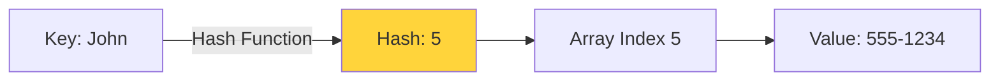
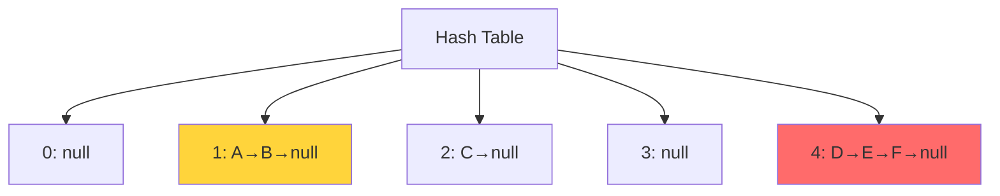
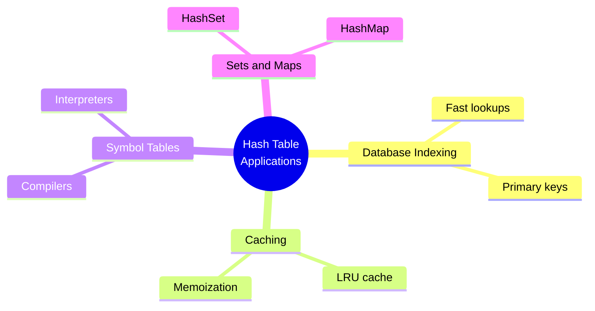

# Session 13: Hash Functions and Hash Tables

[← Back to Module Index]({{ '/docs/AlgorithmsDataStructures/' | relative_url }})

---

## 🎯 Learning Objectives

- Understand hashing and hash tables
- Learn different hash functions
- Master collision resolution techniques
- Analyze complexity of hash operations
- Implement hash table operations

---

## 1. Introduction to Hashing

### What is Hashing?

**Hashing** is a technique to map data of arbitrary size to fixed-size values (hash codes) for fast data retrieval.



**Time Complexity:**
- Insert: O(1) average
- Search: O(1) average
- Delete: O(1) average

---

## 2. Hash Table Structure

```java
class HashTable {
    private static class Entry {
        String key;
        int value;
        Entry next;  // For chaining
        
        Entry(String key, int value) {
            this.key = key;
            this.value = value;
        }
    }
    
    private Entry[] table;
    private int size;
    private int capacity;
    
    public HashTable(int capacity) {
        this.capacity = capacity;
        this.table = new Entry[capacity];
        this.size = 0;
    }
}
```

---

## 3. Hash Functions

### 3.1 Division Method

```java
int hash(int key) {
    return key % capacity;
}
```

**Example**: key = 25, capacity = 10 → hash = 5

### 3.2 Multiplication Method

```java
int hash(int key) {
    double A = 0.6180339887;  // (√5 - 1) / 2
    return (int) (capacity * ((key * A) % 1));
}
```

### 3.3 String Hashing

```java
int hash(String key) {
    int hash = 0;
    for (char c : key.toCharArray()) {
        hash = (hash * 31 + c) % capacity;
    }
    return Math.abs(hash);
}
```

**Good hash function properties:**
- Deterministic
- Uniform distribution
- Fast to compute
- Minimizes collisions

---

## 4. Collision Resolution

### 4.1 Separate Chaining

**Idea**: Each bucket contains a linked list.

```java
// Insert with chaining
void put(String key, int value) {
    int index = hash(key);
    
    Entry entry = table[index];
    
    // Check if key exists
    while (entry != null) {
        if (entry.key.equals(key)) {
            entry.value = value;  // Update
            return;
        }
        entry = entry.next;
    }
    
    // Insert at beginning
    Entry newEntry = new Entry(key, value);
    newEntry.next = table[index];
    table[index] = newEntry;
    size++;
}

// Search with chaining
Integer get(String key) {
    int index = hash(key);
    Entry entry = table[index];
    
    while (entry != null) {
        if (entry.key.equals(key)) {
            return entry.value;
        }
        entry = entry.next;
    }
    
    return null;  // Not found
}
```



### 4.2 Open Addressing

#### Linear Probing

```java
// Insert with linear probing
void put(String key, int value) {
    int index = hash(key);
    int i = 0;
    
    while (table[(index + i) % capacity] != null) {
        if (table[(index + i) % capacity].key.equals(key)) {
            table[(index + i) % capacity].value = value;
            return;
        }
        i++;
    }
    
    table[(index + i) % capacity] = new Entry(key, value);
    size++;
}
```

**Probe sequence**: h(k), h(k)+1, h(k)+2, ...

**Problem**: Primary clustering

#### Quadratic Probing

**Probe sequence**: h(k), h(k)+1², h(k)+2², h(k)+3², ...

```java
int probe(int hash, int i) {
    return (hash + i * i) % capacity;
}
```

**Reduces** primary clustering but **secondary clustering** remains.

#### Double Hashing

```java
int hash1(int key) {
    return key % capacity;
}

int hash2(int key) {
    return 1 + (key % (capacity - 1));
}

int probe(int key, int i) {
    return (hash1(key) + i * hash2(key)) % capacity;
}
```

**Best** open addressing method!

---

## 5. Load Factor

**Load Factor** α = n / m
- n = number of elements
- m = table size

**Chaining**: α can be > 1  
**Open Addressing**: α must be < 1

**Rehashing**: When α > threshold (typically 0.75), create larger table and rehash all elements.

---

## 6. Complexity Analysis


| Method | Average | Worst |
|--------|---------|-------|
| **Chaining** | O(1 + α) | O(n) |
| **Linear Probing** | O(1/(1-α)) | O(n) |
| **Quadratic Probing** | O(1/(1-α)) | O(n) |
| **Double Hashing** | O(1/(1-α)) | O(n) |

**With good hash function and α < 0.75**: O(1) average!

---

## 7. Applications



---

## 8. Key Takeaways

### ✅ Essential Concepts

1. **Hashing**: O(1) average for insert/search/delete
2. **Collision Resolution**:
   - Chaining: Linked lists
   - Open Addressing: Linear, Quadratic, Double hashing
3. **Load Factor**: Keep α < 0.75 for performance

### 🎯 For MCQ Exam

**Focus:**
- Hash function properties
- Collision resolution methods
- Complexity analysis
- When to use hashing

---

[← Previous: Sessions 10-12]({{ '/docs/AlgorithmsDataStructures/session10-12-searching-sorting' | relative_url }}) | [Next: Sessions 14-16 →]({{ '/docs/AlgorithmsDataStructures/session14-16-graphs' | relative_url }})

[← Back to Module Index]({{ '/docs/AlgorithmsDataStructures/' | relative_url }})
