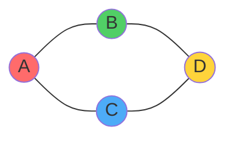
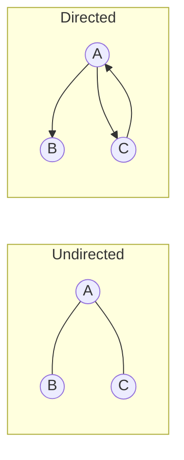
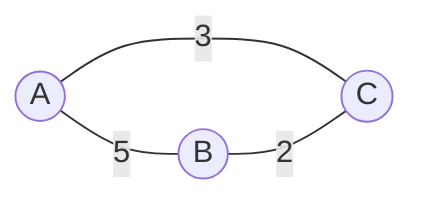

# Sessions 14, 15 & 16: Graphs and Applications

[← Back to Module Index]({{ '/docs/AlgorithmsDataStructures/' | relative_url }})

---

## 🎯 Learning Objectives

- Understand graph theory and terminology
- Learn graph representations (Adjacency Matrix, Adjacency List)
- Master graph traversals (BFS, DFS)
- Implement shortest path algorithms (Dijkstra, Floyd-Warshall)
- Understand minimum spanning trees (Prim's, Kruskal's)

---

## 1. Introduction to Graphs

### What is a Graph?

A **graph** G = (V, E) consists of:
- **V**: Set of vertices (nodes)
- **E**: Set of edges (connections)



---

## 2. Graph Terminology


| Term | Definition |
|------|------------|
| **Vertex (Node)** | A point in the graph |
| **Edge** | Connection between two vertices |
| **Adjacent** | Two vertices connected by an edge |
| **Degree** | Number of edges connected to a vertex |
| **Path** | Sequence of vertices connected by edges |
| **Cycle** | Path that starts and ends at same vertex |
| **Connected** | Path exists between any two vertices |
| **Weighted** | Edges have associated weights/costs |
| **Directed** | Edges have direction (arrows) |

---

## 3. Types of Graphs

### 3.1 Undirected vs Directed



### 3.2 Weighted vs Unweighted



### 3.3 Cyclic vs Acyclic

**Cyclic**: Contains at least one cycle  
**Acyclic**: No cycles (DAG - Directed Acyclic Graph)

---

## 4. Graph Representations

### 4.1 Adjacency Matrix

2D array where `matrix[i][j] = 1` if edge exists.

```java
class GraphMatrix {
    private int[][] adjMatrix;
    private int vertices;
    
    public GraphMatrix(int vertices) {
        this.vertices = vertices;
        adjMatrix = new int[vertices][vertices];
    }
    
    // Add edge - O(1)
    public void addEdge(int src, int dest) {
        adjMatrix[src][dest] = 1;
        adjMatrix[dest][src] = 1;  // For undirected
    }
    
    // Check edge - O(1)
    public boolean hasEdge(int src, int dest) {
        return adjMatrix[src][dest] == 1;
    }
}
```

**Example:**
```
    0  1  2  3
0 [ 0  1  1  0 ]
1 [ 1  0  0  1 ]
2 [ 1  0  0  1 ]
3 [ 0  1  1  0 ]
```

**Pros**: O(1) edge lookup  
**Cons**: O(V²) space

### 4.2 Adjacency List

Array of lists, each list contains neighbors.

```java
class GraphList {
    private LinkedList<Integer>[] adjList;
    private int vertices;
    
    public GraphList(int vertices) {
        this.vertices = vertices;
        adjList = new LinkedList[vertices];
        
        for (int i = 0; i < vertices; i++) {
            adjList[i] = new LinkedList<>();
        }
    }
    
    // Add edge - O(1)
    public void addEdge(int src, int dest) {
        adjList[src].add(dest);
        adjList[dest].add(src);  // For undirected
    }
    
    // Get neighbors - O(1)
    public LinkedList<Integer> getNeighbors(int vertex) {
        return adjList[vertex];
    }
}
```

**Example:**
```
0: [1, 2]
1: [0, 3]
2: [0, 3]
3: [1, 2]
```

**Pros**: O(V + E) space  
**Cons**: O(V) edge lookup

---

## 5. Graph Traversals

### 5.1 Breadth First Search (BFS)

**Uses Queue** - Level by level traversal

```java
void BFS(int start) {
    boolean[] visited = new boolean[vertices];
    Queue<Integer> queue = new LinkedList<>();
    
    visited[start] = true;
    queue.add(start);
    
    while (!queue.isEmpty()) {
        int vertex = queue.poll();
        System.out.print(vertex + " ");
        
        for (int neighbor : adjList[vertex]) {
            if (!visited[neighbor]) {
                visited[neighbor] = true;
                queue.add(neighbor);
            }
        }
    }
}
```

**Time**: O(V + E)  
**Space**: O(V)

**Applications**: Shortest path (unweighted), level-order traversal

### 5.2 Depth First Search (DFS)

**Uses Stack/Recursion** - Go deep first

```java
void DFS(int start) {
    boolean[] visited = new boolean[vertices];
    DFSUtil(start, visited);
}

void DFSUtil(int vertex, boolean[] visited) {
    visited[vertex] = true;
    System.out.print(vertex + " ");
    
    for (int neighbor : adjList[vertex]) {
        if (!visited[neighbor]) {
            DFSUtil(neighbor, visited);
        }
    }
}
```

**Time**: O(V + E)  
**Space**: O(V)

**Applications**: Cycle detection, topological sort, pathfinding

---

## 6. Shortest Path Algorithms

### 6.1 Dijkstra's Algorithm

**Single-source shortest path** for weighted graphs (non-negative weights).

```java
void dijkstra(int src) {
    int[] dist = new int[vertices];
    boolean[] visited = new boolean[vertices];
    
    Arrays.fill(dist, Integer.MAX_VALUE);
    dist[src] = 0;
    
    PriorityQueue<Node> pq = new PriorityQueue<>((a, b) -> a.cost - b.cost);
    pq.add(new Node(src, 0));
    
    while (!pq.isEmpty()) {
        Node current = pq.poll();
        int u = current.vertex;
        
        if (visited[u]) continue;
        visited[u] = true;
        
        for (Edge edge : adjList[u]) {
            int v = edge.dest;
            int weight = edge.weight;
            
            if (dist[u] + weight < dist[v]) {
                dist[v] = dist[u] + weight;
                pq.add(new Node(v, dist[v]));
            }
        }
    }
}
```

**Time**: O((V + E) log V) with priority queue  
**Space**: O(V)

### 6.2 Floyd-Warshall Algorithm

**All-pairs shortest path**

```java
void floydWarshall() {
    int[][] dist = new int[vertices][vertices];
    
    // Initialize
    for (int i = 0; i < vertices; i++) {
        for (int j = 0; j < vertices; j++) {
            if (i == j) dist[i][j] = 0;
            else if (adjMatrix[i][j] != 0) dist[i][j] = adjMatrix[i][j];
            else dist[i][j] = Integer.MAX_VALUE;
        }
    }
    
    // Floyd-Warshall
    for (int k = 0; k < vertices; k++) {
        for (int i = 0; i < vertices; i++) {
            for (int j = 0; j < vertices; j++) {
                if (dist[i][k] != Integer.MAX_VALUE && 
                    dist[k][j] != Integer.MAX_VALUE &&
                    dist[i][k] + dist[k][j] < dist[i][j]) {
                    dist[i][j] = dist[i][k] + dist[k][j];
                }
            }
        }
    }
}
```

**Time**: O(V³)  
**Space**: O(V²)

---

## 7. Minimum Spanning Tree

### 7.1 Prim's Algorithm

**Greedy approach** - Grow tree from single vertex

```java
void primMST() {
    boolean[] inMST = new boolean[vertices];
    int[] key = new int[vertices];
    int[] parent = new int[vertices];
    
    Arrays.fill(key, Integer.MAX_VALUE);
    key[0] = 0;
    parent[0] = -1;
    
    PriorityQueue<Node> pq = new PriorityQueue<>((a, b) -> a.cost - b.cost);
    pq.add(new Node(0, 0));
    
    while (!pq.isEmpty()) {
        int u = pq.poll().vertex;
        inMST[u] = true;
        
        for (Edge edge : adjList[u]) {
            int v = edge.dest;
            int weight = edge.weight;
            
            if (!inMST[v] && weight < key[v]) {
                key[v] = weight;
                parent[v] = u;
                pq.add(new Node(v, key[v]));
            }
        }
    }
}
```

**Time**: O(E log V)

### 7.2 Kruskal's Algorithm

**Greedy approach** - Sort edges, add if no cycle

```java
void kruskalMST() {
    List<Edge> edges = getAllEdges();
    Collections.sort(edges);  // Sort by weight
    
    DisjointSet ds = new DisjointSet(vertices);
    List<Edge> mst = new ArrayList<>();
    
    for (Edge edge : edges) {
        int x = ds.find(edge.src);
        int y = ds.find(edge.dest);
        
        if (x != y) {  // No cycle
            mst.add(edge);
            ds.union(x, y);
        }
    }
}
```

**Time**: O(E log E)

---

## 8. Key Takeaways

### ✅ Essential Concepts

1. **Graph Representations**:
   - Adjacency Matrix: O(V²) space, O(1) lookup
   - Adjacency List: O(V+E) space, better for sparse graphs

2. **Traversals**:
   - BFS: Queue, shortest path (unweighted)
   - DFS: Stack/recursion, cycle detection

3. **Shortest Path**:
   - Dijkstra: Single-source, O((V+E) log V)
   - Floyd-Warshall: All-pairs, O(V³)

4. **MST**:
   - Prim's: O(E log V)
   - Kruskal's: O(E log E)

### 🎯 For MCQ Exam

**Focus:**
- Graph terminology
- When to use matrix vs list
- BFS vs DFS applications
- Shortest path algorithms
- MST algorithms

---

[← Previous: Session 13]({{ '/docs/AlgorithmsDataStructures/session13-hashing' | relative_url }}) | [Next: Sessions 17-18 →]({{ '/docs/AlgorithmsDataStructures/session17-18-algorithm-design' | relative_url }})

[← Back to Module Index]({{ '/docs/AlgorithmsDataStructures/' | relative_url }})
