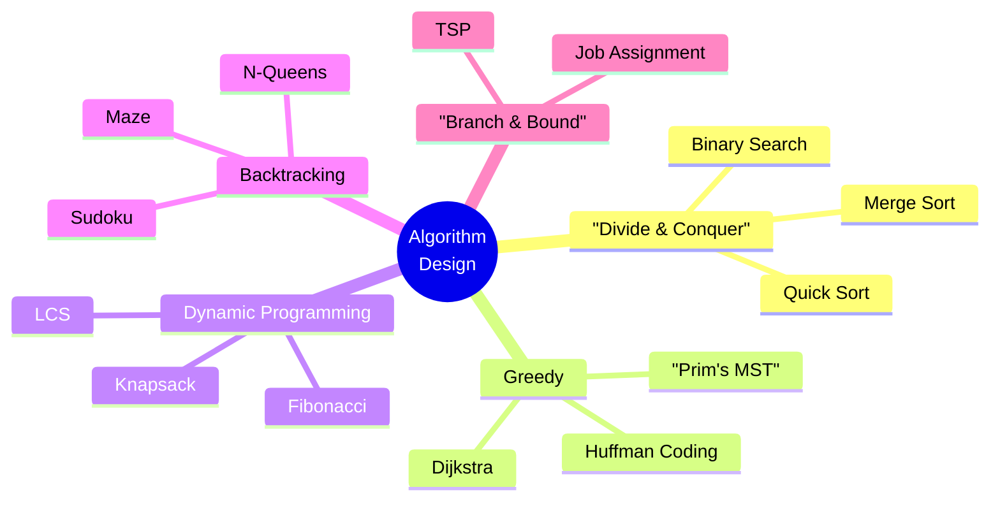
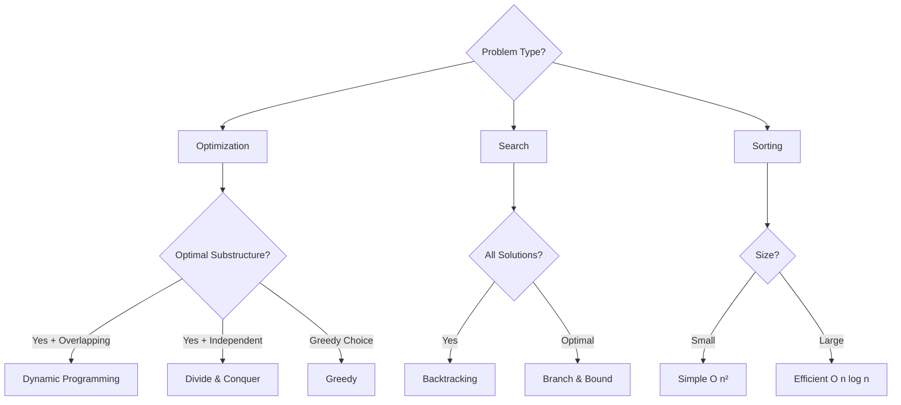

# Sessions 17 & 18: Algorithm Design Techniques

[← Back to Module Index]({{ '/docs/AlgorithmsDataStructures/' | relative_url }})

---

## 🎯 Learning Objectives

- Understand different algorithm design paradigms
- Master divide and conquer, greedy, and dynamic programming
- Learn backtracking and branch-and-bound
- Analyze algorithm complexity
- Know when to apply each technique

---

## 1. Algorithm Design Paradigms



---

## 2. Divide and Conquer

### Concept

1. **Divide**: Break problem into subproblems
2. **Conquer**: Solve subproblems recursively
3. **Combine**: Merge solutions

### Recurrence: T(n) = aT(n/b) + f(n)

### Examples

**Merge Sort**: T(n) = 2T(n/2) + O(n) = O(n log n)

**Binary Search**: T(n) = T(n/2) + O(1) = O(log n)

**Quick Sort**: T(n) = 2T(n/2) + O(n) = O(n log n) average

---

## 3. Greedy Algorithm

### Concept

Make **locally optimal choice** at each step, hoping for global optimum.

### When to Use

- Greedy choice property
- Optimal substructure

### Examples

#### Activity Selection
```java
// Select maximum non-overlapping activities
int activitySelection(int[] start, int[] finish) {
    Arrays.sort(finish);  // Sort by finish time
    
    int count = 1;
    int lastFinish = finish[0];
    
    for (int i = 1; i < finish.length; i++) {
        if (start[i] >= lastFinish) {
            count++;
            lastFinish = finish[i];
        }
    }
    
    return count;
}
```

#### Fractional Knapsack
```java
double fractionalKnapsack(int W, Item[] items) {
    // Sort by value/weight ratio
    Arrays.sort(items, (a, b) -> 
        Double.compare(b.value/b.weight, a.value/a.weight));
    
    double totalValue = 0;
    int currentWeight = 0;
    
    for (Item item : items) {
        if (currentWeight + item.weight <= W) {
            currentWeight += item.weight;
            totalValue += item.value;
        } else {
            int remain = W - currentWeight;
            totalValue += item.value * ((double) remain / item.weight);
            break;
        }
    }
    
    return totalValue;
}
```

**Note**: Greedy doesn't always give optimal solution (e.g., 0/1 Knapsack)

---

## 4. Dynamic Programming

### Concept

Solve problems by breaking into **overlapping subproblems** and storing results (**memoization**).

### When to Use

- Optimal substructure
- Overlapping subproblems

### Top-Down (Memoization) vs Bottom-Up (Tabulation)

#### Fibonacci

**Naive Recursion**: O(2^n)
```java
int fib(int n) {
    if (n <= 1) return n;
    return fib(n-1) + fib(n-2);
}
```

**Memoization**: O(n)
```java
int fibMemo(int n, int[] memo) {
    if (n <= 1) return n;
    if (memo[n] != 0) return memo[n];
    
    memo[n] = fibMemo(n-1, memo) + fibMemo(n-2, memo);
    return memo[n];
}
```

**Tabulation**: O(n)
```java
int fibDP(int n) {
    if (n <= 1) return n;
    
    int[] dp = new int[n + 1];
    dp[0] = 0;
    dp[1] = 1;
    
    for (int i = 2; i <= n; i++) {
        dp[i] = dp[i-1] + dp[i-2];
    }
    
    return dp[n];
}
```

#### 0/1 Knapsack

```java
int knapsack(int W, int[] weights, int[] values, int n) {
    int[][] dp = new int[n + 1][W + 1];
    
    for (int i = 1; i <= n; i++) {
        for (int w = 1; w <= W; w++) {
            if (weights[i-1] <= w) {
                dp[i][w] = Math.max(
                    values[i-1] + dp[i-1][w - weights[i-1]],
                    dp[i-1][w]
                );
            } else {
                dp[i][w] = dp[i-1][w];
            }
        }
    }
    
    return dp[n][W];
}
```

**Time**: O(nW)  
**Space**: O(nW)

#### Longest Common Subsequence

```java
int LCS(String s1, String s2) {
    int m = s1.length(), n = s2.length();
    int[][] dp = new int[m + 1][n + 1];
    
    for (int i = 1; i <= m; i++) {
        for (int j = 1; j <= n; j++) {
            if (s1.charAt(i-1) == s2.charAt(j-1)) {
                dp[i][j] = 1 + dp[i-1][j-1];
            } else {
                dp[i][j] = Math.max(dp[i-1][j], dp[i][j-1]);
            }
        }
    }
    
    return dp[m][n];
}
```

---

## 5. Backtracking

### Concept

Try all possibilities, **backtrack** when solution not feasible.

### Template

```java
void backtrack(state, choices) {
    if (isGoal(state)) {
        recordSolution(state);
        return;
    }
    
    for (choice : choices) {
        if (isValid(choice)) {
            makeChoice(choice);
            backtrack(newState, newChoices);
            undoChoice(choice);  // Backtrack
        }
    }
}
```

### N-Queens Problem

```java
void solveNQueens(int n) {
    int[] board = new int[n];  // board[i] = column of queen in row i
    placeQueens(board, 0, n);
}

void placeQueens(int[] board, int row, int n) {
    if (row == n) {
        printSolution(board);
        return;
    }
    
    for (int col = 0; col < n; col++) {
        if (isSafe(board, row, col)) {
            board[row] = col;
            placeQueens(board, row + 1, n);
            // Backtrack automatically when returning
        }
    }
}

boolean isSafe(int[] board, int row, int col) {
    for (int i = 0; i < row; i++) {
        if (board[i] == col ||  // Same column
            Math.abs(board[i] - col) == Math.abs(i - row)) {  // Diagonal
            return false;
        }
    }
    return true;
}
```

---

## 6. Branch and Bound

### Concept

Like backtracking but uses **bounding function** to prune search space.

### Difference from Backtracking

- Backtracking: DFS, finds all solutions
- Branch & Bound: BFS/Best-first, finds optimal solution

### 0/1 Knapsack (Branch & Bound)

```java
class Node {
    int level, profit, weight;
    double bound;
}

int knapsackBB(int W, int[] weights, int[] values) {
    PriorityQueue<Node> pq = new PriorityQueue<>((a, b) -> 
        Double.compare(b.bound, a.bound));
    
    Node root = new Node();
    root.level = -1;
    root.profit = 0;
    root.weight = 0;
    root.bound = calculateBound(root, W, weights, values);
    
    pq.add(root);
    int maxProfit = 0;
    
    while (!pq.isEmpty()) {
        Node current = pq.poll();
        
        if (current.bound > maxProfit) {
            // Include next item
            Node include = new Node();
            include.level = current.level + 1;
            include.weight = current.weight + weights[include.level];
            include.profit = current.profit + values[include.level];
            
            if (include.weight <= W && include.profit > maxProfit) {
                maxProfit = include.profit;
            }
            
            include.bound = calculateBound(include, W, weights, values);
            if (include.bound > maxProfit) {
                pq.add(include);
            }
            
            // Exclude next item
            Node exclude = new Node();
            exclude.level = current.level + 1;
            exclude.weight = current.weight;
            exclude.profit = current.profit;
            exclude.bound = calculateBound(exclude, W, weights, values);
            
            if (exclude.bound > maxProfit) {
                pq.add(exclude);
            }
        }
    }
    
    return maxProfit;
}
```

---

## 7. Brute Force

### Concept

Try **all possible solutions**, select best.

**Time**: Usually exponential O(2^n) or O(n!)

### When to Use

- Small input size
- No better algorithm known
- Correctness more important than efficiency

---

## 8. Algorithm Selection Guide



---

## 9. Complexity Classes


| Class | Time | Examples |
|-------|------|----------|
| **P** | Polynomial | Sorting, Searching |
| **NP** | Nondeterministic Polynomial | Subset Sum, Knapsack |
| **NP-Complete** | Hardest in NP | SAT, TSP, Graph Coloring |
| **NP-Hard** | At least as hard as NP-Complete | Halting Problem |

---

## 10. Key Takeaways

### ✅ Essential Concepts

1. **Divide & Conquer**: Break, solve, combine
2. **Greedy**: Local optimum, not always global
3. **Dynamic Programming**: Overlapping subproblems, memoization
4. **Backtracking**: Try all, backtrack on failure
5. **Branch & Bound**: Prune with bounds

### 🎯 For MCQ Exam

**Focus:**
- When to use which paradigm
- Complexity analysis
- Greedy vs DP
- Backtracking template
- Real-world applications

---

## 📝 Quick Reference

### Paradigm Selection


| Problem | Technique |
|---------|-----------|
| Fibonacci | DP |
| Merge Sort | Divide & Conquer |
| Activity Selection | Greedy |
| 0/1 Knapsack | DP or Branch & Bound |
| N-Queens | Backtracking |
| Shortest Path | Greedy (Dijkstra) or DP |

---

[← Previous: Sessions 14-16]({{ '/docs/AlgorithmsDataStructures/session14-16-graphs' | relative_url }})

[← Back to Module Index]({{ '/docs/AlgorithmsDataStructures/' | relative_url }})
