# Sessions 2 & 3: Algorithms & Data Structures (Stacks, Queues)

[← Back to Module Index]({{ '/docs/AlgorithmsDataStructures/' | relative_url }})

---

## 🎯 Learning Objectives

By the end of these sessions, you should be able to:
- Understand algorithm constructs and complexity analysis
- Master Big O notation for time and space complexity
- Implement and use stacks and queues
- Understand Abstract Data Types (ADTs)
- Analyze complexity of loops and recursive algorithms

---

## 1. Introduction to Algorithms

### What is an Algorithm?

An **algorithm** is a finite sequence of well-defined instructions to solve a specific problem or perform a computation.

**Properties of a Good Algorithm:**
1. **Input**: Zero or more inputs
2. **Output**: At least one output
3. **Definiteness**: Each step is clear and unambiguous
4. **Finiteness**: Terminates after finite number of steps
5. **Effectiveness**: Steps are basic enough to be executed

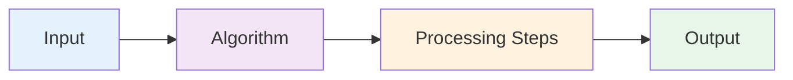

---

## 2. Algorithm Constructs

### 2.1 Sequence

Operations executed one after another.

```java
// Sequential execution
int a = 5;
int b = 10;
int sum = a + b;
System.out.println(sum);
```

### 2.2 Selection (Conditional)

Choose between different paths based on conditions.

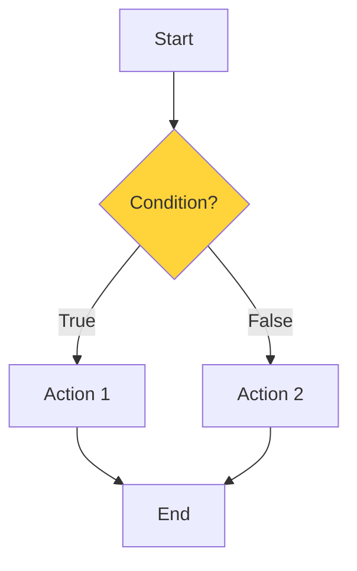

```java
// Selection example
if (score >= 60) {
    grade = "Pass";
} else {
    grade = "Fail";
}
```

### 2.3 Iteration (Loops)

Repeat operations multiple times.

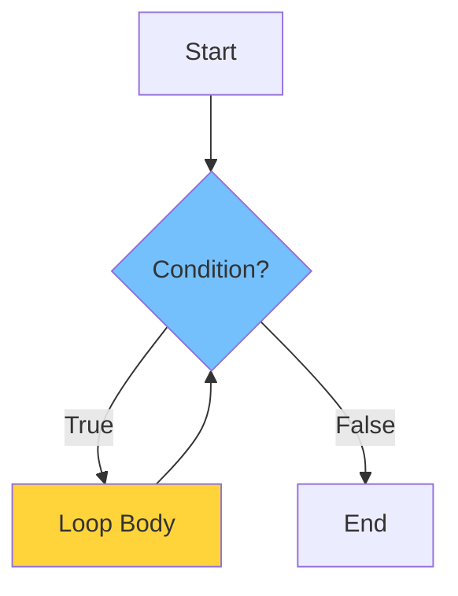

**Types of Loops:**


| Loop Type | Use Case | Example |
|-----------|----------|---------|
| **for** | Known iterations | `for(int i=0; i<n; i++)` |
| **while** | Unknown iterations | `while(condition)` |
| **do-while** | Execute at least once | `do {...} while(condition)` |

---

## 3. Complexity Analysis

### 3.1 Why Analyze Algorithms?

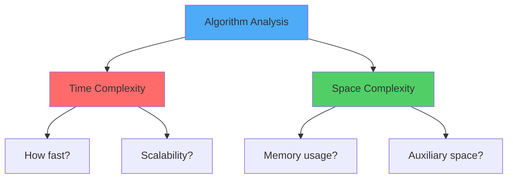

### 3.2 Big O Notation

**Big O** describes the upper bound of algorithm's growth rate.

#### Common Time Complexities

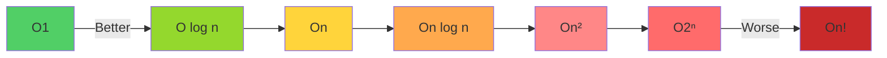

#### Complexity Comparison


| Notation | Name | Example | n=10 | n=100 | n=1000 |
|----------|------|---------|------|-------|--------|
| **O(1)** | Constant | Array access | 1 | 1 | 1 |
| **O(log n)** | Logarithmic | Binary search | 3 | 7 | 10 |
| **O(n)** | Linear | Linear search | 10 | 100 | 1000 |
| **O(n log n)** | Linearithmic | Merge sort | 30 | 664 | 9966 |
| **O(n²)** | Quadratic | Bubble sort | 100 | 10,000 | 1,000,000 |
| **O(2ⁿ)** | Exponential | Fibonacci (naive) | 1024 | 1.27×10³⁰ | ∞ |

### 3.3 Analyzing Loop Complexity

#### Single Loop
```java
// O(n) - Linear time
for (int i = 0; i < n; i++) {
    System.out.println(i);  // O(1) operation
}
// Total: O(n) × O(1) = O(n)
```

#### Nested Loops
```java
// O(n²) - Quadratic time
for (int i = 0; i < n; i++) {        // n times
    for (int j = 0; j < n; j++) {    // n times
        System.out.println(i + j);   // O(1)
    }
}
// Total: O(n) × O(n) × O(1) = O(n²)
```

#### Logarithmic Loop
```java
// O(log n) - Logarithmic time
for (int i = 1; i < n; i *= 2) {
    System.out.println(i);
}
// i: 1, 2, 4, 8, 16, ... n
// Number of iterations: log₂(n)
```

#### Sequential Loops
```java
// O(n + m) → O(n) if m < n
for (int i = 0; i < n; i++) {
    // O(n)
}
for (int j = 0; j < m; j++) {
    // O(m)
}
// Total: O(n + m)
```

### 3.4 Space Complexity

**Space Complexity** = Fixed Space + Variable Space

```java
// O(1) space - constant
int sum(int a, int b) {
    return a + b;  // Only 2 variables
}

// O(n) space - linear
int[] createArray(int n) {
    int[] arr = new int[n];  // Array of size n
    return arr;
}

// O(n) space - recursive stack
int factorial(int n) {
    if (n <= 1) return 1;
    return n * factorial(n - 1);  // n recursive calls
}
```

---

## 4. Abstract Data Types (ADTs)

### What is an ADT?

An **Abstract Data Type** is a mathematical model that defines:
- **Data** stored
- **Operations** that can be performed
- **Behavior** of operations

**ADT vs Data Structure:**

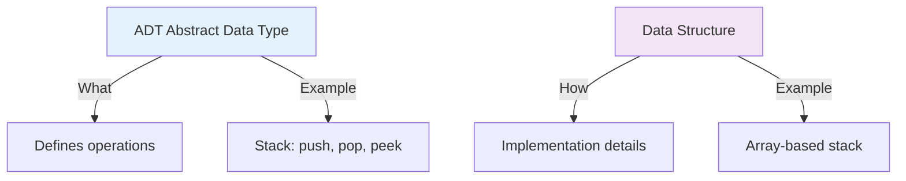

**Key Point:** ADT describes **what** to do, Data Structure describes **how** to do it.

---

## 5. Stack ADT

### 5.1 Stack Concept

A **Stack** is a Last-In-First-Out (LIFO) data structure.

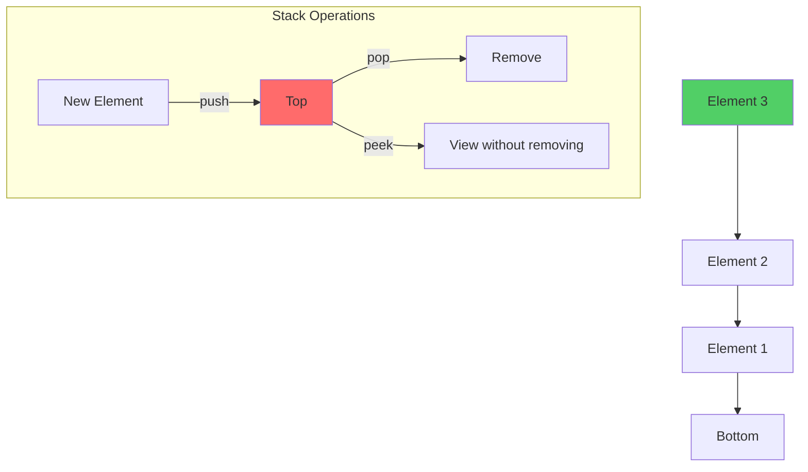

**Real-World Analogy:** Stack of plates - you add/remove from the top only.

### 5.2 Stack Operations


| Operation | Description | Time Complexity |
|-----------|-------------|-----------------|
| **push(x)** | Add element to top | O(1) |
| **pop()** | Remove and return top element | O(1) |
| **peek()** | Return top element without removing | O(1) |
| **isEmpty()** | Check if stack is empty | O(1) |
| **size()** | Return number of elements | O(1) |

### 5.3 Stack Implementation (Array-based)

```java
public class Stack {
    private int[] arr;
    private int top;
    private int capacity;
    
    // Constructor
    public Stack(int size) {
        arr = new int[size];
        capacity = size;
        top = -1;  // Empty stack
    }
    
    // Push operation - O(1)
    public void push(int x) {
        if (isFull()) {
            throw new StackOverflowError("Stack is full");
        }
        arr[++top] = x;
    }
    
    // Pop operation - O(1)
    public int pop() {
        if (isEmpty()) {
            throw new EmptyStackException();
        }
        return arr[top--];
    }
    
    // Peek operation - O(1)
    public int peek() {
        if (isEmpty()) {
            throw new EmptyStackException();
        }
        return arr[top];
    }
    
    // Check if empty - O(1)
    public boolean isEmpty() {
        return top == -1;
    }
    
    // Check if full - O(1)
    public boolean isFull() {
        return top == capacity - 1;
    }
    
    // Get size - O(1)
    public int size() {
        return top + 1;
    }
}
```

### 5.4 Stack Visualization

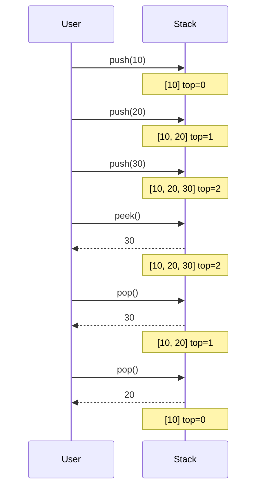

### 5.5 Stack Applications

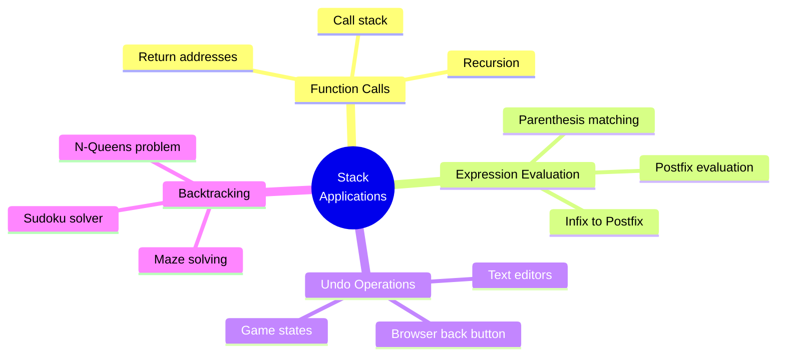

**Example: Balanced Parentheses**
```java
public boolean isBalanced(String expr) {
    Stack<Character> stack = new Stack<>();
    
    for (char ch : expr.toCharArray()) {
        if (ch == '(' || ch == '{' || ch == '[') {
            stack.push(ch);
        } else if (ch == ')' || ch == '}' || ch == ']') {
            if (stack.isEmpty()) return false;
            
            char top = stack.pop();
            if ((ch == ')' && top != '(') ||
                (ch == '}' && top != '{') ||
                (ch == ']' && top != '[')) {
                return false;
            }
        }
    }
    
    return stack.isEmpty();
}

// Test cases:
// "(())" → true
// "({[]})" → true
// "(()" → false
// "({)}" → false
```

---

## 6. Queue ADT

### 6.1 Queue Concept

A **Queue** is a First-In-First-Out (FIFO) data structure.

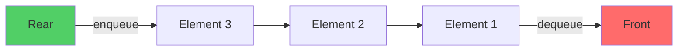

**Real-World Analogy:** Queue at a ticket counter - first person in line is served first.

### 6.2 Queue Operations


| Operation | Description | Time Complexity |
|-----------|-------------|-----------------|
| **enqueue(x)** | Add element to rear | O(1) |
| **dequeue()** | Remove and return front element | O(1) |
| **peek()** | Return front element | O(1) |
| **isEmpty()** | Check if queue is empty | O(1) |
| **size()** | Return number of elements | O(1) |

### 6.3 Queue Implementation (Array-based)

```java
public class Queue {
    private int[] arr;
    private int front;
    private int rear;
    private int capacity;
    private int count;
    
    // Constructor
    public Queue(int size) {
        arr = new int[size];
        capacity = size;
        front = 0;
        rear = -1;
        count = 0;
    }
    
    // Enqueue operation - O(1)
    public void enqueue(int item) {
        if (isFull()) {
            throw new IllegalStateException("Queue is full");
        }
        rear = (rear + 1) % capacity;  // Circular increment
        arr[rear] = item;
        count++;
    }
    
    // Dequeue operation - O(1)
    public int dequeue() {
        if (isEmpty()) {
            throw new NoSuchElementException("Queue is empty");
        }
        int item = arr[front];
        front = (front + 1) % capacity;  // Circular increment
        count--;
        return item;
    }
    
    // Peek operation - O(1)
    public int peek() {
        if (isEmpty()) {
            throw new NoSuchElementException("Queue is empty");
        }
        return arr[front];
    }
    
    // Check if empty - O(1)
    public boolean isEmpty() {
        return count == 0;
    }
    
    // Check if full - O(1)
    public boolean isFull() {
        return count == capacity;
    }
    
    // Get size - O(1)
    public int size() {
        return count;
    }
}
```

### 6.4 Queue Visualization

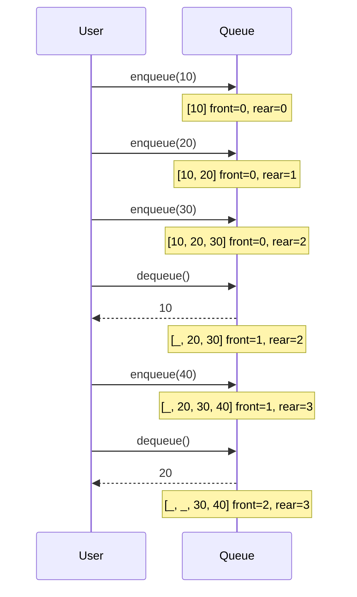

---

## 7. Circular Queue

### 7.1 Why Circular Queue?

**Problem with Linear Queue:**
```
Initial: [10, 20, 30, _, _]  front=0, rear=2
After 2 dequeues: [_, _, 30, _, _]  front=2, rear=2
Problem: Front space wasted!
```

**Solution: Circular Queue**
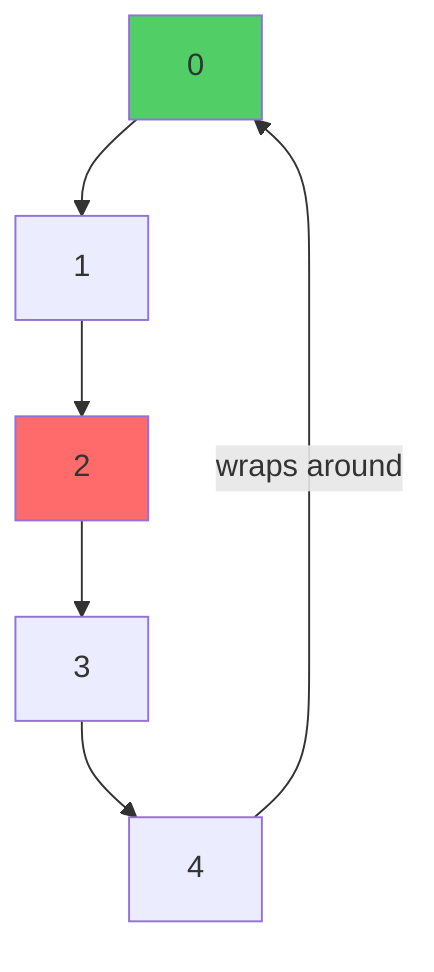

### 7.2 Circular Queue Implementation

```java
public class CircularQueue {
    private int[] arr;
    private int front;
    private int rear;
    private int capacity;
    private int size;
    
    public CircularQueue(int k) {
        arr = new int[k];
        capacity = k;
        front = 0;
        rear = -1;
        size = 0;
    }
    
    // Enqueue - O(1)
    public boolean enqueue(int value) {
        if (isFull()) return false;
        
        rear = (rear + 1) % capacity;  // Circular increment
        arr[rear] = value;
        size++;
        return true;
    }
    
    // Dequeue - O(1)
    public boolean dequeue() {
        if (isEmpty()) return false;
        
        front = (front + 1) % capacity;  // Circular increment
        size--;
        return true;
    }
    
    // Front - O(1)
    public int Front() {
        return isEmpty() ? -1 : arr[front];
    }
    
    // Rear - O(1)
    public int Rear() {
        return isEmpty() ? -1 : arr[rear];
    }
    
    public boolean isEmpty() {
        return size == 0;
    }
    
    public boolean isFull() {
        return size == capacity;
    }
}
```

### 7.3 Circular Queue Visualization

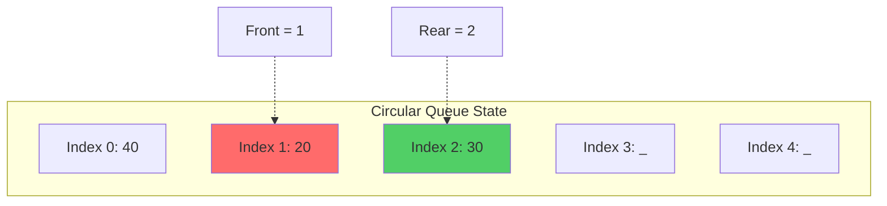

**Operations:**
```
Initial: capacity = 5
enqueue(10): [10, _, _, _, _] front=0, rear=0
enqueue(20): [10, 20, _, _, _] front=0, rear=1
enqueue(30): [10, 20, 30, _, _] front=0, rear=2
dequeue():   [_, 20, 30, _, _] front=1, rear=2
enqueue(40): [_, 20, 30, 40, _] front=1, rear=3
enqueue(50): [_, 20, 30, 40, 50] front=1, rear=4
enqueue(60): [60, 20, 30, 40, 50] front=1, rear=0 (wrapped!)
```

---

## 8. Complexity Analysis Examples

### Example 1: Simple Loop
```java
int sum = 0;
for (int i = 0; i < n; i++) {
    sum += arr[i];
}
```
**Analysis:**
- Loop runs `n` times
- Each iteration: O(1)
- **Time Complexity: O(n)**
- **Space Complexity: O(1)**

### Example 2: Nested Loops
```java
for (int i = 0; i < n; i++) {
    for (int j = 0; j < n; j++) {
        System.out.println(arr[i][j]);
    }
}
```
**Analysis:**
- Outer loop: n times
- Inner loop: n times for each outer iteration
- **Time Complexity: O(n²)**
- **Space Complexity: O(1)**

### Example 3: Logarithmic
```java
int i = 1;
while (i < n) {
    System.out.println(i);
    i *= 2;
}
```
**Analysis:**
- i: 1, 2, 4, 8, 16, ..., n
- Number of iterations: log₂(n)
- **Time Complexity: O(log n)**
- **Space Complexity: O(1)**

### Example 4: Recursive Factorial
```java
int factorial(int n) {
    if (n <= 1) return 1;
    return n * factorial(n - 1);
}
```
**Analysis:**
- Recurrence: T(n) = T(n-1) + O(1)
- Base case: T(1) = O(1)
- **Time Complexity: O(n)**
- **Space Complexity: O(n)** (recursive stack)

### Example 5: Binary Search (Recursive)
```java
int binarySearch(int[] arr, int left, int right, int target) {
    if (left > right) return -1;
    
    int mid = left + (right - left) / 2;
    
    if (arr[mid] == target) return mid;
    if (arr[mid] > target) 
        return binarySearch(arr, left, mid - 1, target);
    return binarySearch(arr, mid + 1, right, target);
}
```
**Analysis:**
- Recurrence: T(n) = T(n/2) + O(1)
- **Time Complexity: O(log n)**
- **Space Complexity: O(log n)** (recursive stack)

---

## 9. Practice Problems

### Problem 1: Implement Stack using Queue
```java
/*
Implement a stack using only queue operations.
Operations: push, pop, top, empty
*/

class MyStack {
    Queue<Integer> q1;
    Queue<Integer> q2;
    
    public MyStack() {
        q1 = new LinkedList<>();
        q2 = new LinkedList<>();
    }
    
    // Push: O(n)
    public void push(int x) {
        q2.add(x);
        while (!q1.isEmpty()) {
            q2.add(q1.remove());
        }
        Queue<Integer> temp = q1;
        q1 = q2;
        q2 = temp;
    }
    
    // Pop: O(1)
    public int pop() {
        return q1.remove();
    }
    
    // Top: O(1)
    public int top() {
        return q1.peek();
    }
    
    // Empty: O(1)
    public boolean empty() {
        return q1.isEmpty();
    }
}
```

### Problem 2: Implement Queue using Stack
```java
/*
Implement a queue using only stack operations.
Operations: enqueue, dequeue, peek, empty
*/

class MyQueue {
    Stack<Integer> s1;  // For enqueue
    Stack<Integer> s2;  // For dequeue
    
    public MyQueue() {
        s1 = new Stack<>();
        s2 = new Stack<>();
    }
    
    // Enqueue: O(1)
    public void push(int x) {
        s1.push(x);
    }
    
    // Dequeue: Amortized O(1)
    public int pop() {
        if (s2.isEmpty()) {
            while (!s1.isEmpty()) {
                s2.push(s1.pop());
            }
        }
        return s2.pop();
    }
    
    // Peek: Amortized O(1)
    public int peek() {
        if (s2.isEmpty()) {
            while (!s1.isEmpty()) {
                s2.push(s1.pop());
            }
        }
        return s2.peek();
    }
    
    // Empty: O(1)
    public boolean empty() {
        return s1.isEmpty() && s2.isEmpty();
    }
}
```

### Problem 3: Valid Parentheses
```java
/*
Given a string containing '(', ')', '{', '}', '[', ']',
determine if the input string is valid.
*/

public boolean isValid(String s) {
    Stack<Character> stack = new Stack<>();
    
    for (char c : s.toCharArray()) {
        if (c == '(') stack.push(')');
        else if (c == '{') stack.push('}');
        else if (c == '[') stack.push(']');
        else if (stack.isEmpty() || stack.pop() != c) {
            return false;
        }
    }
    
    return stack.isEmpty();
}

// Time: O(n), Space: O(n)
```

### Problem 4: Next Greater Element
```java
/*
Find the next greater element for each element in array.
If no greater element exists, return -1.
Input: [4, 5, 2, 10]
Output: [5, 10, 10, -1]
*/

public int[] nextGreaterElement(int[] nums) {
    int n = nums.length;
    int[] result = new int[n];
    Stack<Integer> stack = new Stack<>();
    
    // Traverse from right to left
    for (int i = n - 1; i >= 0; i--) {
        // Pop smaller elements
        while (!stack.isEmpty() && stack.peek() <= nums[i]) {
            stack.pop();
        }
        
        result[i] = stack.isEmpty() ? -1 : stack.peek();
        stack.push(nums[i]);
    }
    
    return result;
}

// Time: O(n), Space: O(n)
```

---

## 10. Key Takeaways

### ✅ Essential Concepts

1. **Big O Notation**
   - O(1) < O(log n) < O(n) < O(n log n) < O(n²) < O(2ⁿ) < O(n!)
   - Focus on dominant term, ignore constants

2. **Stack (LIFO)**
   - All operations: O(1)
   - Applications: Function calls, expression evaluation, undo

3. **Queue (FIFO)**
   - All operations: O(1)
   - Applications: BFS, scheduling, buffering

4. **Circular Queue**
   - Efficient space utilization
   - Use modulo for circular increment

### 🎯 For MCQ Exam

**Common Question Types:**

1. **Complexity Analysis**
   - "What is the time complexity of [code]?"
   - "Which has better complexity: [algo1] or [algo2]?"

2. **Stack/Queue Operations**
   - "After these operations, what is the state?"
   - "Which data structure is best for [scenario]?"

3. **Applications**
   - "Which data structure for function calls?"
   - "How to check balanced parentheses?"

4. **Implementation**
   - "What happens when stack overflows?"
   - "How does circular queue handle wrap-around?"

---

## 📝 Quick Revision

### Complexity Cheat Sheet
- **Single loop**: O(n)
- **Nested loops**: O(n²)
- **Halving**: O(log n)
- **Divide & Conquer**: O(n log n)
- **Recursive calls**: Check recurrence relation

### Stack vs Queue


| Feature | Stack | Queue |
|---------|-------|-------|
| Order | LIFO | FIFO |
| Insert | push (top) | enqueue (rear) |
| Remove | pop (top) | dequeue (front) |
| View | peek (top) | peek (front) |
| Use Case | Undo, recursion | Scheduling, BFS |

---

[← Previous: Session 1]({{ '/docs/AlgorithmsDataStructures/session1-problem-solving' | relative_url }}) | [Next: Sessions 4-5 →]({{ '/docs/AlgorithmsDataStructures/session4-5-linked-lists' | relative_url }})

[← Back to Module Index]({{ '/docs/AlgorithmsDataStructures/' | relative_url }})
