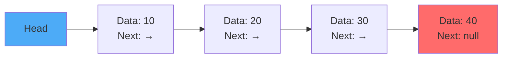
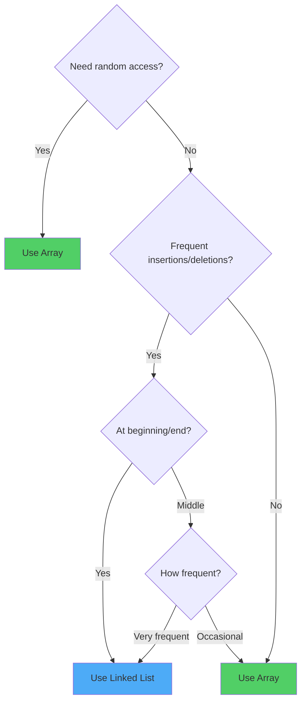
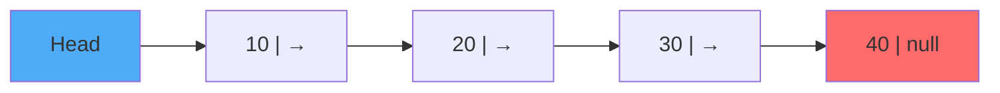
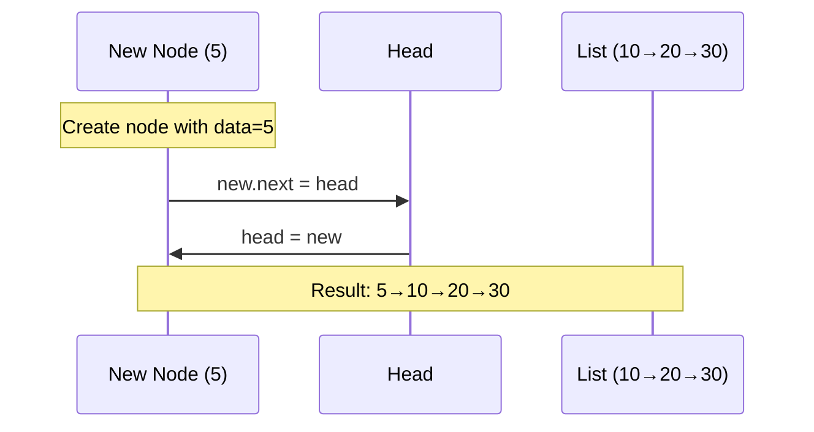
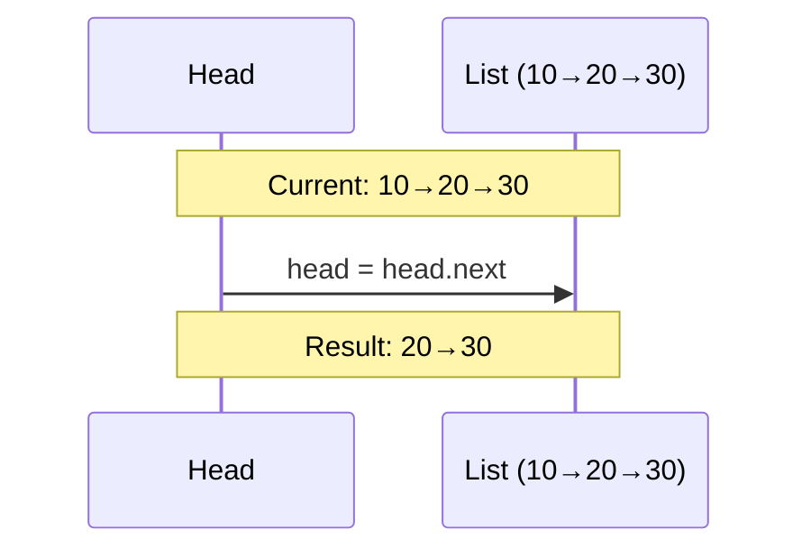
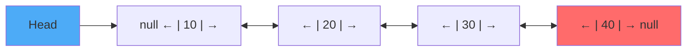
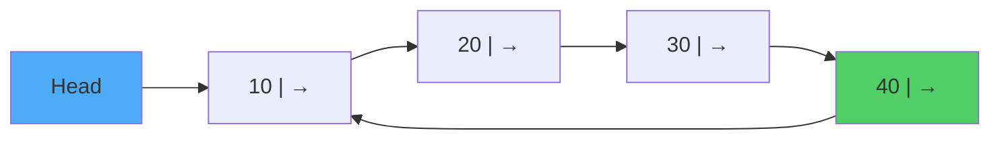
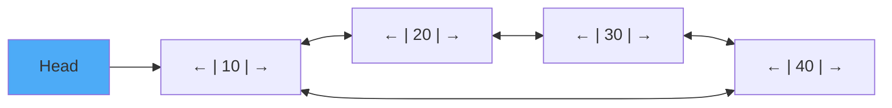
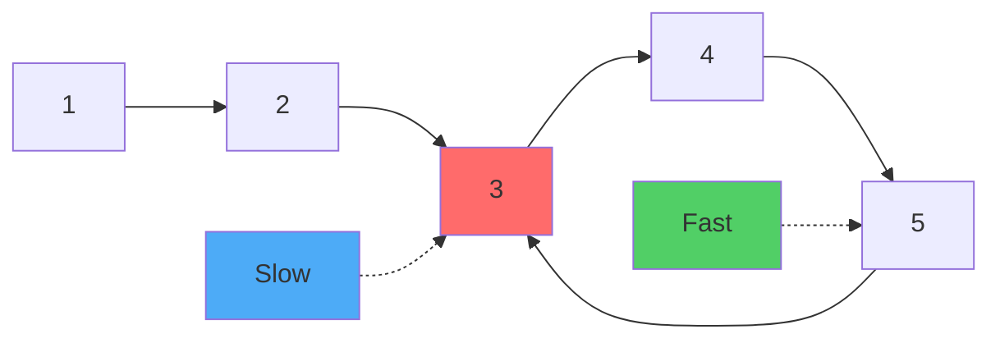

# Sessions 4 & 5: Linked List Data Structures

[← Back to Module Index]({{ '/docs/AlgorithmsDataStructures/' | relative_url }})

---

## 🎯 Learning Objectives

By the end of these sessions, you should be able to:
- Understand linked list structure and node-based storage
- Implement singly, doubly, and circular linked lists
- Compare linked lists with arrays
- Implement stack and circular queue using linked lists
- Analyze time and space complexity of linked list operations

---

## 1. Introduction to Linked Lists

### What is a Linked List?

A **Linked List** is a linear data structure where elements are stored in nodes, and each node points to the next node in the sequence.



**Key Components:**
- **Node**: Contains data and reference to next node
- **Head**: Reference to the first node
- **Tail**: Reference to the last node (optional)

### Node Structure

```java
class Node {
    int data;       // Data part
    Node next;      // Reference to next node
    
    // Constructor
    Node(int data) {
        this.data = data;
        this.next = null;
    }
}
```

---

## 2. Arrays vs Linked Lists

### Comparison Table


| Feature | Array | Linked List |
|---------|-------|-------------|
| **Memory** | Contiguous | Non-contiguous |
| **Size** | Fixed (static) | Dynamic |
| **Access** | O(1) random access | O(n) sequential |
| **Insertion (beginning)** | O(n) | O(1) |
| **Insertion (end)** | O(1) if space available | O(n) without tail, O(1) with tail |
| **Deletion (beginning)** | O(n) | O(1) |
| **Search** | O(n) unsorted, O(log n) sorted | O(n) |
| **Memory overhead** | No extra | Extra for pointers |
| **Cache performance** | Better (locality) | Worse (scattered) |

### When to Use What?



**Use Array when:**
- Need random access
- Size is known and fixed
- Memory is limited (no pointer overhead)
- Cache performance matters

**Use Linked List when:**
- Frequent insertions/deletions at beginning
- Size is unknown or varies greatly
- Don't need random access
- Memory fragmentation is acceptable

---

## 3. Singly Linked List

### 3.1 Structure



### 3.2 Implementation

```java
public class SinglyLinkedList {
    private Node head;
    private int size;
    
    // Node class
    private static class Node {
        int data;
        Node next;
        
        Node(int data) {
            this.data = data;
            this.next = null;
        }
    }
    
    // Constructor
    public SinglyLinkedList() {
        this.head = null;
        this.size = 0;
    }
    
    // Insert at beginning - O(1)
    public void insertAtBeginning(int data) {
        Node newNode = new Node(data);
        newNode.next = head;
        head = newNode;
        size++;
    }
    
    // Insert at end - O(n)
    public void insertAtEnd(int data) {
        Node newNode = new Node(data);
        
        if (head == null) {
            head = newNode;
        } else {
            Node current = head;
            while (current.next != null) {
                current = current.next;
            }
            current.next = newNode;
        }
        size++;
    }
    
    // Insert at position - O(n)
    public void insertAtPosition(int data, int position) {
        if (position < 0 || position > size) {
            throw new IndexOutOfBoundsException();
        }
        
        if (position == 0) {
            insertAtBeginning(data);
            return;
        }
        
        Node newNode = new Node(data);
        Node current = head;
        
        for (int i = 0; i < position - 1; i++) {
            current = current.next;
        }
        
        newNode.next = current.next;
        current.next = newNode;
        size++;
    }
    
    // Delete from beginning - O(1)
    public int deleteFromBeginning() {
        if (head == null) {
            throw new NoSuchElementException("List is empty");
        }
        
        int data = head.data;
        head = head.next;
        size--;
        return data;
    }
    
    // Delete from end - O(n)
    public int deleteFromEnd() {
        if (head == null) {
            throw new NoSuchElementException("List is empty");
        }
        
        if (head.next == null) {
            int data = head.data;
            head = null;
            size--;
            return data;
        }
        
        Node current = head;
        while (current.next.next != null) {
            current = current.next;
        }
        
        int data = current.next.data;
        current.next = null;
        size--;
        return data;
    }
    
    // Search - O(n)
    public boolean search(int key) {
        Node current = head;
        while (current != null) {
            if (current.data == key) {
                return true;
            }
            current = current.next;
        }
        return false;
    }
    
    // Display - O(n)
    public void display() {
        Node current = head;
        while (current != null) {
            System.out.print(current.data + " -> ");
            current = current.next;
        }
        System.out.println("null");
    }
    
    // Get size - O(1)
    public int size() {
        return size;
    }
    
    // Reverse the list - O(n)
    public void reverse() {
        Node prev = null;
        Node current = head;
        Node next = null;
        
        while (current != null) {
            next = current.next;  // Store next
            current.next = prev;  // Reverse link
            prev = current;       // Move prev forward
            current = next;       // Move current forward
        }
        
        head = prev;
    }
}
```

### 3.3 Operation Visualization

**Insert at Beginning:**


**Delete from Beginning:**


---

## 4. Doubly Linked List

### 4.1 Structure



**Advantages:**
- Can traverse in both directions
- Easier deletion (no need for previous node)
- Can insert before a given node

**Disadvantages:**
- Extra memory for previous pointer
- More complex operations

### 4.2 Implementation

```java
public class DoublyLinkedList {
    private Node head;
    private Node tail;
    private int size;
    
    // Node class
    private static class Node {
        int data;
        Node next;
        Node prev;
        
        Node(int data) {
            this.data = data;
            this.next = null;
            this.prev = null;
        }
    }
    
    // Constructor
    public DoublyLinkedList() {
        this.head = null;
        this.tail = null;
        this.size = 0;
    }
    
    // Insert at beginning - O(1)
    public void insertAtBeginning(int data) {
        Node newNode = new Node(data);
        
        if (head == null) {
            head = tail = newNode;
        } else {
            newNode.next = head;
            head.prev = newNode;
            head = newNode;
        }
        size++;
    }
    
    // Insert at end - O(1) with tail pointer
    public void insertAtEnd(int data) {
        Node newNode = new Node(data);
        
        if (tail == null) {
            head = tail = newNode;
        } else {
            tail.next = newNode;
            newNode.prev = tail;
            tail = newNode;
        }
        size++;
    }
    
    // Delete node - O(1) if node reference is given
    public void deleteNode(Node node) {
        if (node == null) return;
        
        if (node.prev != null) {
            node.prev.next = node.next;
        } else {
            head = node.next;
        }
        
        if (node.next != null) {
            node.next.prev = node.prev;
        } else {
            tail = node.prev;
        }
        
        size--;
    }
    
    // Display forward - O(n)
    public void displayForward() {
        Node current = head;
        while (current != null) {
            System.out.print(current.data + " <-> ");
            current = current.next;
        }
        System.out.println("null");
    }
    
    // Display backward - O(n)
    public void displayBackward() {
        Node current = tail;
        while (current != null) {
            System.out.print(current.data + " <-> ");
            current = current.prev;
        }
        System.out.println("null");
    }
}
```

---

## 5. Circular Linked List

### 5.1 Singly Circular Linked List



**Key Feature:** Last node points back to first node (no null)

### 5.2 Implementation

```java
public class CircularLinkedList {
    private Node head;
    private int size;
    
    private static class Node {
        int data;
        Node next;
        
        Node(int data) {
            this.data = data;
            this.next = null;
        }
    }
    
    // Insert at beginning - O(n)
    public void insertAtBeginning(int data) {
        Node newNode = new Node(data);
        
        if (head == null) {
            head = newNode;
            newNode.next = head;  // Point to itself
        } else {
            Node current = head;
            while (current.next != head) {
                current = current.next;
            }
            newNode.next = head;
            current.next = newNode;
            head = newNode;
        }
        size++;
    }
    
    // Insert at end - O(n)
    public void insertAtEnd(int data) {
        Node newNode = new Node(data);
        
        if (head == null) {
            head = newNode;
            newNode.next = head;
        } else {
            Node current = head;
            while (current.next != head) {
                current = current.next;
            }
            current.next = newNode;
            newNode.next = head;
        }
        size++;
    }
    
    // Display - O(n)
    public void display() {
        if (head == null) return;
        
        Node current = head;
        do {
            System.out.print(current.data + " -> ");
            current = current.next;
        } while (current != head);
        System.out.println("(back to head)");
    }
}
```

### 5.3 Doubly Circular Linked List



**Applications:**
- Round-robin scheduling
- Music playlist (loop mode)
- Browser tab cycling
- Undo/Redo with circular buffer

---

## 6. Stack using Linked List

### Implementation

```java
public class LinkedStack {
    private Node top;
    private int size;
    
    private static class Node {
        int data;
        Node next;
        
        Node(int data) {
            this.data = data;
            this.next = null;
        }
    }
    
    // Push - O(1)
    public void push(int data) {
        Node newNode = new Node(data);
        newNode.next = top;
        top = newNode;
        size++;
    }
    
    // Pop - O(1)
    public int pop() {
        if (isEmpty()) {
            throw new EmptyStackException();
        }
        int data = top.data;
        top = top.next;
        size--;
        return data;
    }
    
    // Peek - O(1)
    public int peek() {
        if (isEmpty()) {
            throw new EmptyStackException();
        }
        return top.data;
    }
    
    // isEmpty - O(1)
    public boolean isEmpty() {
        return top == null;
    }
    
    // size - O(1)
    public int size() {
        return size;
    }
}
```

**Advantages over Array-based Stack:**
- No size limit (dynamic)
- No stack overflow (until memory runs out)
- Efficient memory usage

**Disadvantages:**
- Extra memory for pointers
- No random access

---

## 7. Circular Queue using Linked List

### Implementation

```java
public class LinkedCircularQueue {
    private Node front;
    private Node rear;
    private int size;
    
    private static class Node {
        int data;
        Node next;
        
        Node(int data) {
            this.data = data;
            this.next = null;
        }
    }
    
    // Enqueue - O(1)
    public void enqueue(int data) {
        Node newNode = new Node(data);
        
        if (isEmpty()) {
            front = rear = newNode;
            rear.next = front;  // Circular
        } else {
            rear.next = newNode;
            rear = newNode;
            rear.next = front;  // Maintain circular
        }
        size++;
    }
    
    // Dequeue - O(1)
    public int dequeue() {
        if (isEmpty()) {
            throw new NoSuchElementException("Queue is empty");
        }
        
        int data = front.data;
        
        if (front == rear) {  // Only one element
            front = rear = null;
        } else {
            front = front.next;
            rear.next = front;  // Maintain circular
        }
        
        size--;
        return data;
    }
    
    // Peek - O(1)
    public int peek() {
        if (isEmpty()) {
            throw new NoSuchElementException("Queue is empty");
        }
        return front.data;
    }
    
    // isEmpty - O(1)
    public boolean isEmpty() {
        return front == null;
    }
    
    // size - O(1)
    public int size() {
        return size;
    }
    
    // Display - O(n)
    public void display() {
        if (isEmpty()) return;
        
        Node current = front;
        do {
            System.out.print(current.data + " ");
            current = current.next;
        } while (current != front);
        System.out.println();
    }
}
```

**Advantages:**
- No size limit
- No wasted space
- True circular behavior

---

## 8. Common Linked List Problems

### Problem 1: Reverse a Linked List

```java
// Iterative approach - O(n) time, O(1) space
public Node reverse(Node head) {
    Node prev = null;
    Node current = head;
    Node next = null;
    
    while (current != null) {
        next = current.next;    // Save next
        current.next = prev;    // Reverse link
        prev = current;         // Move prev
        current = next;         // Move current
    }
    
    return prev;  // New head
}

// Recursive approach - O(n) time, O(n) space
public Node reverseRecursive(Node head) {
    if (head == null || head.next == null) {
        return head;
    }
    
    Node newHead = reverseRecursive(head.next);
    head.next.next = head;
    head.next = null;
    
    return newHead;
}
```

### Problem 2: Detect Cycle (Floyd's Algorithm)

```java
// Floyd's Cycle Detection - O(n) time, O(1) space
public boolean hasCycle(Node head) {
    if (head == null) return false;
    
    Node slow = head;
    Node fast = head;
    
    while (fast != null && fast.next != null) {
        slow = slow.next;           // Move 1 step
        fast = fast.next.next;      // Move 2 steps
        
        if (slow == fast) {
            return true;  // Cycle detected
        }
    }
    
    return false;
}
```

**Visualization:**


### Problem 3: Find Middle Element

```java
// Two pointer approach - O(n) time, O(1) space
public Node findMiddle(Node head) {
    if (head == null) return null;
    
    Node slow = head;
    Node fast = head;
    
    while (fast != null && fast.next != null) {
        slow = slow.next;
        fast = fast.next.next;
    }
    
    return slow;  // Middle node
}
```

### Problem 4: Merge Two Sorted Lists

```java
// O(n + m) time, O(1) space
public Node mergeSorted(Node l1, Node l2) {
    Node dummy = new Node(0);
    Node current = dummy;
    
    while (l1 != null && l2 != null) {
        if (l1.data <= l2.data) {
            current.next = l1;
            l1 = l1.next;
        } else {
            current.next = l2;
            l2 = l2.next;
        }
        current = current.next;
    }
    
    // Attach remaining
    current.next = (l1 != null) ? l1 : l2;
    
    return dummy.next;
}
```

### Problem 5: Remove Nth Node from End

```java
// One pass solution - O(n) time, O(1) space
public Node removeNthFromEnd(Node head, int n) {
    Node dummy = new Node(0);
    dummy.next = head;
    
    Node first = dummy;
    Node second = dummy;
    
    // Move first n+1 steps ahead
    for (int i = 0; i <= n; i++) {
        first = first.next;
    }
    
    // Move both until first reaches end
    while (first != null) {
        first = first.next;
        second = second.next;
    }
    
    // Remove nth node
    second.next = second.next.next;
    
    return dummy.next;
}
```

---

## 9. Complexity Analysis Summary

### Singly Linked List


| Operation | Time | Space |
|-----------|------|-------|
| Insert at beginning | O(1) | O(1) |
| Insert at end | O(n) | O(1) |
| Insert at position | O(n) | O(1) |
| Delete from beginning | O(1) | O(1) |
| Delete from end | O(n) | O(1) |
| Search | O(n) | O(1) |
| Access by index | O(n) | O(1) |

### Doubly Linked List


| Operation | Time | Space |
|-----------|------|-------|
| Insert at beginning | O(1) | O(1) |
| Insert at end | O(1) with tail | O(1) |
| Delete node (given reference) | O(1) | O(1) |
| Search | O(n) | O(1) |
| Traverse backward | O(n) | O(1) |

### Circular Linked List


| Operation | Time | Space |
|-----------|------|-------|
| Insert at beginning | O(n) | O(1) |
| Insert at end | O(n) | O(1) |
| Traverse | O(n) | O(1) |

---

## 10. Key Takeaways

### ✅ Essential Concepts

1. **Linked List Basics**
   - Node-based storage
   - Dynamic size
   - Non-contiguous memory

2. **Types**
   - Singly: One direction
   - Doubly: Both directions
   - Circular: Last → First

3. **When to Use**
   - Frequent insertions/deletions at beginning
   - Unknown size
   - Don't need random access

4. **Common Patterns**
   - Two pointers (slow/fast)
   - Dummy node
   - Recursion

### 🎯 For MCQ Exam

**Common Question Types:**

1. **Complexity Questions**
   - "Time complexity of inserting at end in singly linked list?"
   - "Space complexity of reversing a linked list?"

2. **Operation Questions**
   - "After these operations, what is the state?"
   - "How many pointers need to be updated?"

3. **Comparison Questions**
   - "Array vs Linked List for [scenario]?"
   - "Singly vs Doubly linked list?"

4. **Algorithm Questions**
   - "How to detect cycle?"
   - "How to find middle element?"

---

## 📝 Quick Revision

### Key Differences


| Feature | Singly | Doubly | Circular |
|---------|--------|--------|----------|
| Pointers per node | 1 (next) | 2 (next, prev) | 1 or 2 |
| Traversal | Forward only | Both directions | Circular |
| Memory | Less | More | Same as base |
| Delete node | Need previous | Direct | Need traversal |
| Last node points to | null | null | First node |

### Important Algorithms
- **Reverse**: 3 pointers (prev, current, next)
- **Cycle Detection**: Floyd's (slow/fast pointers)
- **Middle**: Two pointers (slow/fast)
- **Merge**: Dummy node + two pointers

---

[← Previous: Sessions 2-3]({{ '/docs/AlgorithmsDataStructures/session2-3-algorithms-basics' | relative_url }}) | [Next: Session 6 →]({{ '/docs/AlgorithmsDataStructures/session6-recursion' | relative_url }})

[← Back to Module Index]({{ '/docs/AlgorithmsDataStructures/' | relative_url }})
