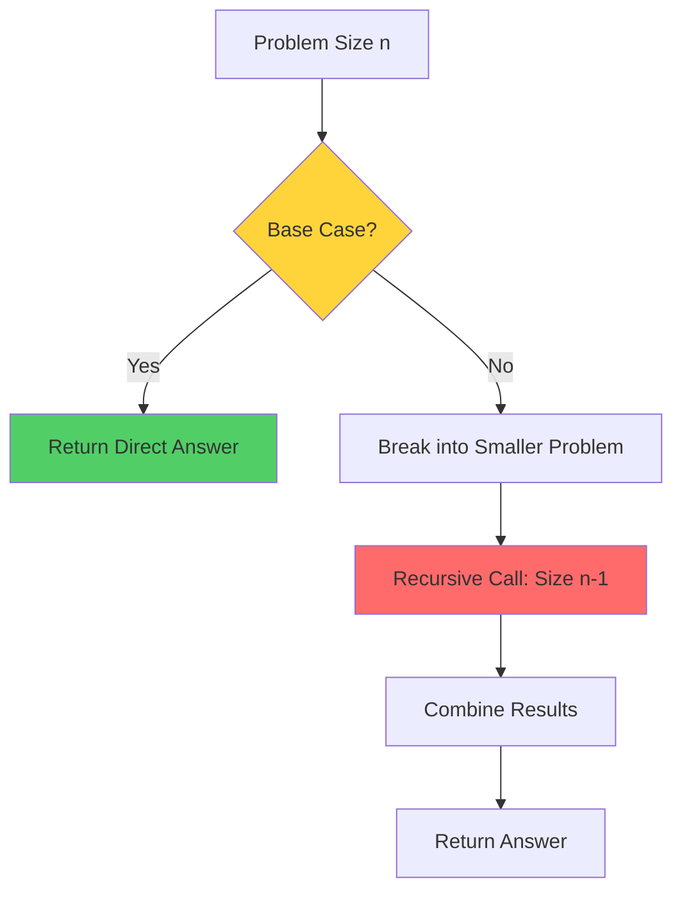
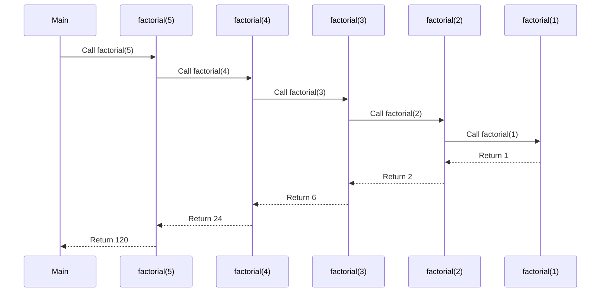
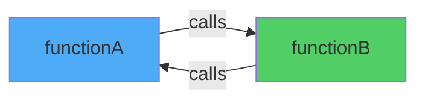
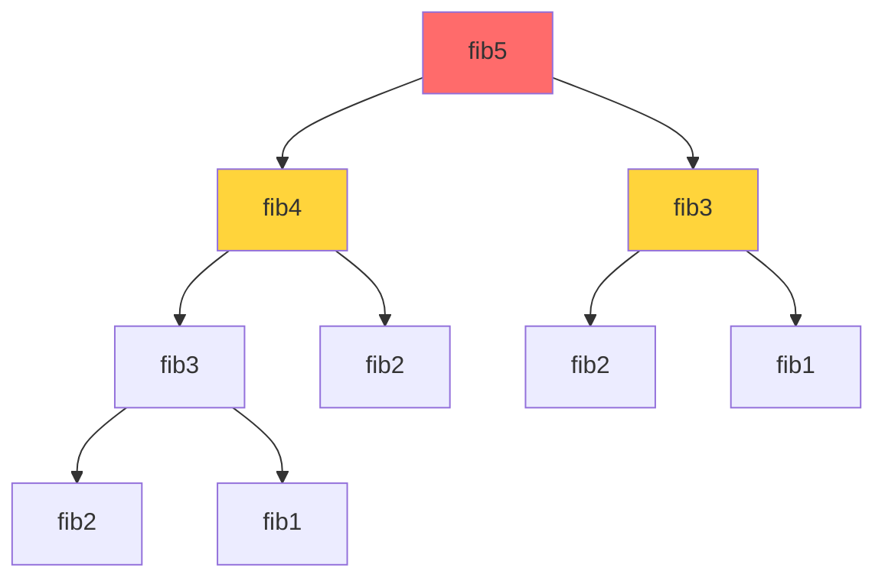
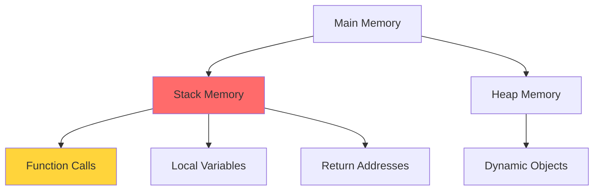
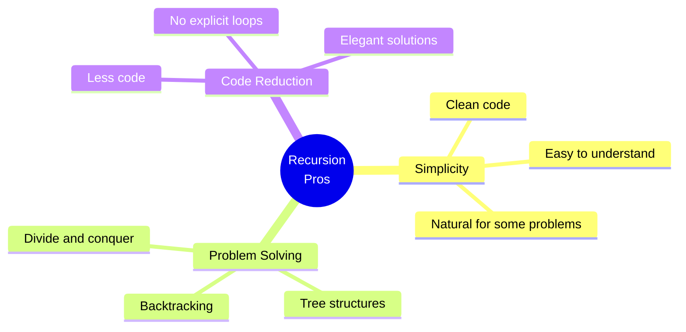
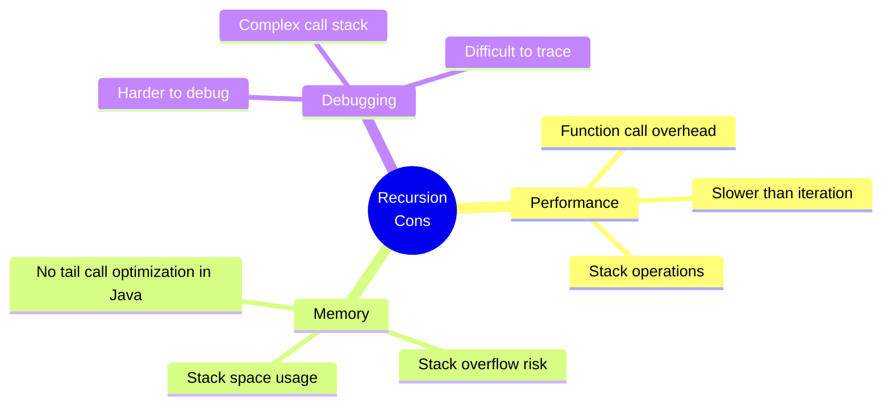
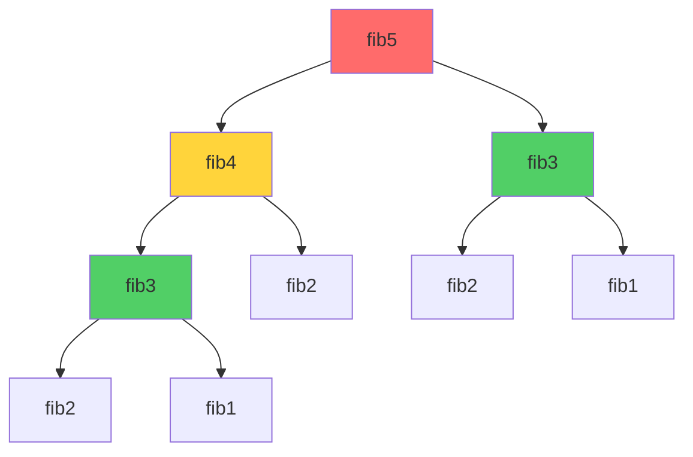
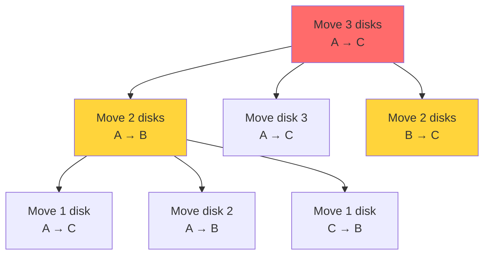
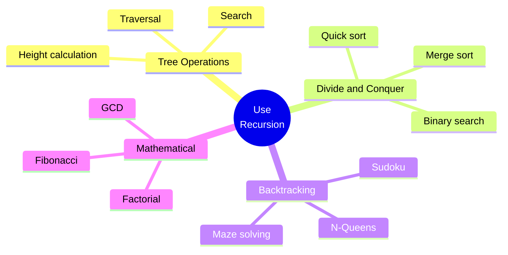

# Session 6: Recursion

[← Back to Module Index]({{ '/docs/AlgorithmsDataStructures/' | relative_url }})

---

## 🎯 Learning Objectives

By the end of this session, you should be able to:
- Understand what recursion is and how it works
- Identify base conditions in recursive functions
- Differentiate between direct and indirect recursion
- Understand memory allocation in recursive calls
- Analyze complexity of recursive algorithms
- Know when to use recursion vs iteration

---

## 1. What is Recursion?

### Definition

**Recursion** is a programming technique where a function calls itself to solve a problem by breaking it down into smaller, similar sub-problems.



### Key Components

1. **Base Case**: Condition to stop recursion
2. **Recursive Case**: Function calls itself with modified parameters
3. **Progress**: Each call must move toward base case

```java
// Simple recursive function
int factorial(int n) {
    // Base case
    if (n <= 1) {
        return 1;
    }
    
    // Recursive case
    return n * factorial(n - 1);
}
```

---

## 2. How Recursion Works

### Call Stack Visualization



### Stack Frame Details

Each recursive call creates a **stack frame** containing:
- Local variables
- Parameters
- Return address
- Return value

```
Stack Memory (Growing Downward):
┌─────────────────────┐
│ factorial(5)        │ ← Current call
│ n = 5               │
│ return address      │
├─────────────────────┤
│ factorial(4)        │
│ n = 4               │
├─────────────────────┤
│ factorial(3)        │
│ n = 3               │
├─────────────────────┤
│ factorial(2)        │
│ n = 2               │
├─────────────────────┤
│ factorial(1)        │ ← Base case
│ n = 1               │
│ return 1            │
└─────────────────────┘
```

---

## 3. Types of Recursion

### 3.1 Direct Recursion

Function calls itself directly.

```java
// Direct recursion example
void printNumbers(int n) {
    if (n <= 0) return;  // Base case
    
    System.out.println(n);
    printNumbers(n - 1);  // Direct self-call
}
```

### 3.2 Indirect Recursion

Function A calls function B, which calls function A.

```java
// Indirect recursion example
void functionA(int n) {
    if (n <= 0) return;
    
    System.out.println("A: " + n);
    functionB(n - 1);  // Calls B
}

void functionB(int n) {
    if (n <= 0) return;
    
    System.out.println("B: " + n);
    functionA(n - 1);  // Calls A
}
```



### 3.3 Tail Recursion

Recursive call is the last operation in the function.

```java
// Tail recursive
int factorialTail(int n, int accumulator) {
    if (n <= 1) return accumulator;
    
    return factorialTail(n - 1, n * accumulator);  // Last operation
}

// Non-tail recursive
int factorial(int n) {
    if (n <= 1) return 1;
    
    return n * factorial(n - 1);  // Multiplication after recursive call
}
```

**Advantage**: Can be optimized by compiler (tail call optimization)

### 3.4 Linear vs Tree Recursion

**Linear Recursion**: Single recursive call

```java
// Linear recursion
int sum(int n) {
    if (n <= 0) return 0;
    return n + sum(n - 1);  // One recursive call
}
```

**Tree Recursion**: Multiple recursive calls

```java
// Tree recursion
int fibonacci(int n) {
    if (n <= 1) return n;
    
    return fibonacci(n - 1) + fibonacci(n - 2);  // Two recursive calls
}
```



---

## 4. Base Condition

### Importance of Base Case

**Without base case**: Infinite recursion → Stack Overflow

```java
// WRONG: No base case
int infiniteRecursion(int n) {
    return n + infiniteRecursion(n - 1);  // Never stops!
}

// CORRECT: With base case
int correctRecursion(int n) {
    if (n <= 0) return 0;  // Base case
    return n + correctRecursion(n - 1);
}
```

### Multiple Base Cases

```java
int fibonacci(int n) {
    // Two base cases
    if (n == 0) return 0;
    if (n == 1) return 1;
    
    return fibonacci(n - 1) + fibonacci(n - 2);
}
```

---

## 5. Memory Allocation in Recursion

### Stack Memory



### Memory Usage Example

```java
void recursiveFunction(int n) {
    int localVar = n * 2;  // Local variable
    
    if (n <= 0) return;
    
    recursiveFunction(n - 1);
}

// Call: recursiveFunction(3)
// Stack frames created: 4 (n=3, n=2, n=1, n=0)
// Each frame stores: n, localVar, return address
```

### Stack Overflow

```java
// This will cause stack overflow for large n
int factorial(int n) {
    if (n <= 1) return 1;
    return n * factorial(n - 1);
}

// factorial(100000) → Stack Overflow Error
```

**Reason**: Limited stack size (typically 1-8 MB)

---

## 6. Pros and Cons of Recursion

### ✅ Advantages



1. **Cleaner Code**: More readable for certain problems
2. **Natural Fit**: Trees, graphs, divide-and-conquer
3. **Reduces Complexity**: Breaks down complex problems

### ❌ Disadvantages



1. **Memory Overhead**: Each call uses stack space
2. **Performance**: Function call overhead
3. **Stack Overflow**: Limited stack size
4. **Debugging**: Harder to trace execution

### Recursion vs Iteration


| Aspect | Recursion | Iteration |
|--------|-----------|-----------|
| **Code** | Shorter, cleaner | Longer, explicit |
| **Memory** | O(n) stack space | O(1) typically |
| **Speed** | Slower (function calls) | Faster |
| **Readability** | Better for complex problems | Better for simple loops |
| **Stack Overflow** | Possible | No |
| **Use Case** | Trees, graphs, divide-and-conquer | Simple loops, known iterations |

---

## 7. Complexity Analysis

### Time Complexity

#### Linear Recursion
```java
// T(n) = T(n-1) + O(1)
// Time: O(n)
int sum(int n) {
    if (n <= 0) return 0;
    return n + sum(n - 1);
}
```

#### Tree Recursion (Fibonacci)
```java
// T(n) = T(n-1) + T(n-2) + O(1)
// Time: O(2^n) - Exponential!
int fibonacci(int n) {
    if (n <= 1) return n;
    return fibonacci(n - 1) + fibonacci(n - 2);
}
```

**Fibonacci Call Tree:**


**Notice**: `fib(3)` calculated twice, `fib(2)` three times!

#### Divide and Conquer
```java
// T(n) = 2T(n/2) + O(n)
// Time: O(n log n)
void mergeSort(int[] arr, int left, int right) {
    if (left >= right) return;
    
    int mid = (left + right) / 2;
    mergeSort(arr, left, mid);      // T(n/2)
    mergeSort(arr, mid + 1, right); // T(n/2)
    merge(arr, left, mid, right);   // O(n)
}
```

### Space Complexity

```java
// Space: O(n) - recursive stack
int factorial(int n) {
    if (n <= 1) return 1;
    return n * factorial(n - 1);
}

// Space: O(log n) - binary recursion
int binarySearch(int[] arr, int left, int right, int target) {
    if (left > right) return -1;
    
    int mid = (left + right) / 2;
    if (arr[mid] == target) return mid;
    
    if (arr[mid] > target)
        return binarySearch(arr, left, mid - 1, target);
    return binarySearch(arr, mid + 1, right, target);
}
```

---

## 8. Common Recursive Problems

### Problem 1: Power Function

```java
// Calculate x^n
// Time: O(n), Space: O(n)
int power(int x, int n) {
    if (n == 0) return 1;
    return x * power(x, n - 1);
}

// Optimized: O(log n) time and space
int powerOptimized(int x, int n) {
    if (n == 0) return 1;
    
    int half = powerOptimized(x, n / 2);
    
    if (n % 2 == 0) {
        return half * half;
    } else {
        return x * half * half;
    }
}
```

### Problem 2: Sum of Digits

```java
// Sum of digits in a number
// Time: O(log n), Space: O(log n)
int sumOfDigits(int n) {
    if (n == 0) return 0;
    return (n % 10) + sumOfDigits(n / 10);
}

// Example: sumOfDigits(1234)
// = 4 + sumOfDigits(123)
// = 4 + 3 + sumOfDigits(12)
// = 4 + 3 + 2 + sumOfDigits(1)
// = 4 + 3 + 2 + 1 + sumOfDigits(0)
// = 4 + 3 + 2 + 1 + 0 = 10
```

### Problem 3: Tower of Hanoi

```java
// Move n disks from source to destination using auxiliary
// Time: O(2^n), Space: O(n)
void towerOfHanoi(int n, char source, char dest, char aux) {
    if (n == 1) {
        System.out.println("Move disk 1 from " + source + " to " + dest);
        return;
    }
    
    // Move n-1 disks from source to auxiliary
    towerOfHanoi(n - 1, source, aux, dest);
    
    // Move nth disk from source to destination
    System.out.println("Move disk " + n + " from " + source + " to " + dest);
    
    // Move n-1 disks from auxiliary to destination
    towerOfHanoi(n - 1, aux, dest, source);
}
```



### Problem 4: Print Array

```java
// Print array elements recursively
void printArray(int[] arr, int index) {
    if (index >= arr.length) return;
    
    System.out.println(arr[index]);
    printArray(arr, index + 1);
}

// Print in reverse
void printReverse(int[] arr, int index) {
    if (index < 0) return;
    
    System.out.println(arr[index]);
    printReverse(arr, index - 1);
}
```

### Problem 5: Check Palindrome

```java
// Check if string is palindrome
boolean isPalindrome(String str, int left, int right) {
    if (left >= right) return true;
    
    if (str.charAt(left) != str.charAt(right)) {
        return false;
    }
    
    return isPalindrome(str, left + 1, right - 1);
}

// Usage: isPalindrome("racecar", 0, 6)
```

### Problem 6: GCD (Euclidean Algorithm)

```java
// Greatest Common Divisor
// Time: O(log min(a,b)), Space: O(log min(a,b))
int gcd(int a, int b) {
    if (b == 0) return a;
    return gcd(b, a % b);
}

// Example: gcd(48, 18)
// = gcd(18, 48 % 18) = gcd(18, 12)
// = gcd(12, 18 % 12) = gcd(12, 6)
// = gcd(6, 12 % 6) = gcd(6, 0)
// = 6
```

---

## 9. Recursion Optimization

### 9.1 Memoization (Dynamic Programming)

**Problem**: Fibonacci has overlapping subproblems

```java
// Naive: O(2^n)
int fibonacci(int n) {
    if (n <= 1) return n;
    return fibonacci(n - 1) + fibonacci(n - 2);
}

// Optimized with memoization: O(n)
int fibonacciMemo(int n, int[] memo) {
    if (n <= 1) return n;
    
    if (memo[n] != 0) {
        return memo[n];  // Return cached result
    }
    
    memo[n] = fibonacciMemo(n - 1, memo) + fibonacciMemo(n - 2, memo);
    return memo[n];
}

// Usage
int[] memo = new int[n + 1];
int result = fibonacciMemo(n, memo);
```

### 9.2 Tail Recursion Conversion

```java
// Non-tail recursive
int factorial(int n) {
    if (n <= 1) return 1;
    return n * factorial(n - 1);
}

// Tail recursive (can be optimized by compiler)
int factorialTail(int n, int accumulator) {
    if (n <= 1) return accumulator;
    return factorialTail(n - 1, n * accumulator);
}

// Usage: factorialTail(5, 1)
```

### 9.3 Convert to Iteration

```java
// Recursive
int factorial(int n) {
    if (n <= 1) return 1;
    return n * factorial(n - 1);
}

// Iterative (better performance)
int factorialIterative(int n) {
    int result = 1;
    for (int i = 2; i <= n; i++) {
        result *= i;
    }
    return result;
}
```

---

## 10. When to Use Recursion

### ✅ Good Use Cases



### ❌ Avoid Recursion

- Simple loops (use iteration)
- Very deep recursion (stack overflow risk)
- Performance-critical code
- When tail call optimization not available

---

## 11. Practice Problems

### Problem 1: Print 1 to N
```java
void printNumbers(int n) {
    if (n <= 0) return;
    printNumbers(n - 1);
    System.out.println(n);
}
```

### Problem 2: Count Digits
```java
int countDigits(int n) {
    if (n == 0) return 0;
    return 1 + countDigits(n / 10);
}
```

### Problem 3: Reverse String
```java
String reverse(String str) {
    if (str.isEmpty()) return str;
    return reverse(str.substring(1)) + str.charAt(0);
}
```

### Problem 4: Binary String Generation
```java
void generateBinary(int n, String current) {
    if (n == 0) {
        System.out.println(current);
        return;
    }
    generateBinary(n - 1, current + "0");
    generateBinary(n - 1, current + "1");
}
```

---

## 12. Key Takeaways

### ✅ Essential Concepts

1. **Recursion Components**
   - Base case (termination condition)
   - Recursive case (self-call)
   - Progress toward base case

2. **Types**
   - Direct vs Indirect
   - Tail vs Non-tail
   - Linear vs Tree

3. **Complexity**
   - Time: Depends on recurrence relation
   - Space: O(depth of recursion)

4. **When to Use**
   - Tree/graph problems
   - Divide and conquer
   - Backtracking
   - Natural recursive structure

### 🎯 For MCQ Exam

**Common Question Types:**

1. **Output Questions**
   - "What is the output of this recursive function?"
   - Trace execution step by step

2. **Complexity Questions**
   - "Time complexity of recursive function?"
   - Identify recurrence relation

3. **Stack Questions**
   - "How many stack frames created?"
   - "What causes stack overflow?"

4. **Comparison Questions**
   - "Recursion vs iteration for [problem]?"
   - "Which is more efficient?"

---

## 📝 Quick Revision

### Recursion Checklist
- ✅ Base case defined?
- ✅ Progress toward base case?
- ✅ Correct recursive call?
- ✅ Stack overflow risk?
- ✅ Can be optimized?

### Common Patterns
- **Decrease by 1**: `f(n) = ... f(n-1)`
- **Divide by 2**: `f(n) = ... f(n/2)`
- **Tree**: `f(n) = ... f(n-1) + f(n-2)`

### Complexity Quick Reference
- Linear recursion: O(n)
- Binary recursion (balanced): O(log n)
- Tree recursion (Fibonacci): O(2^n)
- Divide and conquer: O(n log n)

---

[← Previous: Sessions 4-5]({{ '/docs/AlgorithmsDataStructures/session4-5-linked-lists' | relative_url }}) | [Next: Sessions 7-9 →]({{ '/docs/AlgorithmsDataStructures/session7-9-trees' | relative_url }})

[← Back to Module Index]({{ '/docs/AlgorithmsDataStructures/' | relative_url }})
