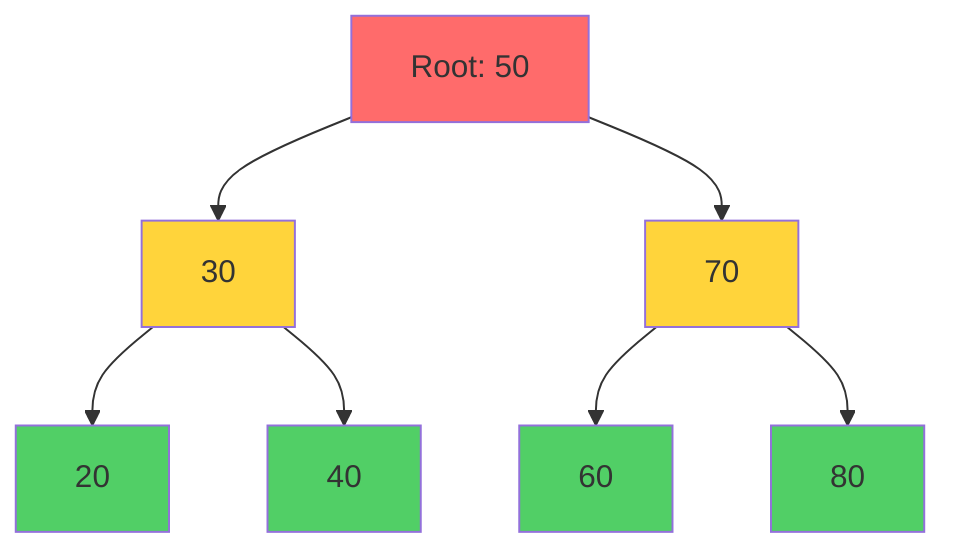
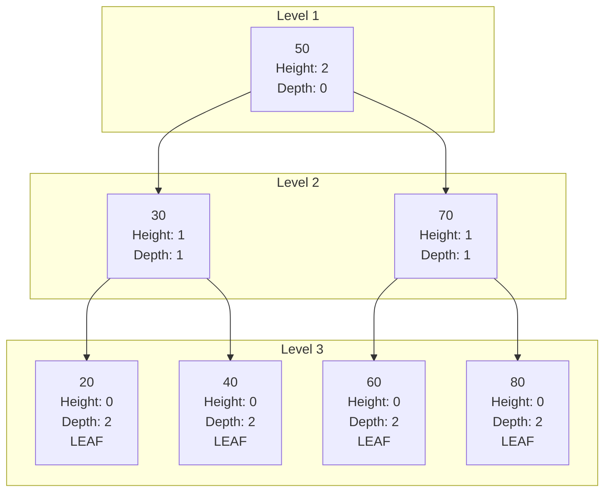
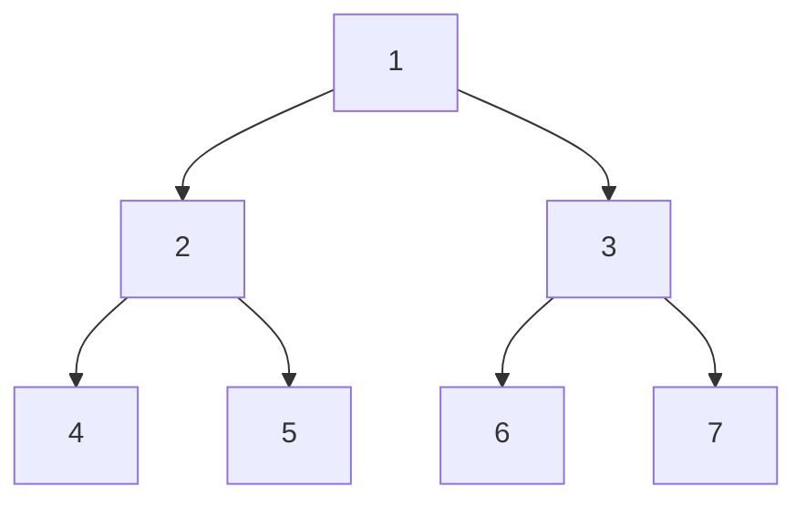
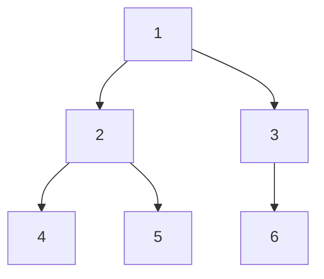
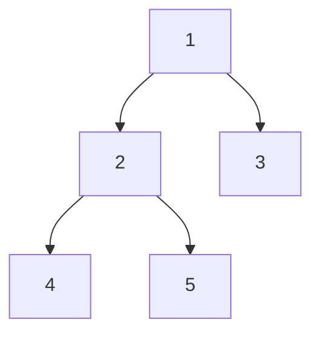
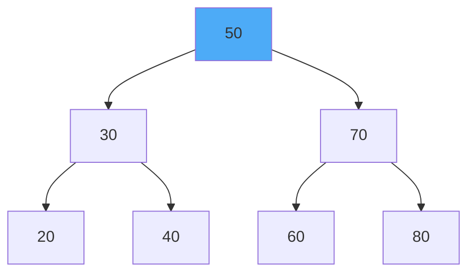
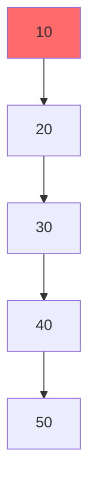
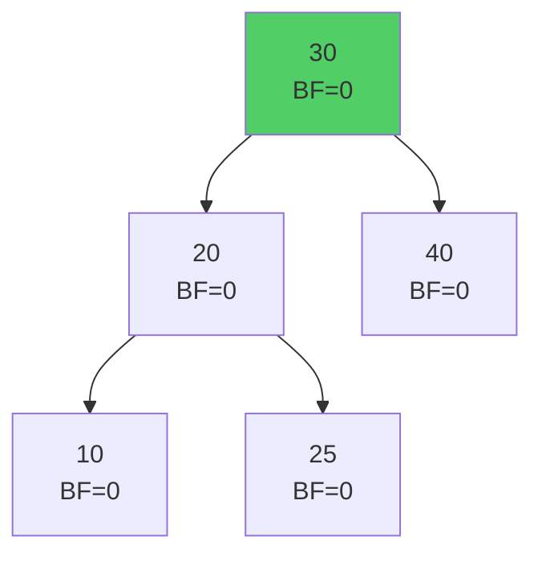
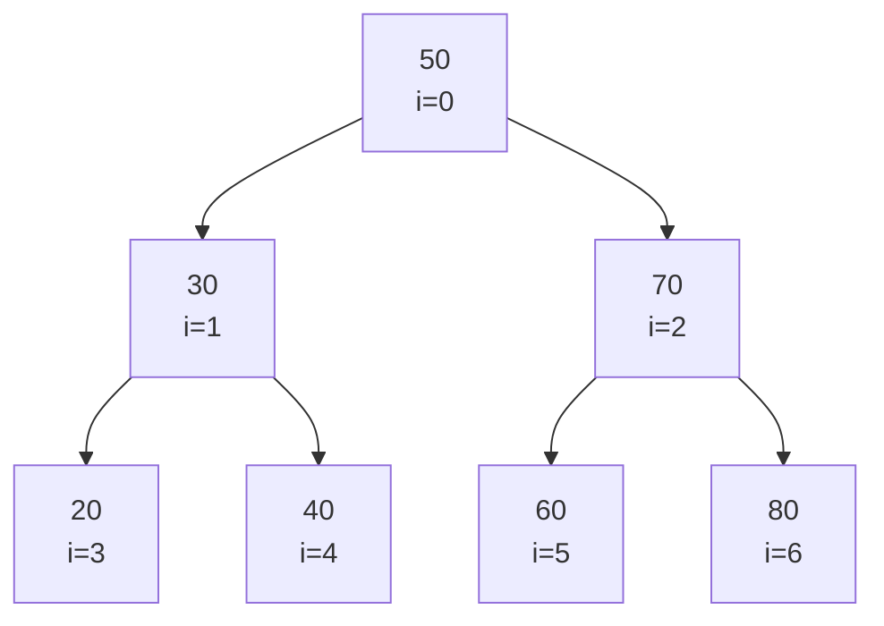

# Sessions 7, 8 & 9: Trees & Applications

[← Back to Module Index]({{ '/docs/AlgorithmsDataStructures/' | relative_url }})

---

## 🎯 Learning Objectives

- Understand tree terminology and structure
- Implement binary trees and binary search trees (BST)
- Master tree traversal algorithms (BFS, DFS, Inorder, Preorder, Postorder)
- Understand AVL trees and self-balancing
- Analyze search complexity in BST
- Implement tree operations (create, insert, delete, search)

---

## 1. Introduction to Trees

### What is a Tree?

A **tree** is a hierarchical data structure consisting of nodes connected by edges, with one node designated as the root.



---

## 2. Tree Terminology


| Term | Definition | Example |
|------|------------|---------|
| **Root** | Top node with no parent | 50 |
| **Parent** | Node with children | 30 is parent of 20, 40 |
| **Child** | Node with a parent | 20, 40 are children of 30 |
| **Leaf** | Node with no children | 20, 40, 60, 80 |
| **Internal Node** | Node with at least one child | 30, 70 |
| **Sibling** | Nodes with same parent | 20 and 40 |
| **Ancestor** | All nodes on path to root | For 20: 30, 50 |
| **Descendant** | All nodes in subtree | For 30: 20, 40 |
| **Height** | Longest path from node to leaf | Height of 50 = 2 |
| **Depth** | Path length from root to node | Depth of 20 = 2 |
| **Level** | Depth + 1 | Level of 20 = 3 |
| **Degree** | Number of children | Degree of 30 = 2 |



---

## 3. Binary Tree

### Definition

A **binary tree** is a tree where each node has **at most 2 children** (left and right).

### Node Structure

```java
class TreeNode {
    int data;
    TreeNode left;
    TreeNode right;
    
    TreeNode(int data) {
        this.data = data;
        this.left = null;
        this.right = null;
    }
}
```

### Types of Binary Trees

#### 3.1 Full Binary Tree
Every node has 0 or 2 children.



#### 3.2 Complete Binary Tree (ACBT)
All levels filled except possibly the last, which is filled left to right.



#### 3.3 Perfect Binary Tree
All internal nodes have 2 children, all leaves at same level.


#### 3.4 Balanced Binary Tree
Height difference between left and right subtrees ≤ 1 for all nodes.

---

## 4. Tree Traversals

### 4.1 Depth First Search (DFS)

#### Inorder (Left → Root → Right)
```java
void inorder(TreeNode root) {
    if (root == null) return;
    
    inorder(root.left);           // Left
    System.out.print(root.data + " ");  // Root
    inorder(root.right);          // Right
}
```

**Output for BST**: Sorted order!

#### Preorder (Root → Left → Right)
```java
void preorder(TreeNode root) {
    if (root == null) return;
    
    System.out.print(root.data + " ");  // Root
    preorder(root.left);          // Left
    preorder(root.right);         // Right
}
```

**Use**: Create copy of tree, prefix expression

#### Postorder (Left → Right → Root)
```java
void postorder(TreeNode root) {
    if (root == null) return;
    
    postorder(root.left);         // Left
    postorder(root.right);        // Right
    System.out.print(root.data + " ");  // Root
}
```

**Use**: Delete tree, postfix expression

### Traversal Example



- **Inorder**: 4, 2, 5, 1, 3
- **Preorder**: 1, 2, 4, 5, 3
- **Postorder**: 4, 5, 2, 3, 1

### 4.2 Breadth First Search (BFS) / Level Order

```java
void levelOrder(TreeNode root) {
    if (root == null) return;
    
    Queue<TreeNode> queue = new LinkedList<>();
    queue.add(root);
    
    while (!queue.isEmpty()) {
        TreeNode node = queue.poll();
        System.out.print(node.data + " ");
        
        if (node.left != null) queue.add(node.left);
        if (node.right != null) queue.add(node.right);
    }
}
```

**Output**: 1, 2, 3, 4, 5

---

## 5. Binary Search Tree (BST)

### Properties

1. Left subtree values < root value
2. Right subtree values > root value
3. Both subtrees are also BSTs



**Inorder traversal**: 20, 30, 40, 50, 60, 70, 80 (sorted!)

### BST Implementation

```java
public class BST {
    private TreeNode root;
    
    // Insert - O(h) where h is height
    public void insert(int data) {
        root = insertRec(root, data);
    }
    
    private TreeNode insertRec(TreeNode root, int data) {
        if (root == null) {
            return new TreeNode(data);
        }
        
        if (data < root.data) {
            root.left = insertRec(root.left, data);
        } else if (data > root.data) {
            root.right = insertRec(root.right, data);
        }
        
        return root;
    }
    
    // Search - O(h)
    public boolean search(int key) {
        return searchRec(root, key);
    }
    
    private boolean searchRec(TreeNode root, int key) {
        if (root == null) return false;
        
        if (root.data == key) return true;
        
        if (key < root.data) {
            return searchRec(root.left, key);
        }
        return searchRec(root.right, key);
    }
    
    // Delete - O(h)
    public void delete(int key) {
        root = deleteRec(root, key);
    }
    
    private TreeNode deleteRec(TreeNode root, int key) {
        if (root == null) return null;
        
        if (key < root.data) {
            root.left = deleteRec(root.left, key);
        } else if (key > root.data) {
            root.right = deleteRec(root.right, key);
        } else {
            // Node found
            
            // Case 1: Leaf node
            if (root.left == null && root.right == null) {
                return null;
            }
            
            // Case 2: One child
            if (root.left == null) return root.right;
            if (root.right == null) return root.left;
            
            // Case 3: Two children
            // Find inorder successor (smallest in right subtree)
            TreeNode successor = findMin(root.right);
            root.data = successor.data;
            root.right = deleteRec(root.right, successor.data);
        }
        
        return root;
    }
    
    private TreeNode findMin(TreeNode root) {
        while (root.left != null) {
            root = root.left;
        }
        return root;
    }
    
    // Inorder traversal
    public void inorder() {
        inorderRec(root);
        System.out.println();
    }
    
    private void inorderRec(TreeNode root) {
        if (root != null) {
            inorderRec(root.left);
            System.out.print(root.data + " ");
            inorderRec(root.right);
        }
    }
}
```

### BST Complexity


| Operation | Average | Worst Case |
|-----------|---------|------------|
| **Search** | O(log n) | O(n) |
| **Insert** | O(log n) | O(n) |
| **Delete** | O(log n) | O(n) |
| **Space** | O(n) | O(n) |

**Worst case**: Skewed tree (like linked list)



Height = n → O(n) operations

---

## 6. AVL Tree (Self-Balancing BST)

### Balance Factor

**Balance Factor** = Height(Left Subtree) - Height(Right Subtree)

For AVL tree: BF ∈ {-1, 0, 1}



### Rotations

#### Left Rotation
```
    y                x
   / \              / \
  x   C    →       A   y
 / \                  / \
A   B                B   C
```

#### Right Rotation
```
  y                  x
 / \                / \
A   x      →       y   C
   / \            / \
  B   C          A   B
```

### AVL Complexity


| Operation | Time |
|-----------|------|
| **Search** | O(log n) |
| **Insert** | O(log n) |
| **Delete** | O(log n) |

**Guaranteed** O(log n) due to balancing!

---

## 7. Array Implementation of Complete Binary Tree

For complete binary tree, use array:

```
Index:  0   1   2   3   4   5   6
Value: [50, 30, 70, 20, 40, 60, 80]
```



**Formulas:**
- Parent of node at index `i`: `(i-1)/2`
- Left child of node at index `i`: `2*i + 1`
- Right child of node at index `i`: `2*i + 2`

```java
class ArrayBinaryTree {
    int[] tree;
    int size;
    
    // Parent
    int parent(int i) {
        return (i - 1) / 2;
    }
    
    // Left child
    int left(int i) {
        return 2 * i + 1;
    }
    
    // Right child
    int right(int i) {
        return 2 * i + 2;
    }
}
```

---

## 8. Common Tree Problems

### Problem 1: Height of Tree
```java
int height(TreeNode root) {
    if (root == null) return -1;  // or 0
    
    return 1 + Math.max(height(root.left), height(root.right));
}
```

### Problem 2: Count Nodes
```java
int countNodes(TreeNode root) {
    if (root == null) return 0;
    
    return 1 + countNodes(root.left) + countNodes(root.right);
}
```

### Problem 3: Check if BST
```java
boolean isBST(TreeNode root, Integer min, Integer max) {
    if (root == null) return true;
    
    if ((min != null && root.data <= min) || 
        (max != null && root.data >= max)) {
        return false;
    }
    
    return isBST(root.left, min, root.data) && 
           isBST(root.right, root.data, max);
}
```

### Problem 4: Lowest Common Ancestor (BST)
```java
TreeNode LCA(TreeNode root, int n1, int n2) {
    if (root == null) return null;
    
    if (root.data > n1 && root.data > n2) {
        return LCA(root.left, n1, n2);
    }
    
    if (root.data < n1 && root.data < n2) {
        return LCA(root.right, n1, n2);
    }
    
    return root;
}
```

---

## 9. Key Takeaways

### ✅ Essential Concepts

1. **Tree Structure**: Hierarchical, root, parent-child
2. **Binary Tree**: Max 2 children per node
3. **BST**: Left < Root < Right
4. **Traversals**: Inorder (sorted for BST), Preorder, Postorder, Level Order
5. **AVL**: Self-balancing, O(log n) guaranteed

### 🎯 For MCQ Exam

**Focus Areas:**
- Tree terminology
- Traversal outputs
- BST properties
- Complexity analysis
- When BST degenerates to O(n)

---

[← Previous: Session 6]({{ '/docs/AlgorithmsDataStructures/session6-recursion' | relative_url }}) | [Next: Sessions 10-12 →]({{ '/docs/AlgorithmsDataStructures/session10-12-searching-sorting' | relative_url }})

[← Back to Module Index]({{ '/docs/AlgorithmsDataStructures/' | relative_url }})
