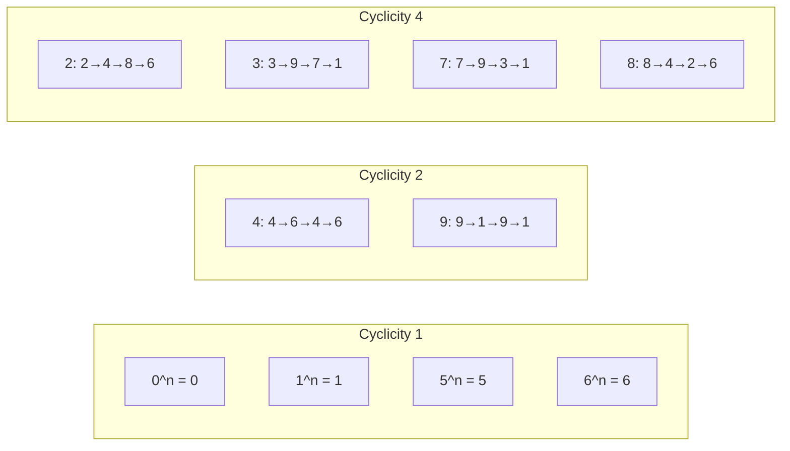
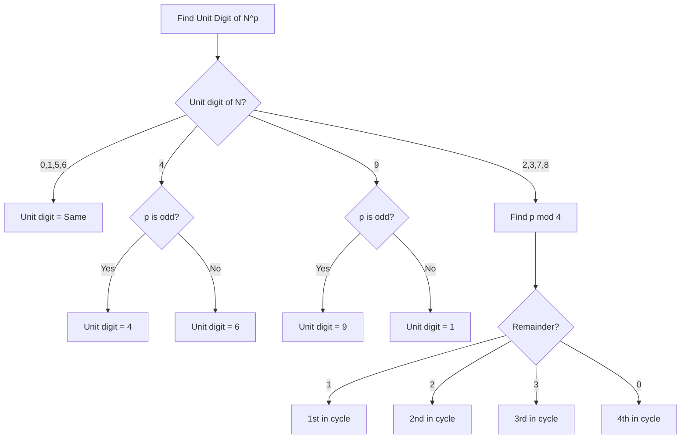
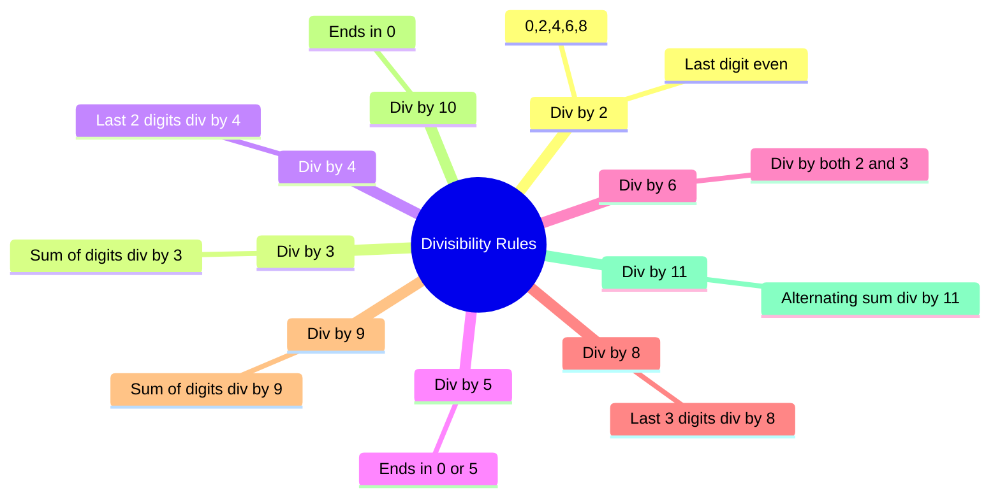
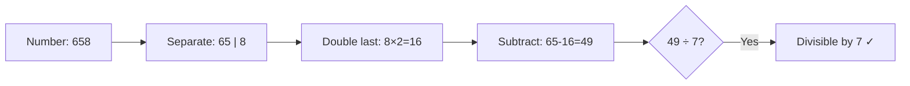
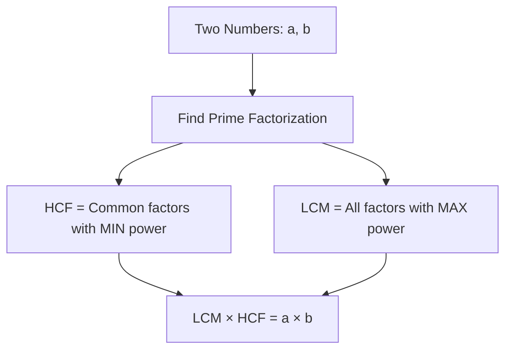

# Session 1: Number System

Master the fundamentals of number systems, including unit digits, cyclicity, divisibility rules, LCM-HCF, and fast calculation techniques.

---

## 📊 Unit Digit Cyclicity

The **unit digit** is the rightmost digit of any number. When numbers are raised to powers, their unit digits follow a cyclic pattern.

### Cyclicity Table

| Unit Digit | Cyclicity | Pattern | Rule |
|:----------:|:---------:|:--------|:-----|
| **0, 1, 5, 6** | 1 | Always same | Unit digit remains unchanged for any power |
| **4, 9** | 2 | Alternates | Odd power → original; Even power → complement |
| **2, 3, 7, 8** | 4 | 4-digit cycle | Divide power by 4, use remainder |

### Detailed Cyclicity Patterns



### Complete Cyclicity Reference

| Digit | Power 1 | Power 2 | Power 3 | Power 4 |
|:-----:|:-------:|:-------:|:-------:|:-------:|
| 2 | 2 | 4 | 8 | 6 |
| 3 | 3 | 9 | 7 | 1 |
| 4 | 4 | 6 | 4 | 6 |
| 7 | 7 | 9 | 3 | 1 |
| 8 | 8 | 4 | 2 | 6 |
| 9 | 9 | 1 | 9 | 1 |

### Finding Unit Digit - Algorithm



### Examples

| Problem | Unit Digit | Reasoning |
|:--------|:-----------|:----------|
| 17²⁵ | 7 | 7 has cycle 4; 25÷4 = rem 1; 1st position = 7 |
| 234⁴⁸ | 6 | 4 has cycle 2; 48 is even; even power = 6 |
| 89⁹⁹ | 9 | 9 has cycle 2; 99 is odd; odd power = 9 |
| 563²⁶ | 9 | 3 has cycle 4; 26÷4 = rem 2; 2nd position = 9 |

---

## 🔢 Last Two Digits

To find the **last two digits** of a number raised to a power, we need to find the number mod 100.

### Rules for Last Two Digits

| Case | Rule |
|:-----|:-----|
| Numbers ending in 1 | Last 2 digits = (tens digit × unit digit of power) mod 10, followed by 1 |
| Numbers ending in 5 | Always ends in 25 (for powers ≥ 2) or 75 |
| Even numbers | Use pattern recognition with cycles |
| Odd numbers | Convert to form (N ending in 1)^k |

### Quick Tricks

- **24^any power**: Last 2 digits cycle with period 20
- **76^any power**: Always ends in **76**
- **25^any power** (≥2): Always ends in **25**

---

## 📐 Divisibility Rules



### Divisibility Rules Table

| Divisor | Rule | Example |
|:-------:|:-----|:--------|
| **2** | Last digit is even (0,2,4,6,8) | 128 ✓ (ends in 8) |
| **3** | Sum of digits divisible by 3 | 123 → 1+2+3=6 ✓ |
| **4** | Last 2 digits divisible by 4 | 1324 → 24÷4=6 ✓ |
| **5** | Last digit is 0 or 5 | 235 ✓ |
| **6** | Divisible by both 2 AND 3 | 114 ✓ (even, 1+1+4=6) |
| **7** | Double last digit, subtract from rest | 371 → 37-2=35 ✓ |
| **8** | Last 3 digits divisible by 8 | 1256 → 256÷8=32 ✓ |
| **9** | Sum of digits divisible by 9 | 729 → 7+2+9=18 ✓ |
| **10** | Last digit is 0 | 250 ✓ |
| **11** | Alternating sum divisible by 11 | 1364 → 1-3+6-4=0 ✓ |
| **12** | Divisible by both 3 AND 4 | 144 ✓ |

### Divisibility by 7 - Step by Step



---

## 🔗 LCM and HCF

### Key Formulas

| Concept | Formula |
|:--------|:--------|
| **HCF** (Highest Common Factor) | Product of common prime factors with **lowest** powers |
| **LCM** (Least Common Multiple) | Product of all prime factors with **highest** powers |
| **Relationship** | LCM × HCF = Product of numbers (for 2 numbers) |
| **LCM of Fractions** | LCM of numerators / HCF of denominators |
| **HCF of Fractions** | HCF of numerators / LCM of denominators |

### LCM-HCF Relationship Diagram



### Methods to Find HCF

**Prime Factorization Method:**
```
Find HCF of 48 and 60:
48 = 2⁴ × 3¹
60 = 2² × 3¹ × 5¹
HCF = 2² × 3¹ = 12
```

**Division Method (Euclidean Algorithm):**
```
HCF(48, 60):
60 = 48 × 1 + 12
48 = 12 × 4 + 0
HCF = 12
```

### Methods to Find LCM

**Prime Factorization Method:**
```
Find LCM of 48 and 60:
48 = 2⁴ × 3¹
60 = 2² × 3¹ × 5¹
LCM = 2⁴ × 3¹ × 5¹ = 240
```

### Important Properties

| Property | Description |
|:---------|:------------|
| HCF ≤ Smaller number | HCF never exceeds the smaller number |
| LCM ≥ Larger number | LCM is always ≥ the larger number |
| Co-prime numbers | HCF = 1 |
| One divides other | HCF = smaller, LCM = larger |

---

## 📊 Remainder Theorem

### Key Concepts

| Concept | Formula/Rule |
|:--------|:-------------|
| **Basic Remainder** | Dividend = Divisor × Quotient + Remainder |
| **Negative Remainder** | Add divisor to get positive remainder |
| **Remainder of Sum** | (a+b) mod n = ((a mod n) + (b mod n)) mod n |
| **Remainder of Product** | (a×b) mod n = ((a mod n) × (b mod n)) mod n |

### Fermat's Little Theorem

> If p is prime and a is not divisible by p, then: **a^(p-1) ≡ 1 (mod p)**

### Euler's Theorem

> **a^φ(n) ≡ 1 (mod n)** where φ(n) is Euler's totient function

### Wilson's Theorem

> If p is a prime number, then: **(p-1)! ≡ -1 (mod p)**
> 
> *Example: Find permainder of 4! divided by 5.*
> *Here p=5 (prime), so (5-1)! = 4! ≡ -1 ≡ 4 (mod 5)*

---

## ⚡ Fast Maths & Simplification

### BODMAS/PEMDAS Order


### Simplification Tricks

| Operation | Shortcut |
|:----------|:---------|
| Multiply by 5 | × 10 ÷ 2 |
| Multiply by 25 | × 100 ÷ 4 |
| Multiply by 125 | × 1000 ÷ 8 |
| Multiply by 11 | Add adjacent digits |
| Square of numbers ending in 5 | n5² = n(n+1) followed by 25 |

### Examples of Fast Multiplication

| Problem | Method | Answer |
|:--------|:-------|:-------|
| 35² | 3×4 = 12, append 25 | 1225 |
| 85² | 8×9 = 72, append 25 | 7225 |
| 24 × 25 | 24 × 100 ÷ 4 = 600 | 600 |
| 48 × 11 | 4_(4+8)_8 = 528 | 528 |

### Base Method Multiplication (Numbers near 100)

**Example: 98 × 97**
1. Bases: 100
2. Differences: 98 (-2), 97 (-3)
3. Multiply differences: (-2) × (-3) = 06 (Last 2 digits)
4. Cross add/subtract: 98 - 3 = 95 (First digits)
5. Result: **9506**

---

## 🎯 Quick Revision Points

> [!TIP]
> **For Unit Digits**: Remember the cycles - 1 for (0,1,5,6), 2 for (4,9), 4 for (2,3,7,8)

> [!TIP]
> **For Divisibility by 7**: Double the last digit and subtract from remaining

> [!TIP]
> **LCM × HCF = Product of two numbers** (only for 2 numbers)

> [!TIP]
> **Co-prime means HCF = 1**, which means LCM = Product

---

## ✍️ Practice Problems

1. Find the unit digit of 7^245
2. Find the unit digit of 234^456 × 789^123
3. Find HCF and LCM of 18, 24, and 36
4. What is the remainder when 17^23 is divided by 5?
5. Is 12348 divisible by 6?
