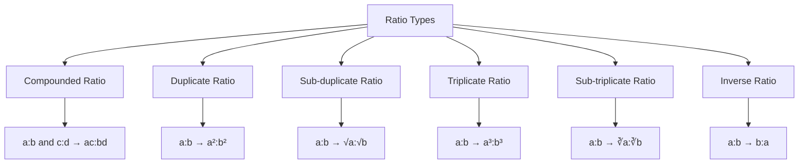
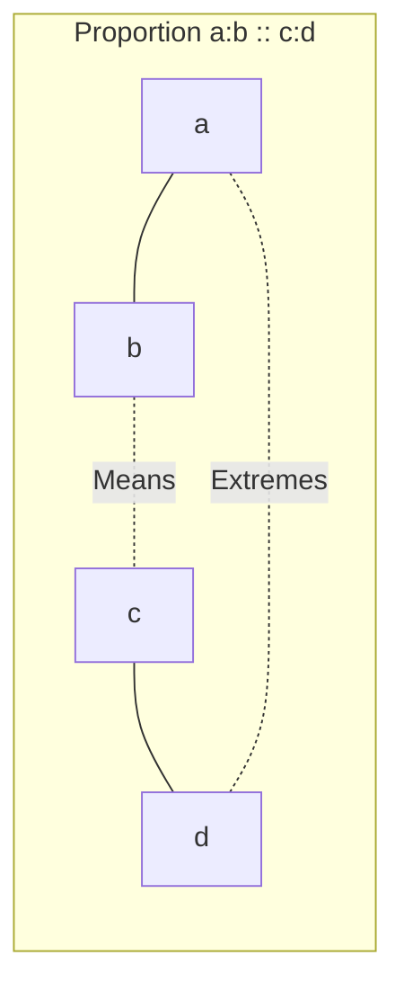
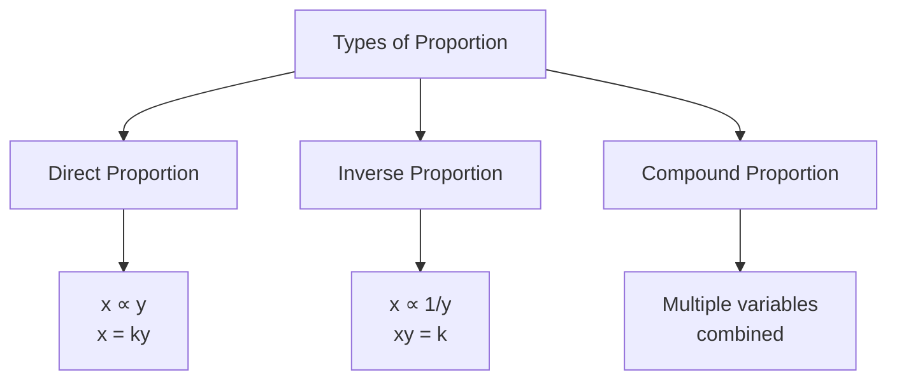
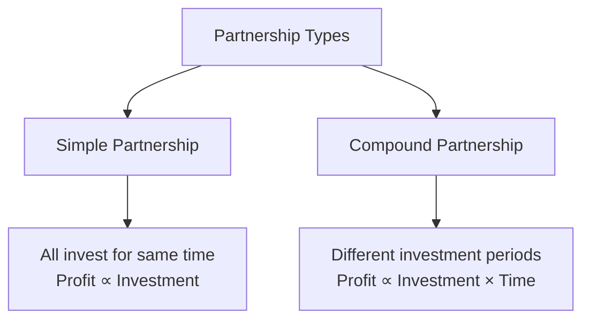
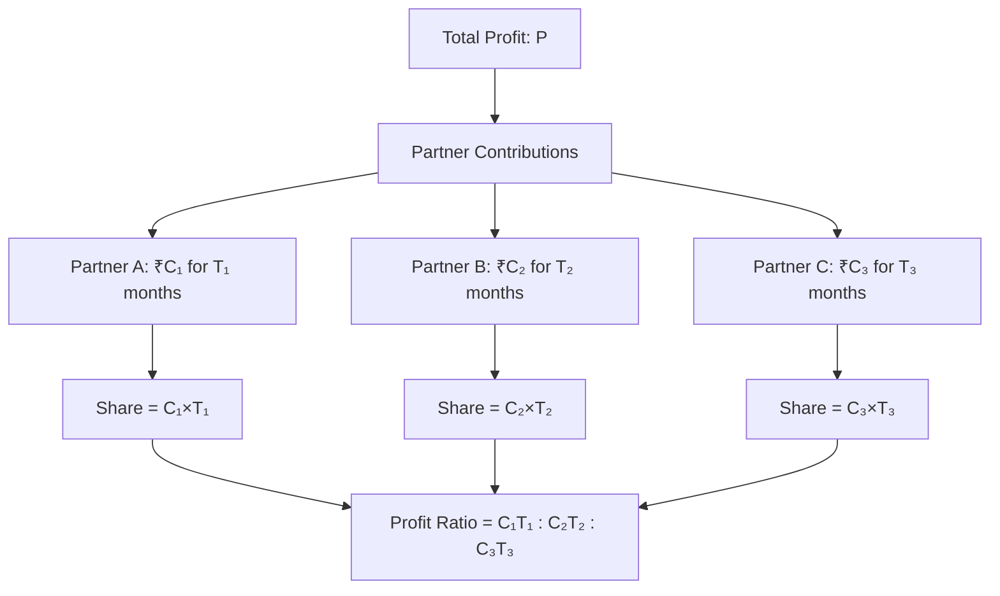

# Session 2: Ratio, Proportion & Partnership

Master ratios, proportions, and partnership problems for profit sharing calculations.

---

## 📊 Ratio Fundamentals

A **ratio** compares two or more quantities of the same kind, expressed as a:b or a/b.

### Key Terms

| Term | Definition |
|:-----|:-----------|
| **Antecedent** | First term (a in a:b) |
| **Consequent** | Second term (b in a:b) |
| **Equal Ratios** | a:b = c:d means ad = bc |

### Types of Ratios



### Ratio Formulas Table

| Type | Formula | Example (2:3) |
|:-----|:--------|:--------------|
| **Original** | a : b | 2 : 3 |
| **Duplicate** | a² : b² | 4 : 9 |
| **Sub-duplicate** | √a : √b | √2 : √3 |
| **Triplicate** | a³ : b³ | 8 : 27 |
| **Inverse** | b : a | 3 : 2 |
| **Compounded** (with c:d) | ac : bd | 2c : 3d |

### Important Properties

| Property | Formula |
|:---------|:--------|
| If a:b = c:d | ad = bc (cross multiplication) |
| If a:b = c:d | (a+b):(a-b) = (c+d):(c-d) |
| Ratio multiplication | Multiply/divide both terms by same number |

### Combining Ratios (The 'N' or Zig-Zag Method)

**To find A:B:C given A:B and B:C:**

1. Write them as:
   ```
   A : B
       B : C
   ```
2. Multiply A×B, B×B, B×C (Wait, this is if B is same).
   Better method:
   A : B = x : y
   B : C = m : n
   
   A : B : C = (x×m) : (y×m) : (y×n)

   *Example: A:B = 2:3, B:C = 4:5*
   *A:B:C = (2×4) : (3×4) : (3×5) = 8 : 12 : 15*

---

## ⚖️ Proportion

When two ratios are equal, they are said to be in **proportion**.

### Proportion Notation

If a:b = c:d, written as **a:b :: c:d**



### Key Formulas

| Concept | Formula |
|:--------|:--------|
| **Product Rule** | Product of Means = Product of Extremes → b×c = a×d |
| **Fourth Proportional** | If a:b = c:x, then x = bc/a |
| **Third Proportional** | If a:b = b:x, then x = b²/a |
| **Mean Proportional** | If a:x = x:b, then x = √(ab) |

### Types of Proportion



| Type | Relationship | Example |
|:-----|:-------------|:--------|
| **Direct Proportion** | x increases → y increases | More workers = More work done |
| **Inverse Proportion** | x increases → y decreases | More workers = Less time |

### Componendo and Dividendo

| Rule | Formula |
|:-----|:--------|
| **Componendo** | If a/b = c/d, then (a+b)/b = (c+d)/d |
| **Dividendo** | If a/b = c/d, then (a-b)/b = (c-d)/d |
| **Componendo-Dividendo** | If a/b = c/d, then (a+b)/(a-b) = (c+d)/(c-d) |

---

## 🤝 Partnership

Partnership problems involve **profit/loss distribution** among partners based on their investment and time.

### Types of Partnership



### Partnership Formulas

| Type | Profit Sharing Ratio |
|:-----|:--------------------|
| **Simple Partnership** | Ratio of Investments → A:B = Investment_A : Investment_B |
| **Compound Partnership** | Ratio of (Investment × Time) → A:B = (I_A × T_A) : (I_B × T_B) |

### Partnership Diagram



### Partner Types

| Type | Role | Share in Profit |
|:-----|:-----|:----------------|
| **Working Partner** | Invests + Manages business | Investment share + Salary (if any) |
| **Sleeping Partner** | Only invests money | Only investment-based share |

### Key Formulas

| Scenario | Formula |
|:---------|:--------|
| A invests ₹x, B invests ₹y (same time) | Profit ratio = x : y |
| A invests ₹x for t₁, B invests ₹y for t₂ | Profit ratio = xt₁ : yt₂ |
| A's share of profit P | A's profit = P × [A's ratio / Total ratio] |

### Important Problem Types

#### 1. Income-Expenditure
> **Income = Expenditure + Savings**
> 
> *Tip: If savings are same for both persons, difference between ratio parts of Income and Expenditure must be same.*

#### 2. Coins Problems
> **Total Value = (No. of coins of type 1 × Value 1) + (No. of coins type 2 × Value 2) + ...**
> 
> *Tip: Convert all values to same unit (e.g., paise) before calculation.*

---

## 🧮 Solved Examples

### Example 1: Simple Ratio
**Q:** If 2:3 = 4:x, find x.

**Solution:**
```
Cross multiply: 2 × x = 3 × 4
2x = 12
x = 6
```

### Example 2: Partnership
**Q:** A and B invest ₹3000 and ₹4000 respectively. A invests for 12 months, B for 9 months. Total profit is ₹8400. Find each share.

**Solution:**
```
A's contribution = 3000 × 12 = 36000
B's contribution = 4000 × 9 = 36000

Ratio = 36000 : 36000 = 1 : 1

A's share = 8400 × 1/2 = ₹4200
B's share = 8400 × 1/2 = ₹4200
```

### Example 3: Mean Proportional
**Q:** Find mean proportional between 4 and 9.

**Solution:**
```
Mean proportional = √(4 × 9) = √36 = 6
```

---

## 🎯 Quick Revision Points

> [!TIP]
> **Cross Multiplication**: If a:b = c:d, then ad = bc

> [!TIP]
> **Partnership**: Profit ∝ Capital × Time

> [!TIP]
> **Mean Proportional** of a and b = √(ab)

> [!NOTE]
> In compound partnership, always calculate **Capital × Time** for each partner before finding ratio

---

## ✍️ Practice Problems

1. Divide ₹1870 in the ratio 3:5:9
2. A:B = 2:3, B:C = 4:5. Find A:B:C
3. Find the fourth proportional to 3, 5, and 6
4. A invests ₹5000 for 4 months, B ₹6000 for 5 months, C ₹8000 for 6 months. Divide profit of ₹56500
5. The ratio of incomes of A and B is 5:4, and ratio of expenses is 3:2. Each saves ₹800. Find their incomes.
