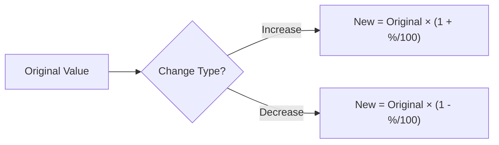
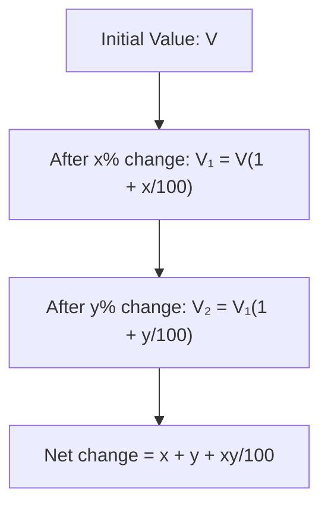
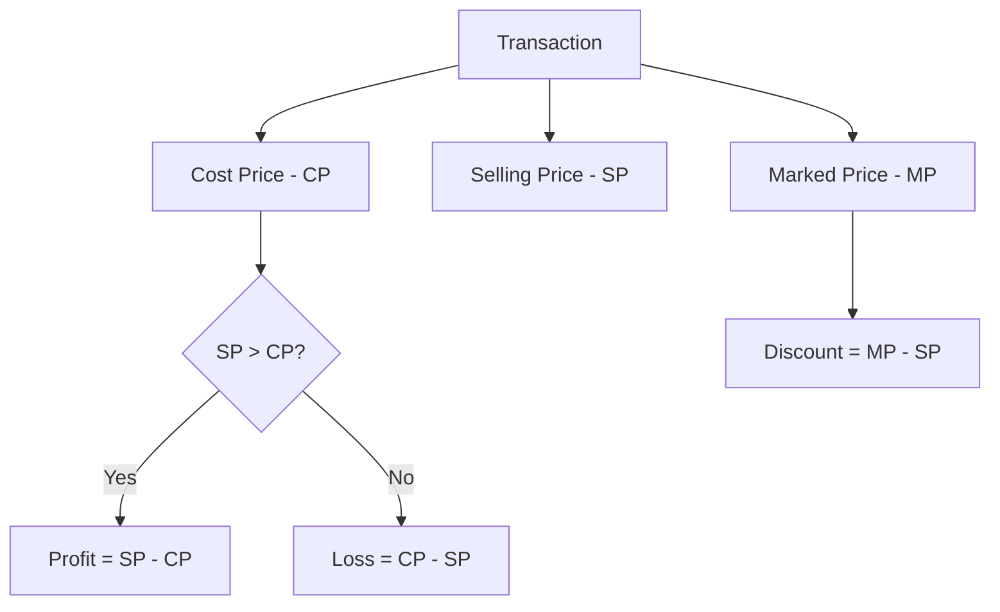
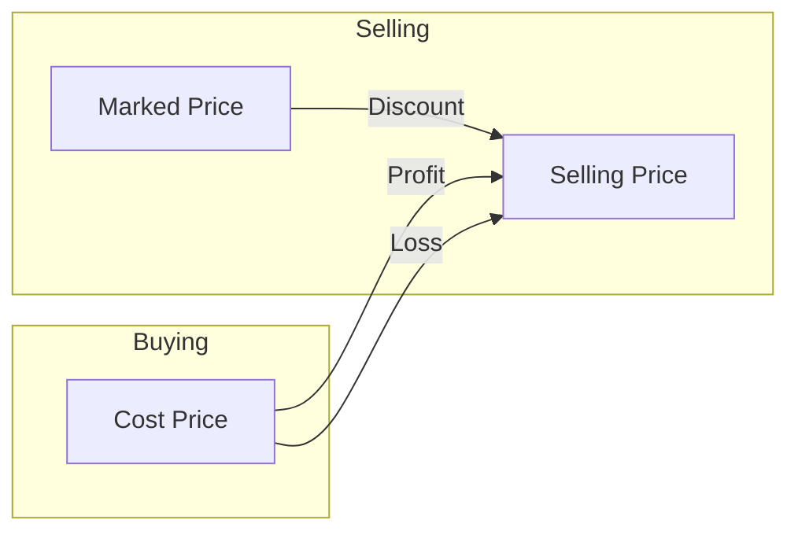

# Session 3: Percentage, Profit & Loss

Master percentage calculations, profit-loss concepts, and discount problems.

---

## 📊 Percentage Fundamentals

**Percentage** means "per hundred" - a way to express a number as a fraction of 100.

### Basic Formulas

| Formula | Description |
|:--------|:------------|
| **Percentage** | (Part / Whole) × 100 |
| **Part** | (Percentage × Whole) / 100 |
| **Whole** | (Part × 100) / Percentage |

### Percentage-Fraction Conversion Table

| Fraction | Percentage | Fraction | Percentage |
|:--------:|:----------:|:--------:|:----------:|
| 1/2 | 50% | 1/8 | 12.5% |
| 1/3 | 33.33% | 1/9 | 11.11% |
| 1/4 | 25% | 1/10 | 10% |
| 1/5 | 20% | 1/11 | 9.09% |
| 1/6 | 16.67% | 1/12 | 8.33% |
| 1/7 | 14.28% | 2/3 | 66.67% |

### Percentage Change



| Type | Formula |
|:-----|:--------|
| **Percentage Increase** | [(New - Original) / Original] × 100 |
| **Percentage Decrease** | [(Original - New) / Original] × 100 |
| **New Value (Increase)** | Original × (1 + Rate/100) |
| **New Value (Decrease)** | Original × (1 - Rate/100) |

### Price and Consumption Rule
If price of a commodity increases by **R%**, then the reduction in consumption so as not to increase the expenditure is:
> **Reduction % = [ R / (100 + R) ] × 100**

If price decreases by **R%**, then increase in consumption:
> **Increase % = [ R / (100 - R) ] × 100**

---

### Successive Percentage Change

When a value changes by x% and then by y%:

**Net Change = x + y + (xy/100)**



### Examples

| Initial | Changes | Net Effect |
|:--------|:--------|:-----------|
| 100 | +20%, +10% | 20 + 10 + (20×10)/100 = **32% increase** |
| 100 | +20%, -10% | 20 - 10 + (20×-10)/100 = **8% increase** |
| 100 | -20%, -10% | -20 - 10 + (-20×-10)/100 = **-28% = 28% decrease** |

---

## 💰 Profit and Loss

### Key Terms



| Term | Definition |
|:-----|:-----------|
| **Cost Price (CP)** | Price at which article is purchased |
| **Selling Price (SP)** | Price at which article is sold |
| **Marked Price (MP)** | Price displayed on the article (list price) |
| **Profit** | SP - CP (when SP > CP) |
| **Loss** | CP - SP (when CP > SP) |
| **Discount** | MP - SP |

### Core Formulas

| Formula | Expression |
|:--------|:-----------|
| **Profit %** | (Profit / CP) × 100 |
| **Loss %** | (Loss / CP) × 100 |
| **SP (with Profit)** | CP × (100 + P%) / 100 |
| **SP (with Loss)** | CP × (100 - L%) / 100 |
| **CP (when Profit)** | SP × 100 / (100 + P%) |
| **CP (when Loss)** | SP × 100 / (100 - L%) |
| **Discount %** | (Discount / MP) × 100 |

### Relationship Diagram



### Quick Multipliers

| Scenario | Multiplier for SP |
|:---------|:------------------|
| 10% Profit | CP × 1.10 |
| 20% Profit | CP × 1.20 |
| 25% Profit | CP × 1.25 |
| 10% Loss | CP × 0.90 |
| 20% Loss | CP × 0.80 |
| 25% Loss | CP × 0.75 |

### Direct Relation MP and CP

This is the **most powerful formula** for problems involving Discount and Profit simultaneously.

> **MP / CP = (100 + Profit%) / (100 - Discount%)**

*Example: Discount = 10%, Profit = 20%*
*MP/CP = 120 / 90 = 4 / 3*
*So if CP = 300, MP = 400*

---

## 🏷️ Discount Concepts

### Discount Formulas

| Concept | Formula |
|:--------|:--------|
| **Discount Amount** | MP - SP |
| **Discount %** | (Discount / MP) × 100 |
| **SP after Discount** | MP × (100 - D%) / 100 |

### Successive Discounts

For discounts d₁% and d₂% applied successively:

**Single Equivalent Discount = d₁ + d₂ - (d₁ × d₂)/100**

| Discounts | Equivalent Single Discount |
|:----------|:--------------------------|
| 10% + 10% | 10 + 10 - 1 = **19%** |
| 20% + 10% | 20 + 10 - 2 = **28%** |
| 20% + 20% | 20 + 20 - 4 = **36%** |

### False Weight/Measure Profit

When a seller uses **false weights** (weighs less than claimed):

**Profit % = (Error / True Weight - Error) × 100**

or

**Profit % = [(True Weight / Claimed Weight) - 1] × 100**

---

## 📈 Special Cases

### Case 1: Same Selling Price, Same Profit/Loss %

If two articles are sold at the same price, one at **x% profit** and other at **x% loss**:

**Net Result: Always LOSS = (x/10)² %** or **(x²/100) %**

### Case 2: Cost Price of x = Selling Price of y

If CP of **x** articles = SP of **y** articles:

**Profit % = [(x - y) / y] × 100**

### Case 3: Break-Even

When **Profit = 0** → CP = SP

---

## 🧮 Solved Examples

### Example 1: Basic Profit
**Q:** If CP = ₹800 and SP = ₹920, find profit %.

**Solution:**
```
Profit = SP - CP = 920 - 800 = ₹120
Profit % = (120/800) × 100 = 15%
```

### Example 2: Successive Discount
**Q:** MP = ₹1000, Discounts of 20% and 10%. Find SP.

**Solution:**
```
After 20%: 1000 × 0.80 = ₹800
After 10%: 800 × 0.90 = ₹720
SP = ₹720

OR using formula:
Single discount = 20 + 10 - (20×10)/100 = 28%
SP = 1000 × 0.72 = ₹720
```

### Example 3: Same SP with Gain and Loss
**Q:** Two articles sold at ₹600 each. One at 20% profit, other at 20% loss. Find net result.

**Solution:**
```
Net Loss = (20/10)² = 4%

OR:
Article 1: CP = 600 × 100/120 = ₹500 (profit)
Article 2: CP = 600 × 100/80 = ₹750 (loss)
Total CP = ₹1250, Total SP = ₹1200
Loss = ₹50 = (50/1250) × 100 = 4%
```

---

## 🎯 Quick Revision Points

> [!TIP]
> **Profit/Loss % is always calculated on CP**

> [!TIP]
> **Discount % is calculated on MP (not CP)**

> [!TIP]
> For successive changes: **x + y + xy/100**

> [!WARNING]
> Same SP with same profit% and loss% → Always results in **LOSS**

---

## ✍️ Practice Problems

1. A sells to B at 10% profit, B sells to C at 15% profit. If C pays ₹460, find A's CP.
2. MP is 25% above CP. What discount % gives 10% profit?
3. An article is sold at 30% gain. If CP and SP both are ₹100 less, gain would be 10% more. Find CP.
4. A vendor uses 900gm weight instead of 1kg. Find profit %.
5. Successive discounts of 25% and 20% are equivalent to single discount of?
