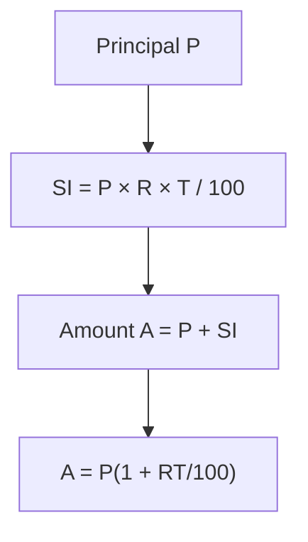
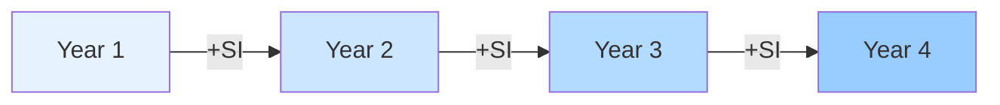
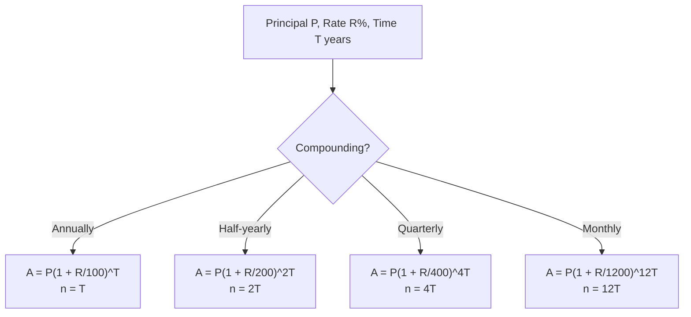
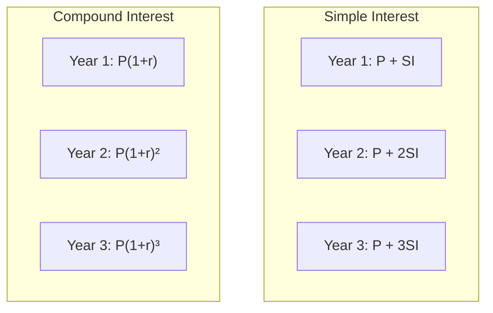
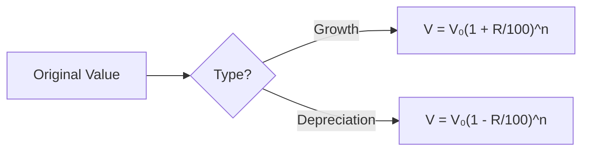

# Session 4: Simple & Compound Interest

Master interest calculations for loans, investments, and financial problems.

---

## 💵 Simple Interest (SI)

Simple Interest is calculated **only on the principal amount**.

### Key Terms

| Term | Symbol | Description |
|:-----|:------:|:------------|
| **Principal** | P | Initial amount borrowed/invested |
| **Rate** | R | Annual interest rate (in %) |
| **Time** | T | Duration (in years) |
| **Simple Interest** | SI | Interest earned/paid |
| **Amount** | A | Principal + Interest |

### Simple Interest Formulas



| Formula | Expression |
|:--------|:-----------|
| **Simple Interest** | SI = (P × R × T) / 100 |
| **Amount** | A = P + SI = P(1 + RT/100) |
| **Principal** | P = (100 × SI) / (R × T) |
| **Rate** | R = (100 × SI) / (P × T) |
| **Time** | T = (100 × SI) / (P × R) |

### SI Characteristics



> Interest earned is **constant** each year: SI per year = P × R / 100

---

## 📈 Compound Interest (CI)

Compound Interest is calculated on **principal + accumulated interest**.

### Compound Interest Formulas

| Formula | Expression |
|:--------|:-----------|
| **Amount (Annually)** | A = P(1 + R/100)^T |
| **Compound Interest** | CI = A - P = P[(1 + R/100)^T - 1] |
| **Half-yearly** | A = P(1 + R/200)^(2T) |
| **Quarterly** | A = P(1 + R/400)^(4T) |
| **Monthly** | A = P(1 + R/1200)^(12T) |

### Compounding Frequency



### General Formula

**A = P(1 + r/n)^(nt)**

Where:
- n = Number of times interest compounded per year
- t = Time in years
- r = Rate as decimal (R/100)

---

## 📊 SI vs CI Comparison



| Aspect | Simple Interest | Compound Interest |
|:-------|:----------------|:------------------|
| Interest on | Principal only | Principal + Previous Interest |
| Growth | Linear | Exponential |
| Formula | P × R × T / 100 | P[(1 + R/100)^T - 1] |
| Interest each year | Constant | Increasing |
| Total (same P, R, T) | Lower | Higher (for T > 1) |

### Difference Between CI and SI

For **2 years**: CI - SI = P(R/100)²

For **3 years**: CI - SI = P(R/100)² × (3 + R/100)

| Years | CI - SI Formula |
|:-----:|:----------------|
| 2 | PR²/10000 |
| 3 | PR²(300 + R)/1000000 |

---

## 💹 Growth and Depreciation

### Population Growth

| Scenario | Formula |
|:---------|:--------|
| **After n years** | P_n = P₀(1 + R/100)^n |
| **Before n years** | P₀ = P_n / (1 + R/100)^n |

### Depreciation

| Scenario | Formula |
|:---------|:--------|
| **Value after n years** | V_n = V₀(1 - R/100)^n |
| **Original value** | V₀ = V_n / (1 - R/100)^n |



---

## 🔢 Different Rates for Different Years

If rates are R₁%, R₂%, R₃% for successive years:

**Amount = P × (1 + R₁/100) × (1 + R₂/100) × (1 + R₃/100)**

### Money Doubling Rules

| Interest Type | Rule | Formula |
|:--------------|:-----|:--------|
| **Simple Interest** | Sum doubles when SI = P | **R × T = 100** |
| **Compound Interest** | If sum doubles in $T$ years | Becomes $2^n$ times in $n \times T$ years |
| **Rule of 72 (CI)** | Approx time to double | **T ≈ 72 / R** |

### Installment Formulas

**1. Simple Interest Installments**
Total Debt $A$ paid in $n$ annual installments of $x$:
$$ A = nx + \frac{x \times R}{100} \times \frac{n(n-1)}{2} $$

**2. Compound Interest Installments**
Loan $P$ paid in $n$ installments of $x$:
$$ P = \frac{x}{(1+\frac{R}{100})} + \frac{x}{(1+\frac{R}{100})^2} + ... + \frac{x}{(1+\frac{R}{100})^n} $$

---

## ✨ Quick Calculation Tables

### Multiplier Table (for CI)

| Rate | 1 Year | 2 Years | 3 Years |
|:----:|:------:|:-------:|:-------:|
| 5% | 1.05 | 1.1025 | 1.1576 |
| 10% | 1.10 | 1.21 | 1.331 |
| 15% | 1.15 | 1.3225 | 1.5209 |
| 20% | 1.20 | 1.44 | 1.728 |
| 25% | 1.25 | 1.5625 | 1.9531 |

### Effective Rate Conversion

| Nominal Rate | Half-yearly Effective | Quarterly Effective |
|:------------:|:---------------------:|:-------------------:|
| 10% | 10.25% | 10.38% |
| 12% | 12.36% | 12.55% |
| 20% | 21% | 21.55% |

---

## 🧮 Solved Examples

### Example 1: Simple Interest
**Q:** Find SI on ₹5000 at 8% for 3 years.

**Solution:**
```
SI = (P × R × T) / 100
SI = (5000 × 8 × 3) / 100
SI = ₹1200
```

### Example 2: Compound Interest
**Q:** Find CI on ₹10000 at 10% for 2 years compounded annually.

**Solution:**
```
A = P(1 + R/100)^T
A = 10000(1 + 10/100)²
A = 10000 × 1.21 = ₹12100
CI = A - P = 12100 - 10000 = ₹2100
```

### Example 3: Difference CI - SI
**Q:** Find difference between CI and SI on ₹8000 at 5% for 2 years.

**Solution:**
```
Difference = P(R/100)²
= 8000 × (5/100)²
= 8000 × 0.0025
= ₹20
```

### Example 4: Half-yearly Compounding
**Q:** Find CI on ₹16000 at 10% for 1.5 years compounded half-yearly.

**Solution:**
```
Rate per half-year = 10/2 = 5%
Number of periods = 1.5 × 2 = 3

A = 16000(1 + 5/100)³
A = 16000 × 1.157625 = ₹18522
CI = 18522 - 16000 = ₹2522
```

---

## 🎯 Quick Revision Points

> [!TIP]
> **SI = PRT/100** - Interest only on principal

> [!TIP]
> **CI = P[(1+R/100)^T - 1]** - Interest on principal + previous interest

> [!TIP]
> **CI - SI for 2 years = PR²/10000**

> [!NOTE]
> For same P, R, T: **CI > SI** when T > 1 year

> [!WARNING]
> Always check compounding frequency - it affects the calculation!

---

## ✍️ Practice Problems

1. A sum becomes ₹3600 in 2 years at SI. It becomes ₹4800 in 6 years. Find origin sum and rate.
2. CI on a sum for 2 years at 10% is ₹525. Find the sum.
3. In what time will ₹8000 amount to ₹8820 at 5% CI?
4. The difference between CI and SI for 3 years at 10% is ₹31. Find principal.
5. Population of a town is 125000. It increases by 4% in first year, decreases by 4% in second year. Find population after 2 years.
