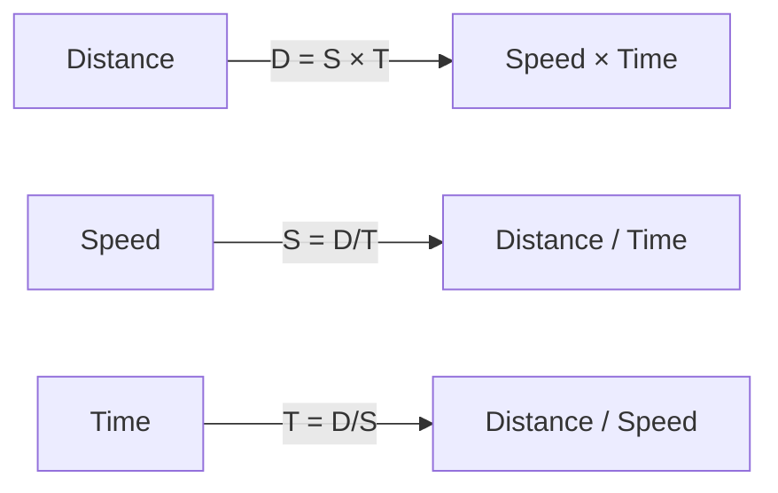
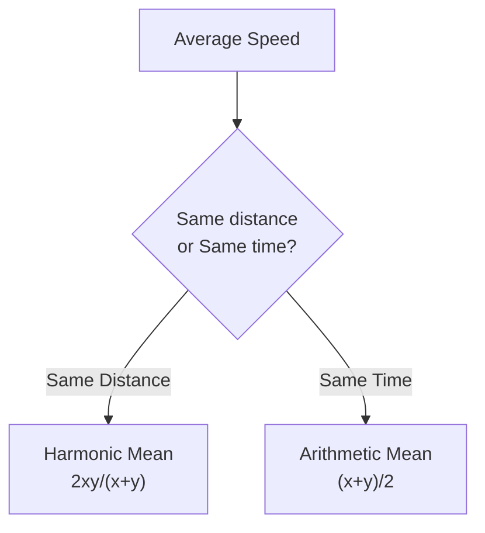
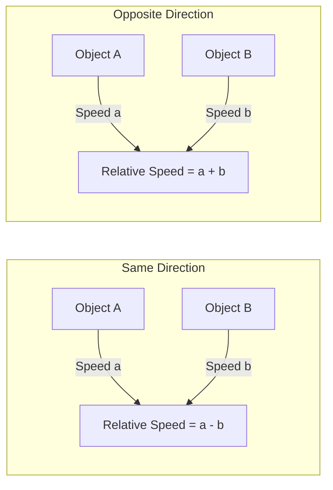
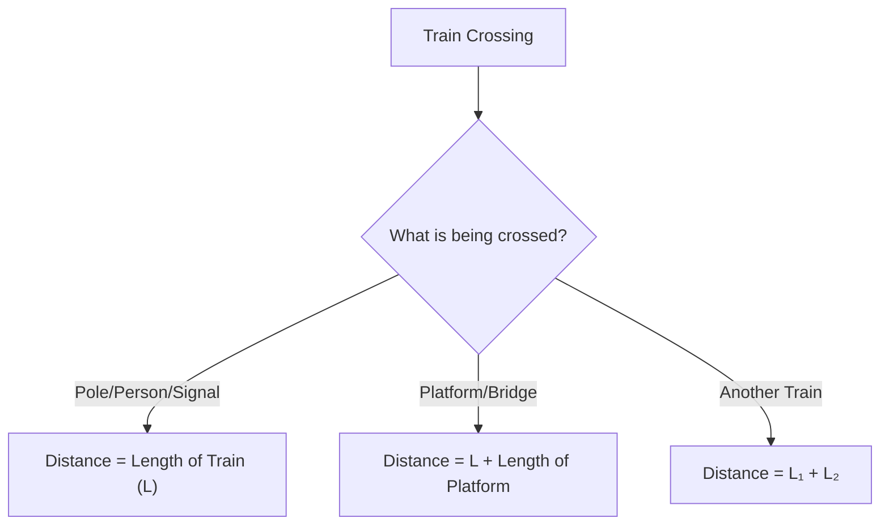

# Session 5: Time, Speed & Distance

Master problems on speed, distance, relative motion, and train-based calculations.

---

## 🚗 Basic Concepts

### Fundamental Formula



| Formula | Expression |
|:--------|:-----------|
| **Distance** | Speed × Time |
| **Speed** | Distance / Time |
| **Time** | Distance / Speed |

### Unit Conversion

| Conversion | Formula |
|:-----------|:--------|
| **km/hr to m/sec** | Multiply by **5/18** |
| **m/sec to km/hr** | Multiply by **18/5** |
| **km/hr to m/min** | Multiply by **1000/60** = **50/3** |

### Quick Conversion Table

| km/hr | m/sec | km/hr | m/sec |
|:-----:|:-----:|:-----:|:-----:|
| 18 | 5 | 72 | 20 |
| 36 | 10 | 90 | 25 |
| 54 | 15 | 108 | 30 |

### Ratio Method (Constant Distance)
If Distance is constant, Speed and Time are inversely proportional.
> **S₁ : S₂  ::  T₂ : T₁**

*Example: If Speed ratio is 3:4, Time ratio will be 4:3.*

### Late / Early Concept (Time Difference)
If a person travels at $S_1$ and reaches $t_1$ late, and at $S_2$ reaches $t_2$ early:
> **Distance = $\frac{S_1 \times S_2}{|S_1 - S_2|} \times \Delta T$**

Where $\Delta T = t_1 + t_2$ (if one late, one early).

---

## ⚡ Average Speed

**Average Speed = Total Distance / Total Time**

### Case 1: Equal Distances

When same distance traveled at different speeds:

**Average Speed = 2xy / (x + y)**

Where x and y are the two speeds.

### Case 2: Equal Times

When same time spent at different speeds:

**Average Speed = (x + y) / 2**



### Quick Reference

| Speeds | Same Distance Avg | Same Time Avg |
|:------:|:-----------------:|:-------------:|
| 20, 30 km/hr | 24 km/hr | 25 km/hr |
| 40, 60 km/hr | 48 km/hr | 50 km/hr |
| 30, 60 km/hr | 40 km/hr | 45 km/hr |

---

## 🔄 Relative Speed

When two objects are in motion:



| Direction | Relative Speed |
|:----------|:---------------|
| **Same direction** | \|S₁ - S₂\| |
| **Opposite directions** | S₁ + S₂ |

---

## 🚂 Problems on Trains

### Train Crossing Objects



### Key Formulas

| Scenario | Formula |
|:---------|:--------|
| **Crossing a pole/person** | Time = Length of Train / Speed |
| **Crossing a platform** | Time = (L_train + L_platform) / Speed |
| **Two trains (same direction)** | Time = (L₁ + L₂) / (S₁ - S₂) |
| **Two trains (opposite direction)** | Time = (L₁ + L₂) / (S₁ + S₂) |

### Train Formula Summary

| Scenario | Distance Covered | Relative Speed |
|:---------|:-----------------|:---------------|
| Train crosses pole | L | S |
| Train crosses platform | L + P | S |
| Two trains meet (opposite) | L₁ + L₂ | S₁ + S₂ |
| One train overtakes other | L₁ + L₂ | S₁ - S₂ |

### Races and Circular Motion

**1. Linear Races**
- **"A beats B by x meters"**: When A finishes, B is x meters behind.
- **"A beats B by t seconds"**: A finishes t seconds before B.

**2. Circular Motion**
Meeting at starting point: **LCM of times taken by each to complete one round.**

---

## 🧮 Solved Examples

### Example 1: Basic Speed
**Q:** A car covers 360 km in 6 hours. Find speed in m/sec.

**Solution:**
```
Speed = 360/6 = 60 km/hr
In m/sec = 60 × 5/18 = 50/3 = 16.67 m/sec
```

### Example 2: Average Speed
**Q:** A person travels 120 km at 40 km/hr and another 120 km at 60 km/hr. Find average speed.

**Solution:**
```
Same distance → Avg Speed = 2xy/(x+y)
= (2 × 40 × 60)/(40 + 60)
= 4800/100 = 48 km/hr
```

### Example 3: Train Crossing Platform
**Q:** A train 200m long crosses a 300m platform in 25 seconds. Find train speed.

**Solution:**
```
Total distance = 200 + 300 = 500m
Speed = 500/25 = 20 m/sec
= 20 × 18/5 = 72 km/hr
```

### Example 4: Two Trains
**Q:** Two trains 100m and 150m long run at 40 km/hr and 32 km/hr in same direction. Time to cross?

**Solution:**
```
Relative speed = 40 - 32 = 8 km/hr = 8 × 5/18 = 20/9 m/sec
Total distance = 100 + 150 = 250m
Time = 250 / (20/9) = 250 × 9/20 = 112.5 seconds
```

---

## 🎯 Quick Revision Points

> [!TIP]
> **km/hr to m/sec**: Multiply by 5/18

> [!TIP]
> **Average Speed for equal distances**: Use 2xy/(x+y) (Harmonic Mean)

> [!TIP]
> **Train crossing pole**: Only train length matters

> [!TIP]
> **Train crossing platform**: Add both lengths

> [!NOTE]
> Same direction → Subtract speeds; Opposite direction → Add speeds

---

## ✍️ Practice Problems

1. A person walks at 5 km/hr for 6 hrs, then at 4 km/hr for 12 hrs. Find average speed.
2. Two trains 150m and 200m traveling at 54 km/hr and 72 km/hr in opposite directions. Time to cross each other?
3. A train passes a platform in 36 sec and a man standing on platform in 20 sec at 54 km/hr. Find platform length.
4. If a man increases his speed by 1/3, he reaches 25 min early. Find original travel time.
5. A car covers first half at 30 km/hr and second half at 90 km/hr. Average speed?
