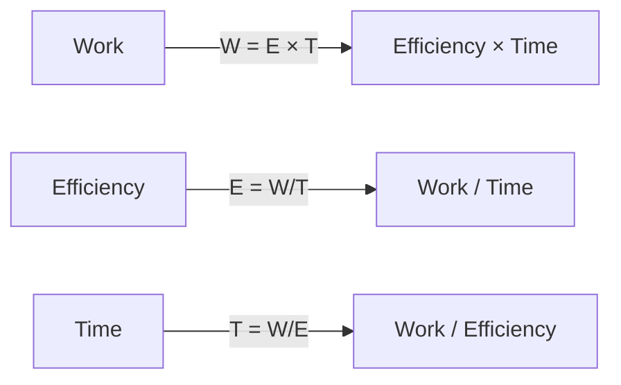
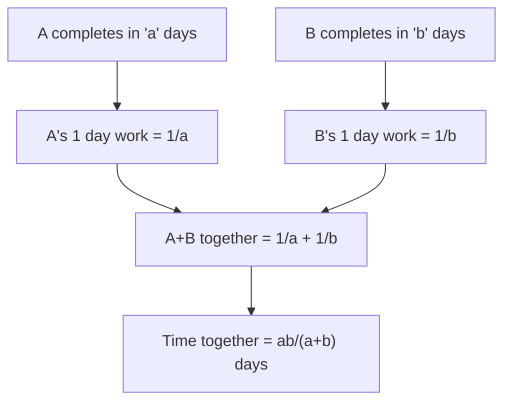
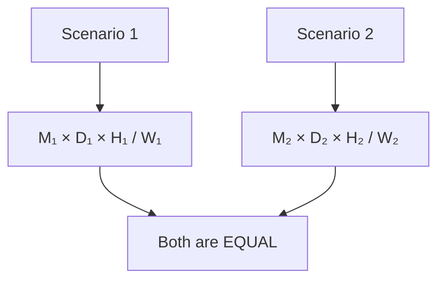
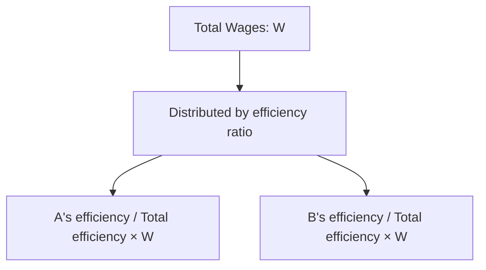

# Session 6: Time & Work, Wages

Master work efficiency, combined work, and wage distribution problems.

---

## ⚙️ Basic Concepts

### Fundamental Relationships



| Formula | Expression |
|:--------|:-----------|
| **Work Done** | Efficiency × Time |
| **Efficiency** | Work / Time = 1 / Time (for unit work) |
| **Time** | Work / Efficiency |

### Key Concept

> If A can complete work in **n days**, A's **one day's work = 1/n**

---

## 📊 Work and Efficiency

### Efficiency Relationships



### Combined Work Formulas

| Scenario | Formula |
|:---------|:--------|
| **A and B together** | Time = ab/(a+b) days |
| **A, B, and C together** | 1/a + 1/b + 1/c per day |
| **A works for x days, then B completes** | x/a + remaining days/b = 1 |

### Efficiency Comparison Table

| If A takes | A's Efficiency | If A is x times faster |
|:-----------|:---------------|:-----------------------|
| 10 days | 10% per day | A takes 1/x times the time |
| 5 days | 20% per day | A does x times work per day |
| 20 days | 5% per day | |

### Unit Work Method (LCM Method)
Steps:
1. Find **LCM** of individual days = **Total Work Units**.
2. Find efficiency/day for each worker = Total Units / Days.
3. Add efficiencies to get combined rate.

*Example: A in 10 days, B in 15 days.*
*Total Work = LCM(10, 15) = 30 units.*
*A's rate = 30/10 = 3 units/day.*
*B's rate = 30/15 = 2 units/day.*
*Together = 5 units/day.*
*Time = 30/5 = 6 days.*

### Alternating Work Days
If A and B work on alternate days (A starts):
- **Cycle**: A (1st day) + B (2nd day) = 2 days work.
- Find how many complete cycles fit in Total Work.
- Add remaining work by the next person in sequence.

---

## 👥 Multiple Workers

### MDH Formula (Man-Day-Hour)

**M₁ × D₁ × H₁ × E₁ / W₁ = M₂ × D₂ × H₂ × E₂ / W₂**

Where:
- M = Number of workers
- D = Days
- H = Hours per day
- E = Efficiency
- W = Work units



### Work Sharing Table

| If A alone takes | B alone takes | Together they take |
|:----------------:|:-------------:|:------------------:|
| 12 days | 12 days | 6 days |
| 10 days | 15 days | 6 days |
| 12 days | 18 days | 7.2 days |
| 10 days | 20 days | 6.67 days |
| 15 days | 20 days | 8.57 days |

### 'OR' vs 'AND' Problems
- **"10 Men OR 15 Women"**: Means 10 Men = 15 Women -> 2 Men = 3 Women. Convert all to one unit (e.g., all Women).
- **Formula approach (for OR condition)**:
  $$ \text{Required Days} = \frac{\text{Given Days}}{\frac{\text{Req Men}}{\text{Given Men}} + \frac{\text{Req Women}}{\text{Given Women}}} $$

---

## 💰 Wages

### Wage Distribution Principle

**Wages are distributed in the ratio of work done (or efficiencies)**



### Wage Formulas

| Concept | Formula |
|:--------|:--------|
| **Ratio of Wages** | Ratio of efficiencies (or work done) |
| **If times are a:b** | Efficiencies are b:a, so wages are b:a |
| **A's share** | (A's efficiency / Total efficiency) × Total Wages |

### Example Table

| A takes | B takes | Efficiency Ratio | Wage Ratio |
|:-------:|:-------:|:----------------:|:----------:|
| 10 days | 15 days | 15:10 = 3:2 | 3:2 |
| 12 days | 18 days | 18:12 = 3:2 | 3:2 |
| 20 days | 30 days | 30:20 = 3:2 | 3:2 |

---

## 🔄 Negative Work

When someone **destroys** work instead of building:

- Builder (A): +1/a per day
- Destroyer (B): -1/b per day
- Net work: 1/a - 1/b per day

---

## 🧮 Solved Examples

### Example 1: Combined Work
**Q:** A can do work in 12 days, B in 18 days. Both work together for 4 days. How many days for A to finish remaining?

**Solution:**
```
A's 1 day work = 1/12
B's 1 day work = 1/18
Together in 1 day = 1/12 + 1/18 = 5/36

In 4 days = 4 × 5/36 = 20/36 = 5/9

Remaining = 1 - 5/9 = 4/9

A alone: (4/9) ÷ (1/12) = 4/9 × 12 = 16/3 = 5.33 days
```

### Example 2: Wages
**Q:** A can do work in 10 days, B in 15 days. Total wage is ₹5000. Find each share.

**Solution:**
```
Efficiency ratio = 15:10 = 3:2
A's share = 5000 × 3/5 = ₹3000
B's share = 5000 × 2/5 = ₹2000
```

### Example 3: MDH Formula
**Q:** 12 men can do a work in 10 days working 8 hrs/day. How many men needed to do it in 5 days working 12 hrs/day?

**Solution:**
```
M₁D₁H₁ = M₂D₂H₂
12 × 10 × 8 = M₂ × 5 × 12
960 = 60 × M₂
M₂ = 16 men
```

### Example 4: Work Completion
**Q:** A is twice as fast as B. Together they complete work in 12 days. How many days for A alone?

**Solution:**
```
Let B take 2x days, A takes x days
1/x + 1/2x = 1/12
3/2x = 1/12
x = 18 days (A alone)
```

---

## 🎯 Quick Revision Points

> [!TIP]
> **Combined Time = ab/(a+b)** when A takes 'a' days and B takes 'b' days

> [!TIP]
> **Wages ∝ Efficiency ∝ 1/Time** (inverse of time taken)

> [!TIP]
> Use **LCM method** for complex problems - set total work = LCM of individual days

> [!NOTE]
> Efficiency and time are **inversely proportional**

---

## ✍️ Practice Problems

1. A does 4/5 of work in 20 days. He then calls B to complete. B finishes in 6 days. How long would B alone take?
2. 15 men complete work in 16 days. How many additional men needed to complete in 12 days?
3. A can complete in 16 days. B is 60% more efficient. How many days for B?
4. A and B together earn ₹1200. A works for 6 days, B for 9 days. If A earns ₹400, find the ratio of daily wages.
5. If 10 men or 15 women can do work in 6 days, in how many days can 5 men and 5 women do it?
