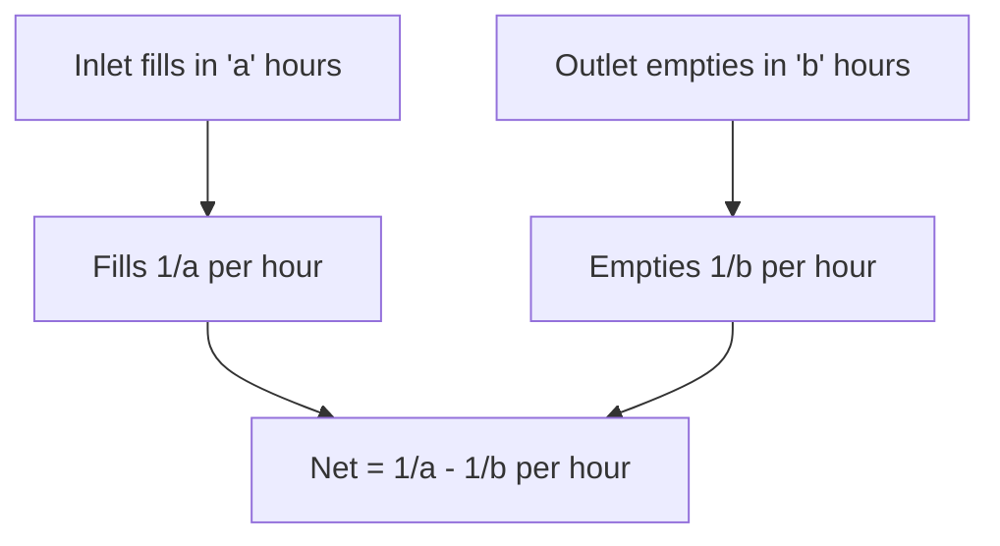
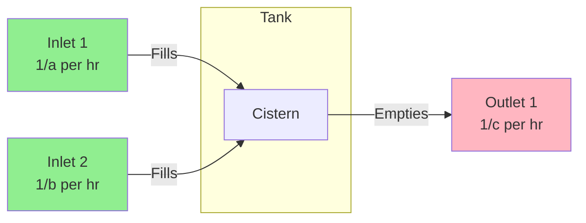
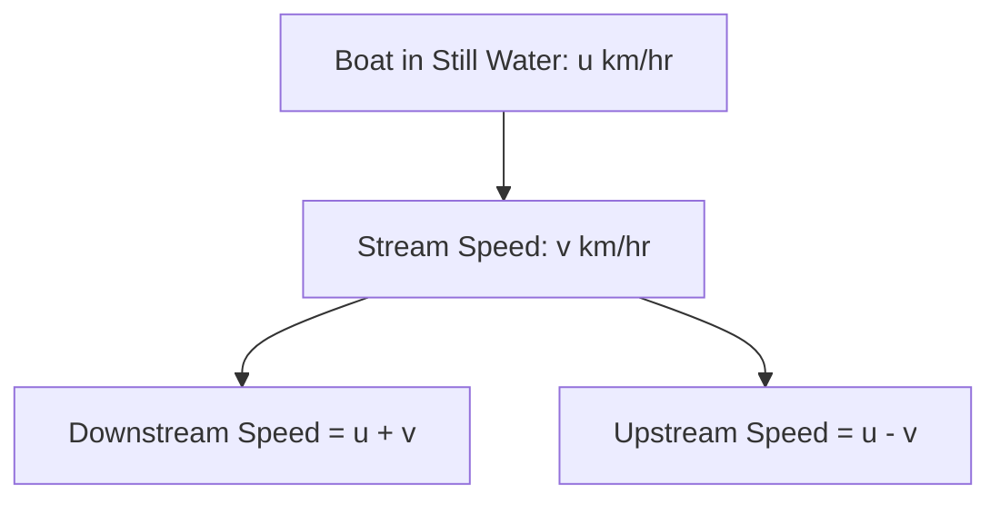
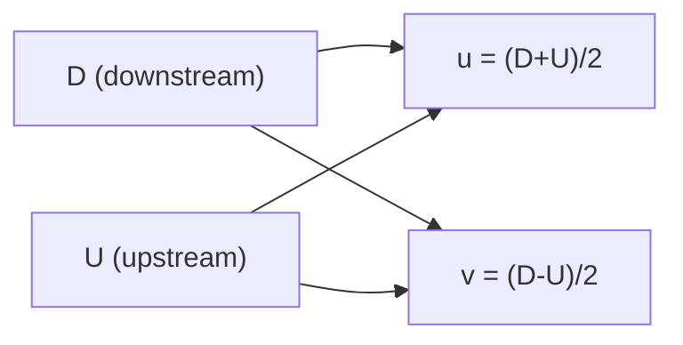

# Session 7: Pipes & Cisterns, Boats & Streams

Master problems involving filling/emptying tanks and upstream/downstream motion.

---

## 🚰 Pipes and Cisterns

This is an application of **Time and Work** concepts with a twist - outlet pipes do **negative work**.

### Key Terms

| Term | Description |
|:-----|:------------|
| **Inlet Pipe** | Fills the tank (positive work) |
| **Outlet Pipe/Leak** | Empties the tank (negative work) |
| **Cistern** | Tank or container being filled/emptied |

### Basic Formulas



| Scenario | Formula |
|:---------|:--------|
| **Inlet alone** | Fills 1/a per hour |
| **Outlet alone** | Empties 1/b per hour |
| **Both open (a < b)** | Net filling = 1/a - 1/b per hour |
| **Both open (a > b)** | Net emptying = 1/b - 1/a per hour |

### Combined Pipes

| Combination | Time to Fill/Empty |
|:------------|:-------------------|
| **Two inlets (a, b hours)** | ab/(a+b) hours |
| **One inlet, one outlet** | ab/\|b-a\| hours |
| **Multiple pipes** | Add all filling rates, subtract emptying rates |

### Pipes and Cisterns Diagram



### Net Work Formula

**Net work per hour = Σ(1/inlet times) - Σ(1/outlet times)**

### Capacity of Tank
If an outlet pipe empties at **X gallons/min** and takes **T minutes** to empty a full tank:
> **Capacity = X × T**

*Note: Often T is found by using the combined rate logic first.*

### Alternating Pipes
If pipes work on alternate hours:
1. **Cycles**: Calculate work for one cycle (e.g., A+B).
2. **Caution**: If one is emptying (negative work), stop the cycles just before the tank is full, and calculate the last step manually. **Do not overshoot.**

---

## 🚣 Boats and Streams

### Key Terms

| Term | Symbol | Description |
|:-----|:------:|:------------|
| **Still Water Speed** | u | Speed of boat in still water |
| **Stream Speed** | v | Speed of the water current |
| **Downstream** | D | Moving with the current |
| **Upstream** | U | Moving against the current |

### Speed Formulas



| Direction | Speed Formula |
|:----------|:--------------|
| **Downstream** | (u + v) km/hr |
| **Upstream** | (u - v) km/hr |

### Deriving u and v

If downstream speed = **D** and upstream speed = **U**:

| To Find | Formula |
|:--------|:--------|
| **Speed in still water (u)** | (D + U) / 2 |
| **Speed of stream (v)** | (D - U) / 2 |



### Time and Distance

| Scenario | Formula |
|:---------|:--------|
| **Time downstream** | Distance / (u + v) |
| **Time upstream** | Distance / (u - v) |
| **Average speed (round trip)** | (u² - v²) / u |

### Special Cases

| Case | Result |
|:-----|:-------|
| If v > u | Boat cannot go upstream |
| Round trip same distance | Total time = D/(u+v) + D/(u-v) |
| Still water (v = 0) | Upstream = Downstream speed |

---

## 🧮 Solved Examples

### Example 1: Two Pipes
**Q:** Pipe A fills in 10 hrs, Pipe B empties in 15 hrs. When both open, time to fill?

**Solution:**
```
A fills: 1/10 per hr
B empties: 1/15 per hr
Net: 1/10 - 1/15 = 1/30 per hr
Time to fill = 30 hours
```

### Example 2: Three Pipes
**Q:** Two inlet pipes fill in 12 and 15 hours. Outlet empties in 20 hours. Time to fill when all open?

**Solution:**
```
Net per hour = 1/12 + 1/15 - 1/20
= 5/60 + 4/60 - 3/60 = 6/60 = 1/10
Time = 10 hours
```

### Example 3: Boats - Basic
**Q:** A man rows downstream 30 km in 3 hrs, upstream 18 km in 3 hrs. Find his speed in still water.

**Solution:**
```
Downstream speed = 30/3 = 10 km/hr
Upstream speed = 18/3 = 6 km/hr

Speed in still water = (10 + 6)/2 = 8 km/hr
Stream speed = (10 - 6)/2 = 2 km/hr
```

### Example 4: Leak Problem
**Q:** A pipe fills tank in 8 hrs. Due to leak, it takes 10 hrs. How long for leak alone to empty full tank?

**Solution:**
```
Pipe fills: 1/8 per hr
Pipe + Leak: 1/10 per hr

Leak empties: 1/8 - 1/10 = 1/40 per hr
Leak alone empties in 40 hours
```

---

## 📊 Quick Reference Tables

### Pipes Summary

| Pipes | Work per unit time | Total Time |
|:------|:-------------------|:-----------|
| 2 Inlets (a, b) | 1/a + 1/b | ab/(a+b) |
| Inlet + Outlet | 1/a - 1/b | ab/(b-a) or ab/(a-b) |
| n Inlets | Σ(1/tᵢ) | 1/Σ(1/tᵢ) |

### Boats Summary

| Quantity | Formula |
|:---------|:--------|
| Downstream speed | u + v |
| Upstream speed | u - v |
| Speed in still water | (D + U)/2 |
| Stream speed | (D - U)/2 |

---

## 🎯 Quick Revision Points

> [!TIP]
> **Inlet = positive work, Outlet = negative work**

> [!TIP]
> **Still water speed = (Downstream + Upstream) / 2**

> [!TIP]
> **Stream speed = (Downstream - Upstream) / 2**

> [!NOTE]
> Pipes & Cisterns is just **Time & Work with negative workers**

---

## ✍️ Practice Problems

1. Two pipes can fill a tank in 15 and 20 minutes. An outlet empties in 30 minutes. When all open, time to fill?
2. A cistern has two pipes. One fills in 10 hrs, the leak empties in 12 hrs. How long if both work together?
3. A boat goes 24 km downstream in 2 hrs and 24 km upstream in 3 hrs. Find speed in still water and stream.
4. A boat takes 6 hrs to travel 24 km upstream and back. If stream speed is 2 km/hr, find still water speed.
5. Three pipes A, B, C can fill in 6, 9, 12 hours. A and B work for 3 hrs, then C also opens. Total time to fill?
