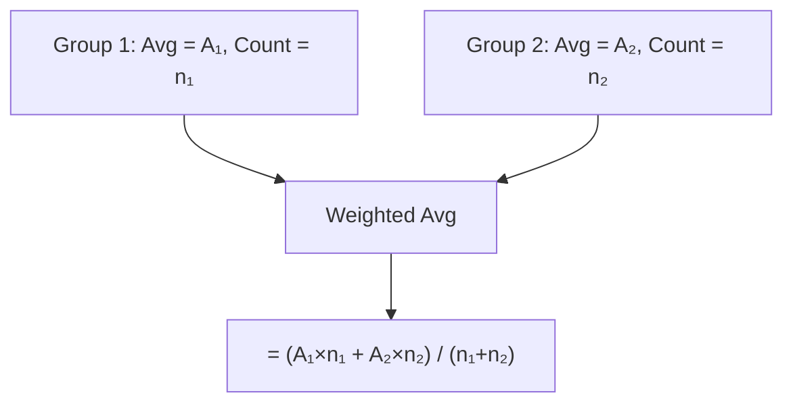
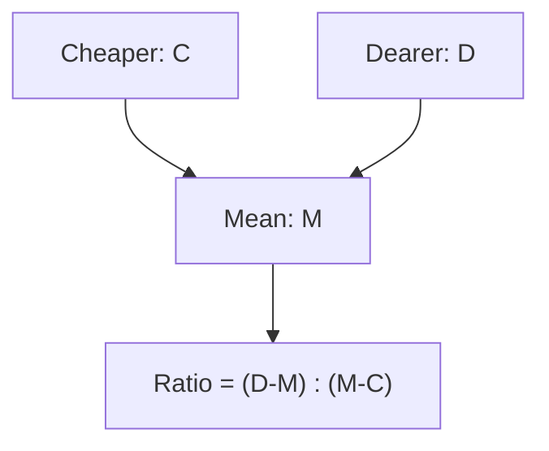
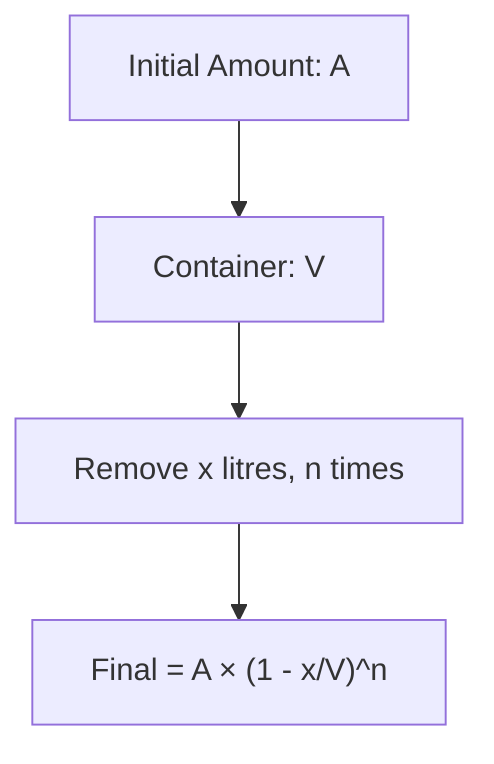

# Session 8: Averages, Mixtures & Alligations

Master average calculations, mixture problems, and the alligation rule.

---

## 📊 Averages

### Basic Formula

**Average = Sum of all observations / Number of observations**


### Key Formulas

| Formula | Expression |
|:--------|:-----------|
| **Average** | Σxᵢ / n |
| **Sum** | Average × n |
| **New Average (add value)** | (Old Sum + New Value) / (n + 1) |

### Special Series Averages

| Series | Average Formula |
|:-------|:----------------|
| First n natural numbers | (n + 1) / 2 |
| First n even numbers | n + 1 |
| First n odd numbers | n |
| Squares of first n numbers | (n + 1)(2n + 1) / 6 |
| Cubes of first n numbers | n(n + 1)² / 4 |
| Consecutive numbers | (First + Last) / 2 |

### Average Change Rules

| Action | Effect on Average |
|:-------|:------------------|
| Add a value > average | Average increases |
| Add a value < average | Average decreases |
| Add a value = average | Average unchanged |
| Remove a value > average | Average decreases |
| Remove a value < average | Average increases |

### Important Shortcuts

**1. Replacement Rule**
If a person of weight $W_{old}$ is replaced by a new person $W_{new}$ and average increases by $x$:
> **$W_{new} = W_{old} + (\text{Total People} \times x)$**

**2. Overlap Rule (Middle Number)**
If avg of $n$ numbers is $A$, avg of first $k$ is $A_1$, avg of last $k$ is $A_2$ (where $2k > n$):
> **Middle Number = $(k \times A_1 + k \times A_2) - (n \times A)$**

**3. Sports Averages**
- **Batting Avg**: Total Runs / Total Innings
- **Bowling Avg**: Total Runs Given / Total Wickets Taken

---

## ⚖️ Weighted Average

When different groups have different sizes:

**Weighted Average = Σ(Value × Weight) / Σ(Weight)**



### Formula

**Combined Average = (n₁A₁ + n₂A₂ + ... + nₖAₖ) / (n₁ + n₂ + ... + nₖ)**

---

## 🥤 Mixtures and Alligations

### Basic Mixture Concepts

A mixture problem involves combining two or more ingredients with different properties.

### Rule of Alligation

Used to find the **ratio** in which two ingredients must be mixed to get a mixture of desired value.



### Alligation Cross Method

```
       Cheaper (C)          Dearer (D)
              \                /
               \              /
                \            /
                 Mean (M)
                /            \
               /              \
              /                \
           (D-M)              (M-C)
           
Ratio of Cheaper : Dearer = (D - M) : (M - C)
```

### Alligation Formula

| To Find | Formula |
|:--------|:--------|
| **Ratio of quantities** | (D - M) : (M - C) |
| **Mean value** | (C × Q₁ + D × Q₂) / (Q₁ + Q₂) |
| **Quantity of cheaper** | Total × (D - M) / (D - C) |
| **Quantity of dearer** | Total × (M - C) / (D - C) |

---

## 🔄 Repeated Dilution

When a container is repeatedly filled and emptied partially:

### Formula for Repeated Replacement

**Final Concentration = Initial × (1 - Removed/Total)ⁿ**



| Scenario | Formula |
|:---------|:--------|
| After n operations | Final = A(1 - x/V)ⁿ |
| Fraction remaining | (1 - x/V)ⁿ |
| Fraction replaced | 1 - (1 - x/V)ⁿ |

---

## 🧮 Solved Examples

### Example 1: Basic Average
**Q:** Average of 5 numbers is 20. If one number is removed, average becomes 18. Find removed number.

**Solution:**
```
Sum of 5 numbers = 20 × 5 = 100
Sum of 4 numbers = 18 × 4 = 72
Removed number = 100 - 72 = 28
```

### Example 2: Weighted Average
**Q:** Class A has 30 students with avg 50, Class B has 20 students with avg 60. Find combined average.

**Solution:**
```
Combined = (30×50 + 20×60) / (30+20)
= (1500 + 1200) / 50
= 2700 / 50 = 54
```

### Example 3: Alligation
**Q:** In what ratio must water be mixed with milk costing ₹24/litre to get mixture worth ₹18/litre?

**Solution:**
```
Water (Cheaper) = ₹0
Milk (Dearer) = ₹24
Mean = ₹18

Ratio = (24-18) : (18-0) = 6 : 18 = 1 : 3
Water : Milk = 1 : 3
```

### Example 4: Replacement
**Q:** A container has 40L of milk. 8L removed and replaced with water. Done 3 times. Find final milk quantity.

**Solution:**
```
Final milk = 40 × (1 - 8/40)³
= 40 × (32/40)³
= 40 × (4/5)³
= 40 × 64/125
= 20.48 litres
```

---

## 📊 Quick Reference Tables

### Common Alligation Ratios

| Cheaper (C) | Dearer (D) | Mean (M) | Ratio C:D |
|:-----------:|:----------:|:--------:|:---------:|
| 10 | 20 | 15 | 1:1 |
| 10 | 25 | 15 | 2:1 |
| 12 | 18 | 14 | 2:1 |
| 20 | 30 | 24 | 3:2 |

### Average of Series

| Series | First 5 | First 10 | First 20 |
|:-------|:-------:|:--------:|:--------:|
| Natural (n+1)/2 | 3 | 5.5 | 10.5 |
| Even (n+1) | 6 | 11 | 21 |
| Odd (n) | 5 | 10 | 20 |

---

## 🎯 Quick Revision Points

> [!TIP]
> **Alligation ratio = (Dearer - Mean) : (Mean - Cheaper)**

> [!TIP]
> **Average of first n natural numbers = (n+1)/2**

> [!TIP]
> **Replacement formula**: Final = Initial × (1 - x/V)ⁿ

> [!NOTE]
> In alligation, water has cost = 0 and pure substance has concentration = 100%

---

## ✍️ Practice Problems

1. The average of 11 results is 60. Average of first 6 is 58, last 6 is 63. Find 6th result.
2. In what ratio must rice at ₹3.10/kg mix with rice at ₹3.60/kg to get mixture worth ₹3.25/kg?
3. A vessel has 60L of milk. 12L replaced by water, repeated 3 times. Find milk remaining.
4. Average age of 30 boys is 15. If teacher included, average becomes 16. Find teacher's age.
5. How many kg of rice at ₹8/kg be mixed with 40 kg of rice at ₹5/kg to get mixture at ₹6/kg?
