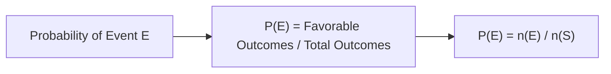
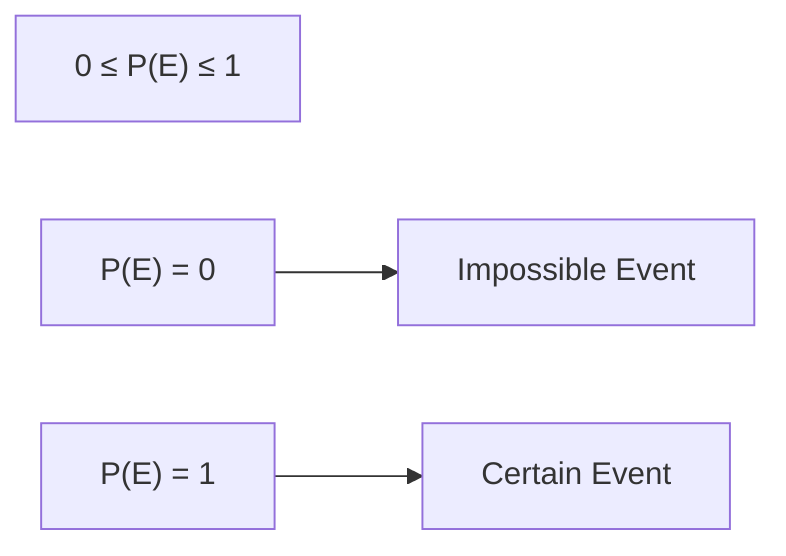
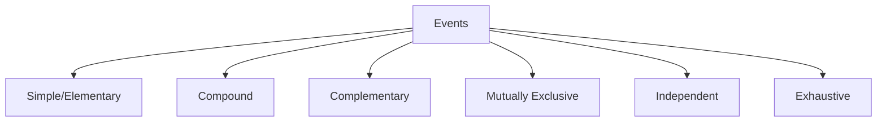
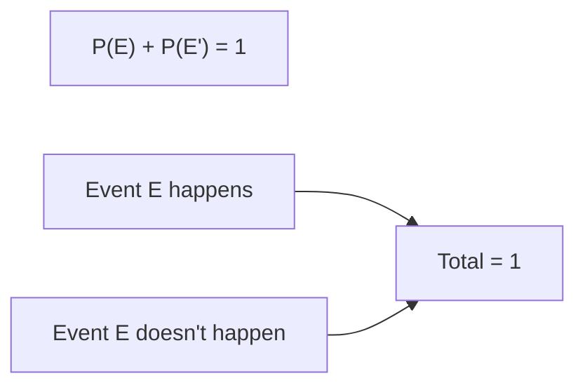
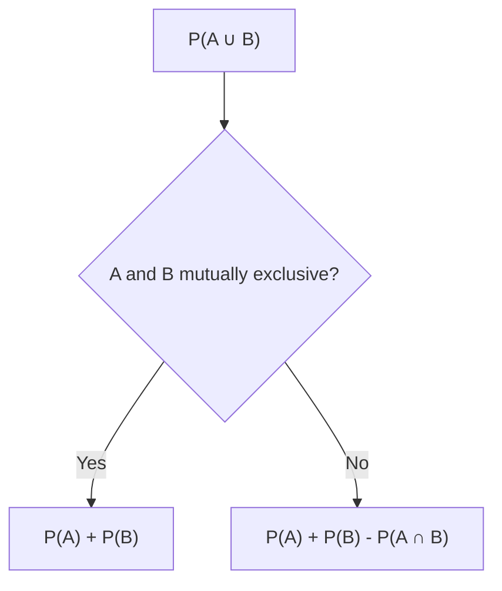

# Session 9: Probability

Master probability concepts, rules, and problem-solving techniques.

---

## 📊 Basic Concepts

### Key Definitions

| Term | Definition |
|:-----|:-----------|
| **Experiment** | An action with well-defined outcomes |
| **Sample Space (S)** | Set of all possible outcomes |
| **Event (E)** | A subset of sample space |
| **Favorable Outcomes** | Outcomes that satisfy the event condition |

### Probability Formula



**P(E) = n(E) / n(S)** = Number of favorable outcomes / Total outcomes

### Probability Range



| Value | Meaning |
|:------|:--------|
| P(E) = 0 | Impossible (never happens) |
| P(E) = 1 | Certain (always happens) |
| 0 < P(E) < 1 | Possible but not certain |

---

## 🎲 Types of Events

### Event Classification



| Event Type | Description |
|:-----------|:------------|
| **Simple** | Single outcome (e.g., getting a 6) |
| **Compound** | Multiple outcomes (e.g., getting even number) |
| **Complementary** | E' = S - E (not happening) |
| **Mutually Exclusive** | Cannot occur together |
| **Independent** | One doesn't affect the other |
| **Exhaustive** | Cover all possibilities |

---

## 📐 Probability Rules

### Rule 1: Complement Rule

**P(E') = 1 - P(E)**



### Rule 2: Addition Rule

**P(A ∪ B) = P(A) + P(B) - P(A ∩ B)**

| Scenario | Formula |
|:---------|:--------|
| **General** | P(A or B) = P(A) + P(B) - P(A and B) |
| **Mutually Exclusive** | P(A or B) = P(A) + P(B) |



### Rule 3: Multiplication Rule

**P(A ∩ B) = P(A) × P(B|A)**

| Scenario | Formula |
|:---------|:--------|
| **Independent Events** | P(A and B) = P(A) × P(B) |
| **Dependent Events** | P(A and B) = P(A) × P(B\|A) |

---

## 🎴 Common Probability Scenarios

### Dice Probability

| Outcome | Probability |
|:--------|:------------|
| Any specific number (1-6) | 1/6 |
| Even number (2,4,6) | 3/6 = 1/2 |
| Odd number (1,3,5) | 3/6 = 1/2 |
| Number > 4 (5,6) | 2/6 = 1/3 |
| Two dice sum = 7 | 6/36 = 1/6 |

### Cards Probability

| Total Cards | 52 |
|:------------|:---|
| Suits | 4 (♠♥♦♣) - 13 each |
| Face Cards | 12 (J, Q, K × 4) |
| Aces | 4 |
| Red Cards | 26 (Hearts + Diamonds) |
| Black Cards | 26 (Spades + Clubs) |

| Draw | Probability |
|:-----|:------------|
| Any specific card | 1/52 |
| Any Ace | 4/52 = 1/13 |
| Any Heart | 13/52 = 1/4 |
| Any Face Card | 12/52 = 3/13 |
| Red Face Card | 6/52 = 3/26 |

### Coins Probability

| Toss | Sample Space Size |
|:-----|:-----------------:|
| 1 coin | 2 |
| 2 coins | 4 |
| 3 coins | 8 |
| n coins | 2ⁿ |

### Calendar Probability (Leap Year)

| Year Type | Days | Extra Days | P(53 Sundays) |
|:----------|:-----|:-----------|:--------------|
| **Ordinary Year** | 365 | 1 | 1/7 |
| **Leap Year** | 366 | 2 | 2/7 |

*Logic: 366 days = 52 weeks + 2 extra days. The 2 extra days can be (Sun,Mon), (Mon,Tue)... (Sat,Sun). 2 out of 7 cases have Sunday.*

### Selection Probability (Using Combinations)
When selecting $r$ items from $n$ items:
> **P(E) = $\frac{\text{No. of favorable selections}}{\text{Total possible selections}} = \frac{^nC_r}{^TC_r}$**

*Example: 2 Red balls from 5 Red, 3 Blue.*
*Total = 8, Select 2. Total ways = $^8C_2$. Favorable = $^5C_2$. P = $^5C_2 / ^8C_2$.*

---

## 📈 Conditional Probability

**P(A|B) = P(A ∩ B) / P(B)**

Probability of A given that B has occurred.

### Bayes' Theorem

**P(A|B) = [P(B|A) × P(A)] / P(B)**

---

## 🧮 Solved Examples

### Example 1: Single Die
**Q:** A die is thrown. Find P(getting prime number).

**Solution:**
```
Prime numbers on die: 2, 3, 5
Favorable = 3, Total = 6
P = 3/6 = 1/2
```

### Example 2: Two Dice
**Q:** Two dice are thrown. Find P(sum = 9).

**Solution:**
```
Total outcomes = 6 × 6 = 36
Favorable: (3,6), (4,5), (5,4), (6,3) = 4
P = 4/36 = 1/9
```

### Example 3: Cards
**Q:** A card is drawn. Find P(King or Heart).

**Solution:**
```
P(King) = 4/52
P(Heart) = 13/52
P(King of Hearts) = 1/52
P(King or Heart) = 4/52 + 13/52 - 1/52 = 16/52 = 4/13
```

### Example 4: Independent Events
**Q:** A coin is tossed 3 times. Find P(all heads).

**Solution:**
```
P(H) = 1/2 for each toss
P(all H) = 1/2 × 1/2 × 1/2 = 1/8
```

---

## 📊 Important Probability Table

| Event | Formula |
|:------|:--------|
| At least one | 1 - P(none) |
| At most one | P(none) + P(exactly one) |
| Exactly one of A or B | P(A) + P(B) - 2P(A∩B) |
| Neither A nor B | 1 - P(A∪B) |

---

## 🎯 Quick Revision Points

> [!TIP]
> **P(E) = Favorable / Total** - Basic probability formula

> [!TIP]
> **P(E) + P(E') = 1** - Complement rule

> [!TIP]
> **"At least one" = 1 - P(none)** - Very useful shortcut!

> [!NOTE]
> For independent events: Multiply individual probabilities

---

## ✍️ Practice Problems

1. Two dice thrown. Find P(sum is multiple of 3).
2. A bag has 5 red, 3 blue balls. Two drawn at random. Find P(both same color).
3. A coin tossed 4 times. Find P(at least one head).
4. Cards: Find P(drawing a Queen or a Red card).
5. Two cards drawn without replacement. Find P(both are Aces).
