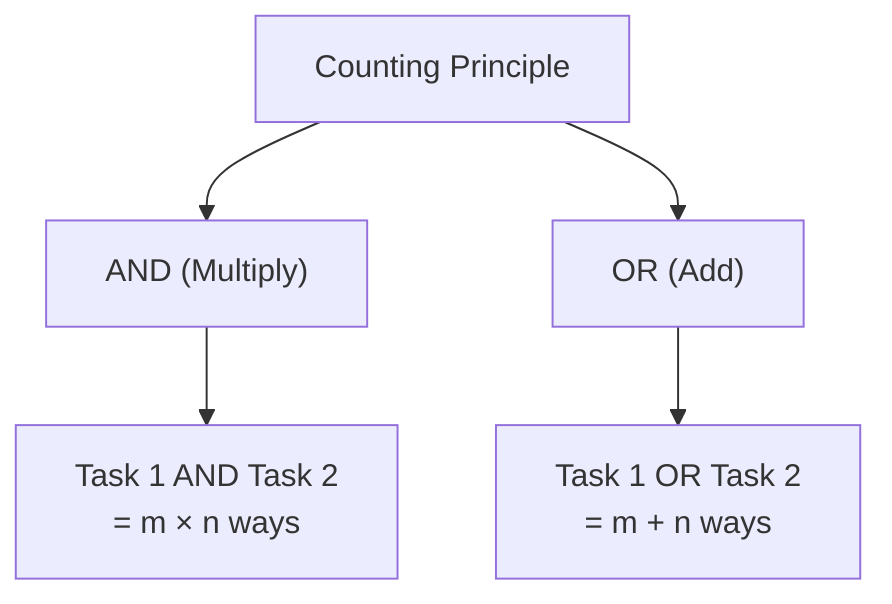
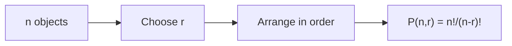
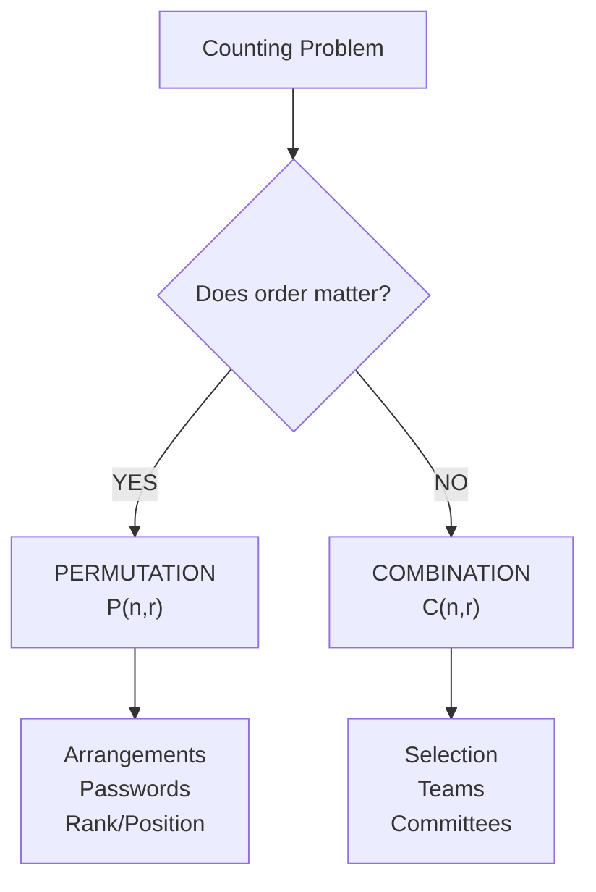
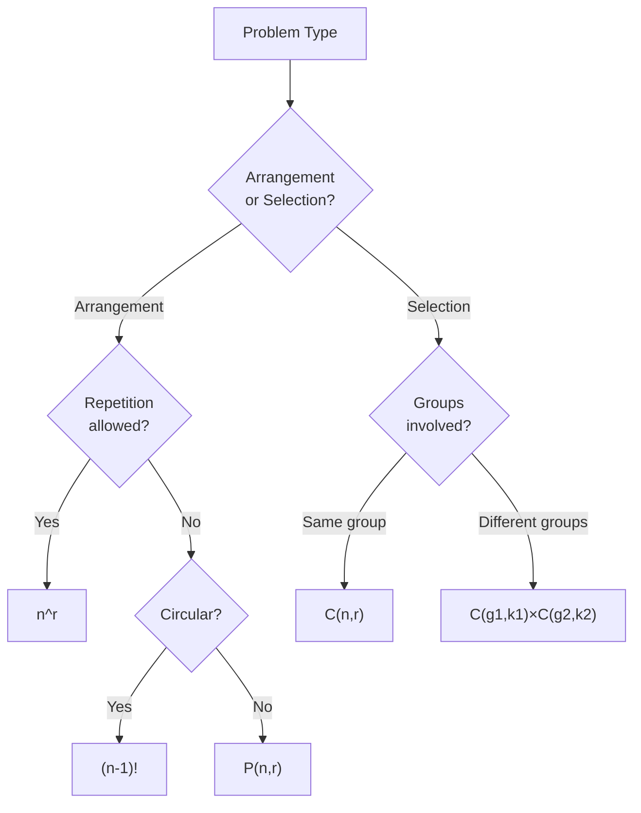

# Session 10: Permutations & Combinations

Master counting principles, arrangements, and selections.

---

## 📊 Fundamental Counting Principle

### Multiplication Principle

If task A can be done in **m** ways and task B in **n** ways, then both together in **m × n** ways.

### Addition Principle

If task A can be done in **m** ways OR task B in **n** ways (mutually exclusive), then either can be done in **m + n** ways.



---

## 🔢 Factorial

### Definition

**n! = n × (n-1) × (n-2) × ... × 3 × 2 × 1**

### Key Values

| n | n! |
|:-:|:--:|
| 0 | 1 |
| 1 | 1 |
| 2 | 2 |
| 3 | 6 |
| 4 | 24 |
| 5 | 120 |
| 6 | 720 |
| 7 | 5040 |
| 10 | 3628800 |

> **Important**: 0! = 1 (by definition)

---

## 🔄 Permutations

**Permutation = Arrangement** (Order MATTERS)

### Basic Formula

**P(n, r) = n! / (n-r)!**



### Permutation Cases

| Scenario | Formula |
|:---------|:--------|
| All n objects arranged | n! |
| r objects from n | n!/(n-r)! |
| With repetition allowed | nʳ |
| Identical objects (p,q same) | n! / (p! × q!) |
| Circular arrangement | (n-1)! |

### Special Permutation Formulas

| Type | Formula |
|:-----|:--------|
| **Linear** | P(n,r) = n!/(n-r)! |
| **Circular** | (n-1)! |
| **Necklace/Bracelet** | (n-1)!/2 |
| **Repetition in n objects** | n!/p!q!r! |

---

## 🎯 Combinations

**Combination = Selection** (Order DOESN'T MATTER)

### Basic Formula

**C(n, r) = n! / [r! × (n-r)!]**


### Key Properties

| Property | Formula |
|:---------|:--------|
| C(n, 0) = C(n, n) | 1 |
| C(n, 1) = C(n, n-1) | n |
| C(n, r) = C(n, n-r) | Symmetry |
| C(n, r) + C(n, r+1) | C(n+1, r+1) |

### Relationship between P and C

**P(n, r) = C(n, r) × r!**

or

**C(n, r) = P(n, r) / r!**

---

## 📊 Permutation vs Combination



| Permutation | Combination |
|:------------|:------------|
| Order matters | Order doesn't matter |
| Arrangement | Selection |
| ABC ≠ BAC | {A,B,C} = {B,A,C} |
| P(n,r) = n!/(n-r)! | C(n,r) = n!/r!(n-r)! |

---

## 🔢 Common Formulas Table

| n | C(n,0) | C(n,1) | C(n,2) | C(n,3) | C(n,4) |
|:-:|:------:|:------:|:------:|:------:|:------:|
| 4 | 1 | 4 | 6 | 4 | 1 |
| 5 | 1 | 5 | 10 | 10 | 5 |
| 6 | 1 | 6 | 15 | 20 | 15 |
| 7 | 1 | 7 | 21 | 35 | 35 |
| 8 | 1 | 8 | 28 | 56 | 70 |
| 10 | 1 | 10 | 45 | 120 | 210 |

---

## ⚡ Special Cases

### Words with Repetition

For word "MISSISSIPPI" (M=1, I=4, S=4, P=2, total=11):

**Arrangements = 11! / (1! × 4! × 4! × 2!)**

### Circular Arrangements

- n distinct objects in circle: **(n-1)!**
- Necklace (clockwise = anticlockwise): **(n-1)!/2**

### Selection with Conditions

| Condition | Method |
|:----------|:-------|
| At least one | Total - None |
| At most k | C(n,0) + C(n,1) + ... + C(n,k) |
| Exactly k from each group | C(g₁,k) × C(g₂,k) |

### Miscellaneous Shortcuts

**1. Geometric Applications**
- **Handshakes**: Number of handshakes among $n$ people = **$C(n,2) = \frac{n(n-1)}{2}$**
- **Diagonals of Polygon**: Number of diagonals in $n$-sided polygon = **$C(n,2) - n = \frac{n(n-3)}{2}$**

**2. Derangements (None Correct)**
Number of ways to arrange $n$ items such that NONE occupy their original position:
> **$D_n = n! [1 - \frac{1}{1!} + \frac{1}{2!} - \frac{1}{3!} + ... + \frac{(-1)^n}{n!} ]$**
- $D_3 = 2$
- $D_4 = 9$
- $D_5 = 44$

**3. Sum of Numbers**
Sum of all $n$-digit numbers formed by $n$ non-zero digits (without repetition):
> **Sum = (Sum of digits) × (n-1)! × (11...1 [n times])**

---

## 🧮 Solved Examples

### Example 1: Basic Permutation
**Q:** How many 3-digit numbers from digits 1,2,3,4,5 (no repetition)?

**Solution:**
```
P(5,3) = 5!/(5-3)! = 5!/2! = 120/2 = 60
```

### Example 2: Basic Combination
**Q:** Select 3 students from 8 for a team.

**Solution:**
```
C(8,3) = 8!/(3!×5!) = (8×7×6)/(3×2×1) = 56
```

### Example 3: Word Arrangement
**Q:** How many arrangements of "APPLE"?

**Solution:**
```
5 letters, P repeats twice
= 5!/2! = 120/2 = 60
```

### Example 4: Committee Formation
**Q:** Form a committee of 5 from 6 men and 4 women with at least 2 women.

**Solution:**
```
Cases: (2W,3M) + (3W,2M) + (4W,1M)
= C(4,2)×C(6,3) + C(4,3)×C(6,2) + C(4,4)×C(6,1)
= 6×20 + 4×15 + 1×6
= 120 + 60 + 6 = 186
```

### Example 5: Circular Arrangement
**Q:** 5 people sit around a circular table. Number of ways?

**Solution:**
```
Circular = (n-1)! = (5-1)! = 4! = 24
```

---

## 📋 Decision Flowchart



---

## 🎯 Quick Revision Points

> [!TIP]
> **Permutation = Order matters** (Arrangement)

> [!TIP]
> **Combination = Order doesn't matter** (Selection)

> [!TIP]
> **C(n,r) = C(n, n-r)** - Choose r = Leave out (n-r)

> [!TIP]
> **Circular = (n-1)!** - One position is fixed

> [!NOTE]
> For repeated letters: Divide by factorial of each repetition

---

## ✍️ Practice Problems

1. How many 4-letter words from "CHAIR" with no repetition?
2. In how many ways can 8 people sit around a round table?
3. Arrangements of "ENGINEERING"?
4. Select 4 balls from 5 red, 4 blue such that at least 2 are red.
5. How many 5-digit numbers where first digit ≠ 0 from digits 0-9 (no repetition)?
