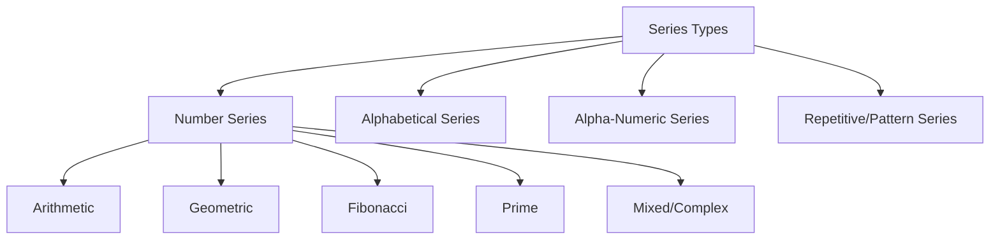
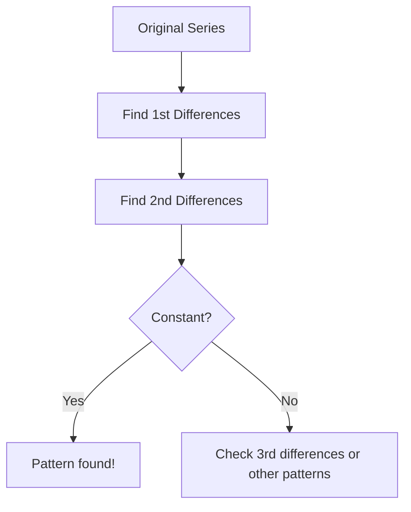
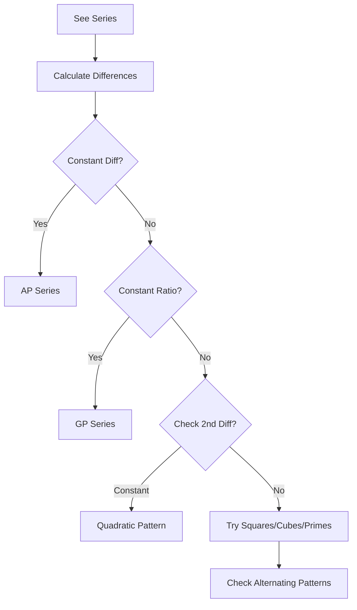

# Session 11: Series

Master number series, alphabetical series, and pattern recognition.

---

## 📊 Types of Series



---

## 🔢 Number Series

### Common Patterns

| Pattern Type | Example | Rule |
|:-------------|:--------|:-----|
| **Arithmetic (AP)** | 2, 5, 8, 11, 14 | +3 each time |
| **Geometric (GP)** | 3, 6, 12, 24, 48 | ×2 each time |
| **Squares** | 1, 4, 9, 16, 25 | n² |
| **Cubes** | 1, 8, 27, 64, 125 | n³ |
| **Fibonacci** | 1, 1, 2, 3, 5, 8, 13 | Sum of previous two |
| **Prime** | 2, 3, 5, 7, 11, 13 | Prime numbers |

### Difference Method



### Examples with Differences

**Series: 2, 5, 10, 17, 26, ?**
```
First differences:  3,  5,  7,  9, ?
Second differences:   2,  2,  2
Pattern: +2 each time in first differences
Next first diff = 11, so answer = 26 + 11 = 37
```

### Square and Cube Based

| n | n² | n³ | n² + n | n² - 1 |
|:-:|:--:|:--:|:------:|:------:|
| 1 | 1 | 1 | 2 | 0 |
| 2 | 4 | 8 | 6 | 3 |
| 3 | 9 | 27 | 12 | 8 |
| 4 | 16 | 64 | 20 | 15 |
| 5 | 25 | 125 | 30 | 24 |
| 6 | 36 | 216 | 42 | 35 |

---

## 🔤 Alphabetical Series

### Position Values

| A | B | C | D | E | F | G | H | I | J | K | L | M |
|:-:|:-:|:-:|:-:|:-:|:-:|:-:|:-:|:-:|:-:|:-:|:-:|:-:|
| 1 | 2 | 3 | 4 | 5 | 6 | 7 | 8 | 9 | 10 | 11 | 12 | 13 |

| N | O | P | Q | R | S | T | U | V | W | X | Y | Z |
|:-:|:-:|:-:|:-:|:-:|:-:|:-:|:-:|:-:|:-:|:-:|:-:|:-:|
| 14 | 15 | 16 | 17 | 18 | 19 | 20 | 21 | 22 | 23 | 24 | 25 | 26 |

### Opposite Letters (Sum = 27)

| Letter | Opposite |
|:------:|:--------:|
| A (1) | Z (26) |
| B (2) | Y (25) |
| C (3) | X (24) |
| M (13) | N (14) |

### Common Patterns

| Pattern | Example | Rule |
|:--------|:--------|:-----|
| **Skip 1** | A, C, E, G | +2 positions |
| **Skip 2** | A, D, G, J | +3 positions |
| **Reverse** | Z, Y, X, W | -1 position |
| **Alternate** | A, Z, B, Y | Forward + Backward |

---

## 🔀 Mixed Series

### Alpha-Numeric Patterns

**Example: A1, B2, D4, G7, K11, ?**
```
Letters: A(1), B(2), D(4), G(7), K(11)
    Diff:    +1,   +2,   +3,   +4,   +5
Numbers: 1, 2, 4, 7, 11
    Diff:   +1, +2, +3, +4, +5

Next: K+5 = P, 11+5 = 16 → P16
```

---

## 🔁 Repetitive Series

### Pattern Recognition

**Type 1: Increasing Repetition**
```
1, 2, 2, 3, 3, 3, 4, 4, 4, 4, ...
(1 appears once, 2 twice, 3 thrice, etc.)
```

**Type 2: Cyclic Pattern**
```
1, 2, 3, 1, 2, 3, 1, 2, 3, ...
(Pattern repeats with period 3)
```

**Type 3: Growing Pattern**
```
1, 1, 2, 1, 2, 3, 1, 2, 3, 4, ...
(Resets and adds one more)
```

### Solving Continuous Patterns (a_b_c...)
**Strategy:**
1. **Count total characters** (including blanks). Common lengths: 12, 15, 16, 20.
2. **Divide into groups**:
   - 12 = 3×4 or 4×3
   - 15 = 3×5 or 5×3
   - 16 = 4×4
3. **Compare groups** to find missing letters.

*Example: a _ b c a a b _ a a _ c*
*Total 12. Try groups of 4: `a_bc | aab_ | aa_c`*
*Fill: `aabc | aabc | aabc`. Missing: a, c, b.*

---

## 🧮 Problem-Solving Strategy



### Common Tricks

| If you see... | Try... |
|:--------------|:-------|
| Large numbers | Squares or cubes |
| Rapid growth | Geometric or exponential |
| Irregular gaps | Two interleaved series |
| Prime-like | Prime number series |
| Near squares | n² ± k pattern |

### Finding Wrong Term Strategy
1. **Check pattern from both start and end.**
2. **Identify the "breaking point"** where logic fails.
3. If $a, b, c, d, e$ is series and $c$ is wrong, then $(b \to c)$ and $(c \to d)$ both logical relationships will be broken.

---

## 🧮 Solved Examples

### Example 1: Find the pattern
**Q:** 3, 6, 11, 18, 27, ?

**Solution:**
```
Differences: 3, 5, 7, 9 (odd numbers)
Next diff = 11
Answer = 27 + 11 = 38
```

### Example 2: Mixed Pattern
**Q:** 2, 3, 5, 7, 11, 13, ?

**Solution:**
```
These are prime numbers!
Next prime = 17
```

### Example 3: Geometric
**Q:** 5, 15, 45, 135, ?

**Solution:**
```
Each term × 3
135 × 3 = 405
```

### Example 4: Two Series
**Q:** 3, 4, 8, 10, 13, 16, 18, ?

**Solution:**
```
Odd positions: 3, 8, 13, 18 (diff = 5)
Even positions: 4, 10, 16, ? (diff = 6)
Answer = 22
```

---

## 📊 Quick Reference

| Series Type | Common Form | Example |
|:------------|:------------|:--------|
| n | 1, 2, 3, 4, 5 | Natural numbers |
| 2n | 2, 4, 6, 8, 10 | Even numbers |
| 2n-1 | 1, 3, 5, 7, 9 | Odd numbers |
| n² | 1, 4, 9, 16, 25 | Squares |
| n³ | 1, 8, 27, 64 | Cubes |
| 2ⁿ | 2, 4, 8, 16, 32 | Powers of 2 |
| n(n+1)/2 | 1, 3, 6, 10, 15 | Triangular |
| Fibonacci | 1, 1, 2, 3, 5, 8 | Sum of prev 2 |

---

## 🎯 Quick Revision Points

> [!TIP]
> **Always try the difference method first**

> [!TIP]
> **Look for two interleaved series** if pattern isn't obvious

> [!TIP]
> **Check squares/cubes** when numbers are large

> [!NOTE]
> For alphabet: A=1, Z=26, and A+Z=27 (opposites)

---

## ✍️ Practice Problems

1. Find next: 2, 6, 12, 20, 30, ?
2. Find wrong term: 3, 7, 15, 31, 61, 127
3. Complete: A, C, F, J, O, ?
4. Find next: 1, 4, 9, 1, 6, 2, 5, ?
5. Find pattern: 7, 11, 13, 17, 19, 23, ?
