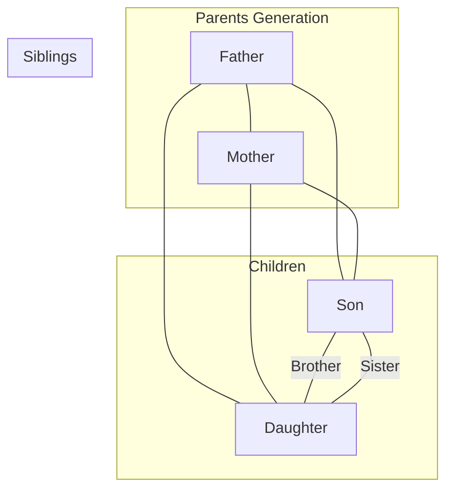
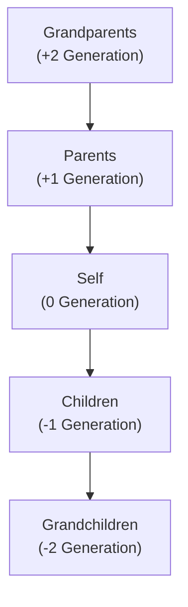
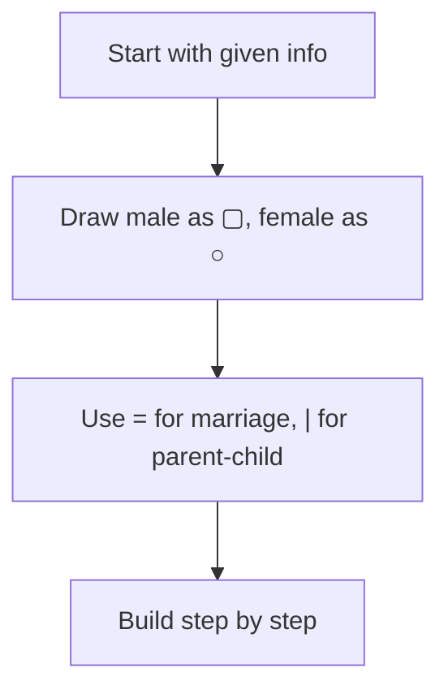

# Session 12: Blood Relations

Master family relationship problems with systematic approach.

---

## 👨‍👩‍👧‍👦 Relationship Terminology

### Basic Relationships



### Key Terms Table

| Relation | Male | Female |
|:---------|:-----|:-------|
| Parent | Father | Mother |
| Child | Son | Daughter |
| Sibling | Brother | Sister |
| Parent's Parent | Grandfather | Grandmother |
| Child's Child | Grandson | Granddaughter |
| Parent's Sibling | Uncle | Aunt |
| Sibling's Child | Nephew | Niece |
| Child's Spouse | Son-in-law | Daughter-in-law |
| Spouse's Parent | Father-in-law | Mother-in-law |

---

## 🔄 Generation Levels



| Level | Relationship |
|:-----:|:-------------|
| +2 | Grandparents, Grand Uncle/Aunt |
| +1 | Parents, Uncle, Aunt |
| 0 | Self, Siblings, Cousins, Spouse |
| -1 | Children, Nephew, Niece |
| -2 | Grandchildren |

---

## 👨‍👩‍👧 Paternal vs Maternal

### Paternal (Father's Side)

| Relation | Term |
|:---------|:-----|
| Father's Father | Paternal Grandfather |
| Father's Mother | Paternal Grandmother |
| Father's Brother | Paternal Uncle |
| Father's Sister | Paternal Aunt |
| Father's Brother's/Sister's Child | Paternal Cousin |

### Maternal (Mother's Side)

| Relation | Term |
|:---------|:-----|
| Mother's Father | Maternal Grandfather |
| Mother's Mother | Maternal Grandmother |
| Mother's Brother | Maternal Uncle |
| Mother's Sister | Maternal Aunt |
| Mother's Brother's/Sister's Child | Maternal Cousin |

---

## 🧩 Problem-Solving Strategies

### Strategy 1: Draw Family Tree



### Symbols Convention

| Symbol | Meaning |
|:------:|:--------|
| ▢ or □ | Male |
| ○ | Female |
| — or = | Marriage |
| \| | Parent-Child |
| - - - | Sibling |

### Strategy 2: Trace the Relationship

**Example: "A is B's mother's father's son"**

```
B → B's mother → (mother's) father → (father's) son = A
So A is B's mother's brother = A is B's uncle
```

---

## ⚠️ Common Traps

| Trap | Explanation |
|:-----|:------------|
| **"Only son/daughter"** | No other siblings of that gender |
| **"Only child"** | No siblings at all |
| **Name-based gender assumption** | Don't assume gender from names! |
| **"Brother" vs "Brother-in-law"** | Blood relation vs marriage relation |

### Ambiguous Relations
Some terms have multiple meanings:
- **Uncle**: Paternal (Father's brother) or Maternal (Mother's brother)
- **Aunt**: Paternal (Father's sister) or Maternal (Mother's sister)
- **Brother-in-Law**: Spouse's brother OR Sister's husband
- **Sister-in-Law**: Spouse's sister OR Brother's wife

---

## 📝 Types of Questions

### Type 1: Pointing/Introduction

**"Pointing to a photograph, A says 'He is my mother's only son's son.' How is the person related to A?"**

```
A's mother's only son = A himself
A's son = the person in photo
Answer: Son
```

### Type 2: Coded Relations

**"If A $ B means A is father of B, A # B means A is mother of B. What does P $ Q # R mean?"**

```
P is father of Q
Q is mother of R
So P is R's maternal grandfather

#### Shortcut: Generation and Gender Check
1. **Gender Elimination**: If finding "Uncle", options ending with female relation symbols can be eliminated.
2. **Generation Gap**: Assign values:
   - Father/Mother: +1
   - Grandparents: +2
   - Child: -1
   - Sibling/Spouse: 0
   - *Sum the gaps to check if it matches the required relation (e.g., Grandfather needs +2).*

---

### Type 3: Family Puzzle

**"In a family of 6 members, there are 2 married couples..."**
→ Draw and use elimination

---

## 🧮 Solved Examples

### Example 1: Simple Chain
**Q:** A is B's sister. C is B's mother. D is C's father. E is D's mother. How is A related to D?

**Solution:**
```
A ← sister → B ← child → C ← child → D ← child → E

A is B's sister
C is B's (and A's) mother
D is C's father = A's grandfather
Answer: A is D's granddaughter
```

### Example 2: Pointing Question
**Q:** Pointing to a lady, a man said "She is the daughter of the only sister of my father." How is the lady related to the man?

**Solution:**
```
Man's father's only sister = Man's aunt
Daughter of man's aunt = Man's cousin
Answer: Cousin
```

### Example 3: Complex Chain
**Q:** If A + B means A is the mother of B, A - B means A is the brother of B, A × B means A is the father of B, A ÷ B means A is the sister of B. Then what does P × Q + R ÷ S mean?

**Solution:**
```
P × Q: P is father of Q
Q + R: Q is mother of R
R ÷ S: R is sister of S

So: P is grandfather of R
R is sister of S
P is grandfather of S
S is grandson/granddaughter of P
```

---

## 📊 Quick Reference Chart

| "X is Y's..." | Means |
|:--------------|:------|
| Father's/Mother's father | Grandfather |
| Father's/Mother's mother | Grandmother |
| Son's/Daughter's son | Grandson |
| Son's/Daughter's daughter | Granddaughter |
| Brother's/Sister's son | Nephew |
| Brother's/Sister's daughter | Niece |
| Father's/Mother's brother | Uncle |
| Father's/Mother's sister | Aunt |
| Uncle's/Aunt's child | Cousin |
| Husband's/Wife's father | Father-in-law |
| Husband's/Wife's mother | Mother-in-law |

---

## 🎯 Quick Revision Points

> [!TIP]
> **Always draw a family tree** - Never try to solve mentally

> [!TIP]
> **Use standard symbols** - □ for male, ○ for female

> [!TIP]
> **"Only son" ≠ "Only child"** - They might have daughters

> [!WARNING]
> **Never assume gender from names** - Wait for explicit information

---

## ✍️ Practice Problems

1. A is B's brother. C is A's mother. D is C's father. B is D's ?
2. If P $ Q means P is father of Q, P # Q means P is mother of Q, P @ Q means P is wife of Q. What is the relation of C to A in: A $ B # C?
3. In a family, there are 6 members A, B, C, D, E, F. A and B are married. D is son of C. E is daughter of A. C is son of B. F is brother of C. How many male members are there?
4. Pointing to a man, a woman said "His mother is the only daughter of my mother." How is the woman related to the man?
5. A's father is B's son. Who is A's grandfather?
