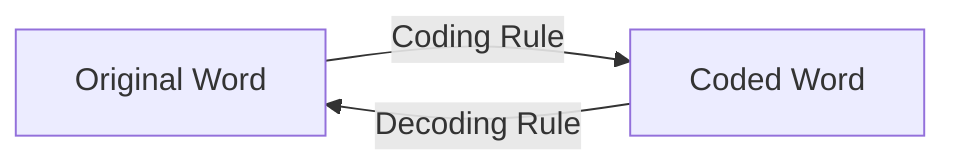
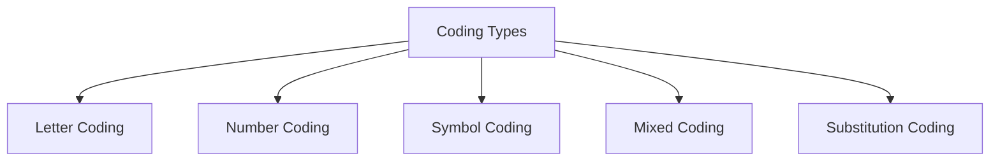
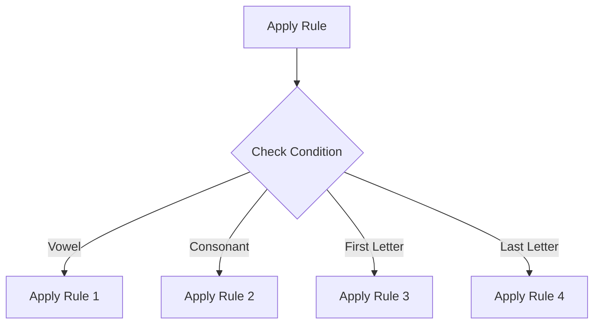
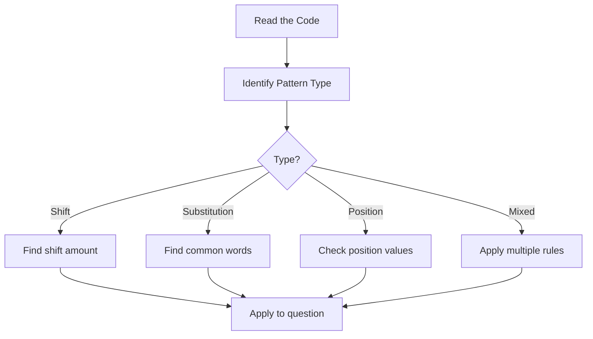

# Session 13: Coding-Decoding

Master pattern recognition in coded messages.

---

## 🔐 What is Coding-Decoding?

**Coding** = Encrypting a message using a specific rule
**Decoding** = Decrypting the coded message back



---

## 📝 Types of Coding



---

## 🔤 Letter Coding

### Type 1: Position Shift

| Original | +1 Shift | +2 Shift | -1 Shift |
|:---------|:---------|:---------|:---------|
| A | B | C | Z |
| B | C | D | A |
| CAT | DBU | ECV | BZS |

**Pattern: Each letter moves by fixed positions**

### Type 2: Reverse Alphabet

| A | B | C | ... | X | Y | Z |
|:-:|:-:|:-:|:---:|:-:|:-:|:-:|
| Z | Y | X | ... | C | B | A |

**A ↔ Z, B ↔ Y, C ↔ X** (Sum = 27)

### Type 3: Position-Based

| Letter | Position | Coded as Position |
|:------:|:--------:|:-----------------:|
| A | 1 | 1 |
| B | 2 | 2 |
| C | 3 | 3 |
| CAT | 3,1,20 | 3120 or 3-1-20 |

---

## 🔢 Number Coding

### Type 1: Direct Substitution

| A | B | C | D | E | ... | Z |
|:-:|:-:|:-:|:-:|:-:|:---:|:-:|
| 1 | 2 | 3 | 4 | 5 | ... | 26 |

**CAT = 3 + 1 + 20 = 24** or **CAT = 31020**

### Type 2: Reverse Substitution

| A | B | C | D | E | ... | Z |
|:-:|:-:|:-:|:-:|:-:|:---:|:-:|
| 26 | 25 | 24 | 23 | 22 | ... | 1 |

### Type 3: Mathematical Operations

| Word | Sum of positions | Product | Other |
|:-----|:---------------:|:-------:|:------|
| BAD | 2+1+4 = 7 | 2×1×4 = 8 | Various |

---

## 🧩 Substitution Coding (Chinese Coding)

### Method

Given multiple statements, find common words to decode.

**Example:**
- "sky is blue" → "pix nix qix"
- "sea is deep" → "nix rix six"

**Solution:**
```
Common word: "is" → Common code: "nix"
So: is = nix

"sky", "blue" = "pix", "qix" (order unknown)
"sea", "deep" = "rix", "six" (order unknown)
```

### "Is Called" vs "Means" Logic
- **Case 1**: "Cloud is called White, White is called Rain..."
  - Q: Color of milk?
  - Logic: Milk is White -> White is called **Rain**. Answer: Rain. (**Forward**)
- **Case 2**: "Cloud means White, White means Rain..."
  - Q: Color of milk?
  - Logic: Milk is White -> Cloud means White. Answer: **Cloud**. (**Backward**)

---

## 🔀 Mixed/Conditional Coding

### Conditional Rules



**Example Conditions:**
- If word starts with vowel → Add 'X' at end
- If word ends with consonant → Reverse the word
- If word has even letters → Shift by +2
- If word has odd letters → Shift by -1

### Matrix Coding
Given two matrices (0-4 and 5-9), a letter is represented by **Row** then **Column**.
- Example: 'A' = 23 (Row 2, Column 3)
- Task: Identify code for a word like "EAST".
- **Tip**: Check options from the **last letter** backwards (usually faster).

### Binary Coding
Numbers represented by symbols (e.g., 0 = *, 1 = $).
- Example: $3 = 11_2 = $ $
- Example: $5 = 101_2 = $ * $

---

## 📊 Alphabet Position Table

### Forward Positions (Memorize!)

| A | B | C | D | E | F | G | H | I | J | K | L | M |
|:-:|:-:|:-:|:-:|:-:|:-:|:-:|:-:|:-:|:-:|:-:|:-:|:-:|
| 1 | 2 | 3 | 4 | 5 | 6 | 7 | 8 | 9 | 10 | 11 | 12 | 13 |

| N | O | P | Q | R | S | T | U | V | W | X | Y | Z |
|:-:|:-:|:-:|:-:|:-:|:-:|:-:|:-:|:-:|:-:|:-:|:-:|:-:|
| 14 | 15 | 16 | 17 | 18 | 19 | 20 | 21 | 22 | 23 | 24 | 25 | 26 |

### Quick Reference

| Position | Letter | Opposite (27-n) |
|:--------:|:------:|:---------------:|
| 1 | A | Z (26) |
| 5 | E | V (22) |
| 10 | J | Q (17) |
| 13 | M | N (14) |
| 20 | T | G (7) |
| 26 | Z | A (1) |

---

## 🧮 Solved Examples

### Example 1: Letter Shift
**Q:** If COMPUTER = DPNQVUFS, then PRINTER = ?

**Solution:**
```
C→D (+1), O→P (+1), M→N (+1)...
Each letter shifts +1
P→Q, R→S, I→J, N→O, T→U, E→F, R→S
PRINTER = QSJOUFS
```

### Example 2: Reverse Alphabet
**Q:** If FRIEND = UIRWMW, then ENEMY = ?

**Solution:**
```
F(6) → U(21) = 27-6
R(18) → I(9) = 27-18
Using opposite letters: A↔Z pattern
E→V, N→M, E→V, M→N, Y→B
ENEMY = VMVNB
```

### Example 3: Substitution
**Q:** In a code, "good morning" = "pit sit", "good evening" = "pit nit", "morning walk" = "sit dit". What is "evening"?

**Solution:**
```
"good morning" = "pit sit"
"good evening" = "pit nit"
Common: good = pit

So: morning = sit, evening = nit
Answer: evening = nit
```

### Example 4: Number Coding
**Q:** If MANGO = 52, APPLE = 50, then BANANA = ?

**Solution:**
```
MANGO: M(13)+A(1)+N(14)+G(7)+O(15) = 50 ≠ 52
Try: Sum × something or different rule

Check: MANGO = 13+1+14+7+15 = 50, +2 = 52
APPLE = 1+16+16+12+5 = 50 (matches!)

BANANA = 2+1+14+1+14+1 = 33, +2 = 35
Answer: 35
```

---

## 📋 Problem-Solving Strategy



---

## 🎯 Quick Revision Points

> [!TIP]
> **Memorize letter positions** - At least EJOTY (5,10,15,20,25)

> [!TIP]
> **Check for +1, -1, +2 shifts first** - Most common patterns

> [!TIP]
> **Look for common words** in substitution coding

> [!NOTE]
> **A+Z = B+Y = ... = 27** for opposite letter coding

---

## ✍️ Practice Problems

1. If DELHI = 73458, CALCUTTA = 82589662, then MUMBAI = ?
2. If HOUSE → FQSUC, then CHAIR → ?
3. In code: "tall boy" = "ro po", "good boy" = "so ro", "tall girl" = "po no". What is "good girl"?
4. If TIGER → SHHDS, then HORSE → ?
5. If EARTH = 41528, MOON = 3665, then MARS = ?
