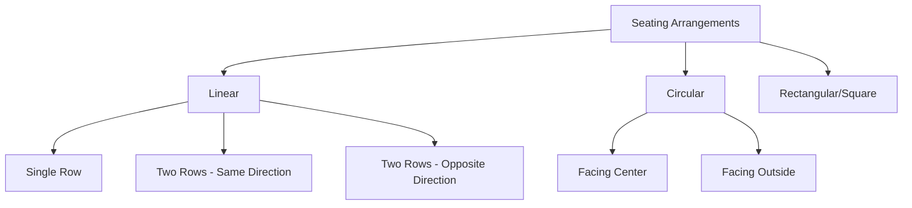
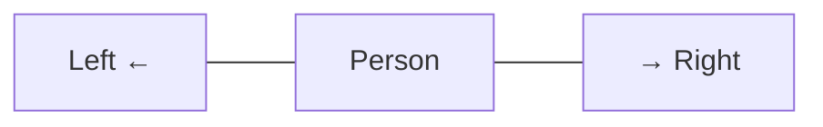
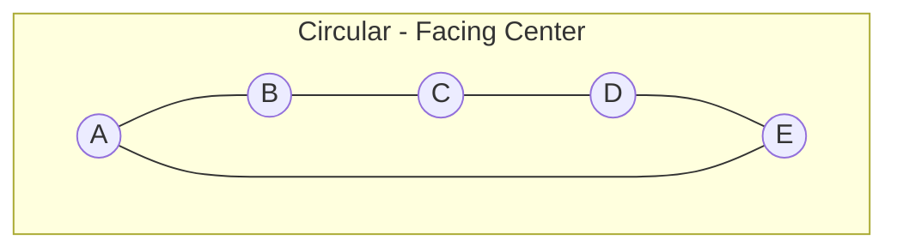
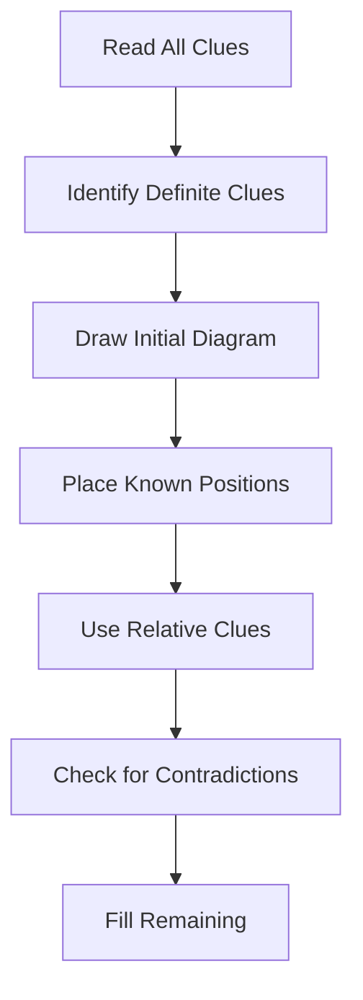

# Session 14: Seating Arrangement

Master linear and circular seating arrangement problems.

---

## 📊 Types of Arrangements



---

## 📏 Linear Arrangement

### Single Row Arrangement

```
Left End                                Right End
   ←                                       →
[1] - [2] - [3] - [4] - [5] - [6] - [7] - [8]
```

### Key Concepts

| Term | Meaning |
|:-----|:--------|
| **Immediate Left** | Adjacent position to left |
| **Immediate Right** | Adjacent position to right |
| **Left of** | Anywhere to the left |
| **Right of** | Anywhere to the right |
| **Between** | Positions in between two people |
| **Extreme Left** | Leftmost position |
| **Extreme Right** | Rightmost position |

### Direction Rules



---

## 🔵 Circular Arrangement

### Facing Center



**When facing center:**
- **Left** = Clockwise direction
- **Right** = Anti-clockwise direction

### Facing Outside

**When facing outside (away from center):**
- **Left** = Anti-clockwise direction
- **Right** = Clockwise direction

### Direction Summary

| Facing | Left | Right |
|:-------|:-----|:------|
| Center | Clockwise | Anti-clockwise |
| Outside | Anti-clockwise | Clockwise |

---

## 📐 Two-Row Arrangement

### Same Direction

```
Row 1: [A] - [B] - [C] - [D] - [E]  → (Facing North)
Row 2: [P] - [Q] - [R] - [S] - [T]  → (Facing North)
```

### Opposite Direction (Face to Face)

```
Row 1: [A] - [B] - [C] - [D] - [E]  → (Facing South)
       ↓     ↓     ↓     ↓     ↓
Row 2: [P] - [Q] - [R] - [S] - [T]  ← (Facing North)
```

**In opposite facing:**
- A faces P (directly)
- Left of A in Row 1 = Right of P in Row 2 (from their perspective)

---

## 🧩 Problem-Solving Steps



### Definite vs Relative Clues

| Definite Clues | Relative Clues |
|:---------------|:---------------|
| "A sits at left end" | "A sits to left of B" |
| "B sits exactly in middle" | "C is between A and B" |
| "D faces North" | "D sits 2nd from E" |

### Advanced Arrangement Types

**1. Square/Rectangular Table**
- **Corners**: Usually face one direction (e.g., Center).
- **Middle of Sides**: Usually face opposite direction (e.g., Outside).
- **Diagram**: Draw square, mark 8 positions (4 corner, 4 mid).

**2. Unknown Number of Persons (Linear)**
- Start with connecting information.
- Combine overlapping clues.
- *Example: A is 3rd from left, B is 5th from right, 2 people between them.*
  - Case 1 (Separate): Left(3) + 2 + Right(5) = 10 total.
  - Case 2 (Overlap): L+R - Mid - 2. (Check validity).

**3. Mixed Facing (Circular)**
- Some face center, some outside.
- **Tip**: Use arrows on the diagram (↑ for In, ↓ for Out) to avoid confusion with Left/Right.

---

## 📝 Important Terms

| Term | Explanation |
|:-----|:------------|
| **2nd to the left of A** | Skip 1 position, take 2nd on left |
| **3rd from left end** | 3rd position from left |
| **Immediate neighbor** | Adjacent seats |
| **Not adjacent** | At least one seat between |
| **Faces** | In circular, person sits opposite |
| **Between** | Persons on both sides |

### Counting Positions

```
From Left End:  1  2  3  4  5  (from left)
                ↓  ↓  ↓  ↓  ↓
               [A][B][C][D][E]
                ↑  ↑  ↑  ↑  ↑
From Right End: 5  4  3  2  1  (from right)
```

---

## 🧮 Solved Examples

### Example 1: Linear - 5 People
**Q:** A, B, C, D, E sit in a row. A sits 2nd from left. B is at right end. C is between A and B. D is not adjacent to A.

**Solution:**
```
A is 2nd from left: _ A _ _ _
B at right end:     _ A _ _ B
C between A and B:  _ A _ C B or _ A C _ B
D not adjacent to A: Must be position 4 or 5

If _ A C D B → E at position 1
Check: D adjacent to C only ✓

Answer: E A C D B
```

### Example 2: Circular - 6 People
**Q:** 6 people A-F sit in circle facing center. A is 2nd left of B. C is opposite A. D is immediate right of C.

**Solution:**
```
Draw circle, place A and B with A 2nd left of B
C opposite A means 3 positions away
D immediate right of C

       A
    F     B
        
    E     C
       D
```

### Example 3: Two Rows
**Q:** 8 people in 2 rows of 4 each, facing each other. P is at an end positioning facing Q. R is 2nd left of Q.

**Solution:**
```
Row 1: P _ _ _  (facing south)
Row 2: Q _ R _  (facing north, R 2nd left of Q)

Continue placing based on other clues...
```

---

## 📊 Quick Reference

### For Linear

| Clue | Meaning |
|:-----|:--------|
| X is 3rd from left | X at position 3 from left |
| X is to left of Y | X before Y (not necessarily adjacent) |
| X is immediate left of Y | X directly next to Y on left |
| X is between Y and Z | Y-X-Z or Z-X-Y |

### For Circular

| Clue | Meaning |
|:-----|:--------|
| X is 2nd right of Y (facing center) | 2 positions anti-clockwise |
| X is opposite Y | Diametrically opposite |
| X is immediate right (facing out) | Clockwise direction |

---

## 🎯 Quick Revision Points

> [!TIP]
> **Always draw diagrams** - Never solve mentally

> [!TIP]
> **Start with definite clues** - Fixed positions first

> [!TIP]
> **In circular facing center**: Left = Clockwise

> [!WARNING]
> **Check directions carefully** - Left/Right depends on facing direction

---

## ✍️ Practice Problems

1. 5 friends A, B, C, D, E sit in a row. C does not sit at any end. B sits 2nd from right. E is immediate right of B. Who sits at ends?

2. 6 people sit in circle facing center. P is opposite Q. R is 2nd left of P. S is immediate right of Q. Find R's position relative to Q.

3. 8 people in 2 rows of 4, facing each other. A faces B. C is at left end of Row 1. D is 2nd from right in Row 2. E is not at any end.

4. In a circular arrangement, who is 3rd to the left of the person who is 2nd to the right of A?

5. 7 people sit in a line facing North. B is 3rd from left. E is 3rd from right. There are 2 people between B and E.
