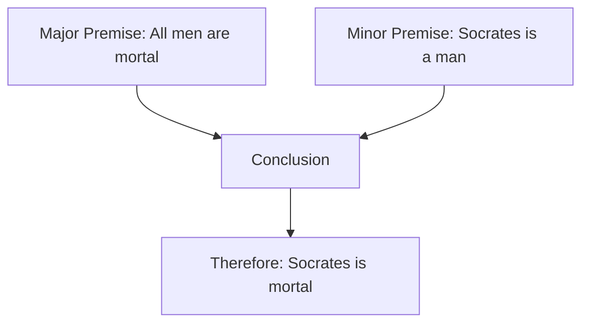
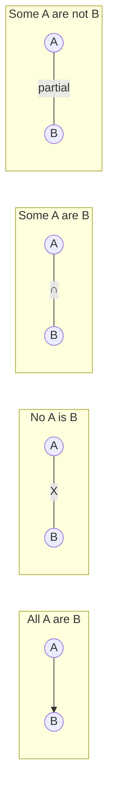
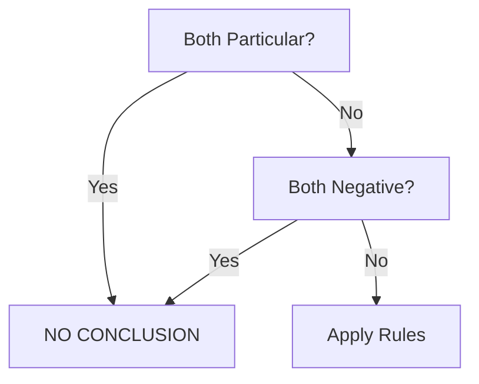

# Session 15: Syllogism & Venn Diagrams

Master logical deductions using syllogism rules and Venn diagrams.

---

## 📊 What is Syllogism?

A syllogism consists of:
1. **Major Premise** (general statement)
2. **Minor Premise** (specific statement)
3. **Conclusion** (logical deduction)



---

## 📝 Types of Propositions

### Four Standard Forms

| Type | Form | Example | Symbol |
|:-----|:-----|:--------|:------:|
| **Universal Affirmative** | All A are B | All dogs are animals | A |
| **Universal Negative** | No A is B | No cat is a dog | E |
| **Particular Affirmative** | Some A are B | Some birds can fly | I |
| **Particular Negative** | Some A are not B | Some animals are not wild | O |

### Venn Diagram Representations



---

## 🔄 Conversion Rules

| Original | Conversion | Valid? |
|:---------|:-----------|:------:|
| All A are B | Some B are A | ✓ |
| No A is B | No B is A | ✓ |
| Some A are B | Some B are A | ✓ |
| Some A are not B | Some B are not A | ✗ INVALID |

> **Important**: Universal affirmative converts to particular, not universal!

---

## 📐 Syllogism Rules

### The Combination Table

| Premise 1 | Premise 2 | Conclusion |
|:---------:|:---------:|:----------:|
| All + All | → | All |
| All + No | → | No |
| All + Some | → | Some |
| Some + All | → | Some |
| No + All | → | Some not (reverse) |
| No + Some | → | Some not |

### Key Rules

1. **Two particular premises** → No valid conclusion
2. **Two negative premises** → No valid conclusion
3. **One negative premise** → Negative conclusion
4. **One particular premise** → Particular conclusion



---

## 🔵 Venn Diagram Method

### Drawing Guidelines

| Statement | Diagram Approach |
|:----------|:-----------------|
| All A are B | A circle inside B |
| No A is B | A and B separate |
| Some A are B | A and B overlap |
| Some A are not B | A extends outside B |

### Step-by-Step Process

1. **Draw circles** for each category
2. **Shade** definite regions first
3. **Mark X** for existence (some)
4. **Check conclusion** against diagram

---

## 🧮 Solved Examples

### Example 1: Basic Syllogism
**Statements:**
- All cats are animals
- All animals are living things

**Conclusions:**
- I. All cats are living things
- II. Some living things are cats

**Solution:**
```
All cats are animals → A
All animals are living things → B
A inside B inside C

I. All cats are living things ✓ (Cats ⊂ Animals ⊂ Living)
II. Some living things are cats ✓ (Conversion of I)

Answer: Both I and II follow
```

### Example 2: Negative Premises
**Statements:**
- All roses are flowers
- No flower is black

**Conclusions:**
- I. No rose is black
- II. Some blacks are not roses

**Solution:**
```
Roses ⊂ Flowers, Flowers ∩ Black = ∅
Therefore: Roses ∩ Black = ∅

I. No rose is black ✓
II. Some blacks are not roses ✓ (by definition)

Answer: Both follow
```

### Example 3: Particular Premises
**Statements:**
- Some dogs are pets
- All pets are animals

**Conclusions:**
- I. Some dogs are animals
- II. All animals are dogs

**Solution:**
```
Some Dogs → Pets ⊂ Animals

I. Some dogs are animals ✓ (follows from chain)
II. All animals are dogs ✗ (not valid)

Answer: Only I follows
```

---

## 📋 Common Patterns

### Definite Conclusions

| If you have | You can conclude |
|:------------|:-----------------|
| All A→B, All B→C | All A→C |
| All A→B, No B→C | No A→C |
| Some A→B, All B→C | Some A→C |
| No A→B | No B→A |

### Invalid Conclusions

| These DON'T follow |
|:-------------------|
| Some A are B → All A are B |
| Some A are not B → No A is B |
| All B are A → All A are B |

---

## 🔶 Venn Diagram Applications

### Three-Circle Venn Diagram

```
        A
       ╱ ╲
      ╱   ╲
     ╱  1  ╲
    ├───2───┤
  B │ 3 │ 4 │ C
    └───┴───┘
    
Regions:
1 = Only A
2 = A and B only
3 = A, B, and C
4 = B and C only
```

### Solving with Venn Diagrams

1. Draw all possible diagrams
2. If conclusion holds in ALL diagrams → Follows
3. If conclusion fails in ANY diagram → Doesn't follow
4. If conclusion might hold → Uncertain (check possibilities)

---

## 🎯 Quick Revision Points

> [!TIP]
> **Two particular = No conclusion**

> [!TIP]
> **Two negative = No conclusion**

> [!TIP]
> **"Some A are not B" CANNOT convert to "Some B are not A"**

> [!WARNING]
> Always draw Venn diagrams for complex problems

---

## 📊 Possibility Cases

When asked "Can conclusion be true?"

| Statement | Possibility |
|:----------|:------------|
| Some A are B | Possible: All A are B |
| No A is B | NOT possible: Some A are B |
| All A are B | NOT possible: No A is B |

### Modern Syllogism Concepts
**1. "Only A is B"**
- Means: **All B are A** (and B cannot belong to anything else).
- *Example: Only Engineers are Smart -> All Smart people are Engineers.*

**2. "Only a few A are B"**
- Means: **Some A are B** AND **Some A are NOT B**.
- *Example: Only a few apples are red -> Some apples are red, but not all.*

### Either-Or Case Conditions
For **Conclusion I or Conclusion II** to follow:
1. Both conclusions must be **Individually False** (or Doubtful).
2. Subject and Predicate must be **Same**.
3. One conclusion must be **Positive**, other **Negative**.
4. Valid Pairs: (Some + No), (All + Some Not).
   *Note: (All + No) is NOT an Either-Or pair usually, it's Neither-Nor unless possibilities exist.*

---

## ✍️ Practice Problems

1. **Statements**: All pens are books. Some books are pencils.
   **Conclusions**: I. Some pens are pencils. II. Some pencils are pens.

2. **Statements**: No man is a donkey. All donkeys are foolish.
   **Conclusions**: I. No man is foolish. II. Some foolish are not men.

3. **Statements**: Some chairs are tables. All tables are furniture.
   **Conclusions**: I. Some chairs are furniture. II. All furniture are tables.

4. **Statements**: All birds can fly. Penguins are birds.
   **Conclusions**: I. Penguins can fly. II. Some flying things are penguins.

5. **Statements**: No politician is honest. Some honest are rich.
   **Conclusions**: I. No politician is rich. II. Some rich are not politicians.
