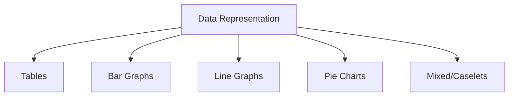
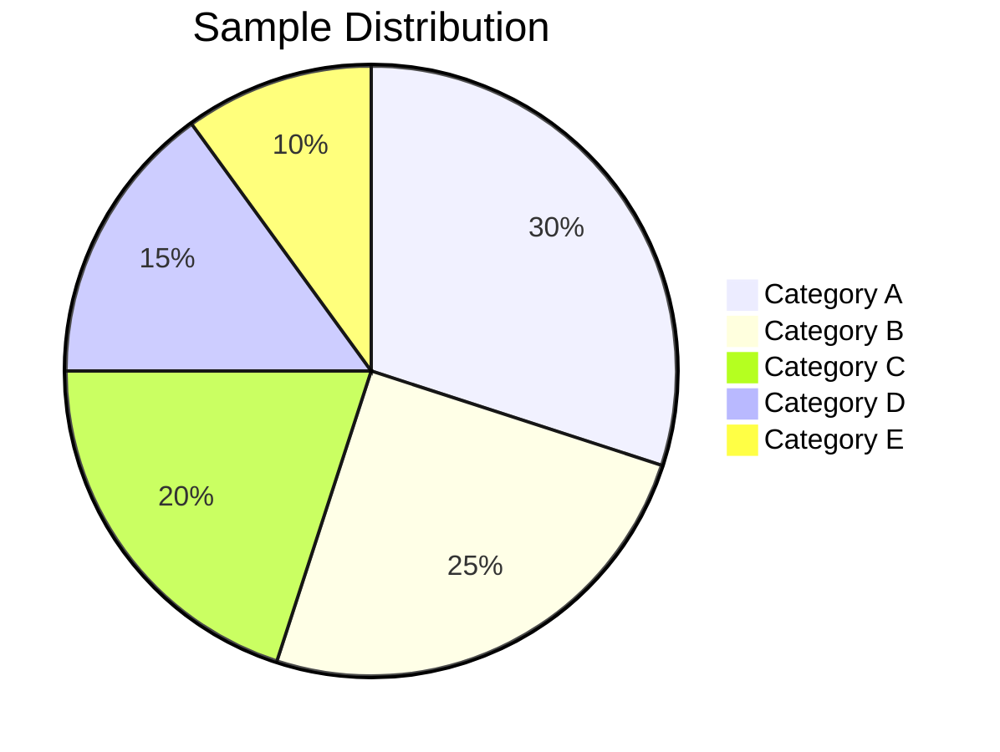
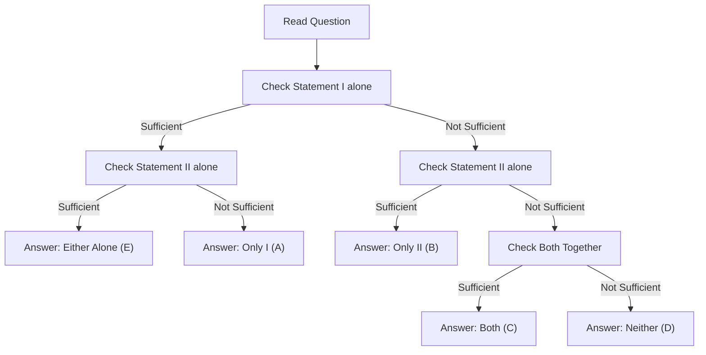

# Session 16: Data Interpretation & Data Sufficiency

Master reading charts, tables, and evaluating data adequacy.

---

## 📊 Data Interpretation (DI)

### Types of Data Representation



### Caselet DI Strategy
Caselets provide data in **paragraph form** instead of charts.
**Steps:**
1. Read the paragraph quickly to understand structure.
2. Create a **Table** immediately.
3. Fill known values.
4. Calculate derived values (Total - Known).
5. Solve questions using your table (never look back at paragraph).

---

## 📈 Tables

### Reading Tables

| Year | Revenue | Expense | Profit |
|:----:|:-------:|:-------:|:------:|
| 2020 | 500 | 350 | 150 |
| 2021 | 600 | 400 | 200 |
| 2022 | 750 | 480 | 270 |
| 2023 | 850 | 520 | 330 |

**Common Questions:**
- Percentage change = [(New - Old) / Old] × 100
- Ratio of values
- Average of a column
- Growth rate

---

## 📊 Bar Graphs

### Types of Bar Graphs

| Type | Use Case |
|:-----|:---------|
| **Simple Bar** | Single data series |
| **Grouped Bar** | Multiple categories comparison |
| **Stacked Bar** | Parts of a whole over time |

### Reading Tips

- Compare heights for relative values
- Calculate differences between bars
- Find ratios between categories

---

## 📉 Line Graphs

### Key Concepts

| Feature | Indicates |
|:--------|:----------|
| **Upward slope** | Increase/Growth |
| **Downward slope** | Decrease/Decline |
| **Steep slope** | Rapid change |
| **Flat line** | No change |
| **Intersection** | Equal values at that point |

---

## 🥧 Pie Charts

### Pie Chart Formulas

| Concept | Formula |
|:--------|:--------|
| **Percentage to Degree** | Degree = (Percentage / 100) × 360° |
| **Degree to Percentage** | Percentage = (Degree / 360) × 100 |
| **Value from percentage** | Value = (Percentage / 100) × Total |

### Quick Conversion Table

| Percentage | Degree |
|:----------:|:------:|
| 25% | 90° |
| 50% | 180° |
| 12.5% | 45° |
| 33.33% | 120° |
| 10% | 36° |



---

## 🧮 Common DI Calculations

### Percentage Calculations

| Calculation | Formula |
|:------------|:--------|
| Percentage of Total | (Part / Total) × 100 |
| Percentage Change | [(New - Old) / Old] × 100 |
| Percentage Point Change | New% - Old% |

### Growth Rate

**CAGR (Compound Annual Growth Rate):**
CAGR = [(Final / Initial)^(1/n) - 1] × 100

### Ratio and Proportion

**A : B = a : b, Total = T**
- A's share = T × a/(a+b)
- B's share = T × b/(a+b)

### Speed Math: Split Percentage Method
Instead of multiplying, split the percentage:
- **Find 55% of 240**:
  - 50% = 120
  - 5% = 12
  - Total = 132
- **Find 17.5% of 400**:
  - 10% = 40
  - 5% = 20
  - 2.5% = 10
  - Total = 70

---

## 📋 Data Sufficiency

### Question Format

**Q: Is X true?**
- Statement I: [Information]
- Statement II: [Information]

**Answer Options:**
| Option | Meaning |
|:-------|:--------|
| A | Statement I alone sufficient |
| B | Statement II alone sufficient |
| C | Both together sufficient |
| D | Both together NOT sufficient |
| E | Either alone sufficient |

### Problem-Solving Approach



---

## 🧮 Solved Examples

### Example 1: Table Reading
**Q:** From the table above, find the percentage increase in profit from 2020 to 2023.

**Solution:**
```
Profit 2020 = 150, Profit 2023 = 330
% Increase = [(330 - 150) / 150] × 100
= (180 / 150) × 100 = 120%
```

### Example 2: Pie Chart
**Q:** If a pie chart shows 72° for Category A and total value is 500, find value of A.

**Solution:**
```
Percentage = (72 / 360) × 100 = 20%
Value = 20% of 500 = 100
```

### Example 3: Data Sufficiency
**Q:** What is the age of Ram?
- I. Ram is twice as old as Shyam
- II. Sum of their ages is 45

**Solution:**
```
From I alone: Ram = 2 × Shyam (2 unknowns, 1 equation) → Not sufficient
From II alone: Ram + Shyam = 45 (2 unknowns, 1 equation) → Not sufficient
Both together: Ram = 2S, R + S = 45
2S + S = 45, S = 15, R = 30 → Sufficient

Answer: C (Both together sufficient)
```

---

## 📊 DI Tips

### Speed Techniques

| Technique | Application |
|:----------|:------------|
| **Approximation** | Round numbers for quick calculation |
| **Elimination** | Remove obviously wrong options |
| **Comparison** | Compare relative values, not exact |
| **Pattern** | Look for trends first |

### Common Traps

| Trap | Solution |
|:-----|:---------|
| Different scales | Always check axes labels |
| Incomplete data | Don't assume missing values |
| % vs Absolute | Distinguish percentage from actual values |

---

## 🎯 Quick Revision Points

> [!TIP]
> **Pie Chart**: 1% = 3.6°, 25% = 90°, 50% = 180°

> [!TIP]
> **Percentage Change** = (New - Old) / Old × 100

> [!TIP]
> **Data Sufficiency**: Test each statement INDEPENDENTLY first

> [!NOTE]
> Always approximate for complex calculations to save time

---

## ✍️ Practice Problems

1. A pie chart shows: A=90°, B=120°, C=60°, D=90°. If total is 720, find value of B.

2. From a bar chart showing sales: 2020=450, 2021=500, 2022=520, 2023=600. Find average annual growth.

3. **Data Sufficiency**: Is x > 0?
   - I. x² > 0
   - II. x³ > 0

4. If profit increased by 20% to become 600, what was the original profit?

5. In a table, if Column A values are 20% of Column B, and B = 500, find A.
